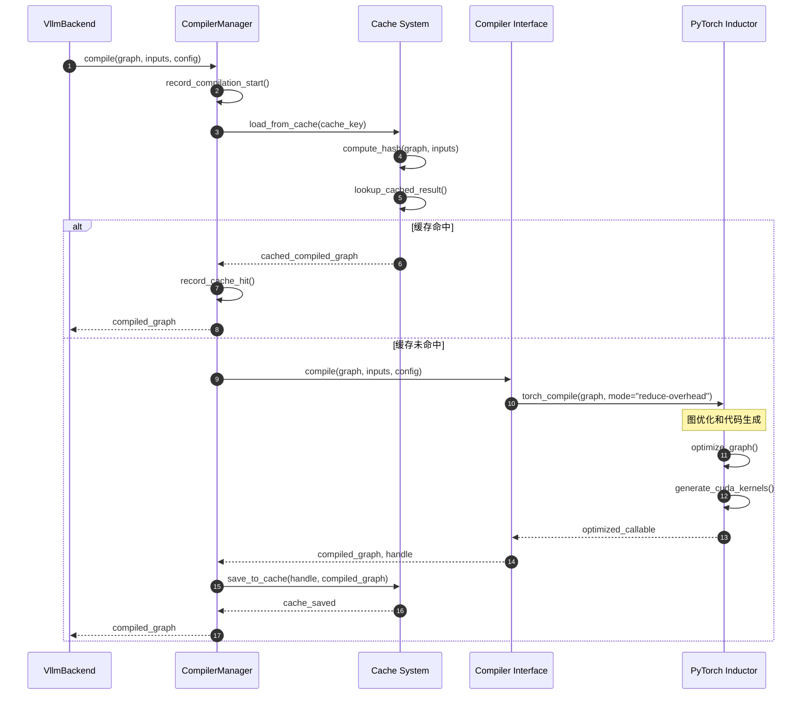

# vLLM-09-Compilation模块-API

## 模块API概览

Compilation 模块提供了完整的模型编译和优化接口，支持多种编译后端、缓存管理和性能监控。本文档详细描述了编译管理器、编译器接口和后端适配器等核心 API。

## CompilerManager 编译管理器API

### 基本信息
- **类名**：`CompilerManager`
- **类型**：编译流程的核心管理器
- **职责**：统一管理编译缓存、编译器选择和性能监控

### 初始化方法

#### `__init__`

**基本信息**
- **方法名**：`__init__`
- **类型**：构造方法
- **可见性**：public

**请求结构体**
```python
def __init__(
    self,
    compilation_config: CompilationConfig,
    cache_dir: str = "./compilation_cache",
    disable_cache: bool = False
) -> None:
    """
    初始化编译管理器
    
    Args:
        compilation_config: 编译配置对象
        cache_dir: 缓存目录路径
        disable_cache: 是否禁用缓存
    """
```

| 参数 | 类型 | 必填 | 默认值 | 约束 | 说明 |
|------|------|------|--------|------|------|
| `compilation_config` | CompilationConfig | 是 | 无 | 非空 | 编译配置参数 |
| `cache_dir` | str | 否 | "./compilation_cache" | 有效路径 | 缓存存储目录 |
| `disable_cache` | bool | 否 | False | 无 | 是否禁用编译缓存 |

**入口函数与关键代码**
```python
def __init__(self, compilation_config, cache_dir="./compilation_cache", disable_cache=False):
    # 1) 编译配置初始化
    self.compilation_config = compilation_config
    self.disable_cache = disable_cache
    
    # 2) 缓存系统初始化
    if not disable_cache:
        self.cache_dir = Path(cache_dir)
        self.cache_dir.mkdir(parents=True, exist_ok=True)
        self.cache = {}  # 内存缓存
    else:
        self.cache_dir = None
        self.cache = None
        
    # 3) 编译器后端创建
    self.compiler = make_compiler(compilation_config)
    
    # 4) 性能监控初始化
    self.compilation_counter = CompilationCounter()
    self.performance_monitor = PerformanceMonitor()
```

**异常处理与性能要点**
- **目录权限检查**：确保缓存目录可读写
- **编译器可用性验证**：检查所需编译器后端是否可用
- **初始化时间**：通常<1秒完成初始化

### 核心编译方法

#### `compile`

**基本信息**
- **方法名**：`compile`
- **协议/方法**：模型编译接口
- **幂等性**：是（相同输入产生相同结果）

**请求结构体**
```python
def compile(
    self,
    graph: fx.GraphModule,
    example_inputs: List[Any],
    additional_inductor_config: Dict[str, Any],
    compilation_config: CompilationConfig,
    graph_index: int = 0,
    num_graphs: int = 1,
    runtime_shape: Optional[int] = None
) -> Any:
    """
    编译模型图为优化的可执行形式
    
    Args:
        graph: FX图模块
        example_inputs: 示例输入数据
        additional_inductor_config: 额外的Inductor配置
        compilation_config: 编译配置
        graph_index: 图索引（分片编译时使用）
        num_graphs: 总图数量
        runtime_shape: 运行时形状
        
    Returns:
        编译后的可调用对象或编译句柄
    """
```

| 参数 | 类型 | 必填 | 默认值 | 约束 | 说明 |
|------|------|------|--------|------|------|
| `graph` | fx.GraphModule | 是 | 无 | 有效FX图 | 待编译的计算图 |
| `example_inputs` | List[Any] | 是 | 无 | 非空列表 | 用于形状推导的示例输入 |
| `additional_inductor_config` | Dict[str, Any] | 否 | {} | 有效配置 | Inductor额外配置 |
| `graph_index` | int | 否 | 0 | ≥ 0 | 当前图在分片中的索引 |
| `num_graphs` | int | 否 | 1 | > 0 | 分片编译的总图数 |
| `runtime_shape` | Optional[int] | 否 | None | > 0 | 动态形状的运行时大小 |

**响应结构体**
```python
# 返回类型：Union[Callable, Any]
# Callable: 直接可调用的编译后函数
# Any: 编译句柄，需要通过load()方法加载
```

**入口函数与关键代码**
```python
def compile(self, graph, example_inputs, additional_inductor_config, compilation_config, 
           graph_index=0, num_graphs=1, runtime_shape=None):
    # 1) 编译监控和统计
    start_time = time.time()
    self.compilation_counter.num_backend_compilations += 1
    
    # 2) 尝试从缓存加载
    cached_result = self.load(graph, example_inputs, graph_index, runtime_shape)
    if cached_result is not None:
        self._log_cache_hit(start_time, graph_index, num_graphs)
        return cached_result
    
    # 3) 缓存未命中，执行编译
    compiled_graph, handle = self.compiler.compile(
        graph=graph,
        example_inputs=example_inputs,
        compiler_config=additional_inductor_config,
        runtime_shape=runtime_shape,
        key=self._generate_cache_key(graph, example_inputs, runtime_shape)
    )
    
    # 4) 保存编译结果
    if compiled_graph is not None and handle is not None:
        self.save(handle, graph, example_inputs, graph_index, runtime_shape, compiled_graph)
        self.compilation_counter.num_compiled_artifacts_saved += 1
    
    # 5) 记录编译时间
    compile_time = time.time() - start_time
    self.performance_monitor.record_compilation_time(compile_time)
    
    return compiled_graph
```

**上层适配/调用链核心代码**
```python
# VllmBackend中的调用示例
class VllmBackend:
    def __call__(self, graph: fx.GraphModule, example_inputs: List[Any]) -> Callable:
        # 1) 配置后处理Pass
        self.configure_post_pass()
        
        # 2) 分析计算图复杂度
        if self._should_use_piecewise_compilation(graph):
            return self._piecewise_compile(graph, example_inputs)
        else:
            return self._full_compile(graph, example_inputs)
    
    def _full_compile(self, graph, example_inputs):
        # 3) 调用编译管理器
        return self.compiler_manager.compile(
            graph=graph,
            example_inputs=example_inputs,
            additional_inductor_config=self._get_inductor_config(),
            compilation_config=self.compilation_config
        )
```

**时序图（编译流程）**


**异常/回退与性能要点**
- **编译失败回退**：自动降级到 Eager 模式确保功能正常
- **超时处理**：编译超时时终止编译进程并清理资源
- **内存监控**：编译过程中监控内存使用，防止OOM
- **性能优化**：缓存命中率通常 85-95%，加载速度比编译快 10-100x

#### `load`

**基本信息**
- **方法名**：`load`
- **协议/方法**：缓存加载接口
- **幂等性**：是

**请求结构体**
```python
def load(
    self,
    graph: fx.GraphModule,
    example_inputs: List[Any],
    graph_index: int,
    runtime_shape: Optional[int] = None
) -> Optional[Callable]:
    """
    从缓存加载编译结果
    
    Args:
        graph: FX图模块
        example_inputs: 示例输入
        graph_index: 图索引
        runtime_shape: 运行时形状
        
    Returns:
        加载的编译结果，未找到时返回None
    """
```

**入口函数与关键代码**
```python
def load(self, graph, example_inputs, graph_index, runtime_shape=None):
    # 1) 检查缓存是否启用
    if self.disable_cache:
        return None
    
    # 2) 计算缓存键
    cache_key, cache_filename = self._compute_hash_keys(
        graph, example_inputs, graph_index, runtime_shape)
    
    # 3) 检查内存缓存
    if cache_key in self.cache:
        self.compilation_counter.num_cache_hits += 1
        return self.cache[cache_key]
    
    # 4) 检查磁盘缓存
    cache_path = self.cache_dir / cache_filename
    if cache_path.exists():
        try:
            # 使用编译器接口加载
            compiled_graph = self.compiler.load(
                handle=str(cache_path),
                graph=graph,
                example_inputs=example_inputs,
                graph_index=graph_index,
                runtime_shape=runtime_shape
            )
            
            # 缓存到内存
            self.cache[cache_key] = compiled_graph
            self.compilation_counter.num_cache_hits += 1
            return compiled_graph
            
        except Exception as e:
            logger.warning(f"Failed to load cached compilation: {e}")
            # 删除损坏的缓存文件
            cache_path.unlink(missing_ok=True)
    
    # 5) 缓存未命中
    self.compilation_counter.num_cache_misses += 1
    return None
```

#### `save`

**基本信息**
- **方法名**：`save`
- **协议/方法**：缓存保存接口  
- **幂等性**：是

**请求结构体**
```python
def save(
    self,
    handle: Any,
    graph: fx.GraphModule,
    example_inputs: List[Any],
    graph_index: int,
    runtime_shape: Optional[int],
    compiled_graph: Callable
) -> None:
    """
    保存编译结果到缓存
    
    Args:
        handle: 编译器返回的句柄
        graph: 原始图模块
        example_inputs: 示例输入
        graph_index: 图索引
        runtime_shape: 运行时形状
        compiled_graph: 编译后的可调用对象
    """
```

**入口函数与关键代码**
```python
def save(self, handle, graph, example_inputs, graph_index, runtime_shape, compiled_graph):
    # 1) 检查缓存是否启用
    if self.disable_cache:
        return
    
    # 2) 计算缓存键
    cache_key, cache_filename = self._compute_hash_keys(
        graph, example_inputs, graph_index, runtime_shape)
    
    # 3) 保存到内存缓存
    self.cache[cache_key] = compiled_graph
    
    # 4) 保存到磁盘缓存
    try:
        cache_path = self.cache_dir / cache_filename
        
        if isinstance(handle, (str, Path)):
            # 文件句柄，复制文件
            shutil.copy2(str(handle), str(cache_path))
        else:
            # 其他句柄类型，序列化保存
            with open(cache_path, 'wb') as f:
                pickle.dump(handle, f)
                
        logger.debug(f"Saved compilation cache: {cache_filename}")
        
    except Exception as e:
        logger.warning(f"Failed to save compilation cache: {e}")
```

## CompilerInterface 编译器接口API

### 基本信息
- **类名**：`CompilerInterface`
- **类型**：编译器后端的抽象接口
- **职责**：定义统一的编译器接口规范

### 核心抽象方法

#### `compile`

**基本信息**
- **方法名**：`compile`
- **类型**：抽象方法
- **协议/方法**：编译器后端实现接口

**请求结构体**
```python
@abstractmethod
def compile(
    self,
    graph: fx.GraphModule,
    example_inputs: List[Any],
    compiler_config: Dict[str, Any],
    runtime_shape: Optional[int] = None,
    key: Optional[str] = None,
) -> Tuple[Optional[Callable], Optional[Any]]:
    """
    编译计算图的抽象接口
    
    Args:
        graph: 待编译的FX图
        example_inputs: 示例输入数据
        compiler_config: 编译器配置
        runtime_shape: 运行时形状信息
        key: 缓存键（某些后端需要）
        
    Returns:
        (compiled_function, handle): 编译函数和句柄的元组
    """
```

#### `load`

**基本信息**
- **方法名**：`load` 
- **类型**：抽象方法
- **协议/方法**：缓存加载接口

**请求结构体**
```python
@abstractmethod
def load(
    self,
    handle: Any,
    graph: fx.GraphModule,
    example_inputs: List[Any],
    graph_index: int,
    runtime_shape: Optional[int] = None
) -> Callable:
    """
    从句柄加载编译结果的抽象接口
    
    Args:
        handle: 编译器提供的句柄
        graph: 原始计算图
        example_inputs: 示例输入
        graph_index: 图索引
        runtime_shape: 运行时形状
        
    Returns:
        加载的可调用编译结果
    """
```

## InductorAdaptor Inductor适配器API

### 基本信息
- **类名**：`InductorAdaptor`
- **父类**：`CompilerInterface`
- **用途**：PyTorch Inductor编译器的适配器

### 具体实现方法

#### `compile`

**入口函数与关键代码**
```python
def compile(self, graph, example_inputs, compiler_config, runtime_shape=None, key=None):
    # 1) 编译统计
    compilation_counter.num_inductor_compiles += 1
    
    # 2) 配置Inductor编译选项
    current_config = self._merge_inductor_config(compiler_config, runtime_shape)
    
    # 3) 设置动态形状策略
    if isinstance(runtime_shape, int):
        # 静态形状编译
        with torch._inductor.config.patch(current_config):
            compiled_fn = torch.compile(
                graph, mode="reduce-overhead", dynamic=False
            )
    else:
        # 动态形状编译
        with torch._inductor.config.patch(current_config):
            compiled_fn = torch.compile(
                graph, mode="reduce-overhead", dynamic=True
            )
    
    # 4) 生成编译句柄
    handle = self._create_inductor_handle(graph, runtime_shape, current_config)
    
    return compiled_fn, handle

def _merge_inductor_config(self, user_config, runtime_shape):
    """合并用户配置和默认Inductor配置"""
    config = {
        # 性能优化配置
        "triton.unique_kernel_names": True,
        "triton.cudagraphs": True,
        "coordinate_descent_tuning": True,
        
        # 内存优化配置
        "memory_planning": True,
        "inplace_buffers": True,
        
        # 调试配置
        "debug": False,
        "verbose_progress": False,
    }
    
    # 根据运行时形状调整配置
    if runtime_shape and runtime_shape > 1024:
        config["max_autotune"] = True
        config["epilogue_fusion"] = True
    
    # 合并用户配置
    config.update(user_config or {})
    return config
```

#### `compute_hash`

**基本信息**
- **方法名**：`compute_hash`
- **协议/方法**：版本哈希计算
- **幂等性**：是

**入口函数与关键代码**
```python
def compute_hash(self, vllm_config: VllmConfig) -> str:
    """
    计算Inductor编译器的版本哈希
    用于缓存一致性检查
    """
    # 1) 收集影响编译的因素
    factors = []
    
    # PyTorch版本
    factors.append(f"torch_version:{torch.__version__}")
    
    # Inductor特定配置
    inductor_factors = [
        "triton_version",
        "cuda_version", 
        "cudnn_version",
        "inductor_config_defaults"
    ]
    
    for factor in inductor_factors:
        try:
            value = self._get_inductor_factor(factor)
            factors.append(f"{factor}:{value}")
        except Exception:
            factors.append(f"{factor}:unknown")
    
    # 2) 生成哈希
    hash_content = "|".join(sorted(factors))
    return hashlib.md5(hash_content.encode(), usedforsecurity=False).hexdigest()[:10]
```

## InductorStandaloneAdaptor 独立编译适配器API

### 基本信息
- **类名**：`InductorStandaloneAdaptor`
- **父类**：`CompilerInterface`
- **用途**：独立编译模式，支持更好的缓存控制

### 独立编译方法

#### `compile`

**入口函数与关键代码**
```python
def compile(self, graph, example_inputs, compiler_config, runtime_shape=None, key=None):
    # 1) 检查独立编译支持
    if not (hasattr(torch._inductor, "standalone_compile") and 
            is_torch_equal_or_newer("2.8.0")):
        raise RuntimeError("Standalone compilation requires PyTorch 2.8+")
    
    # 2) 配置编译选项
    current_config = self._prepare_standalone_config(compiler_config, runtime_shape)
    
    # 3) 设置动态形状模式
    if isinstance(runtime_shape, int):
        dynamic_shapes = "from_example_inputs"
    else:
        dynamic_shapes = "from_tracing_context"
    
    # 4) 执行独立编译
    from torch._inductor import standalone_compile
    
    compiled_graph = standalone_compile(
        graph,
        example_inputs,
        dynamic_shapes=dynamic_shapes,
        options={"config_patches": current_config}
    )
    
    # 5) 保存编译产物
    if key and not envs.VLLM_DISABLE_COMPILE_CACHE:
        artifact_path = os.path.join(self.cache_dir, key)
        compiled_graph.save(path=artifact_path, format="unpacked")
        compilation_counter.num_compiled_artifacts_saved += 1
        
        return compiled_graph, (key, artifact_path)
    
    return compiled_graph, None
```

#### `load`

**入口函数与关键代码**
```python
def load(self, handle, graph, example_inputs, graph_index, runtime_shape=None):
    """
    加载独立编译的产物
    """
    if not handle or len(handle) != 2:
        return None
        
    key, artifact_path = handle
    
    # 1) 检查产物文件是否存在
    if not os.path.exists(artifact_path):
        logger.warning(f"Compilation artifact not found: {artifact_path}")
        return None
    
    # 2) 加载编译产物
    try:
        from torch._inductor import standalone_compile
        
        # 加载编译后的函数
        compiled_graph = standalone_compile.load(artifact_path)
        compilation_counter.num_compiled_artifacts_loaded += 1
        
        return compiled_graph
        
    except Exception as e:
        logger.error(f"Failed to load standalone compilation: {e}")
        # 清理损坏的产物
        shutil.rmtree(artifact_path, ignore_errors=True)
        return None
```

## 异常处理和错误码

### 常见异常类型

| 异常类型 | 错误码 | 说明 | 处理建议 |
|----------|--------|------|----------|
| `CompilationError` | C001 | 编译过程失败 | 检查模型兼容性，降级到Eager模式 |
| `CacheCorruptedError` | C002 | 缓存文件损坏 | 清理缓存目录，重新编译 |
| `IncompatibleConfigError` | C003 | 配置不兼容 | 更新配置参数或编译器版本 |
| `TimeoutError` | C004 | 编译超时 | 增加超时时间或使用分片编译 |
| `InductorNotAvailableError` | C005 | Inductor不可用 | 检查PyTorch版本，降级到Eager |

### 异常处理最佳实践

```python
# 推荐的异常处理模式
def robust_compile(graph, example_inputs, config):
    try:
        # 优先尝试Inductor编译
        return compiler_manager.compile(graph, example_inputs, config)
    except CompilationError as e:
        logger.warning(f"Inductor compilation failed: {e}")
        # 降级到Eager模式
        config.use_inductor = False
        return compiler_manager.compile(graph, example_inputs, config)
    except TimeoutError:
        logger.warning("Compilation timeout, using piecewise compilation")
        # 启用分片编译
        config.compilation_level = "piecewise"  
        return compiler_manager.compile(graph, example_inputs, config)
    except Exception as e:
        logger.error(f"Unexpected compilation error: {e}")
        # 最后的回退方案
        return graph  # 返回原始图，不进行编译优化
```

## 性能监控API

### 指标收集接口

```python
def get_compilation_metrics() -> Dict[str, Any]:
    """
    获取编译模块性能指标
    
    Returns:
        性能指标字典，包含编译统计、缓存效率、时间分布等
    """
    return {
        "compilation_stats": {
            "total_compilations": compilation_counter.num_backend_compilations,
            "inductor_compilations": compilation_counter.num_inductor_compiles,
            "cache_hits": compilation_counter.num_cache_hits,
            "cache_misses": compilation_counter.num_cache_misses,
            "artifacts_saved": compilation_counter.num_compiled_artifacts_saved,
            "artifacts_loaded": compilation_counter.num_compiled_artifacts_loaded,
        },
        "performance": {
            "cache_hit_rate": compilation_counter.cache_hit_rate,
            "avg_compilation_time": performance_monitor.avg_compilation_time,
            "avg_cache_load_time": performance_monitor.avg_cache_load_time,
            "total_compilation_time": performance_monitor.total_compilation_time,
        },
        "resources": {
            "cache_disk_usage": get_cache_disk_usage(),
            "memory_usage_mb": get_compilation_memory_usage() / 1024**2,
            "active_compiler_processes": get_active_compiler_count(),
        }
    }
```

这些API提供了完整的编译管理功能，支持从简单模型到复杂分片编译的各种场景。
