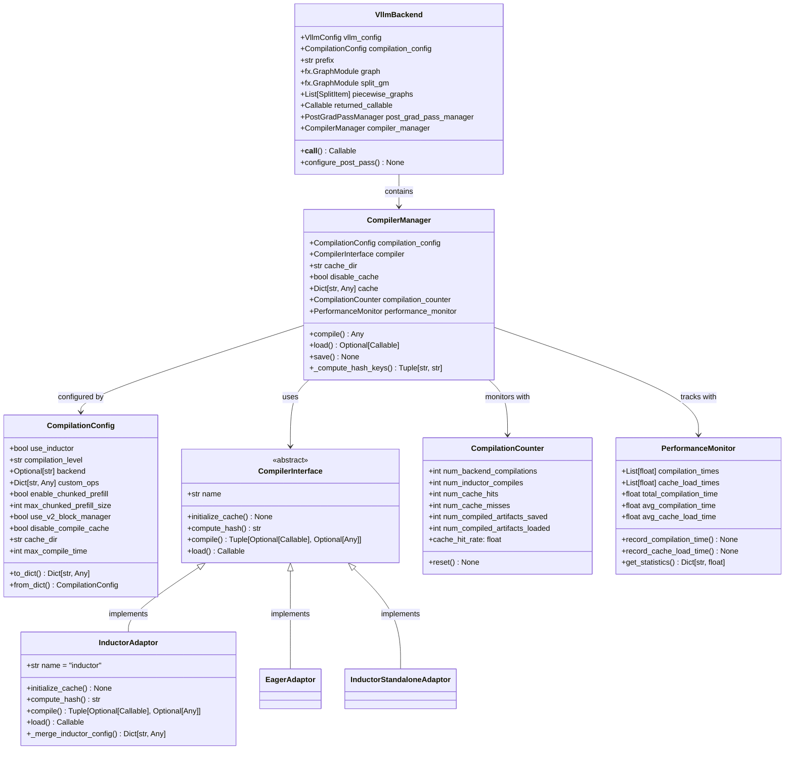

# vLLM-09-Compilation模块-数据结构

## 关键数据结构概览

Compilation 模块的数据结构设计围绕编译流程管理、缓存系统和性能监控展开，包括编译配置、缓存管理、编译器接口和监控统计四个层次。



## 核心类定义

### 1. CompilationConfig 编译配置

```python
@dataclass
class CompilationConfig:
    """
    编译模块的配置参数
    控制编译行为、缓存策略和性能优化
    """
    
    # 核心编译选项
    use_inductor: bool = True                           # 是否使用Inductor编译
    compilation_level: str = "piecewise"                # 编译级别 ("dynamo_once", "piecewise")
    backend: Optional[str] = None                       # 指定编译后端
    
    # 自定义操作和扩展
    custom_ops: Dict[str, Any] = field(default_factory=dict)  # 自定义操作配置
    
    # 分块预填充配置
    enable_chunked_prefill: bool = False                # 启用分块预填充
    max_chunked_prefill_size: int = 8192               # 最大分块预填充大小
    
    # 块管理器配置
    use_v2_block_manager: bool = False                  # 使用V2块管理器
    
    # 缓存配置
    disable_compile_cache: bool = False                 # 禁用编译缓存
    cache_dir: str = field(default_factory=lambda: tempfile.gettempdir())  # 缓存目录
    
    # 性能和限制
    max_compile_time: int = 600                         # 最大编译时间(秒)
    debug_compile: bool = False                         # 编译调试模式
    
    def __post_init__(self):
        """配置验证和标准化"""
        self._validate_and_normalize()
    
    def _validate_and_normalize(self):
        """验证配置参数的有效性"""
        # 1) 编译级别验证
        valid_levels = ["dynamo_once", "piecewise"]
        if self.compilation_level not in valid_levels:
            raise ValueError(f"compilation_level must be one of {valid_levels}")
        
        # 2) 缓存目录处理
        if not self.disable_compile_cache:
            self.cache_dir = os.path.expanduser(self.cache_dir)
            os.makedirs(self.cache_dir, exist_ok=True)
        
        # 3) 时间限制验证
        if self.max_compile_time <= 0:
            raise ValueError("max_compile_time must be positive")
    
    def to_dict(self) -> Dict[str, Any]:
        """转换为字典格式"""
        return {
            "use_inductor": self.use_inductor,
            "compilation_level": self.compilation_level,
            "backend": self.backend,
            "custom_ops": self.custom_ops,
            "enable_chunked_prefill": self.enable_chunked_prefill,
            "max_chunked_prefill_size": self.max_chunked_prefill_size,
            "use_v2_block_manager": self.use_v2_block_manager,
            "disable_compile_cache": self.disable_compile_cache,
            "cache_dir": self.cache_dir,
            "max_compile_time": self.max_compile_time,
            "debug_compile": self.debug_compile,
        }
    
    @classmethod
    def from_dict(cls, config_dict: Dict[str, Any]) -> "CompilationConfig":
        """从字典创建配置对象"""
        return cls(**config_dict)
```

**字段语义与约束**：

| 字段 | 类型 | 约束 | 默认值 | 说明 |
|------|------|------|--------|------|
| `use_inductor` | bool | 无 | True | 是否启用Inductor编译器 |
| `compilation_level` | str | 枚举值 | "piecewise" | 编译粒度级别 |
| `backend` | Optional[str] | 有效后端名 | None | 指定特定编译后端 |
| `custom_ops` | Dict[str, Any] | 有效配置 | {} | 自定义操作配置 |
| `max_compile_time` | int | > 0 | 600 | 编译超时时间 |
| `cache_dir` | str | 有效路径 | 临时目录 | 编译缓存存储路径 |

### 2. CompilerManager 编译管理器

```python
class CompilerManager:
    """
    编译流程的核心管理器
    负责编译调度、缓存管理和性能监控
    """
    
    def __init__(
        self,
        compilation_config: CompilationConfig,
        vllm_config: Optional[VllmConfig] = None
    ):
        # 配置管理
        self.compilation_config = compilation_config
        self.vllm_config = vllm_config
        
        # 编译器后端
        self.compiler = make_compiler(compilation_config)
        
        # 缓存系统
        self.disable_cache = compilation_config.disable_compile_cache
        if not self.disable_cache:
            self.cache_dir = Path(compilation_config.cache_dir)
            self.cache_dir.mkdir(parents=True, exist_ok=True)
            self.cache: Dict[str, Any] = {}  # 内存缓存
        else:
            self.cache_dir = None
            self.cache = None
        
        # 性能监控
        self.compilation_counter = CompilationCounter()
        self.performance_monitor = PerformanceMonitor()
        
        # 运行时状态
        self._compiler_processes: Dict[str, subprocess.Popen] = {}
        self._active_compilations: Set[str] = set()
    
    def _compute_hash_keys(
        self,
        graph: fx.GraphModule,
        example_inputs: List[Any],
        graph_index: int,
        runtime_shape: Optional[int] = None
    ) -> Tuple[str, str]:
        """
        计算编译缓存的哈希键
        
        Returns:
            (cache_key, cache_filename): 缓存键和文件名
        """
        # 1) 收集哈希因子
        hash_factors = []
        
        # 图结构哈希
        graph_str = str(graph.code)
        hash_factors.append(("graph", hashlib.md5(graph_str.encode()).hexdigest()[:8]))
        
        # 输入签名
        input_signature = []
        for inp in example_inputs:
            if hasattr(inp, 'shape') and hasattr(inp, 'dtype'):
                input_signature.append((tuple(inp.shape), str(inp.dtype)))
        hash_factors.append(("inputs", input_signature))
        
        # 运行时形状
        if runtime_shape is not None:
            hash_factors.append(("runtime_shape", runtime_shape))
        
        # 编译配置
        config_hash = hashlib.md5(
            json.dumps(self.compilation_config.to_dict(), sort_keys=True).encode()
        ).hexdigest()[:8]
        hash_factors.append(("config", config_hash))
        
        # 编译器版本
        compiler_hash = self.compiler.compute_hash(self.vllm_config)
        hash_factors.append(("compiler", compiler_hash))
        
        # 2) 生成最终哈希
        hash_content = json.dumps(hash_factors, sort_keys=True)
        cache_key = hashlib.md5(hash_content.encode(), usedforsecurity=False).hexdigest()[:16]
        
        # 3) 构建文件名
        runtime_shape_str = f"shape_{runtime_shape}" if runtime_shape else "dynamic"
        cache_filename = f"compiled_graph_{graph_index}_{runtime_shape_str}_{cache_key}"
        
        return cache_key, cache_filename
```

### 3. CompilerInterface 编译器接口

```python
class CompilerInterface(ABC):
    """
    编译器后端的抽象接口
    定义统一的编译、加载和缓存接口
    """
    
    # 编译器标识
    name: str = "abstract"
    
    @abstractmethod
    def initialize_cache(
        self,
        cache_dir: str,
        disable_cache: bool = False,
        prefix: str = ""
    ) -> None:
        """
        初始化编译器的缓存系统
        
        Args:
            cache_dir: 缓存目录路径
            disable_cache: 是否禁用缓存
            prefix: 缓存前缀（用于多实例区分）
        """
        pass
    
    @abstractmethod
    def compute_hash(self, vllm_config: VllmConfig) -> str:
        """
        计算编译器相关的版本哈希
        
        Args:
            vllm_config: vLLM配置对象
            
        Returns:
            版本哈希字符串
        """
        return ""
    
    @abstractmethod 
    def compile(
        self,
        graph: fx.GraphModule,
        example_inputs: List[Any],
        compiler_config: Dict[str, Any],
        runtime_shape: Optional[int] = None,
        key: Optional[str] = None,
    ) -> Tuple[Optional[Callable], Optional[Any]]:
        """
        编译计算图
        
        Args:
            graph: FX计算图
            example_inputs: 示例输入数据
            compiler_config: 编译器配置
            runtime_shape: 运行时形状
            key: 缓存键
            
        Returns:
            (compiled_function, handle): 编译结果和句柄
        """
        return None, None
    
    @abstractmethod
    def load(
        self,
        handle: Any,
        graph: fx.GraphModule,
        example_inputs: List[Any],
        graph_index: int,
        runtime_shape: Optional[int] = None
    ) -> Callable:
        """
        从句柄加载编译结果
        
        Args:
            handle: 编译器句柄
            graph: 原始计算图
            example_inputs: 示例输入
            graph_index: 图索引
            runtime_shape: 运行时形状
            
        Returns:
            加载的编译函数
        """
        raise NotImplementedError
```

### 4. VllmBackend vLLM编译后端

```python
class VllmBackend:
    """
    vLLM专用的编译后端
    实现分片编译和后梯度优化Pass
    """
    
    def __init__(
        self,
        vllm_config: VllmConfig,
        prefix: str = "",
    ):
        # 配置初始化
        self.vllm_config = vllm_config
        self.compilation_config = vllm_config.compilation_config
        self.prefix = prefix or model_tag
        
        # 后梯度Pass管理器
        self.post_grad_pass_manager = PostGradPassManager()
        
        # 编译状态
        self.sym_tensor_indices: List[int] = []
        self.input_buffers: List[torch.Tensor] = []
        
        # 编译管理器
        self.compiler_manager = CompilerManager(
            self.compilation_config, self.vllm_config)
        
        # 分片编译相关
        self.graph: Optional[fx.GraphModule] = None
        self.split_gm: Optional[fx.GraphModule] = None
        self.piecewise_graphs: List[SplitItem] = []
        self.returned_callable: Optional[Callable] = None
    
    def __call__(
        self,
        graph: fx.GraphModule,
        example_inputs: List[Any]
    ) -> Callable:
        """
        编译入口方法
        根据配置选择完整编译或分片编译
        """
        # 1) 保存图和输入信息
        self.graph = graph
        self._analyze_input_buffers(example_inputs)
        
        # 2) 配置后处理Pass
        self.configure_post_pass()
        
        # 3) 选择编译策略
        if self.compilation_config.compilation_level == "piecewise":
            return self._piecewise_compile(graph, example_inputs)
        else:
            return self._full_compile(graph, example_inputs)
    
    def _piecewise_compile(
        self,
        graph: fx.GraphModule,
        example_inputs: List[Any]
    ) -> Callable:
        """
        分片编译实现
        将大图分解为多个小图分别编译
        """
        # 1) 图分片分析
        self.piecewise_graphs = self._split_graph_into_pieces(graph)
        
        # 2) 创建拼接图
        self.split_gm = self._create_split_graph_module(self.piecewise_graphs)
        
        # 3) 编译各个分片
        compiled_pieces = []
        for i, split_item in enumerate(self.piecewise_graphs):
            compiled_piece = self.compiler_manager.compile(
                split_item.graph,
                split_item.example_inputs,
                self._get_additional_inductor_config(),
                self.compilation_config,
                graph_index=i,
                num_graphs=len(self.piecewise_graphs)
            )
            compiled_pieces.append(compiled_piece)
        
        # 4) 构建完整执行函数
        def piecewise_callable(*args):
            current_args = args
            for piece in compiled_pieces:
                current_args = piece(*current_args)
                if not isinstance(current_args, tuple):
                    current_args = (current_args,)
            return current_args[0] if len(current_args) == 1 else current_args
        
        self.returned_callable = piecewise_callable
        return piecewise_callable
```

## 缓存和监控数据结构

### 1. CompilationCounter 编译统计

```python
@dataclass
class CompilationCounter:
    """
    编译过程的统计计数器
    跟踪编译次数、缓存效率等指标
    """
    
    # 编译统计
    num_backend_compilations: int = 0           # 后端编译总次数
    num_inductor_compiles: int = 0              # Inductor编译次数
    
    # 缓存统计
    num_cache_hits: int = 0                     # 缓存命中次数
    num_cache_misses: int = 0                   # 缓存未命中次数
    
    # 产物管理
    num_compiled_artifacts_saved: int = 0       # 保存的编译产物数
    num_compiled_artifacts_loaded: int = 0      # 加载的编译产物数
    
    @property
    def cache_hit_rate(self) -> float:
        """计算缓存命中率"""
        total_requests = self.num_cache_hits + self.num_cache_misses
        if total_requests == 0:
            return 0.0
        return self.num_cache_hits / total_requests
    
    @property
    def total_cache_requests(self) -> int:
        """总缓存请求数"""
        return self.num_cache_hits + self.num_cache_misses
    
    def reset(self) -> None:
        """重置所有计数器"""
        self.num_backend_compilations = 0
        self.num_inductor_compiles = 0
        self.num_cache_hits = 0
        self.num_cache_misses = 0
        self.num_compiled_artifacts_saved = 0
        self.num_compiled_artifacts_loaded = 0
    
    def to_dict(self) -> Dict[str, Any]:
        """转换为字典格式"""
        return {
            "backend_compilations": self.num_backend_compilations,
            "inductor_compiles": self.num_inductor_compiles,
            "cache_hits": self.num_cache_hits,
            "cache_misses": self.num_cache_misses,
            "cache_hit_rate": self.cache_hit_rate,
            "artifacts_saved": self.num_compiled_artifacts_saved,
            "artifacts_loaded": self.num_compiled_artifacts_loaded,
        }
```

### 2. PerformanceMonitor 性能监控器

```python
class PerformanceMonitor:
    """
    编译性能监控器
    跟踪编译时间、内存使用等性能指标
    """
    
    def __init__(self, max_history: int = 1000):
        self.max_history = max_history
        
        # 时间统计
        self.compilation_times: deque = deque(maxlen=max_history)
        self.cache_load_times: deque = deque(maxlen=max_history)
        
        # 累计统计
        self.total_compilation_time: float = 0.0
        self.total_cache_load_time: float = 0.0
        
        # 内存统计
        self.peak_memory_usage: int = 0
        self.current_memory_usage: int = 0
        
        # 并发统计
        self.active_compilations: int = 0
        self.max_concurrent_compilations: int = 0
    
    def record_compilation_time(self, duration: float) -> None:
        """记录编译时间"""
        self.compilation_times.append(duration)
        self.total_compilation_time += duration
    
    def record_cache_load_time(self, duration: float) -> None:  
        """记录缓存加载时间"""
        self.cache_load_times.append(duration)
        self.total_cache_load_time += duration
    
    def record_memory_usage(self, usage: int) -> None:
        """记录内存使用情况"""
        self.current_memory_usage = usage
        self.peak_memory_usage = max(self.peak_memory_usage, usage)
    
    def start_compilation(self) -> None:
        """开始编译（用于并发统计）"""
        self.active_compilations += 1
        self.max_concurrent_compilations = max(
            self.max_concurrent_compilations, self.active_compilations)
    
    def end_compilation(self) -> None:
        """结束编译"""
        self.active_compilations = max(0, self.active_compilations - 1)
    
    @property
    def avg_compilation_time(self) -> float:
        """平均编译时间"""
        if not self.compilation_times:
            return 0.0
        return sum(self.compilation_times) / len(self.compilation_times)
    
    @property
    def avg_cache_load_time(self) -> float:
        """平均缓存加载时间"""
        if not self.cache_load_times:
            return 0.0
        return sum(self.cache_load_times) / len(self.cache_load_times)
    
    def get_statistics(self) -> Dict[str, float]:
        """获取性能统计信息"""
        return {
            "avg_compilation_time": self.avg_compilation_time,
            "avg_cache_load_time": self.avg_cache_load_time,
            "total_compilation_time": self.total_compilation_time,
            "total_cache_load_time": self.total_cache_load_time,
            "peak_memory_usage_mb": self.peak_memory_usage / 1024**2,
            "current_memory_usage_mb": self.current_memory_usage / 1024**2,
            "max_concurrent_compilations": self.max_concurrent_compilations,
            "active_compilations": self.active_compilations,
        }
```

## 分片编译数据结构

### 1. SplitItem 分片项

```python
@dataclass
class SplitItem:
    """
    分片编译中的单个分片信息
    包含分片图、输入输出和编译选项
    """
    
    # 分片标识
    graph_index: int                            # 分片索引
    graph: fx.GraphModule                       # 分片计算图
    
    # 输入输出
    example_inputs: List[Any]                   # 示例输入
    input_nodes: List[fx.Node]                  # 输入节点列表
    output_nodes: List[fx.Node]                 # 输出节点列表
    
    # 形状信息
    input_shapes: List[Tuple[int, ...]]         # 输入形状列表
    output_shapes: List[Tuple[int, ...]]        # 输出形状列表
    
    # 编译选项
    compile_options: Dict[str, Any] = field(default_factory=dict)
    
    def __post_init__(self):
        """验证分片项的一致性"""
        if len(self.input_shapes) != len(self.example_inputs):
            raise ValueError("Input shapes and example inputs length mismatch")
    
    @property
    def memory_estimate(self) -> int:
        """估算分片的内存需求"""
        total_elements = 0
        for shape in self.input_shapes + self.output_shapes:
            total_elements += np.prod(shape)
        
        # 假设float16，每个元素2字节
        return total_elements * 2
    
    @property
    def complexity_score(self) -> float:
        """计算分片的复杂度分数"""
        # 基于节点数量和连接复杂度的简单评估
        num_nodes = len(list(self.graph.graph.nodes))
        num_edges = len(list(self.graph.graph.edges))
        
        return num_nodes + 0.5 * num_edges
```

### 2. PostGradPassManager Pass管理器

```python
class PostGradPassManager:
    """
    后梯度优化Pass的管理器
    负责注册、调度和执行各种优化Pass
    """
    
    def __init__(self):
        # Pass注册表
        self.registered_passes: List[InductorPass] = []
        
        # Pass配置
        self.pass_config: Dict[str, Any] = {
            "enable_fusion": True,
            "enable_memory_planning": True,
            "enable_kernel_optimization": True,
        }
        
        # 执行统计
        self.pass_execution_times: Dict[str, List[float]] = {}
    
    def register_pass(self, pass_instance: InductorPass) -> None:
        """注册一个优化Pass"""
        self.registered_passes.append(pass_instance)
        self.pass_execution_times[pass_instance.name] = []
    
    def apply_passes(
        self,
        graph: fx.GraphModule,
        example_inputs: List[Any]
    ) -> fx.GraphModule:
        """
        应用所有注册的Pass
        
        Args:
            graph: 输入计算图
            example_inputs: 示例输入
            
        Returns:
            优化后的计算图
        """
        current_graph = graph
        
        for pass_instance in self.registered_passes:
            if not self._should_apply_pass(pass_instance):
                continue
                
            start_time = time.time()
            try:
                current_graph = pass_instance.apply(current_graph, example_inputs)
                execution_time = time.time() - start_time
                self.pass_execution_times[pass_instance.name].append(execution_time)
                
                logger.debug(f"Applied pass {pass_instance.name} in {execution_time:.3f}s")
                
            except Exception as e:
                logger.warning(f"Pass {pass_instance.name} failed: {e}")
                # 继续执行其他Pass
        
        return current_graph
    
    def _should_apply_pass(self, pass_instance: InductorPass) -> bool:
        """判断是否应该应用某个Pass"""
        pass_name = pass_instance.name
        
        # 根据配置决定是否启用
        if pass_name == "fusion_pass":
            return self.pass_config.get("enable_fusion", True)
        elif pass_name == "memory_planning_pass":
            return self.pass_config.get("enable_memory_planning", True)
        elif pass_name == "kernel_optimization_pass":
            return self.pass_config.get("enable_kernel_optimization", True)
        
        # 默认启用
        return True
```

## 数据流映射关系

### 1. 编译流程数据映射

```python
def compilation_data_flow(
    pytorch_model: nn.Module,          # 原始PyTorch模型
    example_inputs: List[torch.Tensor], # 示例输入
    compilation_config: CompilationConfig  # 编译配置
) -> Callable:                         # 编译后的可调用对象
    """
    展示从PyTorch模型到编译结果的完整数据流映射
    """
    # 第1步：模型到FX图的转换
    with torch.no_grad():
        fx_graph = torch.fx.symbolic_trace(pytorch_model)
    
    # 第2步：图优化和变换
    optimized_graph = apply_graph_optimizations(fx_graph)
    
    # 第3步：缓存键计算
    cache_key = compute_compilation_hash(
        optimized_graph, example_inputs, compilation_config)
    
    # 第4步：编译器调用
    if compilation_config.use_inductor:
        compiled_fn = torch.compile(
            optimized_graph, 
            mode="reduce-overhead",
            dynamic=compilation_config.enable_dynamic_shapes
        )
    else:
        compiled_fn = optimized_graph  # Eager模式
    
    # 第5步：缓存存储
    save_compilation_cache(cache_key, compiled_fn)
    
    return compiled_fn
```

### 2. 缓存系统数据组织

```python
class CompilationCacheLayout:
    """
    编译缓存的数据组织结构
    """
    
    def __init__(self, cache_dir: str):
        self.cache_dir = Path(cache_dir)
        
        # 分层缓存结构
        self.memory_cache: Dict[str, Any] = {}        # 内存缓存（最快）
        self.disk_cache_dir = self.cache_dir / "disk" # 磁盘缓存
        self.artifacts_dir = self.cache_dir / "artifacts"  # 编译产物
        
        # 元数据管理
        self.cache_metadata = self._load_cache_metadata()
        
    def _get_cache_hierarchy(self, cache_key: str) -> List[Tuple[str, str]]:
        """
        获取缓存的层次结构路径
        
        Returns:
            [(cache_type, cache_path), ...] 按访问速度排序
        """
        paths = []
        
        # 1) 内存缓存
        if cache_key in self.memory_cache:
            paths.append(("memory", cache_key))
        
        # 2) 磁盘缓存
        disk_path = self.disk_cache_dir / f"{cache_key}.pkl"
        if disk_path.exists():
            paths.append(("disk", str(disk_path)))
        
        # 3) 编译产物缓存
        artifact_path = self.artifacts_dir / cache_key
        if artifact_path.exists():
            paths.append(("artifact", str(artifact_path)))
        
        return paths
```

## 版本演进说明

| 版本 | 主要变更 | 数据结构影响 | 兼容性 | 迁移建议 |
|------|----------|--------------|--------|----------|
| v0.1.x | 基础编译支持 | 简单配置结构 | 不兼容 | 已废弃 |
| v0.2.x | 引入Inductor | 添加编译器接口 | 向后兼容 | 建议升级 |
| v0.3.x | 缓存系统 | 分层缓存结构 | 部分兼容 | 需要重建缓存 |
| v0.4.x | 分片编译 | 分片数据结构 | 向后兼容 | 新增分片配置 |
| 当前版本 | 性能监控优化 | 监控数据结构 | 向后兼容 | 推荐监控功能 |

## 内存布局优化

### 1. 编译缓存内存对齐

```python
# 缓存友好的数据结构设计
@dataclass
class OptimizedCacheEntry:
    """
    内存优化的缓存条目结构
    """
    __slots__ = ['key', 'compiled_fn', 'metadata', 'access_count', 'last_access']
    
    key: str                           # 缓存键
    compiled_fn: Callable              # 编译后的函数
    metadata: Dict[str, Any]           # 元数据信息
    access_count: int = 0              # 访问次数
    last_access: float = 0.0           # 最后访问时间
    
    def update_access(self):
        """更新访问统计"""
        self.access_count += 1
        self.last_access = time.time()
```

### 2. 批处理编译内存池

```python
class CompilationMemoryPool:
    """
    编译过程的内存池管理
    复用临时对象减少分配开销
    """
    
    def __init__(self, pool_size: int = 100):
        # 对象池
        self.fx_graph_pool: List[fx.GraphModule] = []
        self.tensor_pool: List[torch.Tensor] = []
        self.dict_pool: List[Dict[str, Any]] = []
        
        # 池大小限制
        self.max_pool_size = pool_size
        
        # 使用统计
        self.pool_hits = 0
        self.pool_misses = 0
    
    def get_graph_module(self) -> fx.GraphModule:
        """从池中获取图模块对象"""
        if self.fx_graph_pool:
            self.pool_hits += 1
            return self.fx_graph_pool.pop()
        else:
            self.pool_misses += 1
            return fx.GraphModule(nn.Module(), fx.Graph())
    
    def return_graph_module(self, graph: fx.GraphModule):
        """归还图模块对象到池中"""
        if len(self.fx_graph_pool) < self.max_pool_size:
            # 清理状态后放回池中
            graph.graph.clear()
            self.fx_graph_pool.append(graph)
    
    @property
    def hit_rate(self) -> float:
        """计算池命中率"""
        total = self.pool_hits + self.pool_misses
        return self.pool_hits / total if total > 0 else 0.0
```

这些数据结构为Compilation模块提供了完整的类型系统和内存管理方案，支持从简单编译到复杂分片编译的各种场景。
