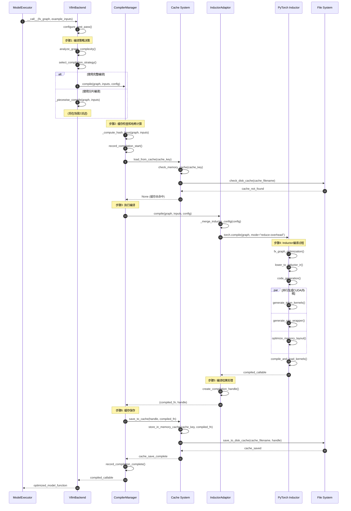
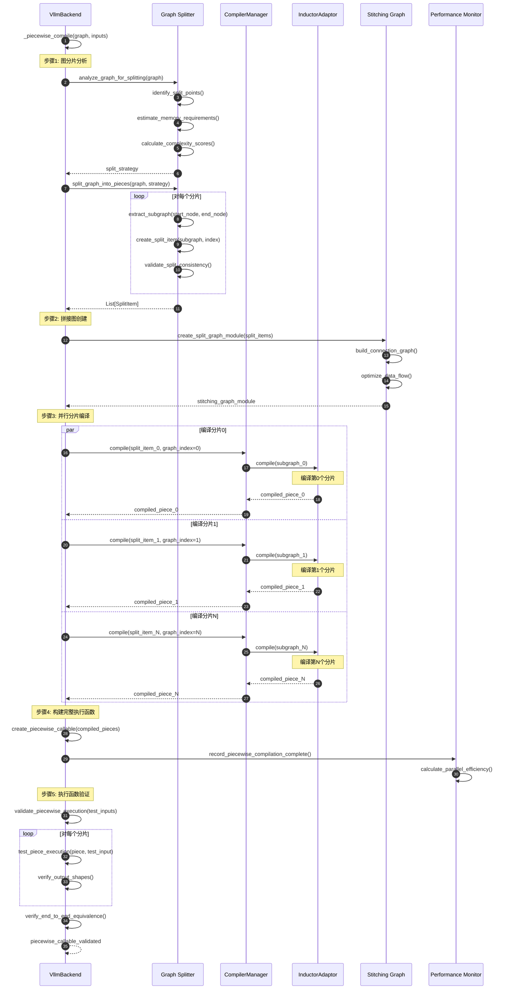
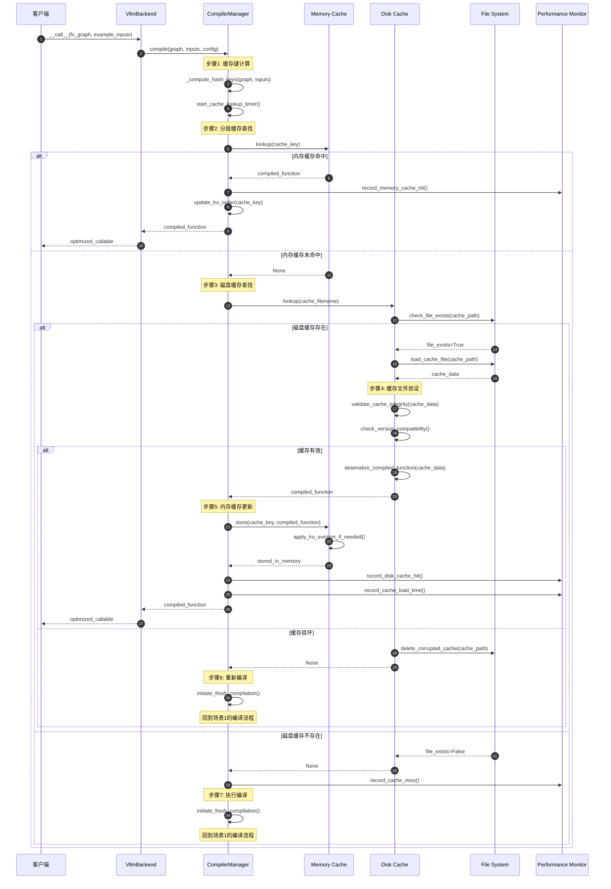
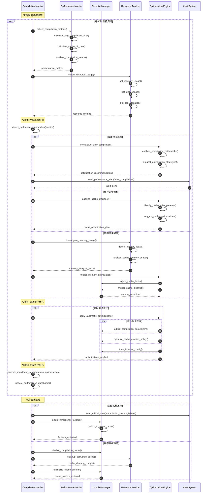
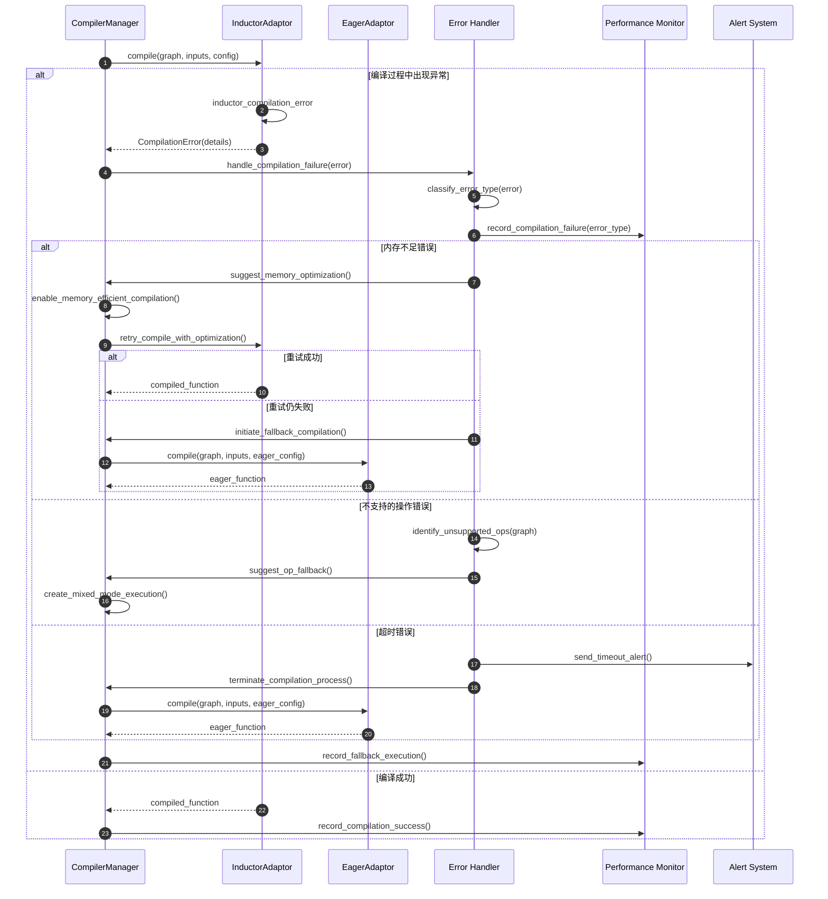

# vLLM-09-Compilation模块-时序图

## 典型场景时序图分析

本文档展示 Compilation 模块在不同编译场景下的详细时序图，涵盖完整编译、分片编译、缓存管理和性能监控等关键操作流程。

## 场景1：首次模型编译流程

### 时序图

### 详细说明

**图意概述**：展示了模型首次编译的完整流程，从图分析到缓存保存的全过程。

**关键步骤分解**：

1. **编译策略选择**（步骤1-2）：
   - 分析计算图的复杂度和内存需求
   - 根据模型大小选择完整编译或分片编译
   - 配置后梯度优化Pass

2. **缓存系统检查**（步骤3-6）：
   - 计算基于图结构、输入签名和配置的哈希键
   - 依次检查内存缓存和磁盘缓存
   - 记录缓存未命中统计

3. **Inductor编译执行**（步骤7-14）：
   - 合并用户配置和默认Inductor配置
   - 调用PyTorch Inductor进行深度优化
   - 并行生成Triton内核和C++包装代码

4. **编译产物处理**（步骤15-18）：
   - 创建编译结果的句柄和元数据
   - 保存到分层缓存系统
   - 更新编译统计和性能指标

**边界条件**：
- **编译超时**：默认10分钟超时，可配置
- **内存限制**：编译过程内存使用监控
- **错误恢复**：编译失败时自动降级到Eager模式

**性能特征**：
- **编译时间**：通常30秒-10分钟（取决于模型复杂度）
- **性能提升**：运行时加速2-5x
- **内存开销**：编译时临时内存使用2-4x模型大小

## 场景2：分片编译流程

### 时序图

### 详细说明

**图意概述**：展示了大型模型分片编译的完整流程，包括图分析、分片创建、并行编译和结果组装。

**分片策略**：

1. **智能分片**：
   - 基于内存使用量和计算复杂度的分片点选择
   - 考虑数据依赖关系避免不必要的中间结果传递
   - 平衡各分片的编译时间和运行时性能

2. **并行编译**：
   - 多个分片可以并行编译，充分利用多核CPU
   - 每个分片独立缓存，提高缓存复用率
   - 编译失败的分片不影响其他分片

3. **连接优化**：
   - 生成高效的分片间数据传递代码
   - 最小化中间张量的内存分配
   - 支持内存原位操作减少拷贝开销

**性能优势**：
- **内存效率**：避免大图编译的内存峰值
- **编译并行**：多分片并行编译减少总时间
- **缓存细粒度**：分片级缓存提高复用率
- **错误隔离**：单个分片编译失败不影响整体

## 场景3：缓存命中的快速加载

### 时序图

### 详细说明

**图意概述**：展示了编译缓存系统的分层查找和快速加载机制，包括内存缓存、磁盘缓存的命中处理。

**缓存策略特征**：

1. **分层缓存架构**：
   - **L1缓存（内存）**：最快访问，容量有限（通常100-500个编译结果）
   - **L2缓存（磁盘）**：容量大，持久化存储，访问稍慢
   - **L3缓存（分布式，可选）**：集群间共享，网络访问

2. **缓存一致性保证**：
   - 多维度哈希确保缓存键的唯一性
   - 版本兼容性检查防止不兼容缓存的使用
   - 完整性验证检测缓存文件损坏

3. **LRU淘汰策略**：
   - 内存缓存使用LRU算法管理容量
   - 磁盘缓存基于访问时间和文件大小淘汰
   - 支持缓存优先级和固定缓存项

**性能优化**：
- **内存缓存命中**：<1ms加载时间
- **磁盘缓存命中**：10-100ms加载时间
- **缓存预热**：启动时预加载常用编译结果
- **异步更新**：后台异步更新过期缓存

## 场景4：编译性能监控和优化

### 时序图

### 详细说明

**图意概述**：展示了编译系统的持续性能监控、异常检测和自动优化流程。

**监控维度**：

1. **性能指标监控**：
   - 编译时间分布和趋势分析
   - 缓存命中率和加载时间统计
   - 并发编译效率和资源利用率
   - 编译成功率和错误率统计

2. **资源使用监控**：
   - CPU利用率和负载均衡
   - 内存使用峰值和泄漏检测
   - 磁盘I/O和存储容量监控
   - 网络带宽使用（分布式缓存）

3. **系统健康监控**：
   - 编译器进程状态监控
   - 缓存系统完整性检查
   - 依赖服务可用性监控
   - 错误日志分析和告警

**自动优化策略**：

1. **动态参数调优**：
   - 根据历史性能数据调整编译参数
   - 自适应缓存大小和淘汰策略
   - 动态并发度控制

2. **预测性优化**：
   - 基于使用模式预编译常用模型
   - 预测性缓存预热和分布
   - 资源需求预测和预分配

3. **故障自愈**：
   - 自动重试失败的编译任务
   - 缓存损坏时的自动修复
   - 性能降级时的自动回退策略

## 故障处理和恢复时序

### 编译失败恢复流程

**故障恢复策略**：

1. **分层回退机制**：
   - Inductor编译失败 → 降级到优化较少的Inductor配置
   - 仍然失败 → 回退到Eager模式
   - 保证系统可用性的同时尽量保持性能

2. **错误分类处理**：
   - 内存不足：启用内存优化选项，减少并发编译
   - 不支持操作：识别并隔离不支持的操作符
   - 超时错误：终止编译进程，防止资源泄漏

3. **自动修复**：
   - 缓存损坏时自动清理和重建
   - 配置错误时自动回退到默认配置
   - 依赖缺失时自动下载或绕过

这些时序图全面展示了 Compilation 模块在各种场景下的工作流程，为编译优化和故障处理提供了详细的参考依据。
