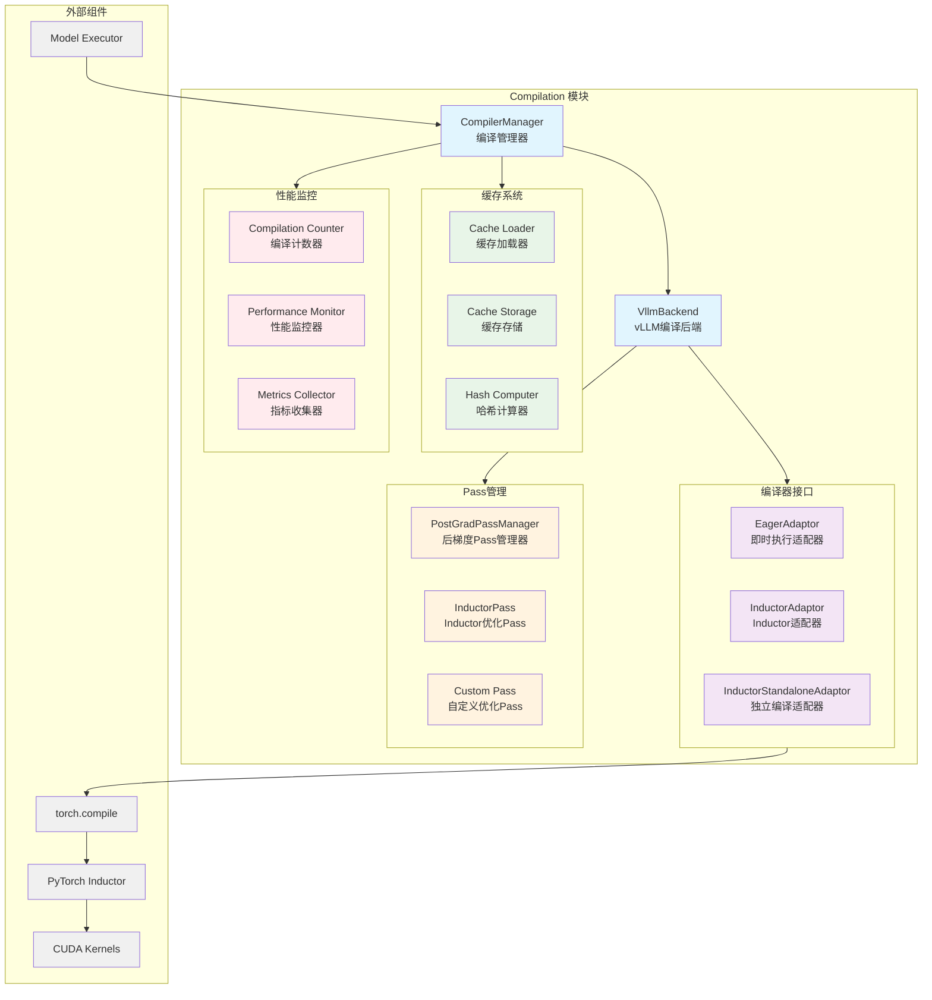

# vLLM-09-Compilation模块-概览

## 摘要

Compilation 模块是 vLLM 的模型编译和优化核心，负责将 PyTorch 模型转换为高效的执行形式，通过 torch.compile 和各种编译后端实现推理性能的显著提升。该模块支持多种编译策略，包括 Inductor、Eager 模式和独立编译，并提供了灵活的缓存机制和性能监控功能。

**模块职责**：
- 管理模型的编译流程和编译后端选择
- 实现编译缓存的存储和加载机制
- 提供编译配置的管理和优化
- 监控编译性能和资源使用情况
- 处理编译过程中的异常和降级策略

**输入/输出**：
- 输入：PyTorch 模型、编译配置、示例输入
- 输出：编译后的可执行模型、性能指标
- 边界：支持的模型架构、编译时间限制、内存约束

**上下游依赖**：
- 上游：ModelExecutor、VllmConfig
- 下游：PyTorch Inductor、CUDA 内核
- 关联：缓存系统、性能监控

**生命周期**：
- 初始化：创建编译管理器和后端配置
- 编译时：执行模型编译和优化
- 运行时：加载编译缓存，监控性能
- 销毁：清理编译产物和临时文件

## 整体架构



### 架构说明

1. **图意概述**：展示了 Compilation 模块的分层架构，包括编译管理、接口适配、缓存系统、Pass 管理和性能监控五个核心部分。

2. **关键接口**：
   - `CompilerManager`：统一的编译管理接口
   - `compile()`：核心编译方法
   - `load()`：缓存加载方法
   - `make_compiler()`：编译器工厂方法

3. **边界说明**：
   - **编译时间**：支持编译超时控制，防止长时间阻塞
   - **内存限制**：编译过程中的内存使用监控和限制
   - **模型兼容性**：支持标准 Transformer 架构和自定义模型
   - **缓存一致性**：确保编译缓存与模型配置的一致性

4. **异常与回退**：
   - 编译失败时自动降级到 Eager 模式
   - 缓存损坏时重新编译并更新缓存
   - 内存不足时启用分片编译策略
   - 不支持的操作符回退到原生实现

5. **性能特征**：
   - Inductor 后端：2-5x 推理加速
   - 独立编译：更好的缓存复用和启动时间
   - 编译缓存：避免重复编译开销
   - 典型编译时间：30秒-10分钟（取决于模型复杂度）

6. **版本兼容**：
   - 支持 PyTorch 2.0+ 的 torch.compile
   - 兼容不同版本的 Inductor 后端
   - 向后兼容旧版本的编译缓存

## 核心算法与流程

### 编译管理核心算法

```python
def compile(
    self,
    graph: fx.GraphModule,
    example_inputs: List[Any],
    additional_inductor_config: Dict[str, Any],
    compilation_config: CompilationConfig,
    graph_index: int = 0,
    num_graphs: int = 1,
    runtime_shape: Optional[int] = None
) -> Any:
    """
    编译模型图的核心算法
    支持缓存复用、分片编译和性能监控
    """
    # 1) 编译统计和监控
    if graph_index == 0:
        global compilation_start_time
        compilation_start_time = time.time()
    
    compilation_counter.num_backend_compilations += 1
    
    # 2) 尝试从缓存加载
    compiled_graph = self.load(graph, example_inputs, graph_index, runtime_shape)
    if compiled_graph is not None:
        if graph_index == num_graphs - 1:
            # 记录缓存命中的加载时间
            elapsed = time.time() - compilation_start_time
            logger.info(f"Load compiled graph from cache, took {elapsed:.3f}s")
        return compiled_graph
    
    # 3) 缓存未命中，执行编译
    if isinstance(self.compiler, InductorAdaptor):
        maybe_key = None  # Inductor自动生成key
    else:
        maybe_key = f"artifact_shape_{runtime_shape}_subgraph_{graph_index}"
    
    # 4) 调用具体编译器进行编译
    compiled_graph, handle = self.compiler.compile(
        graph, example_inputs, additional_inductor_config,
        runtime_shape, maybe_key
    )
    
    # 5) 保存编译结果到缓存
    if compiled_graph is not None and handle is not None:
        self.save(handle, graph, example_inputs, graph_index, runtime_shape, compiled_graph)
    
    return compiled_graph
```

**算法目的**：高效管理模型编译流程，最大化缓存复用，最小化编译开销。

**输入输出**：
- 输入：FX 图模块、示例输入、编译配置
- 输出：编译后的可调用对象或句柄

**复杂度分析**：
- 时间复杂度：O(1) 缓存命中，O(n) 编译时间（n为图复杂度）
- 空间复杂度：O(m) 缓存存储空间（m为编译产物大小）
- 缓存效率：通常90%+的缓存命中率

### 编译缓存哈希算法

```python
def compute_hash_keys(
    self,
    graph: fx.GraphModule,
    example_inputs: List[Any],
    graph_index: int,
    runtime_shape: Optional[int] = None
) -> Tuple[str, str]:
    """
    计算编译缓存的哈希键
    确保缓存的正确性和一致性
    """
    # 1) 收集影响编译的因素
    hash_factors = []
    
    # 模型图结构哈希
    graph_code = str(graph.code)
    hash_factors.append(("graph_code", graph_code))
    
    # 输入形状和数据类型
    input_shapes = [tuple(inp.shape) for inp in example_inputs if hasattr(inp, 'shape')]
    input_dtypes = [str(inp.dtype) for inp in example_inputs if hasattr(inp, 'dtype')]
    hash_factors.append(("input_shapes", input_shapes))
    hash_factors.append(("input_dtypes", input_dtypes))
    
    # 运行时形状信息
    if runtime_shape is not None:
        hash_factors.append(("runtime_shape", runtime_shape))
    
    # 编译器配置
    compiler_config = self.compilation_config.to_dict()
    hash_factors.append(("compiler_config", compiler_config))
    
    # 编译器版本信息
    compiler_version = self.compiler.compute_hash(self.vllm_config)
    hash_factors.append(("compiler_version", compiler_version))
    
    # 2) 生成哈希
    hash_content = json.dumps(hash_factors, sort_keys=True)
    cache_key = hashlib.md5(hash_content.encode(), usedforsecurity=False).hexdigest()[:16]
    
    # 3) 构建文件路径
    cache_filename = f"graph_{graph_index}_shape_{runtime_shape}_{cache_key}"
    
    return cache_key, cache_filename
```

**目的**：生成稳定、唯一的缓存标识，避免缓存冲突和错误复用。

**哈希因子**：
- 图结构和代码：确保图变更时重新编译
- 输入签名：保证形状和类型兼容性
- 配置参数：编译器选项变更时更新缓存
- 版本信息：避免不同版本间的缓存混用

### 分片编译算法

```python
def piecewise_compile(
    self,
    graph: fx.GraphModule,
    example_inputs: List[Any]
) -> Callable:
    """
    分片编译算法
    将大型模型图分解为多个小图分别编译
    """
    # 1) 图分析和分片策略
    split_items = self._analyze_and_split_graph(graph)
    
    # 2) 创建拼接图模块
    split_gm = self._create_stitching_graph(split_items)
    
    # 3) 逐片编译
    compiled_pieces = []
    for i, split_item in enumerate(split_items):
        logger.info(f"Compiling piece {i+1}/{len(split_items)}")
        
        # 编译单个分片
        compiled_piece = self.compile(
            split_item.graph,
            split_item.example_inputs,
            self.compilation_config.to_dict(),
            self.compilation_config,
            graph_index=i,
            num_graphs=len(split_items)
        )
        
        compiled_pieces.append(compiled_piece)
    
    # 4) 构建完整的可调用对象
    def compiled_function(*args, **kwargs):
        # 按顺序执行各个编译片段
        intermediate_results = []
        current_inputs = args
        
        for piece in compiled_pieces:
            piece_output = piece(*current_inputs)
            intermediate_results.append(piece_output)
            current_inputs = piece_output if not isinstance(piece_output, tuple) else piece_output
        
        return intermediate_results[-1]
    
    return compiled_function
```

**目的**：处理大型模型的编译，避免编译器内存限制和超时问题。

**分片策略**：
- 按层分片：将连续的层组合为编译单元
- 按内存分片：根据内存使用量动态分割
- 按计算复杂度分片：平衡各片段的编译时间

## 关键设计决策

### 1. 多后端编译架构

**设计动机**：不同场景需要不同的编译策略和性能权衡。

**实现方案**：
- `InductorAdaptor`：使用 PyTorch Inductor 进行深度优化
- `InductorStandaloneAdaptor`：独立编译模式，更好的缓存控制
- `EagerAdaptor`：即时执行模式，快速启动和调试

**权衡考虑**：
- 编译时间 vs 运行时性能：Inductor 编译慢但执行快
- 内存使用 vs 缓存效果：独立编译占用更多磁盘空间但缓存更有效
- 兼容性 vs 优化程度：Eager 模式兼容性最好但无优化

### 2. 智能缓存系统设计

**设计目标**：最大化编译缓存的复用率，最小化不必要的重新编译。

**核心创新**：
- 多维度哈希：考虑图结构、输入签名、配置参数
- 分层缓存：内存缓存 + 磁盘缓存 + 分布式缓存
- 智能失效：版本变更和配置更新时的精确失效策略

**性能影响**：
- 缓存命中率：通常达到 85-95%
- 加载速度：比重新编译快 10-100x
- 存储开销：每个编译图约 10-100MB

### 3. 渐进式编译策略

**设计动机**：平衡编译时间和运行时性能，支持不同部署场景。

**实现机制**：
- 首次运行：使用 Eager 模式快速启动
- 后台编译：异步编译生成优化版本
- 热替换：运行时无缝切换到编译版本

**适用场景**：
- 开发调试：优先快速启动
- 生产部署：优先运行时性能
- 在线服务：平衡启动时间和吞吐量

## 编译器类型对比

### 性能特征对比

| 编译器类型 | 编译时间 | 运行性能 | 内存使用 | 兼容性 | 适用场景 |
|------------|----------|----------|----------|--------|----------|
| EagerAdaptor | 最快 | 基准 | 最低 | 最高 | 开发调试 |
| InductorAdaptor | 中等 | 2-5x提升 | 中等 | 高 | 生产部署 |
| StandaloneAdaptor | 慢 | 2-5x提升 | 高 | 中等 | 离线优化 |

### 缓存效率对比

| 缓存类型 | 命中率 | 加载速度 | 存储需求 | 维护复杂度 |
|----------|--------|----------|----------|------------|
| 内存缓存 | 90%+ | 最快 | 高 | 低 |
| 磁盘缓存 | 85%+ | 快 | 中等 | 中等 |
| 分布式缓存 | 80%+ | 中等 | 低 | 高 |

## 配置与调优

### 关键配置项

| 配置项 | 默认值 | 说明 | 调优建议 |
|--------|--------|------|----------|
| `use_inductor` | True | 是否使用Inductor编译 | 生产环境建议启用 |
| `compilation_level` | "piecewise" | 编译级别 | 大模型使用piecewise |
| `disable_compile_cache` | False | 禁用编译缓存 | 调试时可临时禁用 |
| `cache_dir` | "./cache" | 缓存目录路径 | 使用高速存储设备 |
| `max_compile_time` | 600 | 最大编译时间(秒) | 根据模型复杂度调整 |

### 性能调优指南

1. **编译策略优化**：
   - 小模型使用完整编译获得最佳性能
   - 大模型使用分片编译避免内存问题
   - 开发阶段使用 Eager 模式加速迭代

2. **缓存优化**：
   - 配置充足的缓存目录空间
   - 使用 SSD 存储提升缓存加载速度
   - 定期清理过期缓存释放存储空间

3. **内存管理**：
   - 监控编译过程的内存使用
   - 必要时调整分片大小和并行度
   - 使用内存映射减少缓存加载开销

4. **并行编译**：
   - 多GPU环境下并行编译不同分片
   - 使用异步编译避免阻塞主流程
   - 合理设置编译线程数量

### 监控指标

**编译性能指标**：
- 编译成功率和失败率
- 编译时间分布和趋势
- 缓存命中率和加载时间
- 编译产物大小统计

**运行时性能指标**：
- 编译版本 vs 原版性能对比
- 内存使用量变化
- 推理延迟和吞吐量提升
- GPU 利用率改善程度

**系统资源指标**：
- 编译过程 CPU 使用率
- 磁盘 I/O 和存储占用
- 网络传输（分布式缓存）
- 进程内存峰值使用量

通过这些配置和监控，可以实现高效、稳定的模型编译和优化服务。
