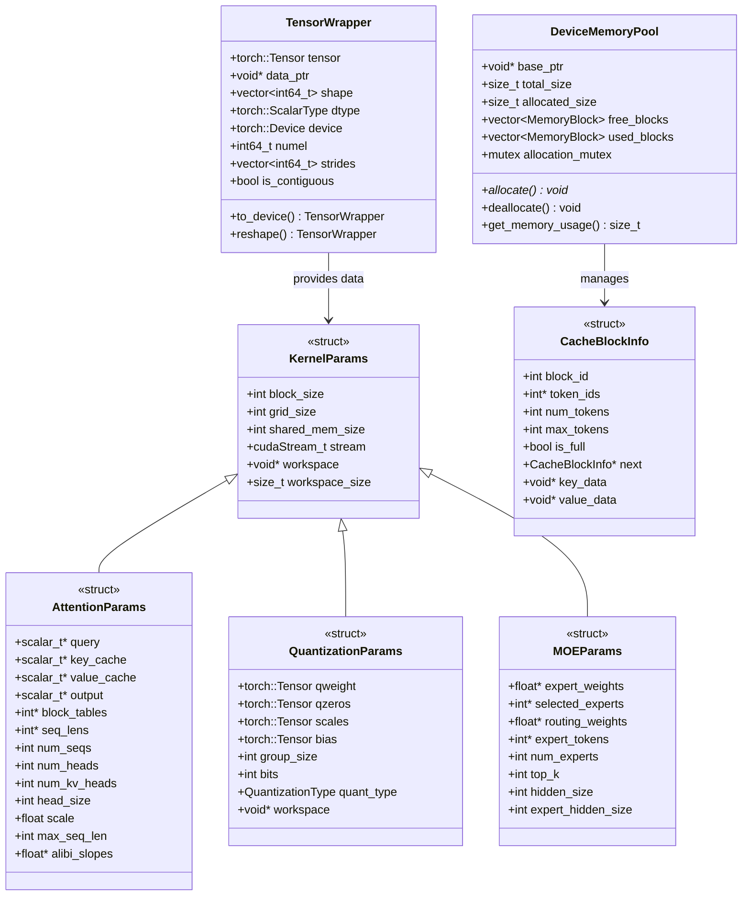

# vLLM-10-CSRC模块-数据结构

## 关键数据结构概览

CSRC 模块的数据结构设计围绕高效的 GPU 计算展开，包括内存布局优化、数据类型支持、内核参数管理和性能监控四个层次。



## 核心数据结构定义

### 1. 基础内核参数结构

```cpp
// 通用内核参数基类
struct KernelParams {
    // CUDA 执行配置
    dim3 grid_size;              // 网格大小
    dim3 block_size;             // 线程块大小
    int shared_mem_size;         // 共享内存大小（字节）
    cudaStream_t stream;         // CUDA流
    
    // 工作空间管理
    void* workspace;             // 临时工作空间指针
    size_t workspace_size;       // 工作空间大小
    
    // 性能监控
    cudaEvent_t start_event;     // 开始计时事件
    cudaEvent_t end_event;       // 结束计时事件
    
    // 构造函数
    KernelParams() : workspace(nullptr), workspace_size(0) {
        cudaEventCreate(&start_event);
        cudaEventCreate(&end_event);
    }
    
    // 析构函数
    ~KernelParams() {
        if (workspace) {
            cudaFree(workspace);
        }
        cudaEventDestroy(start_event);
        cudaEventDestroy(end_event);
    }
    
    // 计算最优执行配置
    void compute_launch_config(int problem_size, int threads_per_block = 256) {
        block_size = dim3(threads_per_block);
        grid_size = dim3((problem_size + threads_per_block - 1) / threads_per_block);
        
        // 限制网格大小避免硬件限制
        const int max_grid_size = 65535;
        if (grid_size.x > max_grid_size) {
            grid_size.y = (grid_size.x + max_grid_size - 1) / max_grid_size;
            grid_size.x = max_grid_size;
        }
    }
    
    // 分配工作空间
    void allocate_workspace(size_t size) {
        if (workspace_size < size) {
            if (workspace) cudaFree(workspace);
            cudaMalloc(&workspace, size);
            workspace_size = size;
        }
    }
};
```

### 2. PagedAttention 参数结构

```cpp
// PagedAttention 内核参数
template<typename scalar_t>
struct PagedAttentionParams : public KernelParams {
    // 输入张量
    scalar_t* query;                    // 查询张量 [num_seqs, num_heads, head_size]
    scalar_t* key_cache;                // Key缓存 [num_blocks, num_kv_heads, head_size/x, block_size, x]
    scalar_t* value_cache;              // Value缓存 [num_blocks, num_kv_heads, head_size, block_size]
    scalar_t* output;                   // 输出张量 [num_seqs, num_heads, head_size]
    
    // 索引和长度信息
    int* block_tables;                  // 块表 [num_seqs, max_num_blocks_per_seq]
    int* seq_lens;                      // 序列长度 [num_seqs]
    
    // 维度参数
    int num_seqs;                       // 序列数量
    int num_heads;                      // 查询头数
    int num_kv_heads;                   // KV头数
    int head_size;                      // 头维度大小
    int block_size;                     // 块大小
    int max_seq_len;                    // 最大序列长度
    int max_num_blocks_per_seq;         // 每序列最大块数
    
    // 计算参数
    float scale;                        // 注意力缩放因子
    float* alibi_slopes;                // ALiBi位置编码斜率
    
    // 量化参数
    float kv_scale;                     // KV缓存量化缩放
    
    // 张量步长
    int q_stride;                       // 查询张量步长
    int kv_block_stride;                // KV块步长
    int kv_head_stride;                 // KV头步长
    
    // 构造函数
    PagedAttentionParams() {
        query = nullptr;
        key_cache = nullptr;
        value_cache = nullptr;
        output = nullptr;
        block_tables = nullptr;
        seq_lens = nullptr;
        alibi_slopes = nullptr;
        
        scale = 1.0f;
        kv_scale = 1.0f;
    }
    
    // 参数验证
    bool validate() const {
        if (!query || !key_cache || !value_cache || !output) {
            return false;
        }
        if (!block_tables || !seq_lens) {
            return false;
        }
        if (num_seqs <= 0 || num_heads <= 0 || num_kv_heads <= 0) {
            return false;
        }
        if (head_size <= 0 || block_size <= 0) {
            return false;
        }
        return true;
    }
    
    // 计算共享内存需求
    int compute_shared_memory_size() const {
        int q_vec_size = head_size * sizeof(scalar_t);
        int k_vec_size = head_size * sizeof(scalar_t);
        int logits_size = block_size * sizeof(float);
        int reduction_size = block_size.x * sizeof(float);
        
        return q_vec_size + k_vec_size + logits_size + reduction_size;
    }
};
```

### 3. 量化参数结构

```cpp
// 量化类型枚举
enum class QuantizationType {
    NONE = 0,
    INT8 = 8,
    INT4 = 4,
    AWQ = 100,      // AWQ INT4量化
    GPTQ = 101,     // GPTQ量化
    SmoothQuant = 102  // SmoothQuant
};

// 量化内核参数
struct QuantizationParams : public KernelParams {
    // 量化权重和参数
    torch::Tensor qweight;              // 量化权重
    torch::Tensor qzeros;               // 量化零点
    torch::Tensor scales;               // 缩放因子
    torch::Tensor bias;                 // 偏置（可选）
    
    // 量化配置
    QuantizationType quant_type;        // 量化类型
    int bits;                          // 量化位数
    int group_size;                    // 分组大小
    
    // 矩阵维度
    int m, n, k;                       // 矩阵乘法维度 (m,k) x (k,n)
    
    // Split-K 参数
    int split_k_iters;                 // Split-K迭代数
    
    // 工作空间布局
    struct WorkspaceLayout {
        void* dequant_weights;         // 反量化权重缓存
        void* partial_results;         // 部分结果缓存
        void* reduction_workspace;     // Reduction工作空间
        
        size_t dequant_weights_size;
        size_t partial_results_size;
        size_t reduction_workspace_size;
    } workspace_layout;
    
    // 构造函数
    QuantizationParams() {
        quant_type = QuantizationType::NONE;
        bits = 16;
        group_size = 128;
        split_k_iters = 1;
        m = n = k = 0;
    }
    
    // 计算工作空间大小
    size_t compute_workspace_size() const {
        size_t dequant_size = 0;
        size_t partial_size = 0;
        size_t reduction_size = 0;
        
        if (quant_type == QuantizationType::AWQ || quant_type == QuantizationType::GPTQ) {
            // AWQ/GPTQ需要反量化缓存
            dequant_size = k * n * sizeof(half);
        }
        
        if (split_k_iters > 1) {
            // Split-K需要部分结果存储
            partial_size = m * n * split_k_iters * sizeof(float);
            reduction_size = m * n * sizeof(float);
        }
        
        return dequant_size + partial_size + reduction_size;
    }
    
    // 设置工作空间布局
    void setup_workspace_layout() {
        if (!workspace) return;
        
        char* workspace_ptr = static_cast<char*>(workspace);
        size_t offset = 0;
        
        // 反量化权重缓存
        workspace_layout.dequant_weights_size = k * n * sizeof(half);
        workspace_layout.dequant_weights = workspace_ptr + offset;
        offset += workspace_layout.dequant_weights_size;
        
        // 部分结果缓存
        if (split_k_iters > 1) {
            workspace_layout.partial_results_size = m * n * split_k_iters * sizeof(float);
            workspace_layout.partial_results = workspace_ptr + offset;
            offset += workspace_layout.partial_results_size;
            
            workspace_layout.reduction_workspace_size = m * n * sizeof(float);
            workspace_layout.reduction_workspace = workspace_ptr + offset;
            offset += workspace_layout.reduction_workspace_size;
        }
    }
};
```

### 4. MOE 参数结构

```cpp
// MOE (Mixture of Experts) 参数结构
struct MOEParams : public KernelParams {
    // 路由相关
    float* expert_weights;              // 专家权重 [num_tokens, num_experts]
    int* selected_experts;              // 选中专家 [num_tokens, top_k]
    float* routing_weights;             // 路由权重 [num_tokens, top_k]
    int* expert_tokens;                 // 每专家token数 [num_experts]
    int* token_to_expert_map;           // token到专家映射
    
    // FFN权重
    float* gate_weights;                // 门控权重 [num_experts, hidden_size, expert_hidden_size]
    float* up_weights;                  // 上升权重 [num_experts, hidden_size, expert_hidden_size]
    float* down_weights;                // 下降权重 [num_experts, expert_hidden_size, hidden_size]
    
    // 维度参数
    int num_tokens;                     // token总数
    int num_experts;                    // 专家总数
    int top_k;                         // 每token选择的专家数
    int hidden_size;                    // 隐藏层大小
    int expert_hidden_size;             // 专家隐藏层大小
    
    // 负载均衡
    float load_balance_loss_coeff;      // 负载均衡损失系数
    float* load_balance_loss;           // 负载均衡损失输出
    
    // 工作空间布局
    struct MOEWorkspace {
        float* gate_outputs;            // 门控输出缓存
        float* up_outputs;              // 上升投影输出缓存  
        float* expert_inputs;           // 重排序的专家输入
        float* expert_outputs;          // 专家输出缓存
        int* sorted_token_indices;      // 排序后的token索引
        int* expert_offsets;            // 专家在批次中的偏移
    } workspace;
    
    // 构造函数
    MOEParams() {
        expert_weights = nullptr;
        selected_experts = nullptr;
        routing_weights = nullptr;
        expert_tokens = nullptr;
        token_to_expert_map = nullptr;
        
        gate_weights = nullptr;
        up_weights = nullptr;
        down_weights = nullptr;
        
        load_balance_loss = nullptr;
        load_balance_loss_coeff = 0.01f;
        
        num_tokens = num_experts = top_k = 0;
        hidden_size = expert_hidden_size = 0;
        
        memset(&workspace, 0, sizeof(workspace));
    }
    
    // 计算工作空间大小
    size_t compute_workspace_size() const {
        size_t gate_size = num_tokens * expert_hidden_size * sizeof(float);
        size_t up_size = num_tokens * expert_hidden_size * sizeof(float);
        size_t expert_inputs_size = num_tokens * hidden_size * sizeof(float);
        size_t expert_outputs_size = num_tokens * hidden_size * sizeof(float);
        size_t indices_size = num_tokens * sizeof(int);
        size_t offsets_size = (num_experts + 1) * sizeof(int);
        
        return gate_size + up_size + expert_inputs_size + expert_outputs_size + 
               indices_size + offsets_size;
    }
};
```

## 内存管理数据结构

### 1. 设备内存池

```cpp
// 内存块描述符
struct MemoryBlock {
    void* ptr;                          // 内存指针
    size_t size;                        // 块大小
    size_t alignment;                   // 对齐要求
    bool is_free;                       // 是否空闲
    MemoryBlock* prev;                  // 前一个块
    MemoryBlock* next;                  // 后一个块
    
    // 构造函数
    MemoryBlock(void* p, size_t s, size_t align = 256) 
        : ptr(p), size(s), alignment(align), is_free(true), prev(nullptr), next(nullptr) {}
};

// 设备内存池管理器
class DeviceMemoryPool {
private:
    void* base_ptr_;                    // 基础内存指针
    size_t total_size_;                 // 总内存大小
    size_t allocated_size_;             // 已分配大小
    size_t peak_usage_;                 // 峰值使用量
    
    // 内存块管理
    MemoryBlock* free_list_head_;       // 空闲链表头
    MemoryBlock* used_list_head_;       // 使用链表头
    
    // 线程安全
    std::mutex allocation_mutex_;
    
    // 统计信息
    std::atomic<int> num_allocations_;
    std::atomic<int> num_deallocations_;
    std::atomic<size_t> current_usage_;
    
public:
    // 构造函数
    DeviceMemoryPool(size_t pool_size) : total_size_(pool_size), allocated_size_(0), peak_usage_(0) {
        // 分配大块连续内存
        cudaMalloc(&base_ptr_, total_size_);
        
        // 初始化空闲链表
        free_list_head_ = new MemoryBlock(base_ptr_, total_size_);
        used_list_head_ = nullptr;
        
        num_allocations_ = 0;
        num_deallocations_ = 0;
        current_usage_ = 0;
    }
    
    // 析构函数
    ~DeviceMemoryPool() {
        cudaFree(base_ptr_);
        cleanup_block_list(free_list_head_);
        cleanup_block_list(used_list_head_);
    }
    
    // 分配内存
    void* allocate(size_t size, size_t alignment = 256) {
        std::lock_guard<std::mutex> lock(allocation_mutex_);
        
        // 向上对齐到alignment边界
        size_t aligned_size = (size + alignment - 1) & ~(alignment - 1);
        
        // 寻找合适的空闲块
        MemoryBlock* block = find_free_block(aligned_size, alignment);
        if (!block) {
            // 内存不足，尝试碎片整理
            if (!defragment()) {
                return nullptr;  // 分配失败
            }
            block = find_free_block(aligned_size, alignment);
            if (!block) {
                return nullptr;
            }
        }
        
        // 分割块（如果需要）
        if (block->size > aligned_size + sizeof(MemoryBlock) + alignment) {
            split_block(block, aligned_size);
        }
        
        // 移动到使用列表
        move_to_used_list(block);
        
        // 更新统计
        allocated_size_ += block->size;
        peak_usage_ = std::max(peak_usage_, allocated_size_);
        current_usage_ += block->size;
        num_allocations_++;
        
        return block->ptr;
    }
    
    // 释放内存
    void deallocate(void* ptr) {
        if (!ptr) return;
        
        std::lock_guard<std::mutex> lock(allocation_mutex_);
        
        // 在使用列表中查找块
        MemoryBlock* block = find_used_block(ptr);
        if (!block) {
            return;  // 无效指针
        }
        
        // 移动到空闲列表
        move_to_free_list(block);
        
        // 尝试合并相邻空闲块
        merge_adjacent_blocks(block);
        
        // 更新统计
        allocated_size_ -= block->size;
        current_usage_ -= block->size;
        num_deallocations_++;
    }
    
    // 获取内存使用统计
    struct MemoryStats {
        size_t total_size;
        size_t allocated_size;
        size_t free_size;
        size_t peak_usage;
        int num_allocations;
        int num_deallocations;
        int num_free_blocks;
        int num_used_blocks;
        float fragmentation_ratio;
    };
    
    MemoryStats get_memory_stats() const {
        std::lock_guard<std::mutex> lock(const_cast<std::mutex&>(allocation_mutex_));
        
        MemoryStats stats;
        stats.total_size = total_size_;
        stats.allocated_size = allocated_size_;
        stats.free_size = total_size_ - allocated_size_;
        stats.peak_usage = peak_usage_;
        stats.num_allocations = num_allocations_;
        stats.num_deallocations = num_deallocations_;
        
        // 计算块数和碎片率
        stats.num_free_blocks = count_blocks(free_list_head_);
        stats.num_used_blocks = count_blocks(used_list_head_);
        stats.fragmentation_ratio = calculate_fragmentation_ratio();
        
        return stats;
    }
    
private:
    // 查找空闲块
    MemoryBlock* find_free_block(size_t size, size_t alignment) {
        MemoryBlock* current = free_list_head_;
        while (current) {
            // 检查大小和对齐
            void* aligned_ptr = align_pointer(current->ptr, alignment);
            size_t available_size = current->size - (static_cast<char*>(aligned_ptr) - static_cast<char*>(current->ptr));
            
            if (available_size >= size) {
                return current;
            }
            current = current->next;
        }
        return nullptr;
    }
    
    // 内存碎片整理
    bool defragment() {
        // 简单的碎片整理：合并所有相邻的空闲块
        MemoryBlock* current = free_list_head_;
        bool merged_any = false;
        
        while (current && current->next) {
            if (static_cast<char*>(current->ptr) + current->size == current->next->ptr) {
                // 合并相邻块
                MemoryBlock* next_block = current->next;
                current->size += next_block->size;
                current->next = next_block->next;
                if (next_block->next) {
                    next_block->next->prev = current;
                }
                delete next_block;
                merged_any = true;
            } else {
                current = current->next;
            }
        }
        
        return merged_any;
    }
    
    // 计算碎片率
    float calculate_fragmentation_ratio() const {
        if (allocated_size_ == 0) return 0.0f;
        
        size_t largest_free_block = 0;
        MemoryBlock* current = free_list_head_;
        while (current) {
            largest_free_block = std::max(largest_free_block, current->size);
            current = current->next;
        }
        
        size_t total_free = total_size_ - allocated_size_;
        if (total_free == 0) return 0.0f;
        
        return 1.0f - static_cast<float>(largest_free_block) / total_free;
    }
};
```

### 2. KV 缓存块管理

```cpp
// KV缓存块信息
template<typename T>
struct CacheBlock {
    int block_id;                       // 块ID
    int sequence_id;                    // 所属序列ID
    int start_token_idx;                // 起始token索引
    int num_tokens;                     // 当前token数
    int capacity;                       // 块容量
    
    // 数据指针
    T* key_data;                        // Key数据指针
    T* value_data;                      // Value数据指针
    
    // 链表指针
    CacheBlock* next_in_sequence;       // 序列中的下一个块
    CacheBlock* prev_in_sequence;       // 序列中的前一个块
    CacheBlock* next_free;              // 空闲链表中的下一个块
    
    // 状态信息
    bool is_allocated;                  // 是否已分配
    bool is_full;                       // 是否已满
    int ref_count;                      // 引用计数（用于Copy-on-Write）
    
    // 构造函数
    CacheBlock() : block_id(-1), sequence_id(-1), start_token_idx(0), num_tokens(0), 
                   capacity(0), key_data(nullptr), value_data(nullptr),
                   next_in_sequence(nullptr), prev_in_sequence(nullptr), next_free(nullptr),
                   is_allocated(false), is_full(false), ref_count(0) {}
    
    // 添加token到块
    bool add_token(int token_idx, const T* key_vec, const T* value_vec, int head_size) {
        if (is_full || num_tokens >= capacity) {
            return false;
        }
        
        // 复制Key和Value数据
        int offset = num_tokens * head_size;
        memcpy(key_data + offset, key_vec, head_size * sizeof(T));
        memcpy(value_data + offset, value_vec, head_size * sizeof(T));
        
        num_tokens++;
        is_full = (num_tokens == capacity);
        
        return true;
    }
    
    // 获取token的Key/Value指针
    std::pair<T*, T*> get_token_kv(int token_idx, int head_size) {
        if (token_idx >= num_tokens) {
            return {nullptr, nullptr};
        }
        
        int offset = token_idx * head_size;
        return {key_data + offset, value_data + offset};
    }
};

// KV缓存管理器
template<typename T>
class KVCacheManager {
private:
    // 内存池
    DeviceMemoryPool* memory_pool_;
    
    // 缓存配置
    int num_layers_;
    int num_heads_;
    int head_size_;
    int block_size_;
    int max_blocks_;
    
    // 块管理
    std::vector<CacheBlock<T>*> all_blocks_;        // 所有块
    CacheBlock<T>* free_list_head_;                 // 空闲块链表
    std::unordered_map<int, CacheBlock<T>*> sequence_blocks_;  // 序列到块的映射
    
    // 统计信息
    std::atomic<int> allocated_blocks_;
    std::atomic<int> peak_blocks_;
    
public:
    // 构造函数
    KVCacheManager(DeviceMemoryPool* pool, int num_layers, int num_heads, 
                   int head_size, int block_size, int max_blocks)
        : memory_pool_(pool), num_layers_(num_layers), num_heads_(num_heads),
          head_size_(head_size), block_size_(block_size), max_blocks_(max_blocks),
          free_list_head_(nullptr), allocated_blocks_(0), peak_blocks_(0) {
        
        initialize_blocks();
    }
    
    // 为序列分配块
    CacheBlock<T>* allocate_block(int sequence_id) {
        if (!free_list_head_) {
            return nullptr;  // 无可用块
        }
        
        // 从空闲链表取出块
        CacheBlock<T>* block = free_list_head_;
        free_list_head_ = block->next_free;
        
        // 初始化块
        block->sequence_id = sequence_id;
        block->start_token_idx = 0;
        block->num_tokens = 0;
        block->is_allocated = true;
        block->is_full = false;
        block->ref_count = 1;
        block->next_free = nullptr;
        
        // 添加到序列映射
        sequence_blocks_[sequence_id] = block;
        
        // 更新统计
        allocated_blocks_++;
        peak_blocks_ = std::max(peak_blocks_.load(), allocated_blocks_.load());
        
        return block;
    }
    
    // 释放序列的所有块
    void free_sequence_blocks(int sequence_id) {
        auto it = sequence_blocks_.find(sequence_id);
        if (it == sequence_blocks_.end()) {
            return;
        }
        
        CacheBlock<T>* current = it->second;
        while (current) {
            CacheBlock<T>* next = current->next_in_sequence;
            
            // 重置块状态
            current->sequence_id = -1;
            current->num_tokens = 0;
            current->is_allocated = false;
            current->is_full = false;
            current->ref_count = 0;
            current->next_in_sequence = nullptr;
            current->prev_in_sequence = nullptr;
            
            // 添加到空闲链表
            current->next_free = free_list_head_;
            free_list_head_ = current;
            
            allocated_blocks_--;
            current = next;
        }
        
        sequence_blocks_.erase(it);
    }
    
    // 获取缓存统计信息
    struct CacheStats {
        int total_blocks;
        int allocated_blocks;
        int free_blocks;
        int peak_blocks;
        float utilization_ratio;
        size_t memory_usage;
    };
    
    CacheStats get_cache_stats() const {
        CacheStats stats;
        stats.total_blocks = max_blocks_;
        stats.allocated_blocks = allocated_blocks_;
        stats.free_blocks = max_blocks_ - allocated_blocks_;
        stats.peak_blocks = peak_blocks_;
        stats.utilization_ratio = static_cast<float>(allocated_blocks_) / max_blocks_;
        
        // 计算内存使用量
        size_t block_memory = num_layers_ * num_heads_ * head_size_ * block_size_ * sizeof(T) * 2;  // *2 for key and value
        stats.memory_usage = allocated_blocks_ * block_memory;
        
        return stats;
    }
    
private:
    // 初始化所有块
    void initialize_blocks() {
        all_blocks_.resize(max_blocks_);
        
        for (int i = 0; i < max_blocks_; ++i) {
            all_blocks_[i] = new CacheBlock<T>();
            all_blocks_[i]->block_id = i;
            all_blocks_[i]->capacity = block_size_;
            
            // 分配Key和Value内存
            size_t kv_size = num_layers_ * num_heads_ * head_size_ * block_size_ * sizeof(T);
            all_blocks_[i]->key_data = static_cast<T*>(memory_pool_->allocate(kv_size));
            all_blocks_[i]->value_data = static_cast<T*>(memory_pool_->allocate(kv_size));
            
            // 添加到空闲链表
            all_blocks_[i]->next_free = free_list_head_;
            free_list_head_ = all_blocks_[i];
        }
    }
};
```

## 性能监控数据结构

### 1. 内核性能统计

```cpp
// 内核执行统计
struct KernelProfiler {
    // 计时信息
    std::vector<float> execution_times;    // 执行时间历史
    float total_time;                      // 总执行时间
    float avg_time;                        // 平均执行时间
    float min_time;                        // 最小执行时间
    float max_time;                        // 最大执行时间
    
    // 调用统计
    int num_calls;                         // 调用次数
    int num_failures;                      // 失败次数
    
    // 资源使用
    int registers_per_thread;              // 每线程寄存器数
    int shared_memory_per_block;           // 每块共享内存
    float occupancy;                       // 占用率
    
    // 内存带宽
    size_t bytes_read;                     // 读取字节数
    size_t bytes_written;                  // 写入字节数
    float memory_bandwidth_gbps;           // 内存带宽 GB/s
    
    // 构造函数
    KernelProfiler() : total_time(0.0f), avg_time(0.0f), min_time(FLT_MAX), max_time(0.0f),
                       num_calls(0), num_failures(0), registers_per_thread(0),
                       shared_memory_per_block(0), occupancy(0.0f),
                       bytes_read(0), bytes_written(0), memory_bandwidth_gbps(0.0f) {
        execution_times.reserve(1000);  // 预分配空间
    }
    
    // 记录执行时间
    void record_execution_time(float time_ms) {
        execution_times.push_back(time_ms);
        total_time += time_ms;
        num_calls++;
        
        min_time = std::min(min_time, time_ms);
        max_time = std::max(max_time, time_ms);
        avg_time = total_time / num_calls;
        
        // 保持历史记录在合理范围内
        if (execution_times.size() > 1000) {
            execution_times.erase(execution_times.begin());
        }
    }
    
    // 记录内存访问
    void record_memory_access(size_t read_bytes, size_t write_bytes, float time_ms) {
        bytes_read += read_bytes;
        bytes_written += write_bytes;
        
        // 计算内存带宽
        if (time_ms > 0) {
            float total_bytes = static_cast<float>(read_bytes + write_bytes);
            float bandwidth = (total_bytes / (1024 * 1024 * 1024)) / (time_ms / 1000.0f);
            memory_bandwidth_gbps = bandwidth;
        }
    }
    
    // 获取统计摘要
    struct ProfileSummary {
        float avg_time_ms;
        float min_time_ms;
        float max_time_ms;
        float std_dev_ms;
        int total_calls;
        float success_rate;
        float memory_bandwidth_gbps;
        float occupancy;
    };
    
    ProfileSummary get_summary() const {
        ProfileSummary summary;
        summary.avg_time_ms = avg_time;
        summary.min_time_ms = min_time;
        summary.max_time_ms = max_time;
        summary.total_calls = num_calls;
        summary.success_rate = (num_calls > 0) ? 1.0f - static_cast<float>(num_failures) / num_calls : 0.0f;
        summary.memory_bandwidth_gbps = memory_bandwidth_gbps;
        summary.occupancy = occupancy;
        
        // 计算标准差
        if (!execution_times.empty()) {
            float variance = 0.0f;
            for (float time : execution_times) {
                float diff = time - avg_time;
                variance += diff * diff;
            }
            variance /= execution_times.size();
            summary.std_dev_ms = std::sqrt(variance);
        } else {
            summary.std_dev_ms = 0.0f;
        }
        
        return summary;
    }
};
```

### 2. 全局性能监控

```cpp
// 全局性能监控器
class GlobalProfiler {
private:
    // 内核分析器映射
    std::unordered_map<std::string, std::unique_ptr<KernelProfiler>> kernel_profilers_;
    
    // 系统级统计
    std::atomic<size_t> total_gpu_memory_allocated_;
    std::atomic<size_t> peak_gpu_memory_usage_;
    std::atomic<int> active_cuda_streams_;
    
    // 线程安全
    std::mutex profiler_mutex_;
    
public:
    // 单例模式
    static GlobalProfiler& instance() {
        static GlobalProfiler instance;
        return instance;
    }
    
    // 获取或创建内核分析器
    KernelProfiler* get_kernel_profiler(const std::string& kernel_name) {
        std::lock_guard<std::mutex> lock(profiler_mutex_);
        
        auto it = kernel_profilers_.find(kernel_name);
        if (it == kernel_profilers_.end()) {
            kernel_profilers_[kernel_name] = std::make_unique<KernelProfiler>();
        }
        
        return kernel_profilers_[kernel_name].get();
    }
    
    // 记录内存分配
    void record_memory_allocation(size_t bytes) {
        total_gpu_memory_allocated_ += bytes;
        size_t current_usage = total_gpu_memory_allocated_.load();
        
        // 原子更新峰值使用量
        size_t expected_peak = peak_gpu_memory_usage_.load();
        while (current_usage > expected_peak && 
               !peak_gpu_memory_usage_.compare_exchange_weak(expected_peak, current_usage)) {
            // 重试直到成功更新
        }
    }
    
    // 记录内存释放
    void record_memory_deallocation(size_t bytes) {
        total_gpu_memory_allocated_ -= bytes;
    }
    
    // 获取全局统计
    struct GlobalStats {
        size_t total_memory_allocated;
        size_t peak_memory_usage;
        int active_streams;
        int num_kernel_types;
        float total_kernel_time;
        std::vector<std::pair<std::string, KernelProfiler::ProfileSummary>> kernel_summaries;
    };
    
    GlobalStats get_global_stats() const {
        std::lock_guard<std::mutex> lock(const_cast<std::mutex&>(profiler_mutex_));
        
        GlobalStats stats;
        stats.total_memory_allocated = total_gpu_memory_allocated_;
        stats.peak_memory_usage = peak_gpu_memory_usage_;
        stats.active_streams = active_cuda_streams_;
        stats.num_kernel_types = kernel_profilers_.size();
        stats.total_kernel_time = 0.0f;
        
        // 收集所有内核统计
        for (const auto& pair : kernel_profilers_) {
            auto summary = pair.second->get_summary();
            stats.kernel_summaries.emplace_back(pair.first, summary);
            stats.total_kernel_time += summary.avg_time_ms * summary.total_calls;
        }
        
        return stats;
    }
    
    // 生成性能报告
    std::string generate_performance_report() const {
        auto stats = get_global_stats();
        std::stringstream report;
        
        report << "=== vLLM CSRC Performance Report ===\n";
        report << "Total GPU Memory: " << stats.total_memory_allocated / (1024*1024) << " MB\n";
        report << "Peak Memory Usage: " << stats.peak_memory_usage / (1024*1024) << " MB\n";
        report << "Active CUDA Streams: " << stats.active_streams << "\n";
        report << "Total Kernel Time: " << stats.total_kernel_time << " ms\n\n";
        
        report << "Kernel Performance:\n";
        for (const auto& kernel_stat : stats.kernel_summaries) {
            const auto& summary = kernel_stat.second;
            report << "  " << kernel_stat.first << ":\n";
            report << "    Calls: " << summary.total_calls << "\n";
            report << "    Avg Time: " << summary.avg_time_ms << " ms\n";
            report << "    Min/Max: " << summary.min_time_ms << "/" << summary.max_time_ms << " ms\n";
            report << "    Success Rate: " << (summary.success_rate * 100) << "%\n";
            report << "    Memory Bandwidth: " << summary.memory_bandwidth_gbps << " GB/s\n";
            report << "    Occupancy: " << (summary.occupancy * 100) << "%\n\n";
        }
        
        return report.str();
    }
};
```

这些数据结构为CSRC模块提供了完整的内存管理、参数传递和性能监控方案，支持高效的GPU计算和资源管理。
