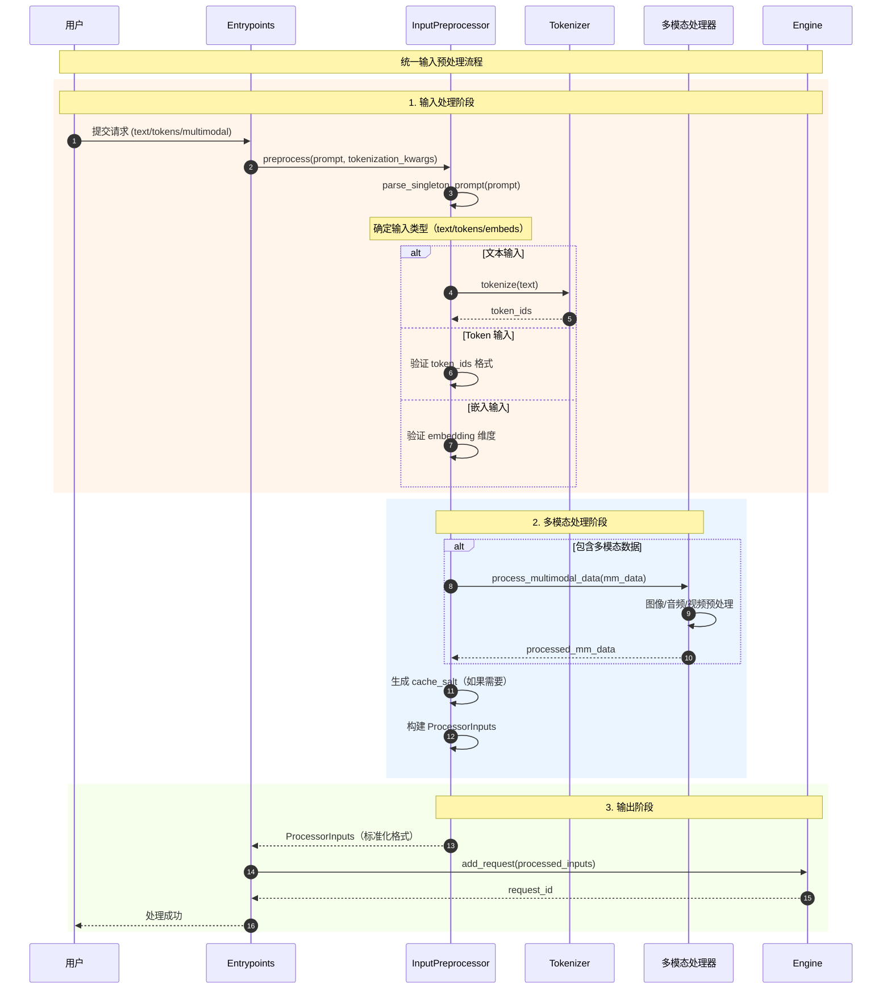
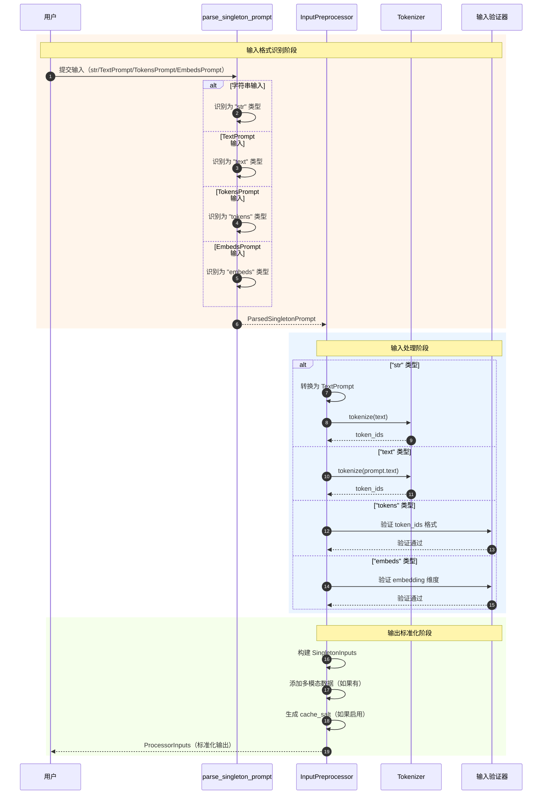

# vLLM-10-InputsOutputs模块-API

## API 概览

InputsOutputs 模块提供统一的输入输出处理 API，支持多种数据格式：

| API 名称 | 类/接口 | 幂等性 | 作用 | 使用场景 |
|---------|---------|--------|------|---------|
| `InputPreprocessor.preprocess` | 方法 | 是 | 统一输入预处理 | 所有输入类型 |
| `parse_and_batch_prompt` | 函数 | 是 | 批量 prompt 解析 | 批量推理 |
| `parse_singleton_prompt` | 函数 | 是 | 单一 prompt 解析 | 输入分析 |
| `build_explicit_enc_dec_prompt` | 函数 | 是 | 构建编码器-解码器 prompt | Seq2Seq 模型 |
| `token_inputs` | 工厂函数 | 是 | 创建 Token 输入 | 预分词场景 |
| `embeds_inputs` | 工厂函数 | 是 | 创建 Embedding 输入 | 向量输入 |

---

## 核心预处理 API

### 1. InputPreprocessor.preprocess

#### 基本信息
- **名称**：`InputPreprocessor.preprocess`
- **协议/方法**：实例方法
- **幂等性**：是（相同输入产生相同输出）
- **返回值**：`ProcessorInputs`

#### 请求结构体

```python
def preprocess(
    self,
    prompt: PromptType,
    tokenization_kwargs: Optional[dict[str, Any]] = None,
    *,
    mm_uuids: Optional[MultiModalUUIDDict] = None,
) -> ProcessorInputs:
    """统一的输入预处理接口"""
```

**参数说明表**：

| 字段 | 类型 | 必填 | 默认值 | 说明 |
|------|------|------|--------|------|
| prompt | PromptType | ✓ | - | 输入 prompt（文本/token/嵌入/编码器-解码器） |
| tokenization_kwargs | dict[str, Any] | ✗ | None | 分词参数 |
| mm_uuids | MultiModalUUIDDict | ✗ | None | 多模态数据 UUID |

#### 响应结构体

```python
# ProcessorInputs 是联合类型
ProcessorInputs = Union[DecoderOnlyInputs, EncoderDecoderInputs]

class DecoderOnlyInputs(TypedDict):
    """仅解码器输入"""
    prompt_token_ids: list[int]
    multi_modal_data: Optional[MultiModalDataDict]
    mm_processor_kwargs: Optional[dict[str, Any]]
    cache_salt: Optional[str]

class EncoderDecoderInputs(TypedDict):
    """编码器-解码器输入"""
    encoder_prompt_token_ids: list[int]
    decoder_prompt_token_ids: Optional[list[int]]
    encoder_multi_modal_data: Optional[MultiModalDataDict]
    decoder_multi_modal_data: Optional[MultiModalDataDict]
    mm_processor_kwargs: Optional[dict[str, Any]]
    cache_salt: Optional[str]
```

#### 入口函数与关键代码

```python
def preprocess(
    self,
    prompt: PromptType,
    tokenization_kwargs: Optional[dict[str, Any]] = None,
    *,
    mm_uuids: Optional[MultiModalUUIDDict] = None,
) -> ProcessorInputs:
    """统一输入预处理的核心方法
    
    功能：
    1. 根据模型类型选择处理策略
    2. 解析和验证输入格式
    3. 执行分词和多模态处理
    4. 生成标准化的内部表示
    """
    
    # 1. 模型类型判断
    if self.model_config.is_encoder_decoder:
        # 编码器-解码器模型处理
        return self._process_encoder_decoder_prompt(
            prompt,
            tokenization_kwargs,
            mm_uuids=mm_uuids,
        )
    
    # 2. 验证输入格式
    if is_explicit_encoder_decoder_prompt(prompt):
        raise ValueError("Cannot pass encoder-decoder prompt to decoder-only models")
    
    # 3. 仅解码器模型处理
    return self._process_decoder_only_prompt(
        prompt,
        tokenization_kwargs=tokenization_kwargs,
        mm_uuids=mm_uuids,
    )
```

#### 仅解码器处理流程

```python
def _process_decoder_only_prompt(
    self,
    prompt: SingletonPrompt,
    tokenization_kwargs: Optional[dict[str, Any]] = None,
    *,
    mm_uuids: Optional[MultiModalUUIDDict] = None,
) -> DecoderOnlyInputs:
    """仅解码器模型的输入处理"""
    
    # 1. 解析输入到统一格式
    prompt_comps = self._prompt_to_llm_inputs(
        prompt,
        tokenization_kwargs=tokenization_kwargs,
        mm_uuids=mm_uuids,
    )
    
    # 2. 构建最终输入
    return self._build_decoder_only_llm_inputs(prompt_comps)

def _prompt_to_llm_inputs(
    self,
    prompt: SingletonPrompt,
    tokenization_kwargs: Optional[dict[str, Any]] = None,
    *,
    mm_uuids: Optional[MultiModalUUIDDict] = None,
) -> SingletonInputs:
    """将 prompt 转换为 LLM 输入格式"""
    
    # 1. 解析 prompt 类型
    parsed = parse_singleton_prompt(prompt)
    
    # 2. 根据类型分发处理
    if parsed["type"] == "embeds":
        return self._process_embeds(parsed["content"])
    elif parsed["type"] == "tokens":
        return self._process_tokens(parsed["content"], mm_uuids=mm_uuids)
    elif parsed["type"] == "text":
        return self._process_text(
            parsed["content"],
            tokenization_kwargs=tokenization_kwargs,
            mm_uuids=mm_uuids,
        )
    elif parsed["type"] == "str":
        return self._process_text(
            TextPrompt(prompt=parsed["content"]),
            tokenization_kwargs=tokenization_kwargs,
            mm_uuids=mm_uuids,
        )
    
    # （此处省略错误处理）
```

#### 使用场景与时序图



---

### 2. parse_and_batch_prompt

#### 基本信息
- **名称**：`parse_and_batch_prompt`
- **协议/方法**：函数接口
- **幂等性**：是
- **返回值**：`Union[Sequence[ParsedText], Sequence[ParsedTokens]]`

#### 请求结构体

```python
def parse_and_batch_prompt(
    prompt: Union[str, list[str], list[int], list[list[int]]],
) -> Union[Sequence[ParsedText], Sequence[ParsedTokens]]:
    """解析并批量化 prompt"""
```

**参数说明表**：

| 字段 | 类型 | 必填 | 说明 |
|------|------|------|------|
| prompt | Union[str, list[str], list[int], list[list[int]]] | ✓ | 各种格式的 prompt |

#### 响应结构体

```python
class ParsedText(TypedDict):
    content: str
    is_tokens: Literal[False]

class ParsedTokens(TypedDict):
    content: list[int]
    is_tokens: Literal[True]
```

#### 入口函数与关键代码

```python
def parse_and_batch_prompt(
    prompt: Union[str, list[str], list[int], list[list[int]]],
) -> Union[Sequence[ParsedText], Sequence[ParsedTokens]]:
    """批量 prompt 解析的核心逻辑
    
    支持 4 种输入格式：
    1. str: 单个文本
    2. list[str]: 多个文本
    3. list[int]: 单个 token 序列
    4. list[list[int]]: 多个 token 序列
    """
    
    # 1. 单个字符串
    if isinstance(prompt, str):
        return [ParsedText(content=prompt, is_tokens=False)]
    
    # 2. 列表类型处理
    if isinstance(prompt, list):
        if len(prompt) == 0:
            raise ValueError("please provide at least one prompt")
        
        # 2.1 字符串列表
        if is_list_of(prompt, str):
            prompt = cast(list[str], prompt)
            return [
                ParsedText(content=elem, is_tokens=False) 
                for elem in prompt
            ]
        
        # 2.2 Token 列表
        if is_list_of(prompt, int):
            prompt = cast(list[int], prompt)
            return [ParsedTokens(content=prompt, is_tokens=True)]
        
        # 2.3 Token 列表的列表
        if is_list_of(prompt, list):
            prompt = cast(list[list[int]], prompt)
            if len(prompt[0]) == 0:
                raise ValueError("please provide at least one prompt")
            
            if is_list_of(prompt[0], int):
                return [
                    ParsedTokens(content=elem, is_tokens=True)
                    for elem in prompt
                ]
    
    # 3. 不支持的格式
    raise TypeError("prompt must be a string, array of strings, "
                   "array of tokens, or array of token arrays")
```

#### 使用场景

```python
# 案例 1: 单个文本
parsed = parse_and_batch_prompt("Hello, world!")
# 结果: [ParsedText(content="Hello, world!", is_tokens=False)]

# 案例 2: 多个文本
parsed = parse_and_batch_prompt(["Hello", "Hi", "Good morning"])
# 结果: [ParsedText(content="Hello", is_tokens=False), ...]

# 案例 3: Token 序列
parsed = parse_and_batch_prompt([1, 2, 3, 4, 5])
# 结果: [ParsedTokens(content=[1, 2, 3, 4, 5], is_tokens=True)]

# 案例 4: 多个 Token 序列
parsed = parse_and_batch_prompt([[1, 2, 3], [4, 5, 6], [7, 8, 9]])
# 结果: [ParsedTokens(content=[1, 2, 3], is_tokens=True), ...]
```

---

### 3. parse_singleton_prompt

#### 基本信息
- **名称**：`parse_singleton_prompt`
- **协议/方法**：函数接口
- **幂等性**：是
- **返回值**：`ParsedSingletonPrompt`

#### 请求结构体

```python
def parse_singleton_prompt(prompt: SingletonPrompt) -> ParsedSingletonPrompt:
    """解析单一 prompt"""
```

#### 响应结构体

```python
class ParsedStrPrompt(TypedDict):
    type: Literal["str"]
    content: str

class ParsedTextPrompt(TypedDict):
    type: Literal["text"]
    content: TextPrompt

class ParsedTokensPrompt(TypedDict):
    type: Literal["tokens"]
    content: TokensPrompt

class ParsedEmbedsPrompt(TypedDict):
    type: Literal["embeds"]
    content: EmbedsPrompt

ParsedSingletonPrompt = Union[
    ParsedStrPrompt, 
    ParsedTextPrompt,
    ParsedTokensPrompt, 
    ParsedEmbedsPrompt
]
```

#### 入口函数与关键代码

```python
def parse_singleton_prompt(prompt: SingletonPrompt) -> ParsedSingletonPrompt:
    """单一 prompt 解析的核心逻辑
    
    根据输入类型返回标准化的解析结果
    """
    
    # 1. 字符串类型
    if isinstance(prompt, str):
        return ParsedStrPrompt(type="str", content=prompt)
    
    # 2. 字典类型 - 需要进一步判断
    if isinstance(prompt, dict):
        # 2.1 TextPrompt
        if "prompt" in prompt:
            return ParsedTextPrompt(type="text", content=cast(TextPrompt, prompt))
        
        # 2.2 TokensPrompt
        if "prompt_token_ids" in prompt:
            return ParsedTokensPrompt(type="tokens", content=cast(TokensPrompt, prompt))
        
        # 2.3 EmbedsPrompt
        if "inputs_embeds" in prompt:
            return ParsedEmbedsPrompt(type="embeds", content=cast(EmbedsPrompt, prompt))
    
    # 3. 不支持的类型
    raise TypeError(f"Invalid prompt type: {type(prompt)}")
```

---

## 工厂函数 API

### 4. token_inputs

#### 基本信息
- **名称**：`token_inputs`
- **协议/方法**：工厂函数
- **幂等性**：是
- **返回值**：`TokenInputs`

#### 请求结构体

```python
def token_inputs(
    prompt_token_ids: list[int],
    prompt: Optional[str] = None,
    token_type_ids: Optional[list[int]] = None,
    multi_modal_data: Optional[MultiModalDataDict] = None,
    multi_modal_uuids: Optional[MultiModalUUIDDict] = None,
    mm_processor_kwargs: Optional[dict[str, Any]] = None,
    cache_salt: Optional[str] = None,
) -> TokenInputs:
    """创建 Token 输入对象"""
```

#### 入口函数与关键代码

```python
def token_inputs(
    prompt_token_ids: list[int],
    prompt: Optional[str] = None,
    token_type_ids: Optional[list[int]] = None,
    multi_modal_data: Optional[MultiModalDataDict] = None,
    multi_modal_uuids: Optional[MultiModalUUIDDict] = None,
    mm_processor_kwargs: Optional[dict[str, Any]] = None,
    cache_salt: Optional[str] = None,
) -> TokenInputs:
    """Token 输入的工厂函数
    
    用于创建标准化的 Token 输入格式
    """
    
    # 1. 基本验证
    if not prompt_token_ids:
        raise ValueError("prompt_token_ids cannot be empty")
    
    # 2. 构建 TokenInputs
    inputs = TokenInputs(prompt_token_ids=prompt_token_ids)
    
    # 3. 可选字段填充
    if prompt is not None:
        inputs["prompt"] = prompt
    if token_type_ids is not None:
        inputs["token_type_ids"] = token_type_ids
    if multi_modal_data is not None:
        inputs["multi_modal_data"] = multi_modal_data
    if multi_modal_uuids is not None:
        inputs["multi_modal_uuids"] = multi_modal_uuids
    if mm_processor_kwargs is not None:
        inputs["mm_processor_kwargs"] = mm_processor_kwargs
    if cache_salt is not None:
        inputs["cache_salt"] = cache_salt
    
    return inputs
```

### 5. embeds_inputs

#### 基本信息
- **名称**：`embeds_inputs`
- **协议/方法**：工厂函数
- **幂等性**：是
- **返回值**：`EmbedsInputs`

#### 请求结构体

```python
def embeds_inputs(
    inputs_embeds: torch.Tensor,
    multi_modal_data: Optional[MultiModalDataDict] = None,
    multi_modal_uuids: Optional[MultiModalUUIDDict] = None,
    mm_processor_kwargs: Optional[dict[str, Any]] = None,
    cache_salt: Optional[str] = None,
) -> EmbedsInputs:
    """创建 Embedding 输入对象"""
```

#### 入口函数与关键代码

```python
def embeds_inputs(
    inputs_embeds: torch.Tensor,
    multi_modal_data: Optional[MultiModalDataDict] = None,
    multi_modal_uuids: Optional[MultiModalUUIDDict] = None,
    mm_processor_kwargs: Optional[dict[str, Any]] = None,
    cache_salt: Optional[str] = None,
) -> EmbedsInputs:
    """Embedding 输入的工厂函数"""
    
    # 1. 验证输入张量
    if inputs_embeds.dim() != 2:
        raise ValueError("inputs_embeds must be 2D tensor [seq_len, hidden_size]")
    
    # 2. 构建 EmbedsInputs
    inputs = EmbedsInputs(inputs_embeds=inputs_embeds)
    
    # 3. 可选字段填充
    if multi_modal_data is not None:
        inputs["multi_modal_data"] = multi_modal_data
    if multi_modal_uuids is not None:
        inputs["multi_modal_uuids"] = multi_modal_uuids
    if mm_processor_kwargs is not None:
        inputs["mm_processor_kwargs"] = mm_processor_kwargs
    if cache_salt is not None:
        inputs["cache_salt"] = cache_salt
    
    return inputs
```

---

## 编码器-解码器 API

### 6. build_explicit_enc_dec_prompt

#### 基本信息
- **名称**：`build_explicit_enc_dec_prompt`
- **协议/方法**：函数接口
- **幂等性**：是
- **返回值**：`ExplicitEncoderDecoderPrompt`

#### 请求结构体

```python
def build_explicit_enc_dec_prompt(
    encoder_prompt: SingletonPrompt,
    decoder_prompt: Optional[SingletonPrompt] = None,
) -> ExplicitEncoderDecoderPrompt:
    """构建显式编码器-解码器 prompt"""
```

#### 响应结构体

```python
class ExplicitEncoderDecoderPrompt(TypedDict):
    """显式编码器-解码器 prompt"""
    encoder_prompt: SingletonPrompt
    decoder_prompt: Optional[SingletonPrompt]
```

#### 入口函数与关键代码

```python
def build_explicit_enc_dec_prompt(
    encoder_prompt: SingletonPrompt,
    decoder_prompt: Optional[SingletonPrompt] = None,
) -> ExplicitEncoderDecoderPrompt:
    """构建编码器-解码器 prompt
    
    用于 Seq2Seq 模型的输入格式化
    """
    
    # 1. 验证编码器输入
    if encoder_prompt is None:
        raise ValueError("encoder_prompt cannot be None")
    
    # 2. 构建显式格式
    return ExplicitEncoderDecoderPrompt(
        encoder_prompt=encoder_prompt,
        decoder_prompt=decoder_prompt,
    )
```

#### 使用场景

```python
# T5 模型输入示例
encoder_text = "Translate to French: Hello world"
decoder_text = "Bonjour le monde"

# 构建编码器-解码器 prompt
enc_dec_prompt = build_explicit_enc_dec_prompt(
    encoder_prompt=encoder_text,
    decoder_prompt=decoder_text,  # 可选，用于教师强制
)

# 预处理
processor = InputPreprocessor(model_config, tokenizer)
processed_inputs = processor.preprocess(enc_dec_prompt)
# 结果类型: EncoderDecoderInputs
```

---

## 内部处理 API

### 7. _process_text

#### 基本信息
- **名称**：`InputPreprocessor._process_text`
- **协议/方法**：私有方法
- **幂等性**：是
- **返回值**：`Union[TokenInputs, MultiModalInputs]`

#### 核心代码

```python
def _process_text(
    self,
    parsed_content: TextPrompt,
    tokenization_kwargs: Optional[dict[str, Any]] = None,
    *,
    mm_uuids: Optional[MultiModalUUIDDict] = None,
) -> Union[TokenInputs, MultiModalInputs]:
    """文本输入的内部处理逻辑"""
    
    # 1. 提取文本和多模态数据
    prompt_text = parsed_content["prompt"]
    mm_data = parsed_content.get("multi_modal_data")
    mm_kwargs = parsed_content.get("mm_processor_kwargs", {})
    
    # 2. 执行分词
    if tokenization_kwargs is None:
        tokenization_kwargs = {}
    
    encoded = self.tokenizer.encode(prompt_text, **tokenization_kwargs)
    prompt_token_ids = encoded.ids if hasattr(encoded, 'ids') else encoded
    
    # 3. 构建基础输入
    inputs = TokenInputs(prompt_token_ids=prompt_token_ids)
    inputs["prompt"] = prompt_text
    
    # 4. 处理多模态数据
    if mm_data is not None:
        # 多模态处理（此处省略详细实现）
        processed_mm_data = self._process_multimodal_data(
            mm_data, mm_kwargs, mm_uuids
        )
        inputs["multi_modal_data"] = processed_mm_data
    
    # 5. 生成缓存盐值
    if self.model_config.enable_prefix_caching:
        cache_salt = self._generate_cache_salt(inputs)
        inputs["cache_salt"] = cache_salt
    
    return inputs
```

### 8. _process_tokens

#### 基本信息
- **名称**：`InputPreprocessor._process_tokens`
- **协议/方法**：私有方法
- **幂等性**：是
- **返回值**：`Union[TokenInputs, MultiModalInputs]`

#### 核心代码

```python
def _process_tokens(
    self,
    parsed_content: TokensPrompt,
    *,
    mm_uuids: Optional[MultiModalUUIDDict] = None,
) -> Union[TokenInputs, MultiModalInputs]:
    """Token 输入的内部处理逻辑"""
    
    # 1. 提取 Token 数据
    prompt_token_ids = parsed_content["prompt_token_ids"]
    prompt_text = parsed_content.get("prompt")
    token_type_ids = parsed_content.get("token_type_ids")
    mm_data = parsed_content.get("multi_modal_data")
    
    # 2. 验证 Token 格式
    if not prompt_token_ids:
        raise ValueError("prompt_token_ids cannot be empty")
    
    if not all(isinstance(token_id, int) for token_id in prompt_token_ids):
        raise ValueError("All token IDs must be integers")
    
    # 3. 构建输入
    inputs = TokenInputs(prompt_token_ids=prompt_token_ids)
    if prompt_text is not None:
        inputs["prompt"] = prompt_text
    if token_type_ids is not None:
        inputs["token_type_ids"] = token_type_ids
    
    # 4. 处理多模态数据
    if mm_data is not None:
        processed_mm_data = self._process_multimodal_data(
            mm_data, {}, mm_uuids
        )
        inputs["multi_modal_data"] = processed_mm_data
    
    return inputs
```

---

## 输入验证和转换时序图

### 多格式输入处理



---

## 使用示例

### 示例 1：基本文本处理

```python
from vllm.inputs.preprocess import InputPreprocessor
from vllm.config import ModelConfig

# 初始化预处理器
model_config = ModelConfig(model="meta-llama/Llama-2-7b-hf")
tokenizer = AutoTokenizer.from_pretrained("meta-llama/Llama-2-7b-hf")
preprocessor = InputPreprocessor(model_config, tokenizer)

# 处理文本输入
text_prompt = "Explain the concept of machine learning"
processed = preprocessor.preprocess(text_prompt)

# 结果：DecoderOnlyInputs
print(processed["prompt_token_ids"])  # [1, 12, 34, 567, ...]
```

### 示例 2：批量 Token 处理

```python
# 批量解析
prompts = [
    "Hello world",
    "How are you?",
    "Good morning"
]

parsed_batch = parse_and_batch_prompt(prompts)
# 结果：[ParsedText(content="Hello world", is_tokens=False), ...]

# 逐个预处理
processed_batch = []
for prompt_text in prompts:
    processed = preprocessor.preprocess(prompt_text)
    processed_batch.append(processed)
```

### 示例 3：多模态输入

```python
# 包含图像的文本输入
multimodal_prompt = {
    "prompt": "Describe this image",
    "multi_modal_data": {
        "image": [image_data]  # PIL.Image 或 numpy array
    }
}

processed = preprocessor.preprocess(multimodal_prompt)
# 结果包含处理后的图像特征
print(processed["multi_modal_data"]["image"].shape)  # torch.Size([...])
```

### 示例 4：编码器-解码器模型

```python
# T5 模型输入
enc_dec_prompt = build_explicit_enc_dec_prompt(
    encoder_prompt="translate English to German: Hello world",
    decoder_prompt="Hallo Welt"  # 可选，用于教师强制
)

# 处理
processed = preprocessor.preprocess(enc_dec_prompt)
# 结果：EncoderDecoderInputs
print(processed["encoder_prompt_token_ids"])  # 编码器 tokens
print(processed["decoder_prompt_token_ids"])  # 解码器 tokens（可选）
```

---

## 性能对比

| API | 处理速度 | 内存使用 | 适用场景 |
|-----|----------|----------|----------|
| preprocess (文本) | 中等 | 中等 | 用户友好接口 |
| preprocess (tokens) | 快 | 低 | 预分词场景 |
| preprocess (embeds) | 快 | 高 | 向量输入 |
| parse_and_batch_prompt | 很快 | 低 | 批量解析 |
| 工厂函数 | 很快 | 低 | 构建标准格式 |

---

## 总结

InputsOutputs 模块提供了完整的输入处理 API：

1. **统一接口**：`preprocess` 方法支持所有输入格式
2. **格式解析**：自动识别和转换不同输入类型
3. **多模态支持**：集成图像、音频等多模态数据处理
4. **工厂函数**：便捷的标准格式构建工具
5. **类型安全**：严格的类型定义和验证

核心设计理念：
- **统一性**：不同格式输入的统一处理流程
- **灵活性**：支持文本、Token、嵌入、多模态等多种输入
- **可扩展性**：模块化设计支持新的输入类型
- **性能优化**：针对不同场景的专门优化
