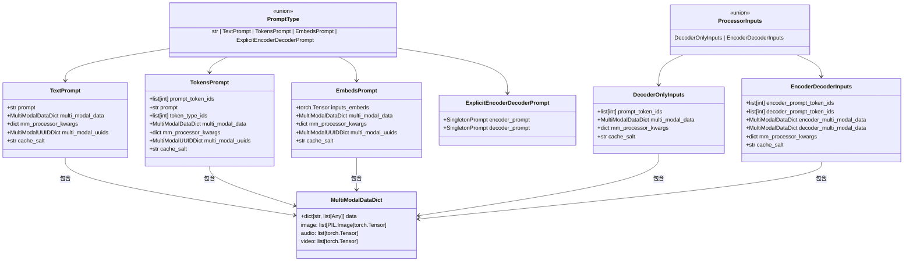
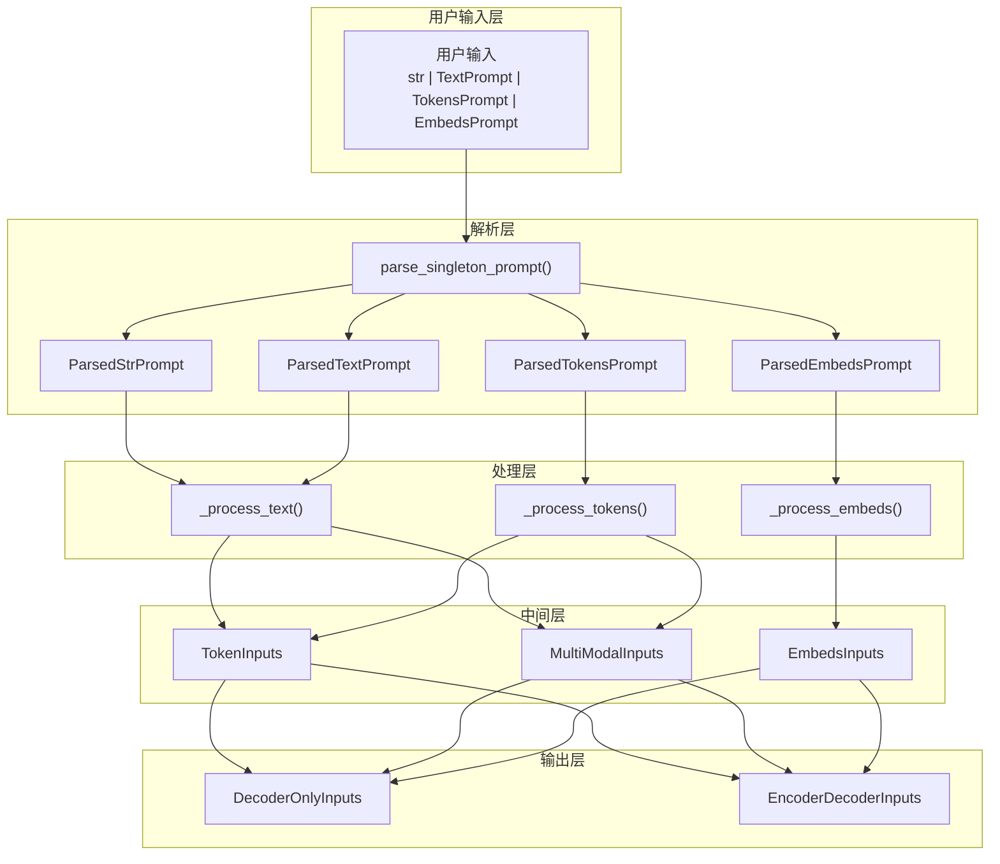

# vLLM-10-InputsOutputs模块-数据结构

## 核心数据结构列表

InputsOutputs 模块包含以下核心数据结构：

| 数据结构 | 类型 | 用途 | 更新时机 | 文件位置 |
|---------|------|------|---------|---------|
| `TextPrompt` | TypedDict | 文本输入格式 | 用户输入时 | inputs/data.py |
| `TokensPrompt` | TypedDict | Token 输入格式 | 预分词输入时 | inputs/data.py |
| `EmbedsPrompt` | TypedDict | 嵌入输入格式 | 向量输入时 | inputs/data.py |
| `ExplicitEncoderDecoderPrompt` | TypedDict | 编码器-解码器输入 | Seq2Seq 模型时 | inputs/data.py |
| `ProcessorInputs` | Union | 处理后的统一输入 | 预处理完成时 | inputs/data.py |
| `SingletonInputs` | Union | 单一输入类型 | 内部处理时 | inputs/data.py |
| `MultiModalDataDict` | Dict | 多模态数据字典 | 多模态输入时 | multimodal/inputs.py |

---

## 输入格式数据结构

### 1. TextPrompt

#### 基本信息

**用途**：用户友好的文本输入格式，支持纯文本和多模态数据。

**定义**：

```python
class TextPrompt(TypedDict):
    """文本 prompt 的标准格式"""
    
    # 必填字段
    prompt: str
    """输入文本，将被分词器处理"""
    
    # 可选字段
    multi_modal_data: NotRequired["MultiModalDataDict"]
    """多模态数据（图像、audio、视频等）"""
    
    mm_processor_kwargs: NotRequired[dict[str, Any]]
    """多模态处理器参数"""
    
    multi_modal_uuids: NotRequired["MultiModalUUIDDict"]
    """多模态数据的用户指定UUID"""
    
    cache_salt: NotRequired[str]
    """前缀缓存的盐值"""
```

#### 字段说明表

| 字段 | 类型 | 必填 | 默认值 | 说明 |
|------|------|------|--------|------|
| prompt | str | ✓ | - | 输入文本，支持任意长度 |
| multi_modal_data | MultiModalDataDict | ✗ | - | 多模态数据字典 |
| mm_processor_kwargs | dict[str, Any] | ✗ | - | 多模态处理参数 |
| multi_modal_uuids | MultiModalUUIDDict | ✗ | - | 多模态数据唯一标识 |
| cache_salt | str | ✗ | - | 缓存盐值，用于前缀缓存 |

#### 使用场景

```python
# 纯文本输入
text_prompt = TextPrompt(prompt="Explain quantum computing")

# 包含图像的文本输入
multimodal_prompt = TextPrompt(
    prompt="Describe this image in detail",
    multi_modal_data={"image": [image_data]},
    mm_processor_kwargs={"do_resize": True, "size": 224}
)

# 带缓存的输入
cached_prompt = TextPrompt(
    prompt="Hello, world!",
    cache_salt="user_session_123"
)
```

#### 验证和约束

```python
def validate_text_prompt(prompt: TextPrompt) -> None:
    """TextPrompt 验证逻辑"""
    
    # 1. 文本长度验证
    if not prompt["prompt"]:
        raise ValueError("Prompt text cannot be empty")
    
    if len(prompt["prompt"]) > MAX_PROMPT_LENGTH:
        raise ValueError(f"Prompt too long: {len(prompt['prompt'])} > {MAX_PROMPT_LENGTH}")
    
    # 2. 多模态数据验证
    if "multi_modal_data" in prompt:
        for modality, data_list in prompt["multi_modal_data"].items():
            if not isinstance(data_list, list):
                raise ValueError(f"Multi-modal data for {modality} must be a list")
    
    # 3. UUID 验证
    if "multi_modal_uuids" in prompt and "multi_modal_data" in prompt:
        for modality in prompt["multi_modal_data"]:
            if modality in prompt["multi_modal_uuids"]:
                data_count = len(prompt["multi_modal_data"][modality])
                uuid_count = len(prompt["multi_modal_uuids"][modality])
                if data_count != uuid_count:
                    raise ValueError(f"UUID count mismatch for {modality}: {uuid_count} != {data_count}")
```

---

### 2. TokensPrompt

#### 基本信息

**用途**：预分词的输入格式，直接提供 token ID 序列。

**定义**：

```python
class TokensPrompt(TypedDict):
    """预分词 prompt 的标准格式"""
    
    # 必填字段
    prompt_token_ids: list[int]
    """Token ID 序列，直接传递给模型"""
    
    # 可选字段
    prompt: NotRequired[str]
    """对应的原始文本（如果可用）"""
    
    token_type_ids: NotRequired[list[int]]
    """Token 类型 ID（用于跨编码器模型）"""
    
    multi_modal_data: NotRequired["MultiModalDataDict"]
    """多模态数据"""
    
    mm_processor_kwargs: NotRequired[dict[str, Any]]
    """多模态处理参数"""
    
    multi_modal_uuids: NotRequired["MultiModalUUIDDict"]
    """多模态数据 UUID"""
    
    cache_salt: NotRequired[str]
    """缓存盐值"""
```

#### 字段说明表

| 字段 | 类型 | 必填 | 默认值 | 说明 |
|------|------|------|--------|------|
| prompt_token_ids | list[int] | ✓ | - | Token ID 序列 |
| prompt | str | ✗ | - | 原始文本（便于调试） |
| token_type_ids | list[int] | ✗ | - | Token 类型 ID |
| multi_modal_data | MultiModalDataDict | ✗ | - | 多模态数据 |
| mm_processor_kwargs | dict[str, Any] | ✗ | - | 处理参数 |
| multi_modal_uuids | MultiModalUUIDDict | ✗ | - | UUID 映射 |
| cache_salt | str | ✗ | - | 缓存标识 |

#### 使用场景

```python
# 基本 Token 输入
tokens_prompt = TokensPrompt(
    prompt_token_ids=[1, 15043, 1, 34567, 2],
    prompt="Hello, world!"  # 可选，用于调试
)

# 跨编码器模型输入
cross_encoder_prompt = TokensPrompt(
    prompt_token_ids=[101, 7592, 1010, 2088, 102],  # [CLS] hello, world [SEP]
    token_type_ids=[0, 0, 0, 0, 0],  # 单一句子
    prompt="hello, world"
)

# 多模态 Token 输入
multimodal_tokens = TokensPrompt(
    prompt_token_ids=[1, 32000, 15043, 2],  # 包含图像 token
    multi_modal_data={"image": [image_tensor]},
    prompt="<image>Describe this"
)
```

#### Token 验证逻辑

```python
def validate_tokens_prompt(prompt: TokensPrompt) -> None:
    """TokensPrompt 验证逻辑"""
    
    # 1. Token ID 验证
    token_ids = prompt["prompt_token_ids"]
    if not token_ids:
        raise ValueError("prompt_token_ids cannot be empty")
    
    if not all(isinstance(tid, int) for tid in token_ids):
        raise ValueError("All token IDs must be integers")
    
    if any(tid < 0 for tid in token_ids):
        raise ValueError("Token IDs must be non-negative")
    
    # 2. Token 类型 ID 验证
    if "token_type_ids" in prompt:
        type_ids = prompt["token_type_ids"]
        if len(type_ids) != len(token_ids):
            raise ValueError("token_type_ids length must match prompt_token_ids")
    
    # 3. 长度限制
    if len(token_ids) > MAX_TOKEN_LENGTH:
        raise ValueError(f"Token sequence too long: {len(token_ids)} > {MAX_TOKEN_LENGTH}")
```

---

### 3. EmbedsPrompt

#### 基本信息

**用途**：直接提供 token 嵌入的输入格式，跳过 embedding lookup。

**定义**：

```python
class EmbedsPrompt(TypedDict):
    """嵌入 prompt 的标准格式"""
    
    # 必填字段
    inputs_embeds: torch.Tensor
    """输入嵌入张量 [seq_len, hidden_size]"""
    
    # 可选字段
    multi_modal_data: NotRequired["MultiModalDataDict"]
    """多模态数据"""
    
    mm_processor_kwargs: NotRequired[dict[str, Any]]
    """多模态处理参数"""
    
    multi_modal_uuids: NotRequired["MultiModalUUIDDict"]
    """多模态数据 UUID"""
    
    cache_salt: NotRequired[str]
    """缓存盐值"""
```

#### 字段说明表

| 字段 | 类型 | 必填 | 默认值 | 说明 |
|------|------|------|--------|------|
| inputs_embeds | torch.Tensor | ✓ | - | 输入嵌入张量 |
| multi_modal_data | MultiModalDataDict | ✗ | - | 多模态数据 |
| mm_processor_kwargs | dict[str, Any] | ✗ | - | 处理参数 |
| multi_modal_uuids | MultiModalUUIDDict | ✗ | - | UUID 映射 |
| cache_salt | str | ✗ | - | 缓存标识 |

#### 嵌入格式和约束

```python
def validate_embeds_prompt(prompt: EmbedsPrompt) -> None:
    """EmbedsPrompt 验证逻辑"""
    
    inputs_embeds = prompt["inputs_embeds"]
    
    # 1. 张量维度验证
    if inputs_embeds.dim() != 2:
        raise ValueError(f"inputs_embeds must be 2D, got {inputs_embeds.dim()}D")
    
    seq_len, hidden_size = inputs_embeds.shape
    
    # 2. 序列长度验证
    if seq_len == 0:
        raise ValueError("Sequence length cannot be zero")
    
    if seq_len > MAX_SEQ_LENGTH:
        raise ValueError(f"Sequence too long: {seq_len} > {MAX_SEQ_LENGTH}")
    
    # 3. 隐层维度验证
    if hidden_size != EXPECTED_HIDDEN_SIZE:
        raise ValueError(f"Hidden size mismatch: {hidden_size} != {EXPECTED_HIDDEN_SIZE}")
    
    # 4. 数值验证
    if torch.isnan(inputs_embeds).any():
        raise ValueError("inputs_embeds contains NaN values")
    
    if torch.isinf(inputs_embeds).any():
        raise ValueError("inputs_embeds contains infinite values")
```

#### 使用场景

```python
# 自定义嵌入输入
custom_embeds = torch.randn(10, 4096)  # [seq_len=10, hidden_size=4096]
embeds_prompt = EmbedsPrompt(inputs_embeds=custom_embeds)

# 多模态嵌入
multimodal_embeds = EmbedsPrompt(
    inputs_embeds=combined_embeds,  # 文本+视觉嵌入
    multi_modal_data={"image": [processed_image]},
    cache_salt="custom_embeds_v1"
)
```

---

### 4. ExplicitEncoderDecoderPrompt

#### 基本信息

**用途**：编码器-解码器模型的显式输入格式。

**定义**：

```python
class ExplicitEncoderDecoderPrompt(TypedDict):
    """编码器-解码器模型的显式输入格式"""
    
    encoder_prompt: SingletonPrompt
    """编码器输入（任意 SingletonPrompt 类型）"""
    
    decoder_prompt: Optional[SingletonPrompt]
    """解码器输入（可选，用于教师强制）"""
```

#### 字段说明表

| 字段 | 类型 | 必填 | 默认值 | 说明 |
|------|------|------|--------|------|
| encoder_prompt | SingletonPrompt | ✓ | - | 编码器输入 |
| decoder_prompt | SingletonPrompt | ✗ | None | 解码器输入（可选） |

#### 使用场景

```python
# T5 翻译任务
t5_prompt = ExplicitEncoderDecoderPrompt(
    encoder_prompt="translate English to German: Hello world",
    decoder_prompt="Hallo Welt"  # 教师强制
)

# BART 摘要任务
bart_prompt = ExplicitEncoderDecoderPrompt(
    encoder_prompt=TextPrompt(
        prompt="Summarize: " + long_article_text
    ),
    decoder_prompt=None  # 自由生成
)

# 混合输入类型
mixed_prompt = ExplicitEncoderDecoderPrompt(
    encoder_prompt=TokensPrompt(
        prompt_token_ids=[1, 2, 3, 4, 5]  # 预分词
    ),
    decoder_prompt=TextPrompt(
        prompt="Begin summary:"  # 文本
    )
)
```

---

## 处理后数据结构

### 5. ProcessorInputs

#### 基本信息

**用途**：预处理器输出的统一格式，Engine 的输入格式。

**定义**：

```python
# Union 类型，根据模型类型选择
ProcessorInputs = Union[DecoderOnlyInputs, EncoderDecoderInputs]

class DecoderOnlyInputs(TypedDict):
    """仅解码器输入（GPT、LLaMA 等）"""
    
    prompt_token_ids: list[int]
    """处理后的 Token ID 序列"""
    
    multi_modal_data: Optional[MultiModalDataDict]
    """处理后的多模态数据"""
    
    mm_processor_kwargs: Optional[dict[str, Any]]
    """多模态处理参数"""
    
    cache_salt: Optional[str]
    """缓存盐值"""

class EncoderDecoderInputs(TypedDict):
    """编码器-解码器输入（T5、BART 等）"""
    
    encoder_prompt_token_ids: list[int]
    """编码器 Token ID 序列"""
    
    decoder_prompt_token_ids: Optional[list[int]]
    """解码器 Token ID 序列（可选）"""
    
    encoder_multi_modal_data: Optional[MultiModalDataDict]
    """编码器多模态数据"""
    
    decoder_multi_modal_data: Optional[MultiModalDataDict]
    """解码器多模态数据"""
    
    mm_processor_kwargs: Optional[dict[str, Any]]
    """多模态处理参数"""
    
    cache_salt: Optional[str]
    """缓存盐值"""
```

#### DecoderOnlyInputs 字段说明

| 字段 | 类型 | 必填 | 说明 |
|------|------|------|------|
| prompt_token_ids | list[int] | ✓ | 分词后的 Token ID 序列 |
| multi_modal_data | MultiModalDataDict | ✗ | 处理后的多模态数据 |
| mm_processor_kwargs | dict[str, Any] | ✗ | 多模态处理参数 |
| cache_salt | str | ✗ | 前缀缓存标识 |

#### EncoderDecoderInputs 字段说明

| 字段 | 类型 | 必填 | 说明 |
|------|------|------|------|
| encoder_prompt_token_ids | list[int] | ✓ | 编码器 Token 序列 |
| decoder_prompt_token_ids | list[int] | ✗ | 解码器 Token 序列 |
| encoder_multi_modal_data | MultiModalDataDict | ✗ | 编码器多模态数据 |
| decoder_multi_modal_data | MultiModalDataDict | ✗ | 解码器多模态数据 |
| mm_processor_kwargs | dict[str, Any] | ✗ | 处理参数 |
| cache_salt | str | ✗ | 缓存标识 |

---

### 6. SingletonInputs

#### 基本信息

**用途**：内部处理的中间格式，表示单一输入类型。

**定义**：

```python
# Union 类型，包含所有可能的单一输入
SingletonInputs = Union[TokenInputs, MultiModalInputs, EmbedsInputs]

class TokenInputs(TypedDict):
    """纯 Token 输入"""
    prompt_token_ids: list[int]
    prompt: NotRequired[str]
    token_type_ids: NotRequired[list[int]]
    cache_salt: NotRequired[str]

class MultiModalInputs(TypedDict):
    """多模态输入"""
    prompt_token_ids: list[int]
    prompt: NotRequired[str]
    multi_modal_data: MultiModalDataDict
    mm_processor_kwargs: NotRequired[dict[str, Any]]
    multi_modal_uuids: NotRequired[MultiModalUUIDDict]
    cache_salt: NotRequired[str]

class EmbedsInputs(TypedDict):
    """嵌入输入"""
    inputs_embeds: torch.Tensor
    multi_modal_data: NotRequired[MultiModalDataDict]
    mm_processor_kwargs: NotRequired[dict[str, Any]]
    multi_modal_uuids: NotRequired[MultiModalUUIDDict]
    cache_salt: NotRequired[str]
```

---

## 多模态数据结构

### 7. MultiModalDataDict

#### 基本信息

**用途**：多模态数据的标准化字典格式。

**定义**：

```python
# 多模态数据字典类型
MultiModalDataDict = dict[str, list[Any]]

# 常见的模态类型
SUPPORTED_MODALITIES = {
    "image": list[Union[PIL.Image.Image, torch.Tensor, np.ndarray]],
    "audio": list[Union[torch.Tensor, np.ndarray]],
    "video": list[Union[torch.Tensor, np.ndarray]],
    "point_cloud": list[torch.Tensor],
}

# UUID 映射
MultiModalUUIDDict = dict[str, list[Optional[str]]]
```

#### 字段结构

| 模态类型 | 数据格式 | 说明 |
|---------|----------|------|
| image | PIL.Image / torch.Tensor / np.ndarray | 图像数据 |
| audio | torch.Tensor / np.ndarray | 音频波形或频谱 |
| video | torch.Tensor / np.ndarray | 视频帧序列 |
| point_cloud | torch.Tensor | 3D 点云数据 |

#### 使用示例

```python
# 图像输入
image_data = {
    "image": [
        PIL.Image.open("image1.jpg"),
        PIL.Image.open("image2.jpg"),
    ]
}

# 音频输入
audio_data = {
    "audio": [
        torch.tensor(audio_waveform_1),
        torch.tensor(audio_waveform_2),
    ]
}

# 混合多模态
mixed_data = {
    "image": [image_tensor],
    "audio": [audio_tensor],
    "point_cloud": [pc_tensor],
}

# 带 UUID 的数据
data_with_uuids = {
    "image": [image1, image2],
}
uuids = {
    "image": ["img_001", "img_002"],  # 用户指定的唯一标识
}
```

---

## 数据结构关系图（类图）



---

## 数据转换流程

### 输入处理管道



---

## 内存布局和优化

### 数据结构大小估算

```python
@dataclass
class DataSizeEstimator:
    """数据结构内存使用估算"""
    
    def estimate_text_prompt(self, prompt: TextPrompt) -> int:
        """估算 TextPrompt 内存使用"""
        size = 0
        
        # 文本字符串
        size += len(prompt["prompt"].encode('utf-8'))
        
        # 多模态数据
        if "multi_modal_data" in prompt:
            for modality, data_list in prompt["multi_modal_data"].items():
                for data in data_list:
                    if isinstance(data, torch.Tensor):
                        size += data.numel() * data.element_size()
                    elif hasattr(data, 'size'):
                        size += data.size
        
        return size
    
    def estimate_tokens_prompt(self, prompt: TokensPrompt) -> int:
        """估算 TokensPrompt 内存使用"""
        size = 0
        
        # Token IDs (int32)
        size += len(prompt["prompt_token_ids"]) * 4
        
        # Token type IDs
        if "token_type_ids" in prompt:
            size += len(prompt["token_type_ids"]) * 4
        
        # 原始文本（可选）
        if "prompt" in prompt:
            size += len(prompt["prompt"].encode('utf-8'))
        
        return size
    
    def estimate_embeds_prompt(self, prompt: EmbedsPrompt) -> int:
        """估算 EmbedsPrompt 内存使用"""
        embeds = prompt["inputs_embeds"]
        return embeds.numel() * embeds.element_size()
```

### 内存优化策略

```python
class MemoryOptimizer:
    """内存优化策略"""
    
    def optimize_multimodal_data(
        self, 
        mm_data: MultiModalDataDict
    ) -> MultiModalDataDict:
        """优化多模态数据存储"""
        
        optimized = {}
        
        for modality, data_list in mm_data.items():
            optimized_list = []
            
            for data in data_list:
                if isinstance(data, torch.Tensor):
                    # 1. 数据类型优化
                    if data.dtype == torch.float64:
                        data = data.float()  # float64 -> float32
                    
                    # 2. 内存布局优化
                    if not data.is_contiguous():
                        data = data.contiguous()
                    
                    # 3. 设备优化
                    if data.device.type == 'cpu' and torch.cuda.is_available():
                        data = data.cuda()
                
                optimized_list.append(data)
            
            optimized[modality] = optimized_list
        
        return optimized
    
    def compress_token_sequence(self, token_ids: list[int]) -> bytes:
        """Token 序列压缩"""
        import zlib
        
        # 转换为字节序列
        byte_data = b''.join(token_id.to_bytes(4, 'little') for token_id in token_ids)
        
        # 压缩
        compressed = zlib.compress(byte_data)
        
        return compressed
    
    def decompress_token_sequence(self, compressed_data: bytes) -> list[int]:
        """Token 序列解压缩"""
        import zlib
        
        # 解压缩
        byte_data = zlib.decompress(compressed_data)
        
        # 转换为 Token ID 列表
        token_ids = []
        for i in range(0, len(byte_data), 4):
            token_id = int.from_bytes(byte_data[i:i+4], 'little')
            token_ids.append(token_id)
        
        return token_ids
```

---

## 缓存策略数据结构

### 前缀缓存支持

```python
@dataclass
class CacheMetadata:
    """缓存元数据"""
    
    cache_salt: str
    """缓存标识"""
    
    prompt_hash: str
    """Prompt 内容哈希"""
    
    tokenizer_hash: str
    """分词器版本哈希"""
    
    mm_data_hash: Optional[str]
    """多模态数据哈希"""
    
    created_at: datetime
    """创建时间"""
    
    access_count: int
    """访问次数"""
    
    def compute_composite_hash(self) -> str:
        """计算复合哈希"""
        components = [
            self.cache_salt,
            self.prompt_hash,
            self.tokenizer_hash,
        ]
        
        if self.mm_data_hash:
            components.append(self.mm_data_hash)
        
        combined = "|".join(components)
        return hashlib.sha256(combined.encode()).hexdigest()

class PrefixCacheEntry:
    """前缀缓存条目"""
    
    def __init__(
        self,
        metadata: CacheMetadata,
        token_ids: list[int],
        processed_data: Optional[dict] = None,
    ):
        self.metadata = metadata
        self.token_ids = token_ids
        self.processed_data = processed_data or {}
        self.hit_count = 0
        self.last_access = datetime.now()
    
    def update_access(self):
        """更新访问统计"""
        self.hit_count += 1
        self.last_access = datetime.now()
        self.metadata.access_count += 1
```

---

## 总结

InputsOutputs 模块的数据结构设计特点：

1. **统一性**：通过 TypedDict 提供统一的输入格式定义
2. **灵活性**：支持文本、Token、嵌入、多模态等多种输入类型
3. **类型安全**：使用 TypedDict 和 Union 提供严格的类型检查
4. **可扩展性**：模块化设计支持新的输入类型和模态
5. **内存优化**：针对大型多模态数据的内存管理策略

核心数据结构：
- **输入格式**：TextPrompt、TokensPrompt、EmbedsPrompt 等用户友好格式
- **处理格式**：ProcessorInputs、SingletonInputs 等内部标准格式
- **多模态支持**：MultiModalDataDict 统一多模态数据管理
- **缓存优化**：支持前缀缓存的元数据和策略

通过合理的数据结构设计，InputsOutputs 模块实现了高效、灵活的输入处理能力。
