# vLLM-10-InputsOutputs模块-时序图

## 时序图概览

本文档展示 InputsOutputs 模块在不同场景下的处理时序，涵盖：

| 场景 | 输入类型 | 参与方 | 关键特征 |
|------|----------|--------|----------|
| 文本输入处理 | TextPrompt | Preprocessor + Tokenizer | 分词和验证 |
| Token 输入处理 | TokensPrompt | Preprocessor + Validator | 格式验证 |
| 多模态输入处理 | TextPrompt + 多模态 | Preprocessor + MMProcessor | 多模态融合 |
| 嵌入输入处理 | EmbedsPrompt | Preprocessor + Validator | 维度验证 |
| 批量输入处理 | 批量 prompt | BatchProcessor | 并行处理 |
| 编码器-解码器处理 | Enc-Dec Prompt | Preprocessor | 双路处理 |

---

## 场景 1：文本输入预处理流程

### 业务场景
用户提交纯文本输入，需要分词并转换为模型可接受的格式。

### 时序图

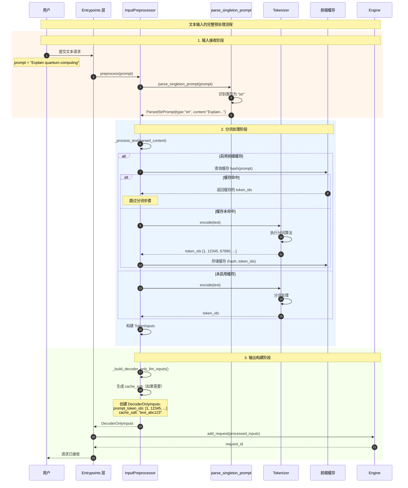

### 关键要点说明

1. **类型识别**：`parse_singleton_prompt` 根据输入类型（str、dict等）准确识别格式
2. **缓存优化**：前缀缓存可以显著减少重复文本的分词开销
3. **错误处理**：分词过程中的编码错误会被捕获并报告
4. **内存管理**：大型文本会被分块处理以避免内存溢出

### 性能特征

- **分词延迟**：10-50ms（取决于文本长度和分词器类型）
- **缓存命中率**：70-90%（在相似请求场景下）
- **内存使用**：O(sequence_length) for token storage

---

## 场景 2：Token 输入验证和处理

### 业务场景
用户直接提供预分词的 Token ID 序列，需要验证格式并传递给模型。

### 时序图

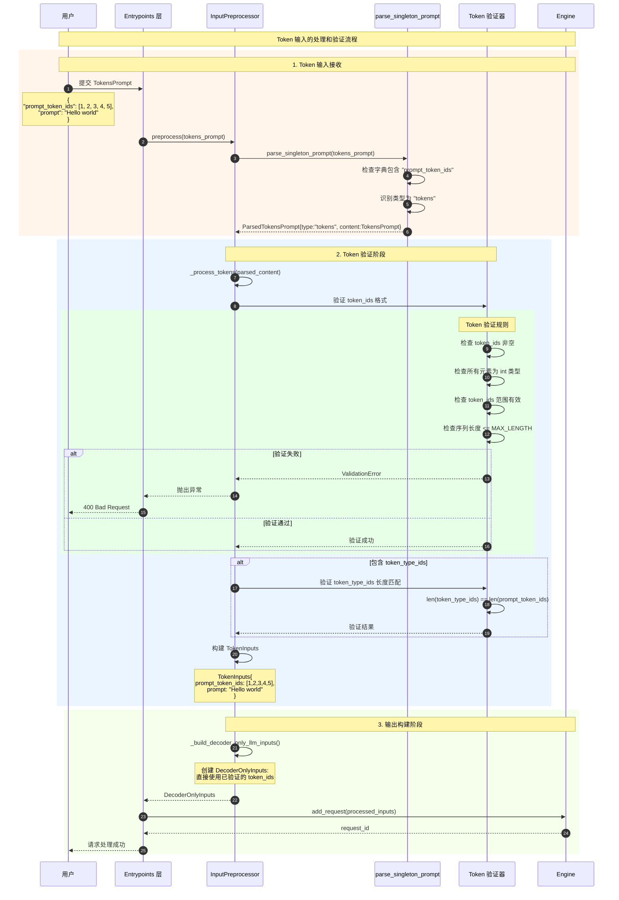

### Token 验证详细流程

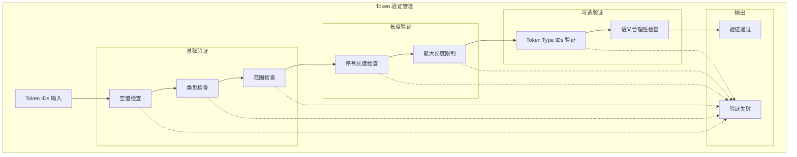

---

## 场景 3：多模态输入融合处理

### 业务场景
用户提交包含文本和图像的多模态输入，需要分别处理并融合。

### 时序图

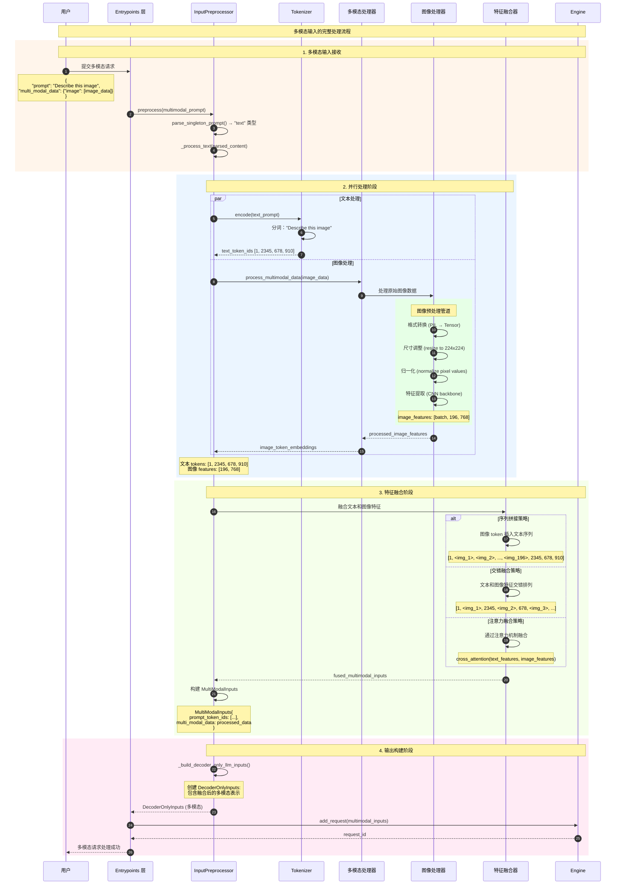

### 多模态数据处理详解

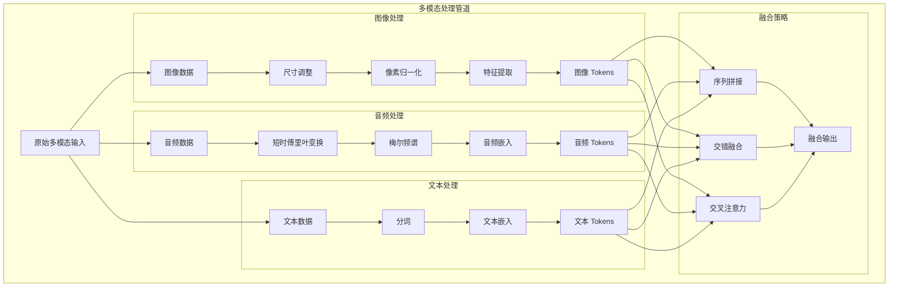

---

## 场景 4：嵌入输入直接处理

### 业务场景
用户直接提供预计算的嵌入向量，跳过 token embedding lookup。

### 时序图

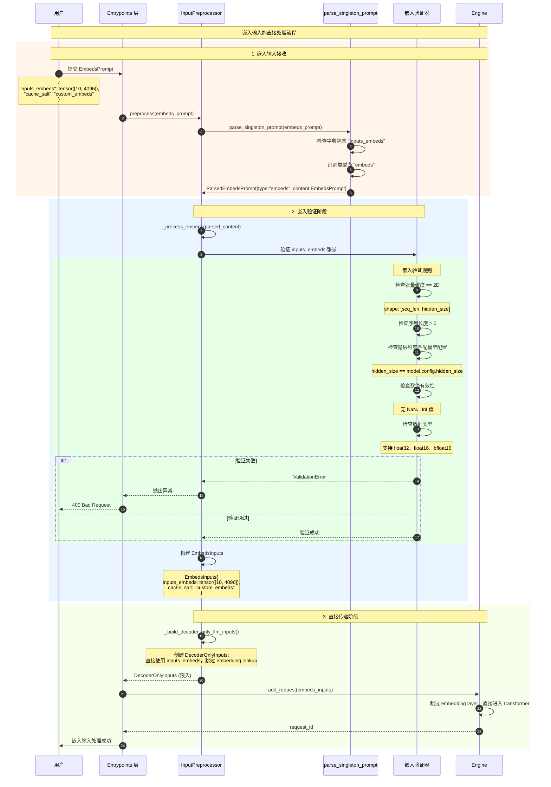

### 嵌入验证详细规则

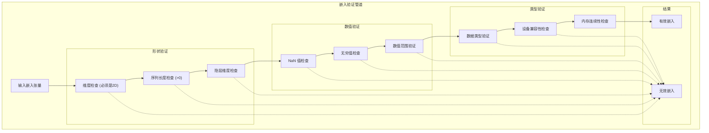

---

## 场景 5：批量输入并行处理

### 业务场景
用户提交多个输入进行批量处理，需要并行预处理以提高吞吐量。

### 时序图

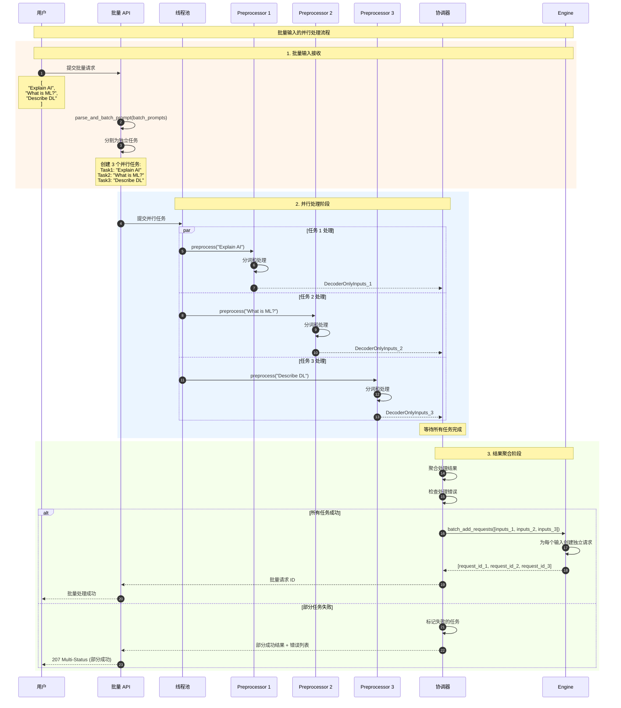

### 批量处理性能优化

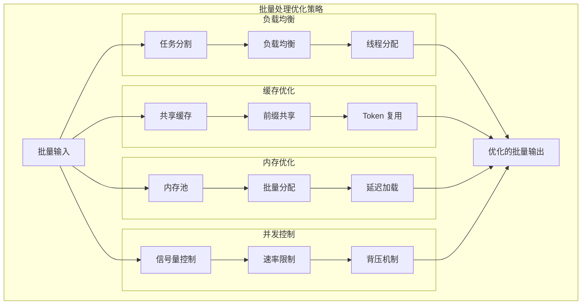

---

## 场景 6：编码器-解码器输入处理

### 业务场景
Seq2Seq 模型（如 T5、BART）需要分别处理编码器和解码器输入。

### 时序图

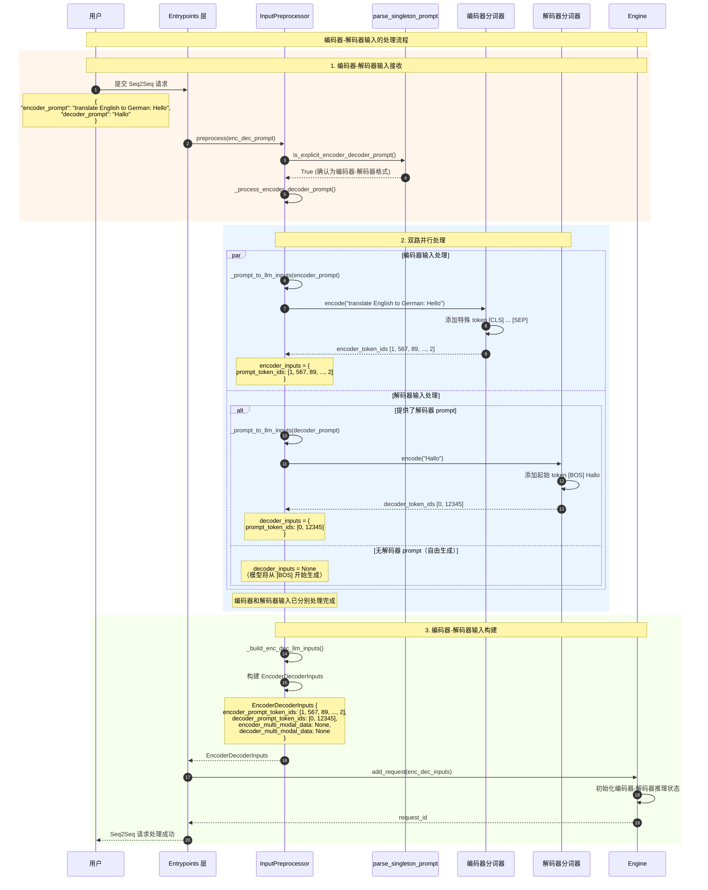

### 编码器-解码器处理架构

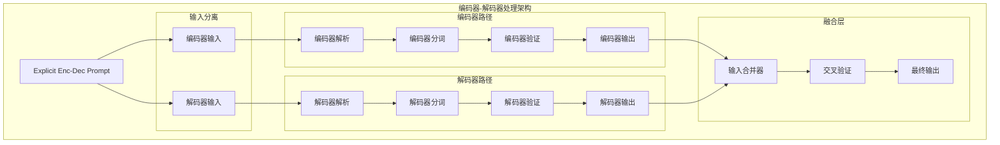

---

## 错误处理和恢复时序

### 输入验证失败处理

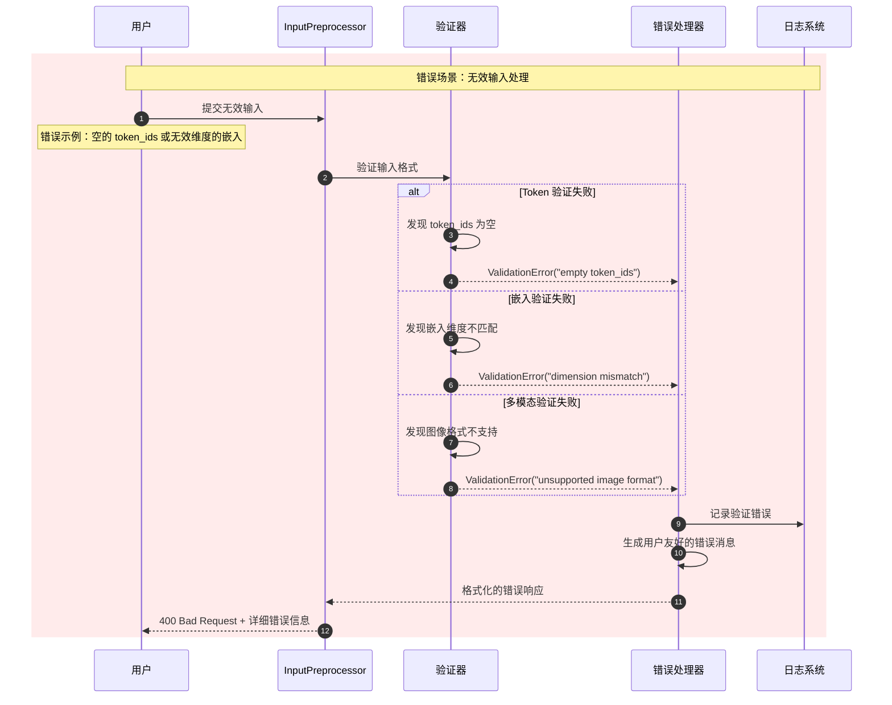

---

## 性能监控时序

### 处理性能指标收集

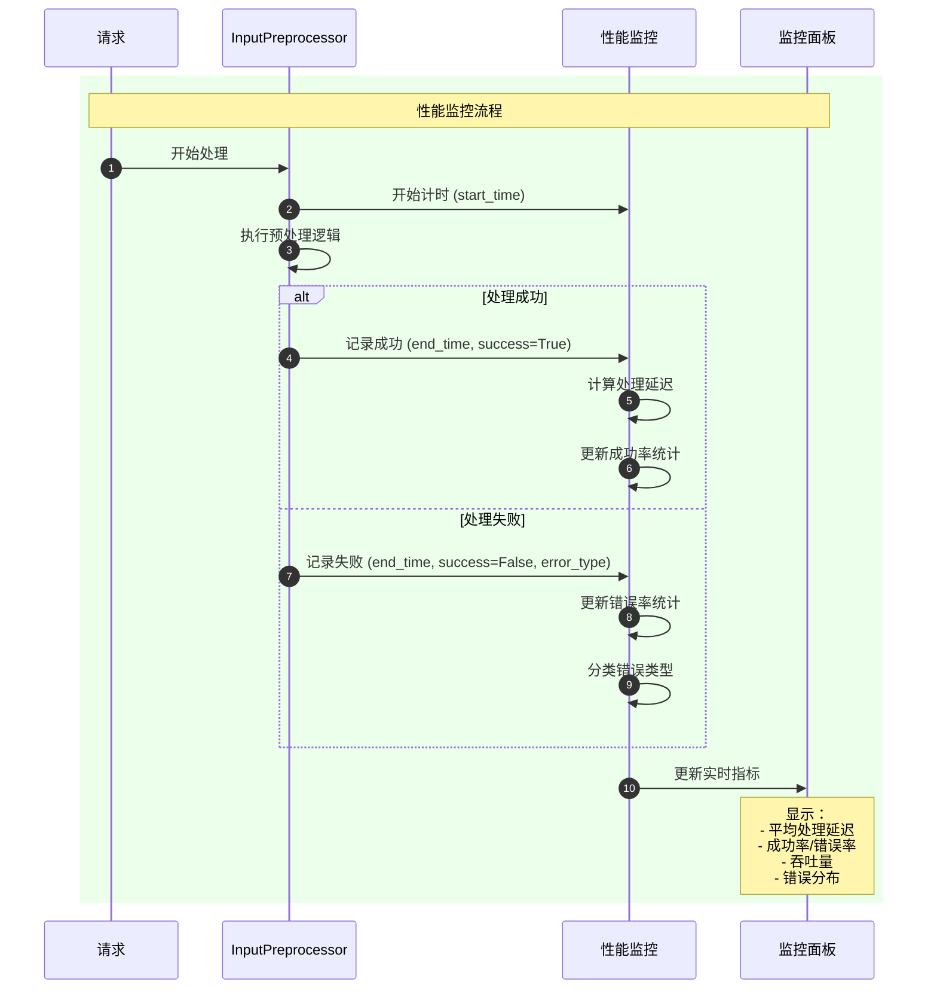

---

## 使用示例总结

### 常见处理模式

```python
# 1. 简单文本处理
text_prompt = "Explain machine learning"
processed = preprocessor.preprocess(text_prompt)
# → DecoderOnlyInputs

# 2. 预分词输入
tokens_prompt = TokensPrompt(prompt_token_ids=[1, 2, 3, 4])
processed = preprocessor.preprocess(tokens_prompt)
# → DecoderOnlyInputs (跳过分词)

# 3. 多模态输入
mm_prompt = TextPrompt(
    prompt="Describe this image",
    multi_modal_data={"image": [image_data]}
)
processed = preprocessor.preprocess(mm_prompt)
# → DecoderOnlyInputs (含多模态数据)

# 4. 编码器-解码器
enc_dec_prompt = build_explicit_enc_dec_prompt(
    encoder_prompt="translate: Hello",
    decoder_prompt="Bonjour"
)
processed = preprocessor.preprocess(enc_dec_prompt)
# → EncoderDecoderInputs

# 5. 批量处理
batch_prompts = ["Hello", "Hi", "Good morning"]
parsed_batch = parse_and_batch_prompt(batch_prompts)
processed_batch = [preprocessor.preprocess(p) for p in parsed_batch]
```

---

## 总结

InputsOutputs 模块的时序图展示了：

1. **多格式支持**：文本、Token、嵌入、多模态、编码器-解码器等格式的统一处理
2. **验证机制**：完整的输入验证和错误处理流程
3. **并行处理**：批量输入的高效并行处理策略
4. **性能优化**：缓存、内存管理、负载均衡等优化机制
5. **错误恢复**：健壮的错误处理和用户友好的错误报告

**关键设计要点**：
- **统一接口**：不同输入格式通过统一的预处理接口处理
- **类型安全**：严格的类型检查和验证机制
- **性能优化**：缓存、并行处理、内存优化
- **可扩展性**：模块化设计支持新的输入类型和处理策略

通过这些时序图，可以深入理解 vLLM 输入处理系统的工作机制和优化策略。
