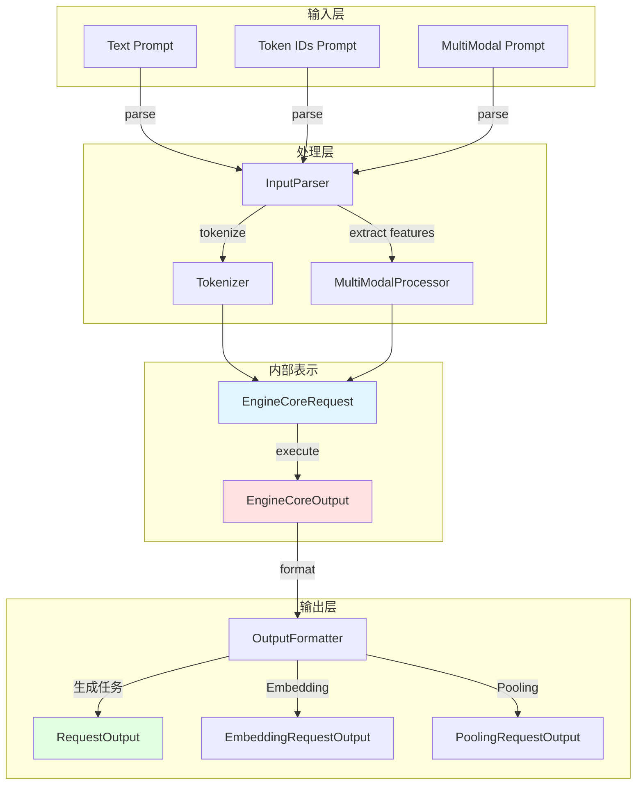

# vLLM-10-InputsOutputs模块-概览

## 模块职责

InputsOutputs 模块定义了 vLLM 的输入输出数据结构，包括：

- 定义输入数据结构（Prompt 类型、多模态输入）
- 定义输出数据结构（RequestOutput、CompletionOutput 等）
- 处理输入数据的解析和验证
- 格式化输出数据
- 支持多种输入格式（文本、token IDs、embeddings、多模态）
- 支持多种输出类型（文本生成、embedding、分类、打分）

## 核心数据结构

### 输入数据结构

#### PromptType

```python
# 支持多种 Prompt 类型
PromptType = Union[str, list[int], TextPrompt, TokensPrompt]

# 文本 Prompt
TextPrompt = Dict[str, Any]  # {"type": "text", "prompt": "..."}

# Token IDs Prompt
TokensPrompt = Dict[str, Any]  # {"type": "tokens", "prompt_token_ids": [...]}

# 多模态 Prompt
MultiModalPrompt = Dict[str, Any]  # 包含 "multi_modal_data"
```

#### TextPrompt

```python
class TextPrompt(TypedDict):
    """文本 Prompt"""
    prompt: str                                    # 文本内容
    multi_modal_data: Optional[MultiModalDataDict] # 多模态数据（可选）
```

#### TokensPrompt

```python
class TokensPrompt(TypedDict):
    """Token IDs Prompt"""
    prompt_token_ids: list[int]                    # Token IDs
    multi_modal_data: Optional[MultiModalDataDict] # 多模态数据（可选）
```

#### MultiModalDataDict

```python
class MultiModalDataDict(TypedDict):
    """多模态数据"""
    image: Optional[Union[Image, list[Image]]]     # 图片
    audio: Optional[Union[Audio, list[Audio]]]     # 音频
    video: Optional[Union[Video, list[Video]]]     # 视频
```

### 输出数据结构

#### RequestOutput

```python
class RequestOutput:
    """请求输出（主要输出结构）"""
    
    def __init__(
        self,
        request_id: str,
        prompt: Optional[str],
        prompt_token_ids: list[int],
        prompt_logprobs: Optional[PromptLogprobs],
        outputs: list[CompletionOutput],
        finished: bool,
        metadata: Optional[RequestMetadata] = None,
    ):
        self.request_id = request_id            # 请求 ID
        self.prompt = prompt                    # 原始 prompt 文本
        self.prompt_token_ids = prompt_token_ids # Prompt token IDs
        self.prompt_logprobs = prompt_logprobs  # Prompt logprobs
        self.outputs = outputs                  # 生成的输出列表
        self.finished = finished                # 是否完成
        self.metadata = metadata                # 元数据
```

#### CompletionOutput

```python
class CompletionOutput:
    """单个完成输出"""
    
    def __init__(
        self,
        index: int,
        text: str,
        token_ids: list[int],
        cumulative_logprob: float,
        logprobs: Optional[SampleLogprobs],
        finish_reason: Optional[str],
        stop_reason: Optional[Union[int, str]],
        lora_request: Optional[LoRARequest] = None,
    ):
        self.index = index                      # 输出索引（n > 1 时）
        self.text = text                        # 生成的文本
        self.token_ids = token_ids              # 生成的 token IDs
        self.cumulative_logprob = cumulative_logprob  # 累积 log 概率
        self.logprobs = logprobs                # Token logprobs
        self.finish_reason = finish_reason      # 完成原因
        self.stop_reason = stop_reason          # 停止原因
        self.lora_request = lora_request        # 使用的 LoRA
```

#### EmbeddingRequestOutput

```python
class EmbeddingRequestOutput:
    """Embedding 任务输出"""
    
    def __init__(
        self,
        request_id: str,
        outputs: EmbeddingOutput,
        prompt_token_ids: list[int],
        finished: bool,
    ):
        self.request_id = request_id
        self.outputs = outputs                  # Embedding 向量
        self.prompt_token_ids = prompt_token_ids
        self.finished = finished

class EmbeddingOutput:
    """Embedding 向量"""
    embedding: list[float]                      # Embedding 向量
```

#### PoolingRequestOutput

```python
class PoolingRequestOutput:
    """Pooling 任务输出"""
    
    def __init__(
        self,
        request_id: str,
        outputs: PoolingOutput,
        prompt_token_ids: list[int],
        finished: bool,
    ):
        self.request_id = request_id
        self.outputs = outputs
        self.prompt_token_ids = prompt_token_ids
        self.finished = finished

class PoolingOutput:
    """Pooling 向量"""
    data: torch.Tensor                          # Pooling 向量（可能是多个）
```

## 输入处理流程

### 文本 Prompt 处理

```python
# 用户输入
prompt = "Hello, my name is"

# 内部转换
text_prompt = {
    "type": "text",
    "prompt": "Hello, my name is"
}

# Tokenization
prompt_token_ids = tokenizer.encode(prompt)  # [1, 15043, 29892, 590, 1024, 338]
```

### Token IDs Prompt 处理

```python
# 用户输入（已 tokenize）
prompt_token_ids = [1, 15043, 29892, 590, 1024, 338]

# 内部转换
tokens_prompt = {
    "type": "tokens",
    "prompt_token_ids": prompt_token_ids
}

# 无需 tokenization，直接使用
```

### 多模态 Prompt 处理

```python
from PIL import Image

# 用户输入
prompt = {
    "prompt": "What is in this image?",
    "multi_modal_data": {
        "image": Image.open("image.jpg")
    }
}

# 内部处理
# 1. Tokenize 文本部分
prompt_text = "What is in this image?"
prompt_token_ids = tokenizer.encode(prompt_text)

# 2. 处理图片
image_features = vision_encoder(image)  # 提取图片特征

# 3. 合并 text + image 特征
combined_input = merge_text_and_image(prompt_token_ids, image_features)
```

## 输出格式化流程

### 生成任务输出

```python
# 内部 EngineCoreOutput
engine_output = EngineCoreOutput(
    request_id="request-123",
    new_token_ids=[1234],
    finish_reason=FinishReason.STOP,
)

# 格式化为 RequestOutput
completion = CompletionOutput(
    index=0,
    text=tokenizer.decode([1234]),  # "world"
    token_ids=[1234],
    cumulative_logprob=-1.23,
    logprobs=None,
    finish_reason="stop",
    stop_reason="</s>",
)

request_output = RequestOutput(
    request_id="request-123",
    prompt="Hello, my name is",
    prompt_token_ids=[1, 15043, 29892, 590, 1024, 338],
    outputs=[completion],
    finished=True,
)
```

### Embedding 任务输出

```python
# 内部输出（torch.Tensor）
embedding_tensor = torch.randn(768)  # hidden_size

# 格式化为 EmbeddingRequestOutput
embedding_output = EmbeddingOutput(
    embedding=embedding_tensor.cpu().tolist()
)

request_output = EmbeddingRequestOutput(
    request_id="request-123",
    outputs=embedding_output,
    prompt_token_ids=[1, 2, 3, 4],
    finished=True,
)
```

## 数据流图



## API 示例

### 使用文本 Prompt

```python
from vllm import LLM, SamplingParams

llm = LLM(model="meta-llama/Llama-2-7b-hf")

# 简单文本
prompts = ["Hello, my name is", "The capital of France is"]

# 生成
outputs = llm.generate(prompts, SamplingParams(temperature=0.8, max_tokens=50))

# 处理输出
for output in outputs:
    print(f"Prompt: {output.prompt}")
    print(f"Generated: {output.outputs[0].text}")
    print(f"Finish reason: {output.outputs[0].finish_reason}")
```

### 使用 Token IDs Prompt

```python
from vllm import LLM, SamplingParams, TokensPrompt

llm = LLM(model="meta-llama/Llama-2-7b-hf")

# Token IDs Prompt
prompts = [
    TokensPrompt(prompt_token_ids=[1, 15043, 29892, 590, 1024, 338])
]

outputs = llm.generate(prompts, SamplingParams(max_tokens=50))

for output in outputs:
    print(f"Generated tokens: {output.outputs[0].token_ids}")
    print(f"Generated text: {output.outputs[0].text}")
```

### 使用多模态 Prompt

```python
from vllm import LLM, SamplingParams
from PIL import Image

llm = LLM(model="llava-hf/llava-1.5-7b-hf")

# 多模态 Prompt
image = Image.open("image.jpg")
prompts = [
    {
        "prompt": "USER: <image>\nWhat is in this image?\nASSISTANT:",
        "multi_modal_data": {"image": image}
    }
]

outputs = llm.generate(prompts, SamplingParams(max_tokens=100))

for output in outputs:
    print(f"Generated: {output.outputs[0].text}")
```

### 使用 Embedding 模型

```python
from vllm import LLM

llm = LLM(model="sentence-transformers/all-MiniLM-L6-v2", task="embed")

# 输入
prompts = ["Hello, world!", "This is a test."]

# 生成 Embeddings
outputs = llm.encode(prompts)

for output in outputs:
    print(f"Embedding shape: {len(output.outputs.embedding)}")
    print(f"Embedding (first 5): {output.outputs.embedding[:5]}")
```

## 输出字段说明

### finish_reason 字段

| 值 | 说明 |
|---|---|
| `"length"` | 达到 `max_tokens` 限制 |
| `"stop"` | 遇到停止条件（stop token 或 stop string） |
| `"abort"` | 请求被取消 |
| `None` | 未完成（流式输出中间状态） |

### logprobs 格式

```python
# 每个 token 的 logprobs
{
    "token_id": 1234,
    "token": "world",
    "logprob": -0.123,
    "top_logprobs": [
        {"token_id": 1234, "token": "world", "logprob": -0.123},
        {"token_id": 5678, "token": "earth", "logprob": -2.456},
        # ...
    ]
}
```

## 数据验证

### 输入验证

```python
def validate_prompt(prompt: PromptType) -> None:
    """验证 Prompt 输入"""
    if isinstance(prompt, str):
        if len(prompt) == 0:
            raise ValueError("Prompt cannot be empty")
    elif isinstance(prompt, list):
        if len(prompt) == 0:
            raise ValueError("Token IDs cannot be empty")
        if not all(isinstance(t, int) for t in prompt):
            raise ValueError("All token IDs must be integers")
    elif isinstance(prompt, dict):
        if "prompt" not in prompt and "prompt_token_ids" not in prompt:
            raise ValueError("Prompt dict must contain 'prompt' or 'prompt_token_ids'")
```

### 输出验证

```python
def validate_request_output(output: RequestOutput) -> None:
    """验证 RequestOutput"""
    if output.finished:
        for completion in output.outputs:
            if completion.finish_reason is None:
                raise ValueError("Finished output must have finish_reason")
```

## 性能考虑

### 内存使用

| 数据结构 | 内存占用 | 说明 |
|---------|---------|------|
| TextPrompt | ~1 KB | 仅文本 |
| TokensPrompt | ~4 KB | Token IDs（int32） |
| RequestOutput | ~10 KB / 1000 tokens | 包含文本和 token IDs |
| EmbeddingOutput | ~3 KB (768 dim) | 浮点数向量 |

### 序列化性能

- **RequestOutput**：~5 μs（Python dataclass）
- **EngineCoreOutput**：~0.5 μs（msgspec，零拷贝）

## 总结

InputsOutputs 模块定义了 vLLM 的输入输出接口：

1. **灵活输入**：支持文本、Token IDs、多模态
2. **统一输出**：RequestOutput、EmbeddingOutput、PoolingOutput
3. **类型安全**：使用 TypedDict 和类型注解
4. **扩展性**：易于添加新的输入/输出类型

通过统一的数据结构，简化了上层应用开发和底层引擎实现。

