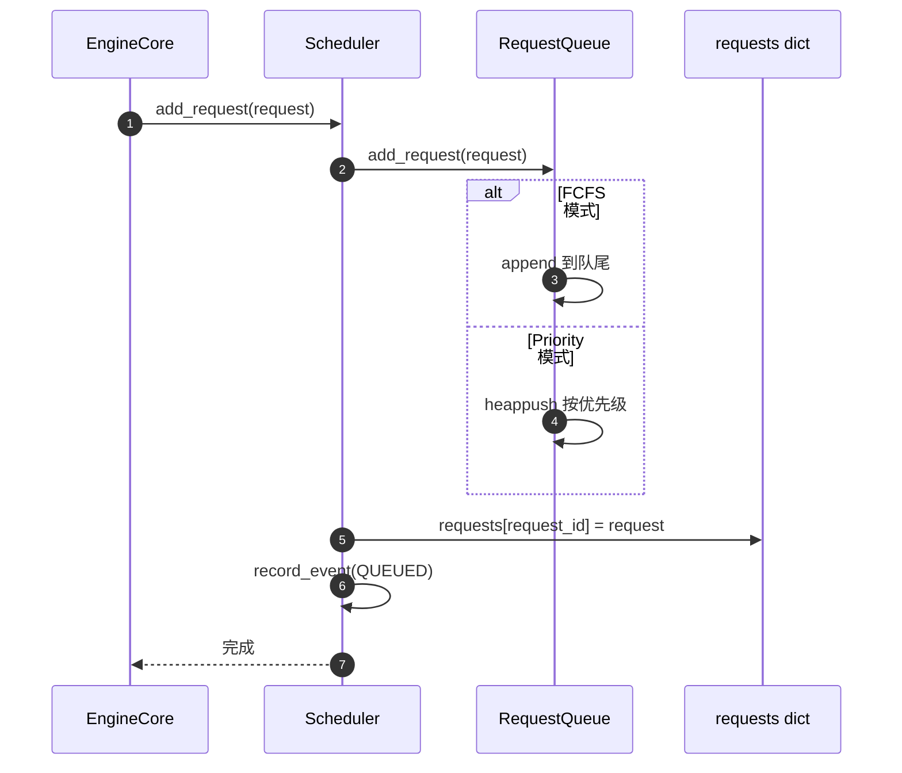
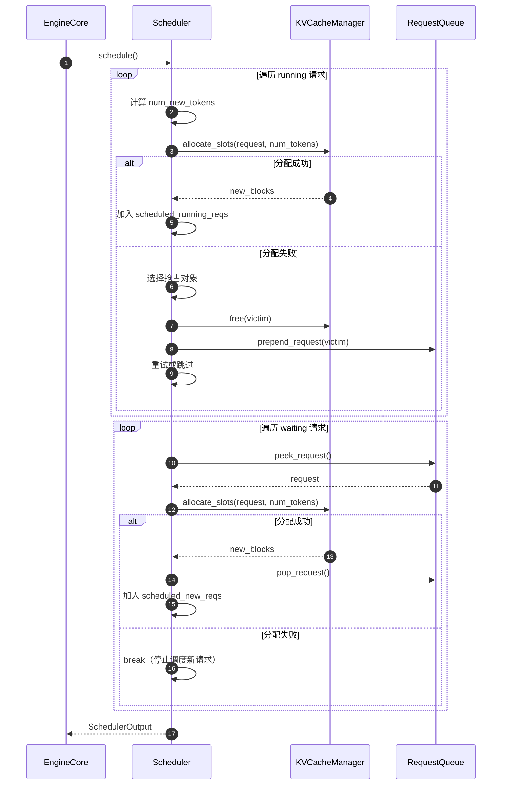
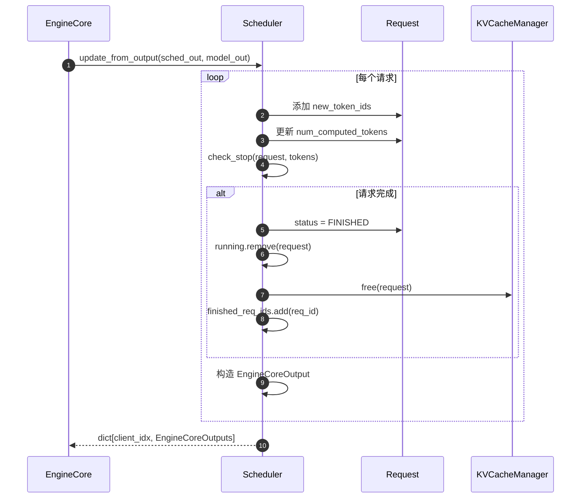

# vLLM-12-Scheduler模块-API

## 模块 API 概览

Scheduler 模块通过 `SchedulerInterface` 定义了标准接口，提供请求管理和调度功能。

## 核心 API 列表

| API 方法 | 功能说明 | 幂等性 | 调用频率 |
|---------|---------|--------|---------|
| `add_request()` | 添加新请求到等待队列 | 否（重复添加会报错） | 每个新请求调用一次 |
| `schedule()` | 执行调度决策 | 是（多次调用无副作用） | 每个 engine step 调用一次 |
| `update_from_output()` | 更新请求状态 | 是 | 每个 engine step 调用一次 |
| `finish_requests()` | 标记请求完成 | 是 | 请求完成时调用 |
| `update_draft_token_ids()` | 更新投机 token | 是 | 投机解码场景 |
| `get_request_counts()` | 获取请求统计 | 是 | 监控场景 |

## API 详细规格

### 1. add_request

#### 基本信息
- **名称**：`add_request(request: Request) -> None`
- **协议/方法**：同步函数调用
- **幂等性**：否，重复添加相同 `request_id` 会导致错误

#### 请求结构体

```python
class Request:
    # 请求标识
    request_id: str                    # 全局唯一标识
    client_index: int                  # 客户端索引（多客户端场景）
    priority: int                      # 优先级（越小越高）
    
    # 输入数据
    prompt_token_ids: Optional[list[int]]    # Prompt token IDs
    prompt_embeds: Optional[torch.Tensor]    # Prompt embeddings
    mm_features: list[MultiModalFeatureSpec] # 多模态特征
    
    # 参数
    sampling_params: Optional[SamplingParams]  # 采样参数
    pooling_params: Optional[PoolingParams]    # Pooling 参数
    eos_token_id: Optional[int]                # 结束 token
    
    # LoRA
    lora_request: Optional[LoRARequest]  # LoRA 适配器
    
    # 状态
    status: RequestStatus             # waiting/running/finished/preempted
    arrival_time: float               # 到达时间戳
    num_computed_tokens: int          # 已计算 token 数
    num_preemptions: int              # 被抢占次数
    
    # 缓存相关
    cache_salt: Optional[str]         # 缓存盐值
    block_hashes: list[BlockHash]     # 块哈希（Prefix Caching）
```

**字段说明**：

| 字段 | 类型 | 必填 | 默认 | 约束 | 说明 |
|------|------|------|------|------|------|
| request_id | str | 是 | - | 全局唯一 | 请求唯一标识 |
| priority | int | 否 | 0 | >=0，越小越高 | Priority 调度模式使用 |
| prompt_token_ids | list[int] | 条件 | None | 长度<=max_model_len | prompt_token_ids 或 prompt_embeds 二选一 |
| sampling_params | SamplingParams | 条件 | None | - | 生成任务必填 |
| pooling_params | PoolingParams | 条件 | None | - | Embedding 任务必填 |
| num_computed_tokens | int | 否 | 0 | >=0 | 已计算的 token 数 |

#### 响应结构体
无返回值（`None`）

#### 入口函数与关键代码

```python
def add_request(self, request: Request) -> None:
    """添加请求到等待队列
    
    Args:
        request: 新请求对象
    """
    # 1) 加入等待队列（按策略排序）
    self.waiting.add_request(request)
    
    # 2) 注册到请求字典
    self.requests[request.request_id] = request
    
    # 3) 记录事件（可选，用于追踪）
    if self.log_stats:
        request.record_event(EngineCoreEventType.QUEUED)
```

#### 调用链核心代码

```python
# 1. EngineCore 接收请求
def add_request(self, request: EngineCoreRequest):
    # 转换为内部 Request 对象
    internal_request = Request.from_engine_core_request(request, block_hasher)
    
    # 2. 调用 Scheduler
    self.scheduler.add_request(internal_request)
```

#### 时序图



#### 异常/回退与性能要点

**错误语义**：
- 重复 `request_id`：不检查，会覆盖旧请求（需上层保证唯一性）
- 无效参数：在 Request 构造时抛出 `ValueError`

**性能要点**：
- FCFS：O(1) append
- Priority：O(log n) heappush
- 无锁设计，单线程调用

---

### 2. schedule

#### 基本信息
- **名称**：`schedule() -> SchedulerOutput`
- **协议/方法**：同步函数调用
- **幂等性**：是（多次调用返回相同结果，但会修改内部状态）

#### 请求结构体
无输入参数

#### 响应结构体

```python
@dataclass
class SchedulerOutput:
    # 新调度的请求
    scheduled_new_reqs: list[NewRequestData]
    
    # 已缓存的请求（继续运行或恢复）
    scheduled_cached_reqs: CachedRequestData
    
    # 每个请求的 token 数
    num_scheduled_tokens: dict[str, int]
    
    # 总 token 数
    total_num_scheduled_tokens: int
    
    # 投机解码 token
    scheduled_spec_decode_tokens: dict[str, list[int]]
    
    # 编码器输入（多模态）
    scheduled_encoder_inputs: dict[str, list[int]]
    
    # 前缀块数量（Cascade Attention）
    num_common_prefix_blocks: tuple[int, ...]
    
    # 其他元数据...
```

**NewRequestData 字段**：

| 字段 | 类型 | 说明 |
|------|------|------|
| req_id | str | 请求 ID |
| prompt_token_ids | list[int] | Prompt tokens |
| mm_features | list[MultiModalFeatureSpec] | 多模态特征 |
| sampling_params | SamplingParams | 采样参数 |
| block_ids | tuple[list[int], ...] | 分配的物理块 ID |
| num_computed_tokens | int | 已计算 token 数 |
| lora_request | LoRARequest | LoRA 适配器 |

**CachedRequestData 字段**：

| 字段 | 类型 | 说明 |
|------|------|------|
| req_ids | list[str] | 请求 ID 列表 |
| resumed_from_preemption | list[bool] | 是否从抢占恢复 |
| new_block_ids | list[tuple[list[int], ...]] | 新分配的块 |
| num_computed_tokens | list[int] | 每个请求的已计算 token 数 |
| num_output_tokens | list[int] | 每个请求的输出 token 数 |

#### 入口函数与关键代码

```python
def schedule(self) -> SchedulerOutput:
    """执行调度决策
    
    Returns:
        SchedulerOutput: 调度结果，包含本 step 要处理的请求
    """
    scheduled_new_reqs = []
    scheduled_running_reqs = []
    preempted_reqs = []
    token_budget = self.max_num_scheduled_tokens
    
    # 1) 首先调度 running 请求（优先级高）
    for request in self.running:
        num_new_tokens = request.num_tokens_with_spec - request.num_computed_tokens
        
        if token_budget < num_new_tokens:
            break  # budget 不足，停止调度
        
        # 尝试分配 KV 块
        while True:
            new_blocks = self.kv_cache_manager.allocate_slots(
                request, num_new_tokens, ...)
            
            if new_blocks is not None:
                break  # 分配成功
            
            # 分配失败，需要抢占
            if self.policy == SchedulingPolicy.PRIORITY:
                victim = max(self.running, key=lambda r: (r.priority, r.arrival_time))
            else:
                victim = self.running.pop()
            
            # 释放被抢占请求的资源
            self.kv_cache_manager.free(victim)
            victim.status = RequestStatus.PREEMPTED
            self.waiting.prepend_request(victim)
            preempted_reqs.append(victim)
            
            if victim == request:
                break  # 当前请求本身被抢占
        
        if new_blocks is None:
            break  # 无法分配，停止调度
        
        scheduled_running_reqs.append(request)
        token_budget -= num_new_tokens
    
    # 2) 然后调度 waiting 请求
    while not self.waiting.is_empty() and token_budget > 0:
        request = self.waiting.peek_request()
        
        # Chunked prefill：限制单次处理的 token 数
        num_new_tokens = min(
            request.num_prompt_tokens - request.num_computed_tokens,
            self.max_chunk_size
        )
        
        if token_budget < num_new_tokens:
            break
        
        # 分配 KV 块
        new_blocks = self.kv_cache_manager.allocate_slots(request, num_new_tokens)
        if new_blocks is None:
            break  # 无法分配
        
        self.waiting.pop_request()
        request.status = RequestStatus.RUNNING
        self.running.append(request)
        scheduled_new_reqs.append(request)
        token_budget -= num_new_tokens
    
    # 3) 构造 SchedulerOutput
    return SchedulerOutput(
        scheduled_new_reqs=[NewRequestData.from_request(r, ...) for r in scheduled_new_reqs],
        scheduled_cached_reqs=CachedRequestData.from_requests(scheduled_running_reqs),
        num_scheduled_tokens={r.request_id: num_tokens for r, num_tokens in ...},
        total_num_scheduled_tokens=sum(num_scheduled_tokens.values()),
        ...
    )
```

#### 时序图



#### 异常/回退与性能要点

**错误语义**：
- KV 缓存不足：触发抢占或停止调度新请求
- 无可抢占对象：停止调度，返回部分结果

**性能要点**：
- 调度复杂度：O(n + m)，n=running 请求数，m=waiting 请求数
- 块分配：O(k)，k=需要分配的块数
- 抢占选择：O(n)（遍历寻找最低优先级）

**优化建议**：
- 设置合理的 `max_num_seqs` 避免扫描过多请求
- 启用 Prefix Caching 减少块分配次数
- Priority 模式使用堆维护优先级队列

---

### 3. update_from_output

#### 基本信息
- **名称**：`update_from_output(scheduler_output, model_runner_output) -> dict[int, EngineCoreOutputs]`
- **协议/方法**：同步函数调用
- **幂等性**：否（会修改请求状态）

#### 请求结构体

```python
# 输入 1: SchedulerOutput（调度结果）
scheduler_output: SchedulerOutput

# 输入 2: ModelRunnerOutput（模型输出）
@dataclass
class ModelRunnerOutput:
    req_ids: list[str]                   # 请求 ID 列表
    sampled_token_ids: list[list[int]]   # 采样的 token IDs
    logprobs: Optional[list[list[float]]]  # Log 概率
    draft_token_ids: Optional[DraftTokenIds]  # 投机 token
    # （此处省略其他字段）
```

#### 响应结构体

```python
# 返回：dict[client_index, EngineCoreOutputs]
@dataclass
class EngineCoreOutputs:
    # 请求输出列表
    outputs: list[EngineCoreOutput]
    
    # 完成的请求 ID 集合
    finished_req_ids: set[str]

@dataclass
class EngineCoreOutput:
    request_id: str
    new_token_ids: list[int]       # 新生成的 token
    finished: bool                 # 是否完成
    finish_reason: Optional[FinishReason]
    # （此处省略其他字段）
```

#### 入口函数与关键代码

```python
def update_from_output(
    self,
    scheduler_output: SchedulerOutput,
    model_runner_output: ModelRunnerOutput,
) -> dict[int, EngineCoreOutputs]:
    """更新请求状态
    
    Args:
        scheduler_output: 本 step 的调度结果
        model_runner_output: 模型运行结果
    
    Returns:
        按客户端索引分组的输出
    """
    outputs_by_client: dict[int, list[EngineCoreOutput]] = defaultdict(list)
    
    # 1) 更新每个请求的状态
    for req_id, new_token_ids in zip(
        model_runner_output.req_ids,
        model_runner_output.sampled_token_ids
    ):
        request = self.requests[req_id]
        
        # 添加新生成的 token
        request._output_token_ids.extend(new_token_ids)
        request._all_token_ids.extend(new_token_ids)
        request.num_computed_tokens += len(new_token_ids)
        
        # 检查是否完成
        stopped = self._check_stop(request, new_token_ids)
        
        if stopped or request.num_output_tokens >= request.max_tokens:
            request.status = RequestStatus.FINISHED_STOPPED
            self.running.remove(request)
            self.finished_req_ids.add(req_id)
            self.kv_cache_manager.free(request)
        
        # 构造输出
        output = EngineCoreOutput(
            request_id=req_id,
            new_token_ids=new_token_ids,
            finished=request.is_finished(),
            finish_reason=request.stop_reason,
        )
        outputs_by_client[request.client_index].append(output)
    
    # 2) 按客户端分组返回
    return {
        client_idx: EngineCoreOutputs(outputs=outputs, ...)
        for client_idx, outputs in outputs_by_client.items()
    }
```

#### 时序图



#### 异常/回退与性能要点

**错误语义**：
- 请求不存在：跳过（可能已被取消）
- 状态不一致：记录警告

**性能要点**：
- 复杂度：O(n)，n=本 step 处理的请求数
- 字符串拼接：使用 `list.extend` 避免重复拷贝
- 停止检测：快速路径优化（大多数情况不停止）

---

## 其他 API

### 4. finish_requests

```python
def finish_requests(
    self,
    request_ids: Union[str, Iterable[str]],
    finished_status: RequestStatus,
) -> None:
    """标记请求完成（取消/超时等）"""
    # （此处省略详细实现，见概览文档）
```

### 5. update_draft_token_ids

```python
def update_draft_token_ids(self, draft_token_ids: DraftTokenIds) -> None:
    """更新投机解码的 draft token（Speculative Decoding）"""
    # （此处省略详细实现）
```

### 6. get_request_counts

```python
def get_request_counts(self) -> tuple[int, int]:
    """返回 (num_running_reqs, num_waiting_reqs)"""
    return len(self.running), len(self.waiting)
```

## API 使用示例

### 完整调度循环

```python
# 初始化
scheduler = Scheduler(vllm_config, kv_cache_config, ...)

# 添加请求
request = Request(request_id="req_1", ...)
scheduler.add_request(request)

# 引擎循环
while True:
    # 1. 调度
    scheduler_output = scheduler.schedule()
    
    if scheduler_output.total_num_scheduled_tokens == 0:
        break  # 无请求，退出
    
    # 2. 执行模型
    model_output = executor.execute_model(scheduler_output)
    
    # 3. 更新状态
    outputs = scheduler.update_from_output(scheduler_output, model_output)
    
    # 4. 返回结果
    for client_idx, client_outputs in outputs.items():
        for output in client_outputs.outputs:
            print(f"Request {output.request_id}: {output.new_token_ids}")
    
    # 5. 清理完成的请求
    # （由 update_from_output 自动处理）
```

## 性能对比

| 场景 | FCFS | Priority | 说明 |
|------|------|---------|------|
| add_request | O(1) | O(log n) | Priority 使用堆 |
| schedule | O(n+m) | O(n+m) | n=running, m=waiting |
| 抢占选择 | O(1) | O(n) | FCFS 栈式抢占 |
| 公平性 | 高 | 中 | Priority 可能饥饿低优先级 |

## 总结

Scheduler 模块的 API 设计简洁明了，核心流程为：`add_request` → `schedule` → `execute_model` → `update_from_output`。通过统一的 token-centric 调度策略，支持 chunked prefill、prefix caching、speculative decoding 等高级特性。API 设计保证了高性能和灵活性的平衡。
