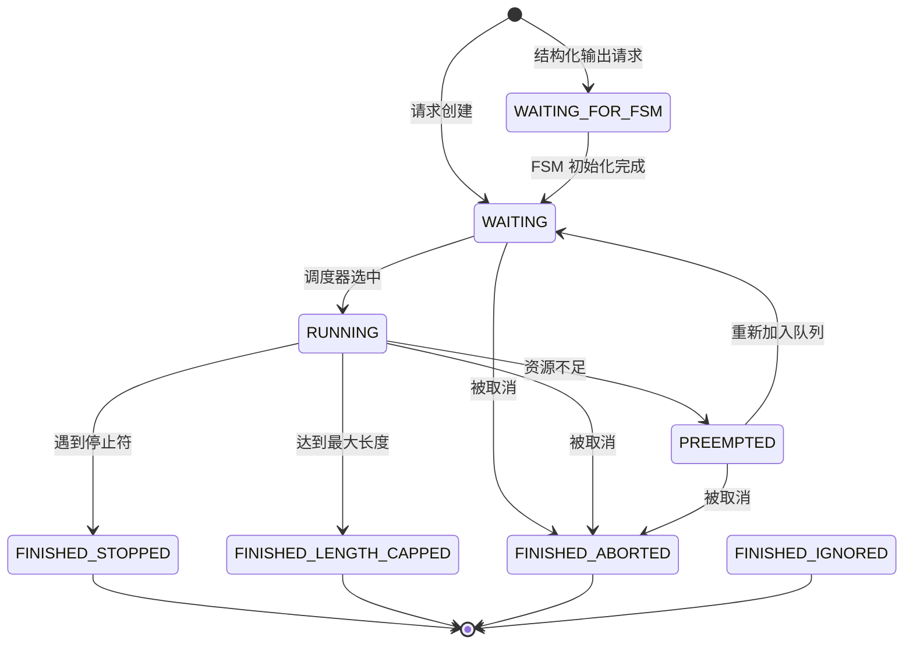
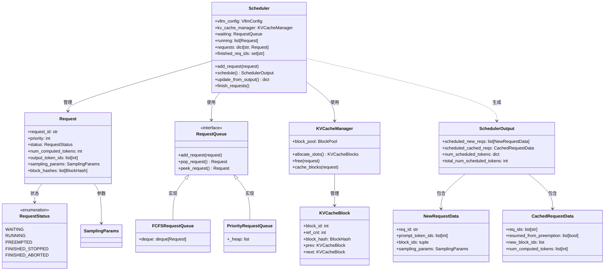
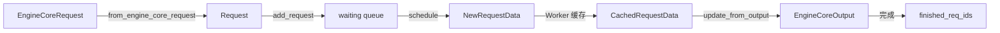
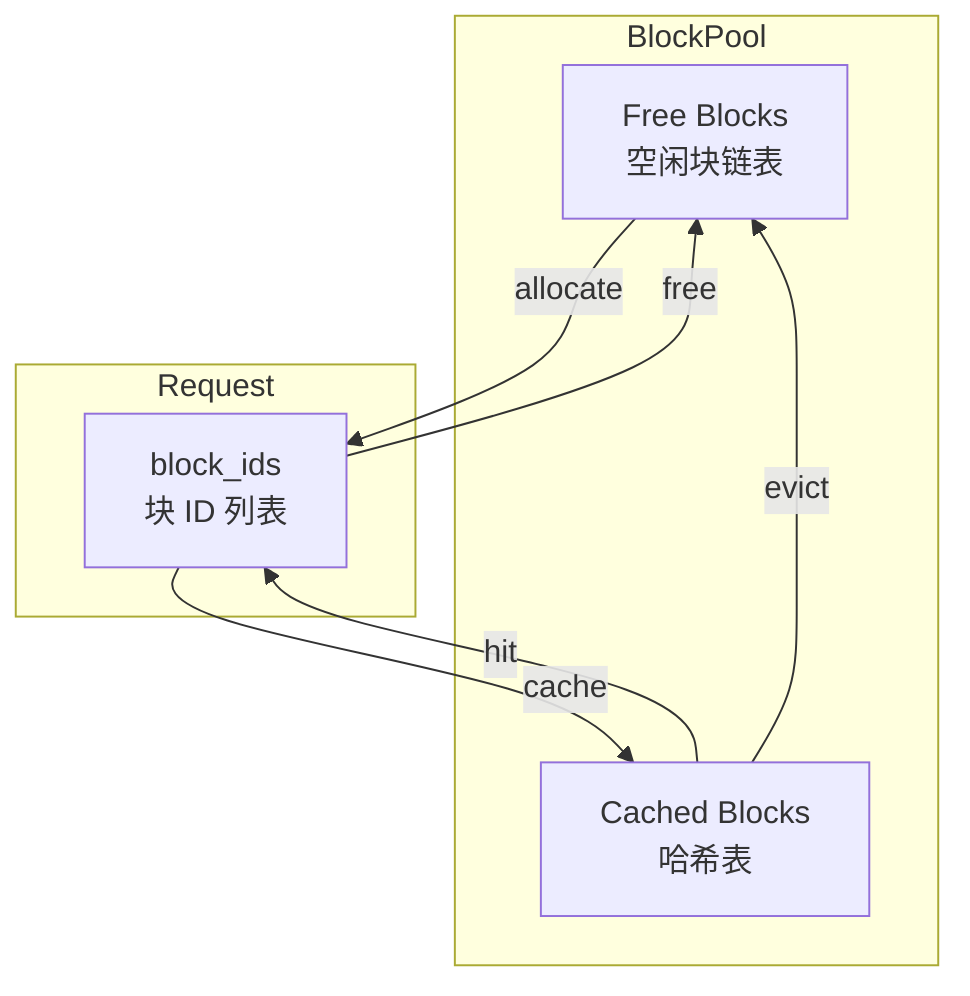

# vLLM-12-Scheduler模块-数据结构

## 核心数据结构

### 1. Request（请求对象）

`Request` 是调度器管理的核心实体，表示一个推理请求。

```python
class Request:
    # === 标识信息 ===
    request_id: str                    # 全局唯一标识
    client_index: int                  # 客户端索引（多客户端场景）
    priority: int                      # 优先级，默认 0（越小越高）
    
    # === 输入数据 ===
    prompt_token_ids: Optional[list[int]]    # Prompt token IDs
    prompt_embeds: Optional[torch.Tensor]    # Prompt embeddings（Embedding 输入）
    mm_features: list[MultiModalFeatureSpec] # 多模态特征（图像/视频/音频）
    
    # === 参数配置 ===
    sampling_params: Optional[SamplingParams]  # 采样参数（生成任务）
    pooling_params: Optional[PoolingParams]    # Pooling 参数（Embedding 任务）
    eos_token_id: Optional[int]                # 结束 token ID
    lora_request: Optional[LoRARequest]        # LoRA 适配器
    
    # === 状态信息 ===
    status: RequestStatus              # 请求状态（枚举）
    arrival_time: float                # 到达时间戳
    num_computed_tokens: int           # 已计算的 token 数
    num_preemptions: int               # 被抢占次数
    num_output_placeholders: int       # 输出占位符数（异步调度）
    
    # === 输出数据 ===
    _output_token_ids: list[int]       # 已生成的 token IDs（私有）
    _all_token_ids: list[int]          # 所有 token IDs（prompt + output）
    output_token_ids: ConstantList     # 只读视图
    all_token_ids: ConstantList        # 只读视图
    
    # === 投机解码 ===
    spec_token_ids: list[int]          # 投机生成的 token
    
    # === 缓存相关 ===
    cache_salt: Optional[str]          # 缓存盐值
    block_hashes: list[BlockHash]      # 块哈希（Prefix Caching）
    num_cached_tokens: int             # 前缀缓存命中的 token 数
    
    # === 多模态 ===
    num_encoder_inputs: int            # 编码器输入数量
    has_encoder_inputs: bool           # 是否有编码器输入
    
    # === 其他 ===
    trace_headers: Optional[dict]      # 追踪头（OpenTelemetry）
    stop_reason: Union[int, str, None] # 停止原因
    max_tokens: int                    # 最大生成 token 数
```

**字段说明**：

| 字段 | 类型 | 用途 | 更新时机 |
|------|------|------|---------|
| status | RequestStatus | 跟踪请求生命周期 | 状态转换时 |
| num_computed_tokens | int | 已计算的 token 数 | 每个 step 后 |
| num_preemptions | int | 被抢占次数 | 抢占时递增 |
| block_hashes | list[BlockHash] | Prefix Caching 查找 | 初始化时计算 |
| output_token_ids | ConstantList | 只读输出 token 列表 | 每个 step 后 |

### 2. RequestStatus（请求状态）

```python
class RequestStatus(enum.Enum):
    WAITING = enum.auto()              # 等待调度
    WAITING_FOR_FSM = enum.auto()      # 等待 FSM 初始化（结构化输出）
    RUNNING = enum.auto()              # 正在运行
    PREEMPTED = enum.auto()            # 被抢占
    FINISHED_STOPPED = enum.auto()     # 完成（遇到停止符）
    FINISHED_LENGTH_CAPPED = enum.auto()  # 完成（达到最大长度）
    FINISHED_ABORTED = enum.auto()     # 完成（被取消）
    FINISHED_IGNORED = enum.auto()     # 完成（被忽略）
```

**状态转换图**：



### 3. SchedulerOutput（调度输出）

调度器每个 step 的输出，描述本次要处理的请求。

```python
@dataclass
class SchedulerOutput:
    # === 新调度的请求 ===
    scheduled_new_reqs: list[NewRequestData]
    
    # === 已缓存的请求 ===
    scheduled_cached_reqs: CachedRequestData
    
    # === Token 分配 ===
    num_scheduled_tokens: dict[str, int]     # req_id -> num_tokens
    total_num_scheduled_tokens: int          # 总 token 数
    
    # === 投机解码 ===
    scheduled_spec_decode_tokens: dict[str, list[int]]
    
    # === 编码器输入（多模态） ===
    scheduled_encoder_inputs: dict[str, list[int]]
    
    # === Cascade Attention ===
    num_common_prefix_blocks: tuple[int, ...]
    
    # === 其他元数据 ===
    finished_req_ids: set[str]               # 本 step 完成的请求
    preempted_req_ids: set[str]              # 本 step 抢占的请求
    # （此处省略其他字段）
```

### 4. NewRequestData（新请求数据）

首次调度的请求的完整数据（需要发送给 Worker）。

```python
@dataclass
class NewRequestData:
    req_id: str
    prompt_token_ids: Optional[list[int]]
    mm_features: list[MultiModalFeatureSpec]
    sampling_params: Optional[SamplingParams]
    pooling_params: Optional[PoolingParams]
    block_ids: tuple[list[int], ...]         # 分配的物理块 ID
    num_computed_tokens: int
    lora_request: Optional[LoRARequest]
    prompt_embeds: Optional[torch.Tensor]
```

### 5. CachedRequestData（缓存请求数据）

已调度过的请求的增量数据（只发送变化部分）。

```python
@dataclass
class CachedRequestData:
    req_ids: list[str]
    resumed_from_preemption: list[bool]      # 是否从抢占恢复
    new_token_ids: list[list[int]]           # 新 token（Pipeline Parallelism）
    new_block_ids: list[Optional[tuple[list[int], ...]]]  # 新分配的块
    num_computed_tokens: list[int]
    num_output_tokens: list[int]
```

### 6. KVCacheBlock（KV 缓存块）

物理 KV 缓存块，是内存分配的基本单位。

```python
class KVCacheBlock:
    block_id: int                      # 物理块 ID
    ref_cnt: int                       # 引用计数
    block_hash: Optional[BlockHash]    # 块哈希（Prefix Caching）
    is_null: bool                      # 是否为空块（占位符）
    
    # === 链表指针（LRU） ===
    prev: Optional[KVCacheBlock]       # 前驱节点
    next: Optional[KVCacheBlock]       # 后继节点
```

**引用计数说明**：
- `ref_cnt = 0`：空闲块，可被分配或驱逐
- `ref_cnt = 1`：单个请求独占
- `ref_cnt > 1`：多个请求共享（Prefix Caching）

### 7. RequestQueue（请求队列）

抽象基类，定义请求队列接口。

```python
class RequestQueue(ABC):
    def add_request(self, request: Request) -> None: ...
    def pop_request(self) -> Request: ...
    def peek_request(self) -> Request: ...
    def prepend_request(self, request: Request) -> None: ...
    def remove_request(self, request: Request) -> None: ...
    def __len__(self) -> int: ...
    def __iter__(self) -> Iterator[Request]: ...
```

#### 7.1 FCFSRequestQueue（FCFS 队列）

```python
class FCFSRequestQueue(deque[Request], RequestQueue):
    """先来先服务队列（基于 deque）"""
    
    def add_request(self, request):
        self.append(request)          # O(1)
    
    def pop_request(self):
        return self.popleft()          # O(1)
    
    def peek_request(self):
        return self[0]                 # O(1)
```

#### 7.2 PriorityRequestQueue（优先级队列）

```python
class PriorityRequestQueue(RequestQueue):
    """优先级队列（基于堆）"""
    
    _heap: list[tuple[int, float, Request]]  # (priority, arrival_time, request)
    
    def add_request(self, request):
        heapq.heappush(self._heap, 
            (request.priority, request.arrival_time, request))  # O(log n)
    
    def pop_request(self):
        _, _, request = heapq.heappop(self._heap)  # O(log n)
        return request
```

## 类图



## 数据结构关系

### Request 生命周期中的数据流



### KV 缓存块管理



## 字段映射与版本演进

### Request 字段映射

| 内部字段 | 外部字段（EngineCoreRequest） | 说明 |
|---------|------------------------------|------|
| request_id | request_id | 一对一映射 |
| prompt_token_ids | prompt_token_ids | 一对一映射 |
| sampling_params | sampling_params | 一对一映射 |
| status | - | 内部状态，不暴露 |
| num_computed_tokens | - | 动态计算 |

### 版本演进

**V0 → V1 变化**：
- 新增：`num_output_placeholders`（异步调度）
- 新增：`spec_token_ids`（投机解码）
- 新增：`block_hashes`（Prefix Caching）
- 移除：`logical_token_blocks`（改用 KVCacheBlocks）

**向后兼容**：
- V0 API 通过适配器层转换为 V1 Request
- 旧字段保留但标记为 deprecated

## 性能考虑

### 内存占用

**单个 Request 对象**：
- 固定部分：~200 bytes
- 可变部分：
  - `prompt_token_ids`：4 × len(prompt) bytes
  - `output_token_ids`：4 × len(output) bytes
  - `block_hashes`：8 × num_blocks bytes

**典型场景**（1000 requests）：
- Prompt 平均长度：500 tokens
- 输出平均长度：100 tokens
- 内存占用：~(200 + 4×500 + 4×100 + 8×40) × 1000 ≈ 2.7 MB

### 访问模式

- **热路径**：`status`、`num_computed_tokens`、`output_token_ids`
- **冷路径**：`trace_headers`、`cache_salt`

## 总结

Scheduler 模块的数据结构设计精简高效，核心是 `Request` 对象和 `SchedulerOutput`。通过引用计数管理 KV 缓存块，通过状态机跟踪请求生命周期。队列设计支持 FCFS 和 Priority 两种策略，满足不同场景需求。
