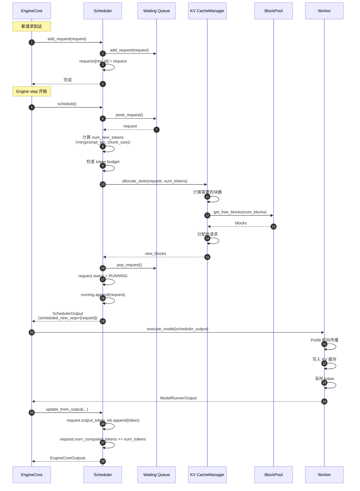
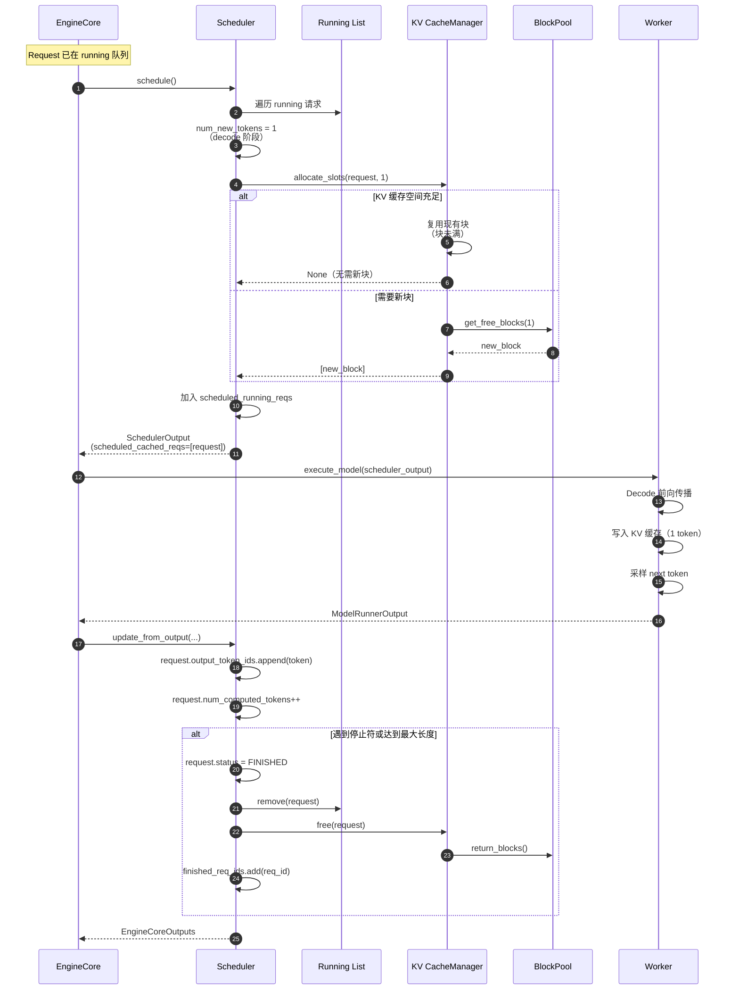
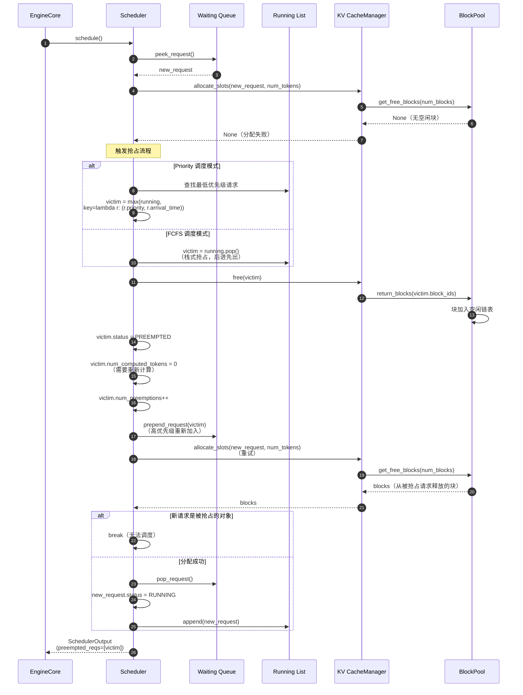
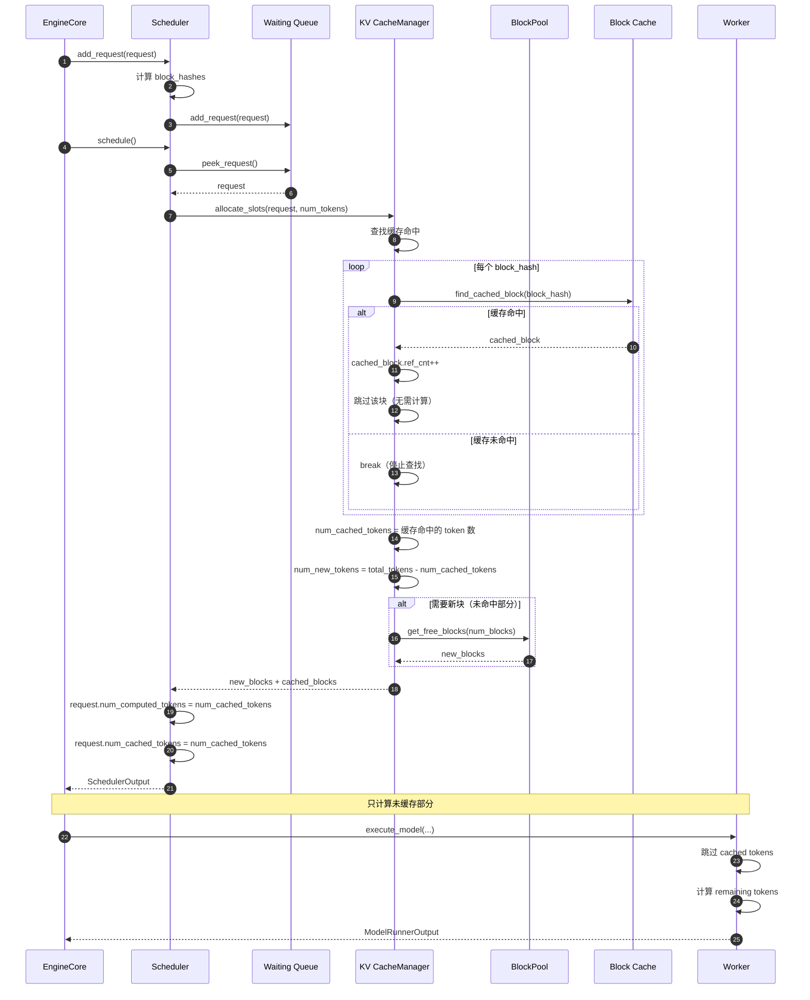
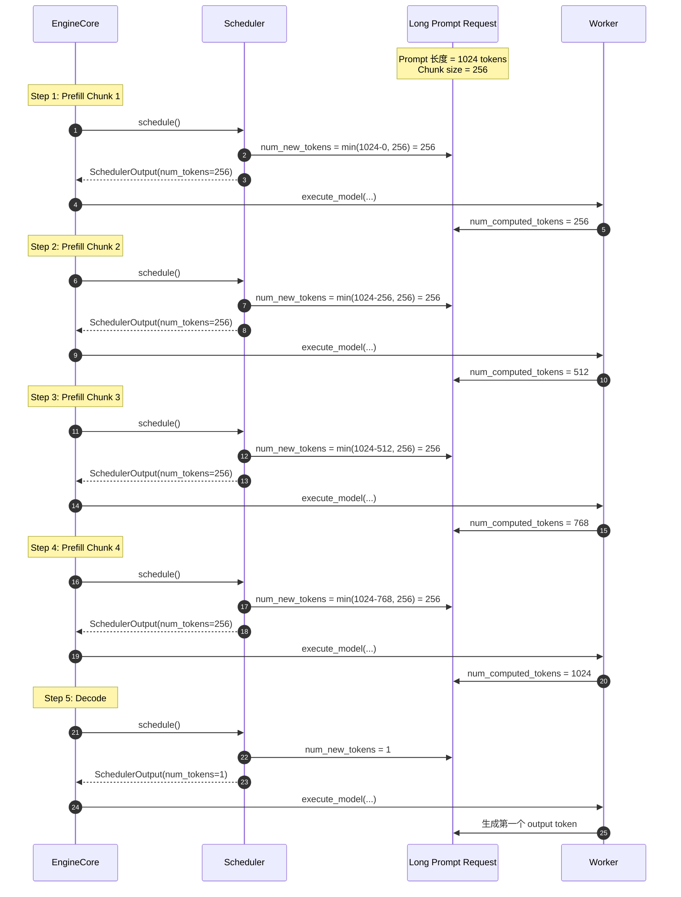

# vLLM-12-Scheduler模块-时序图

## 典型场景时序图

本文档提供 Scheduler 模块在不同场景下的详细时序图。

## 场景 1：新请求调度（Prefill）

### 场景描述
新请求首次进入调度器，执行 prefill 阶段（处理完整 prompt）。

### 时序图

### 关键点说明

1. **Token Budget 检查**（步骤 7）：
   - 确保批次大小不超过 `max_num_batched_tokens`
   - 如果 budget 不足，停止调度新请求

2. **Chunked Prefill**（步骤 6）：
   - 长 prompt 分块处理：`num_new_tokens = min(prompt_len - num_computed, chunk_size)`
   - 首次调度可能只处理部分 prompt

3. **块分配**（步骤 8-12）：
   - 按块大小（默认 16）计算需要的块数
   - 从 BlockPool 获取空闲块
   - 分配失败会触发抢占（见场景 3）

4. **状态转换**（步骤 14-15）：
   - 请求从 `WAITING` → `RUNNING`
   - 从等待队列移至运行列表

---

## 场景 2：持续解码（Decode）

### 场景描述
请求在 prefill 后进入 decode 阶段，每个 step 生成一个 token。

### 时序图

### 关键点说明

1. **Decode 特点**（步骤 3）：
   - 每次只生成一个 token：`num_new_tokens = 1`
   - 批次可以包含多个 decode 请求

2. **块复用**（步骤 4-9）：
   - 如果当前块未满（< 16 tokens），直接复用
   - 块满时，分配新块

3. **请求完成判断**（步骤 17-22）：
   - 遇到 EOS token：`token_id == eos_token_id`
   - 达到最大长度：`len(output_token_ids) >= max_tokens`
   - 资源释放：KV 块返回 BlockPool

---

## 场景 3：内存不足触发抢占

### 场景描述
新请求或 running 请求需要分配 KV 块，但内存不足，触发抢占。

### 时序图

### 关键点说明

1. **抢占触发条件**（步骤 4-6）：
   - BlockPool 无空闲块
   - `allocate_slots` 返回 `None`

2. **抢占对象选择**（步骤 8-12）：
   - **Priority 模式**：选择优先级最低、到达时间最晚的请求
   - **FCFS 模式**：选择最后加入 running 的请求（栈式抢占）

3. **资源释放**（步骤 13-15）：
   - 释放被抢占请求的所有 KV 块
   - 块返回 BlockPool 空闲链表

4. **状态重置**（步骤 16-18）：
   - 状态变为 `PREEMPTED`
   - `num_computed_tokens = 0`：需要重新 prefill
   - 统计抢占次数

5. **重新排队**（步骤 19）：
   - 使用 `prepend_request` 加入队首（高优先级）
   - 下次调度优先处理

6. **自抢占检测**（步骤 24-25）：
   - 如果新请求本身被抢占，停止调度
   - 避免死循环

---

## 场景 4：Prefix Caching 命中

### 场景描述
新请求的 prompt 与之前请求有公共前缀，命中 Prefix Cache。

### 时序图

### 关键点说明

1. **Block Hash 计算**（步骤 2）：
   - 在请求创建时计算 `block_hashes`
   - 每个块 hash 基于 16 个 token IDs

2. **缓存查找**（步骤 8-14）：
   - 从前往后查找缓存块
   - 一旦未命中，停止查找（前缀缓存特性）

3. **引用计数**（步骤 11）：
   - 缓存命中时，`ref_cnt++`
   - 防止共享块被驱逐

4. **跳过计算**（步骤 18）：
   - `num_computed_tokens` 直接设为 `num_cached_tokens`
   - Worker 跳过已缓存部分的前向传播

5. **性能收益**：
   - TTFT 降低：40-60%（缓存命中时）
   - 吞吐提升：20-40%（减少计算量）

---

## 场景 5：Chunked Prefill

### 场景描述
长 prompt 分多次处理，与 decode 请求交错执行。

### 时序图

### 关键点说明

1. **Chunk Size**（步骤 2, 5, 8, 11）：
   - 配置项：`max_num_batched_tokens` / `max_num_seqs`
   - 典型值：256-512 tokens

2. **渐进式处理**：
   - 每个 step 处理固定大小的 chunk
   - 允许 prefill 和 decode 交错执行

3. **延迟方差降低**：
   - 避免长 prompt 阻塞其他请求
   - P99 延迟显著降低

4. **状态跟踪**：
   - `num_computed_tokens` 逐步增加
   - 直到 `num_computed_tokens == num_prompt_tokens`

---

## 时序图总结

| 场景 | 关键特点 | 性能影响 |
|------|---------|---------|
| 新请求调度 | 首次 prefill，块分配 | TTFT 高（需计算完整 prompt） |
| 持续解码 | 每次生成 1 token | TPOT 低（内存带宽瓶颈） |
| 抢占 | 资源不足，释放低优先级请求 | 被抢占请求重新排队 |
| Prefix Caching | 跳过已缓存的 token | TTFT 降低 40-60% |
| Chunked Prefill | 长 prompt 分块处理 | 延迟方差降低，吞吐提升 |

所有场景都遵循统一的调度循环：`schedule()` → `execute_model()` → `update_from_output()`，保证了系统的简洁性和可维护性。
