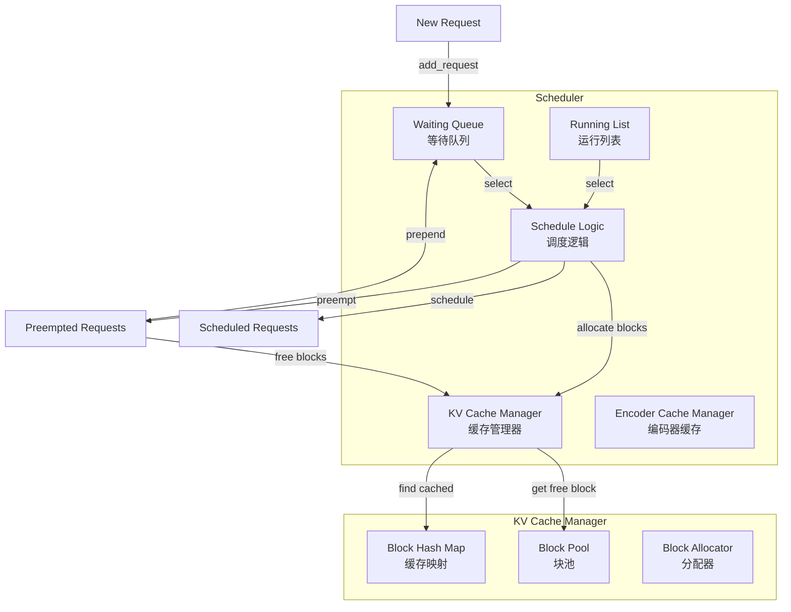
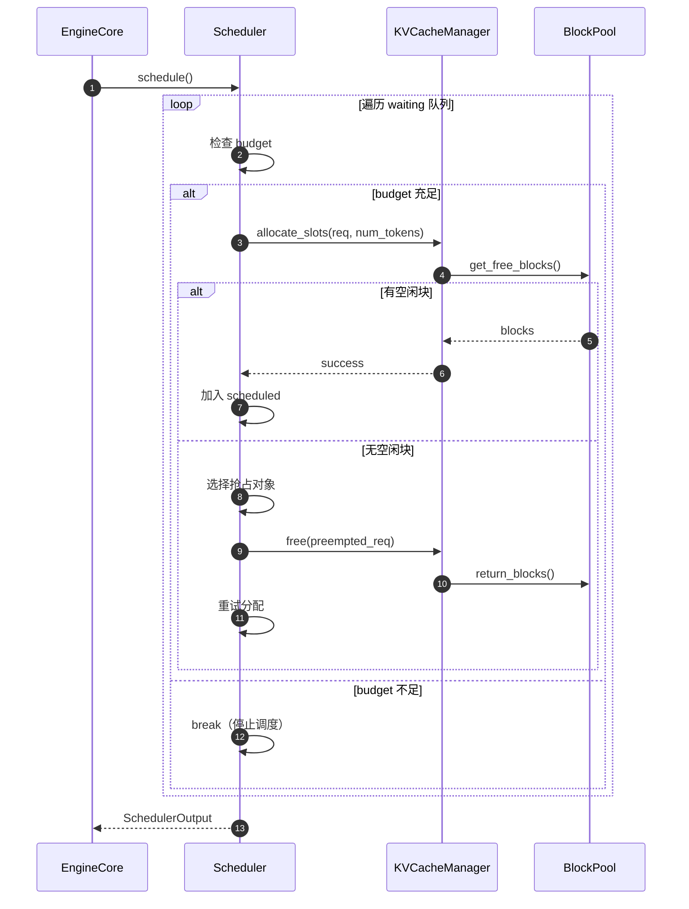

# vLLM-12-Scheduler模块-概览

## 模块职责

Scheduler（调度器）是 vLLM V1 架构的核心组件，负责：

- 请求调度：决定每个 step 处理哪些请求
- 资源分配：为请求分配 KV 缓存块
- 抢占策略：在资源不足时选择要抢占的请求
- 状态管理：维护请求状态（waiting、running、finished）
- 指标收集：记录调度统计信息

## 核心调度策略

### FCFS（先来先服务）
- 按到达时间顺序处理请求
- 公平性好，但可能阻塞高优先级请求
- 适用于无优先级区分的场景

### Priority（优先级调度）
- 按 (priority, arrival_time) 排序
- 低优先级请求可被抢占
- 适用于需要 SLA 保证的场景

## KV 缓存管理

### 块分配机制
- 块大小：16 tokens（默认）
- 预分配策略：延迟分配，按需增长
- Copy-on-Write：支持前缀共享

### 抢占策略
```python
# 优先级抢占：选择优先级最低、到达时间最晚的请求
preempted_req = max(
    self.running,
    key=lambda r: (r.priority, r.arrival_time),
)
```

### Prefix Caching
- 基于哈希的缓存查找
- LRU 驱逐策略
- 跨请求共享，显著降低 TTFT

## 架构图



### 架构说明

#### 1. 调度算法

调度器采用统一的 token-centric 调度策略：

**核心思想**：
- 每个请求有 `num_computed_tokens`（已计算的 token 数）和 `num_tokens_with_spec`（包含投机 token 的总数）
- 调度器目标：让 `num_computed_tokens` 追赶 `num_tokens_with_spec`

**覆盖场景**：
- Chunked Prefill：长 prompt 分块处理
- Prefix Caching：跳过已缓存的 token
- Speculative Decoding：处理投机生成的 token
- 常规 Decode：每次生成一个 token

#### 2. 调度流程



#### 3. 关键数据结构

**Request**：
```python
class Request:
    request_id: str              # 唯一标识
    arrival_time: float          # 到达时间
    priority: int                # 优先级（越小越高）
    num_computed_tokens: int     # 已计算 token 数
    num_tokens_with_spec: int    # 总 token 数（含投机）
    status: RequestStatus        # waiting/running/finished/preempted
    kv_blocks: list[KVCacheBlock]  # 分配的 KV 块
```

**SchedulerOutput**：
```python
class SchedulerOutput:
    scheduled_new_reqs: list[Request]      # 新调度的请求
    scheduled_resumed_reqs: list[Request]  # 恢复的请求
    scheduled_running_reqs: list[Request]  # 继续运行的请求
    preempted_reqs: list[Request]          # 被抢占的请求
    num_scheduled_tokens: dict[str, int]   # 每个请求的 token 数
    req_to_new_blocks: dict[str, KVCacheBlocks]  # 新分配的块
```

#### 4. 性能优化

**批次构建优化**：
- Token budget 限制：避免单批次过大导致 OOM
- 公平性保证：FCFS 防止饥饿
- 优先级保证：Priority 模式支持 SLA

**内存优化**：
- Lazy allocation：按需分配块
- Prefix caching：跨请求共享
- Block pooling：避免频繁分配/释放

**调度开销优化**：
- O(n) 扫描 waiting 队列（n = 等待请求数）
- 堆排序优先队列（Priority 模式）
- 增量更新，避免全量重建

## 核心代码

### 调度主循环

```python
def schedule(self) -> SchedulerOutput:
    scheduled_new_reqs = []
    scheduled_running_reqs = []
    preempted_reqs = []
    token_budget = self.max_num_scheduled_tokens
    
    # 首先调度 running 请求
    for request in self.running:
        num_new_tokens = request.num_tokens_with_spec - request.num_computed_tokens
        
        if token_budget < num_new_tokens:
            break  # budget 不足
        
        # 尝试分配 KV 块
        new_blocks = self.kv_cache_manager.allocate_slots(
            request, num_new_tokens, ...)
        
        if new_blocks is None:
            # 分配失败，需要抢占
            self._preempt_lowest_priority(preempted_reqs)
            continue
        
        # 调度成功
        scheduled_running_reqs.append(request)
        token_budget -= num_new_tokens
    
    # 然后调度 waiting 请求
    while not self.waiting.is_empty() and token_budget > 0:
        request = self.waiting.peek_request()
        num_new_tokens = min(request.num_prompt_tokens, self.max_chunk_size)
        
        if token_budget < num_new_tokens:
            break
        
        # 分配 KV 块
        new_blocks = self.kv_cache_manager.allocate_slots(request, num_new_tokens)
        if new_blocks is None:
            break  # 无法分配，停止调度新请求
        
        self.waiting.pop_request()
        scheduled_new_reqs.append(request)
        token_budget -= num_new_tokens
    
    return SchedulerOutput(
        scheduled_new_reqs=scheduled_new_reqs,
        scheduled_running_reqs=scheduled_running_reqs,
        preempted_reqs=preempted_reqs,
        ...
    )
```

### 抢占逻辑

```python
def _preempt_lowest_priority(self, preempted_reqs):
    if self.policy == SchedulingPolicy.PRIORITY:
        # 选择优先级最低、到达时间最晚的请求
        victim = max(self.running, key=lambda r: (r.priority, r.arrival_time))
    else:
        # FCFS 模式：选择最后加入的请求（栈式抢占）
        victim = self.running.pop()
    
    # 释放 KV 块
    self.kv_cache_manager.free(victim)
    self.encoder_cache_manager.free(victim)
    
    # 更新状态
    victim.status = RequestStatus.PREEMPTED
    victim.num_computed_tokens = 0
    victim.num_preemptions += 1
    
    # 重新加入等待队列（高优先级）
    self.waiting.prepend_request(victim)
    preempted_reqs.append(victim)
```

## 边界与异常

### 并发限制
- 最大运行请求数：`max_num_seqs`（默认 256）
- 最大批次 token 数：`max_num_batched_tokens`（默认 8192）

### 超时处理
- 无显式超时机制（由上层控制）
- 长时间等待的请求会被优先调度（FCFS）

### 错误处理
- 块分配失败：触发抢占或拒绝新请求
- 抢占失败（所有请求优先级相同）：停止调度新请求
- 状态不一致：抛出 AssertionError，需重启

## 总结

Scheduler 是 vLLM V1 的调度核心，通过统一的 token-centric 策略支持 chunked prefill、prefix caching、speculative decoding 等高级特性。KV 缓存管理采用 PagedAttention 机制，实现了高效的内存利用。抢占策略保证了多租户场景下的公平性和 SLA。
