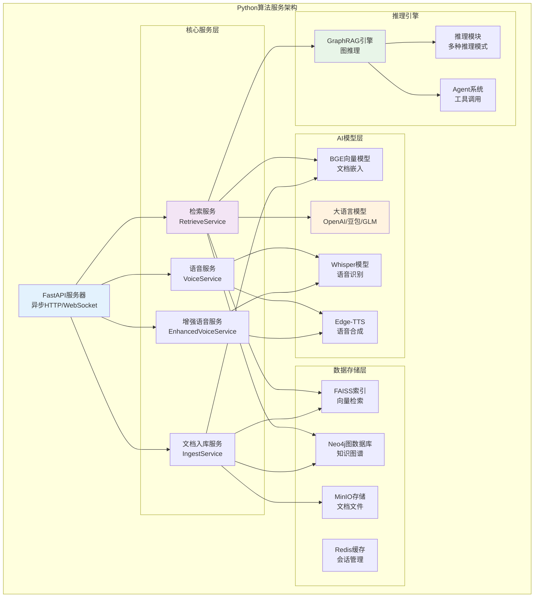
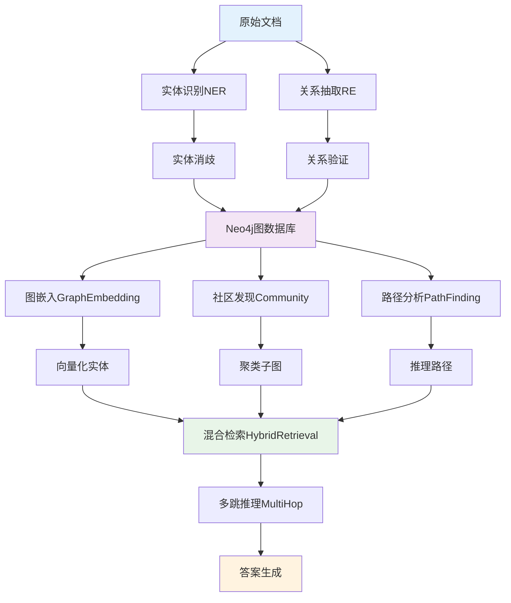
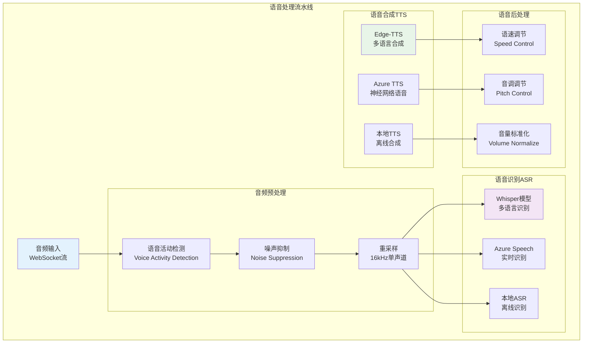

# Python算法服务详细分析

## 📋 模块概述

Python算法服务是VoiceHelper系统的核心AI引擎，负责RAG检索、GraphRAG推理、语音处理和智能对话生成。基于FastAPI异步框架构建，集成多种AI模型和向量数据库，提供高性能的智能算法服务。

## 🏗️ 服务架构图



## 🚀 核心API详细分析

### 1. 文档入库API

#### 入口函数详细解析

**文件位置**: `algo/app/main.py:ingest_documents`

```python
@app.post("/ingest", response_model=IngestResponse)
async def ingest_documents(
    request: IngestRequest,
    background_tasks: BackgroundTasks,
    http_request: Request
):
    """
    文档入库接口 - 处理文档上传、解析、向量化和索引构建
    
    Args:
        request (IngestRequest): 入库请求对象
            - files: List[IngestFile] 文档文件列表
            - collection_name: str 集合名称，默认'default'
            - chunk_size: int 分块大小，默认1000字符
            - chunk_overlap: int 分块重叠，默认200字符
            - metadata: dict 自定义元数据
            
        background_tasks (BackgroundTasks): FastAPI后台任务管理器
        http_request (Request): HTTP请求对象，用于获取客户端信息
    
    Returns:
        IngestResponse: 入库响应对象
            - task_id: str 任务ID，用于查询处理状态
            - status: str 初始状态 'pending'
            - message: str 响应消息
    
    Raises:
        VoiceHelperError: 自定义业务异常
            - RAG_INVALID_QUERY: 无效的请求参数
            - RAG_INDEXING_FAILED: 索引构建失败
    
    处理流程:
        1. 参数验证 - 检查文件列表和格式
        2. 任务创建 - 生成唯一任务ID
        3. 后台处理 - 异步执行入库流程
        4. 状态响应 - 返回任务ID供客户端查询
    """
    start_time = time.time()
    
    # === 第一阶段：请求日志和验证 ===
    
    # 1.1 记录业务日志
    logger.business("文档入库请求", context={
        "files_count": len(request.files) if request.files else 0,
        "collection_name": getattr(request, 'collection_name', 'default'),
        "client_ip": http_request.client.host if http_request.client else "unknown",
    })
    
    try:
        # 1.2 验证必要参数
        if not request.files or len(request.files) == 0:
            raise VoiceHelperError(
                ErrorCode.RAG_INVALID_QUERY, 
                "没有提供文档文件"
            )
        
        # 1.3 验证文件格式和大小
        total_size = 0
        for file in request.files:
            if not file.filename or not file.content:
                raise VoiceHelperError(
                    ErrorCode.RAG_INVALID_QUERY,
                    f"文件 {file.filename} 内容为空"
                )
            
            # 检查文件类型
            allowed_types = ['.txt', '.pdf', '.docx', '.md', '.html']
            if not any(file.filename.lower().endswith(ext) for ext in allowed_types):
                raise VoiceHelperError(
                    ErrorCode.RAG_INVALID_QUERY,
                    f"不支持的文件类型: {file.filename}"
                )
            
            total_size += len(file.content.encode('utf-8') if isinstance(file.content, str) else file.content)
        
        # 1.4 检查总文件大小限制 (100MB)
        if total_size > 100 * 1024 * 1024:
            raise VoiceHelperError(
                ErrorCode.RAG_INVALID_QUERY,
                f"文件总大小超过限制: {total_size / 1024 / 1024:.2f}MB"
            )
        
        # === 第二阶段：任务创建和调度 ===
        
        # 2.1 生成唯一任务ID
        task_id = ingest_service.generate_task_id()
        
        # 2.2 记录任务创建日志
        logger.info(f"生成入库任务ID: {task_id}", context={
            "task_id": task_id,
            "files_count": len(request.files),
            "total_size_mb": total_size / 1024 / 1024,
        })
        
        # 2.3 将入库任务添加到后台队列
        background_tasks.add_task(
            ingest_service.process_ingest_task,
            task_id,
            request
        )
        
        # === 第三阶段：性能记录和响应 ===
        
        # 3.1 记录性能指标
        duration_ms = (time.time() - start_time) * 1000
        logger.performance("文档入库任务创建", duration_ms, context={
            "task_id": task_id,
            "files_count": len(request.files),
        })
        
        # 3.2 返回任务响应
        return IngestResponse(
            task_id=task_id,
            status="pending",
            message=f"已创建入库任务，正在处理 {len(request.files)} 个文件"
        )
    
    except VoiceHelperError:
        # 重新抛出业务异常
        raise
    except Exception as e:
        # 处理未预期异常
        logger.exception("文档入库失败", e, context={
            "files_count": len(request.files) if request.files else 0,
        })
        raise VoiceHelperError(
            ErrorCode.RAG_INDEXING_FAILED, 
            f"文档入库失败: {str(e)}"
        )
```

#### 入库服务核心实现

**文件位置**: `algo/core/ingest.py:IngestService`

```python
class IngestService:
    """
    文档入库服务 - 处理文档解析、向量化、索引构建和存储
    
    主要功能:
    - 文档解析: 支持多种格式文档的文本提取
    - 智能分块: 基于语义的自适应文档分块
    - 向量化: BGE模型生成高质量中文向量
    - 索引构建: FAISS高性能向量索引
    - 图谱构建: 实体抽取和关系识别
    - 异步处理: 后台任务队列管理
    """
    
    def __init__(self):
        """初始化入库服务及其依赖组件"""
        self.text_splitter = self._init_text_splitter()      # 文本分块器
        self.embedding_service = self._init_embedding()       # 向量化服务
        self.vector_store = self._init_vector_store()        # 向量存储
        self.graph_store = self._init_graph_store()          # 图数据库
        self.document_parser = self._init_parser()           # 文档解析器
        self.task_manager = self._init_task_manager()        # 任务管理器
        
        # 异步任务队列和状态管理
        self.task_status: Dict[str, TaskStatus] = {}
        self.processing_queue = asyncio.Queue(maxsize=100)   # 限制队列大小
        self.worker_pool = []                                # 工作线程池
        
        # 启动后台工作线程
        self._start_workers()
    
    async def process_ingest_task(self, task_id: str, request: IngestRequest):
        """
        处理入库任务的主要流程
        
        Args:
            task_id (str): 任务唯一标识符
            request (IngestRequest): 入库请求对象
            
        处理步骤:
            1. 任务初始化 - 设置状态和进度跟踪
            2. 文档解析 - 提取文本内容和元数据
            3. 内容分块 - 智能分割长文档
            4. 向量化 - 生成文档embeddings
            5. 索引构建 - 更新FAISS索引
            6. 图谱构建 - 抽取实体和关系
            7. 状态更新 - 更新任务完成状态
        """
        start_time = time.time()
        
        try:
            # === 第一阶段：任务初始化 ===
            
            # 1.1 初始化任务状态
            self.task_status[task_id] = TaskStatus(
                task_id=task_id,
                status="processing",
                progress=0,
                total_files=len(request.files),
                processed_files=0,
                created_at=datetime.now(),
                updated_at=datetime.now()
            )
            
            logger.info(f"开始处理入库任务: {task_id}", context={
                "task_id": task_id,
                "files_count": len(request.files),
                "collection": getattr(request, 'collection_name', 'default')
            })
            
            # 1.2 创建文档集合
            collection_name = getattr(request, 'collection_name', 'default')
            await self._ensure_collection_exists(collection_name)
            
            # === 第二阶段：批量文档处理 ===
            
            all_documents = []
            all_chunks = []
            processed_files = 0
            
            for file_index, file in enumerate(request.files):
                try:
                    # 2.1 更新处理进度
                    progress = int((file_index / len(request.files)) * 100)
                    await self._update_task_progress(task_id, progress, f"处理文件: {file.filename}")
                    
                    # 2.2 解析单个文档
                    document = await self._parse_single_document(file, collection_name, request.metadata)
                    
                    # 2.3 文档分块处理
                    chunks = await self._split_document_into_chunks(
                        document,
                        chunk_size=getattr(request, 'chunk_size', 1000),
                        chunk_overlap=getattr(request, 'chunk_overlap', 200)
                    )
                    
                    # 2.4 向量化处理
                    vectorized_chunks = await self._vectorize_chunks(chunks)
                    
                    all_documents.append(document)
                    all_chunks.extend(vectorized_chunks)
                    processed_files += 1
                    
                    # 2.5 记录文件处理完成
                    logger.info(f"文件处理完成: {file.filename}", context={
                        "task_id": task_id,
                        "file_index": file_index + 1,
                        "chunks_count": len(chunks),
                        "progress": f"{processed_files}/{len(request.files)}"
                    })
                    
                except Exception as e:
                    logger.error(f"文件处理失败: {file.filename}", context={
                        "task_id": task_id,
                        "error": str(e),
                        "file_index": file_index
                    })
                    # 继续处理其他文件，不中断整个任务
                    continue
            
            # === 第三阶段：向量索引构建 ===
            
            if all_chunks:
                await self._update_task_progress(task_id, 80, "构建向量索引...")
                
                # 3.1 批量更新FAISS索引
                index_update_result = await self._update_vector_index(all_chunks, collection_name)
                
                logger.info("向量索引构建完成", context={
                    "task_id": task_id,
                    "chunks_indexed": len(all_chunks),
                    "index_size": index_update_result.get("total_vectors", 0)
                })
            
            # === 第四阶段：知识图谱构建 ===
            
            if all_documents:
                await self._update_task_progress(task_id, 90, "构建知识图谱...")
                
                # 4.1 实体抽取和关系识别
                graph_result = await self._build_knowledge_graph(all_documents, collection_name)
                
                logger.info("知识图谱构建完成", context={
                    "task_id": task_id,
                    "entities_count": graph_result.get("entities_count", 0),
                    "relations_count": graph_result.get("relations_count", 0)
                })
            
            # === 第五阶段：任务完成处理 ===
            
            # 5.1 更新任务状态为成功
            total_duration = time.time() - start_time
            
            self.task_status[task_id].status = "completed"
            self.task_status[task_id].progress = 100
            self.task_status[task_id].processed_files = processed_files
            self.task_status[task_id].completed_at = datetime.now()
            self.task_status[task_id].duration_seconds = total_duration
            self.task_status[task_id].result = {
                "documents_processed": len(all_documents),
                "chunks_created": len(all_chunks),
                "vectors_indexed": len(all_chunks),
                "entities_extracted": graph_result.get("entities_count", 0) if all_documents else 0,
                "processing_time_seconds": total_duration
            }
            
            # 5.2 记录任务完成日志
            logger.business("文档入库任务完成", context={
                "task_id": task_id,
                "documents_processed": len(all_documents),
                "chunks_created": len(all_chunks),
                "processing_time_seconds": total_duration,
                "success_rate": f"{processed_files}/{len(request.files)}"
            })
            
        except Exception as e:
            # 异常处理：更新任务状态为失败
            logger.exception(f"入库任务失败: {task_id}", e)
            
            self.task_status[task_id].status = "failed"
            self.task_status[task_id].error = str(e)
            self.task_status[task_id].completed_at = datetime.now()
            
            raise VoiceHelperError(
                ErrorCode.RAG_INDEXING_FAILED,
                f"入库任务失败: {str(e)}"
            )
    
    async def _parse_single_document(
        self, 
        file: IngestFile, 
        collection_name: str, 
        metadata: Optional[Dict] = None
    ) -> Document:
        """
        解析单个文档文件
        
        Args:
            file (IngestFile): 待解析的文件对象
            collection_name (str): 文档集合名称
            metadata (dict): 额外的元数据
            
        Returns:
            Document: 解析后的文档对象
            
        支持格式:
            - TXT: 纯文本文件
            - PDF: PDF文档（使用PyPDF2）
            - DOCX: Word文档（使用python-docx）
            - MD: Markdown文件
            - HTML: HTML网页
        """
        try:
            # 1. 确定文件类型
            file_extension = file.filename.lower().split('.')[-1]
            
            # 2. 根据文件类型选择解析器
            if file_extension == 'txt':
                content = await self._parse_txt(file.content)
            elif file_extension == 'pdf':
                content = await self._parse_pdf(file.content)
            elif file_extension == 'docx':
                content = await self._parse_docx(file.content)
            elif file_extension == 'md':
                content = await self._parse_markdown(file.content)
            elif file_extension == 'html':
                content = await self._parse_html(file.content)
            else:
                raise ValueError(f"不支持的文件格式: {file_extension}")
            
            # 3. 内容清洗和预处理
            cleaned_content = self._clean_text_content(content)
            
            # 4. 构建文档对象
            document = Document(
                doc_id=f"{collection_name}_{file.filename}_{int(time.time())}",
                title=file.filename,
                content=cleaned_content,
                metadata={
                    "filename": file.filename,
                    "file_type": file_extension,
                    "file_size": len(file.content.encode('utf-8') if isinstance(file.content, str) else file.content),
                    "collection": collection_name,
                    "created_at": datetime.now().isoformat(),
                    "content_length": len(cleaned_content),
                    **(metadata or {})
                }
            )
            
            return document
            
        except Exception as e:
            logger.error(f"文档解析失败: {file.filename}", error=str(e))
            raise ValueError(f"文档解析失败: {str(e)}")
    
    async def _split_document_into_chunks(
        self,
        document: Document,
        chunk_size: int = 1000,
        chunk_overlap: int = 200
    ) -> List[DocumentChunk]:
        """
        智能文档分块 - 基于语义和结构的自适应分割
        
        Args:
            document (Document): 待分块的文档
            chunk_size (int): 目标分块大小（字符数）
            chunk_overlap (int): 分块重叠大小
            
        Returns:
            List[DocumentChunk]: 文档分块列表
            
        分块策略:
            1. 结构化分割: 按段落、章节等自然边界
            2. 语义保持: 确保语义完整性
            3. 大小控制: 控制分块大小在合理范围
            4. 重叠设计: 保持上下文连贯性
        """
        try:
            chunks = []
            content = document.content
            
            # 1. 预处理：按自然边界分割
            paragraphs = self._split_by_paragraphs(content)
            
            current_chunk = ""
            current_start = 0
            chunk_index = 0
            
            for para in paragraphs:
                # 2. 检查当前分块大小
                if len(current_chunk) + len(para) <= chunk_size:
                    # 可以加入当前分块
                    current_chunk += para + "\n\n"
                else:
                    # 需要创建新分块
                    if current_chunk:
                        chunk = DocumentChunk(
                            chunk_id=f"{document.doc_id}_chunk_{chunk_index}",
                            doc_id=document.doc_id,
                            content=current_chunk.strip(),
                            start_index=current_start,
                            end_index=current_start + len(current_chunk),
                            metadata={
                                "chunk_index": chunk_index,
                                "chunk_type": "paragraph_based",
                                "original_doc_title": document.title,
                                **document.metadata
                            }
                        )
                        chunks.append(chunk)
                        chunk_index += 1
                    
                    # 3. 处理重叠逻辑
                    if chunk_overlap > 0 and chunks:
                        # 从上一个分块的末尾取重叠内容
                        overlap_text = current_chunk[-chunk_overlap:] if len(current_chunk) > chunk_overlap else current_chunk
                        current_chunk = overlap_text + para + "\n\n"
                    else:
                        current_chunk = para + "\n\n"
                    
                    current_start = current_start + len(chunks[-1].content) - chunk_overlap if chunks else 0
            
            # 4. 处理最后一个分块
            if current_chunk:
                chunk = DocumentChunk(
                    chunk_id=f"{document.doc_id}_chunk_{chunk_index}",
                    doc_id=document.doc_id,
                    content=current_chunk.strip(),
                    start_index=current_start,
                    end_index=current_start + len(current_chunk),
                    metadata={
                        "chunk_index": chunk_index,
                        "chunk_type": "paragraph_based",
                        "original_doc_title": document.title,
                        **document.metadata
                    }
                )
                chunks.append(chunk)
            
            # 5. 分块质量检查
            chunks = self._validate_and_optimize_chunks(chunks)
            
            logger.info(f"文档分块完成: {document.title}", context={
                "doc_id": document.doc_id,
                "total_chunks": len(chunks),
                "avg_chunk_size": sum(len(c.content) for c in chunks) / len(chunks) if chunks else 0,
                "content_coverage": sum(len(c.content) for c in chunks) / len(document.content) * 100
            })
            
            return chunks
            
        except Exception as e:
            logger.error(f"文档分块失败: {document.title}", error=str(e))
            raise ValueError(f"文档分块失败: {str(e)}")
```

### 2. 检索查询API

#### 流式检索核心实现

**文件位置**: `algo/core/retrieve.py:RetrieveService.stream_query`

```python
async def stream_query(self, request: QueryRequest) -> AsyncGenerator[str, None]:
    """
    流式查询处理 - 多路召回+融合重排+流式生成的完整RAG流程
    
    Args:
        request (QueryRequest): 查询请求对象
            - messages: List[Message] 对话消息列表
            - top_k: int 返回结果数量，默认10
            - temperature: float LLM生成温度，默认0.7
            - collection_name: str 检索集合，默认'default'
            - retrieval_mode: str 检索模式 'hybrid'|'vector'|'graph'
    
    Yields:
        str: NDJSON格式的事件流，包含以下事件类型:
            - retrieval_start: {"type": "retrieval_start", "data": {"query_id": "...", "timestamp": 123}}
            - retrieval_progress: {"type": "retrieval_progress", "data": {"stage": "vector", "progress": 0.3}}
            - retrieval_result: {"type": "retrieval_result", "data": {"results": [...], "total": 10}}
            - generation_start: {"type": "generation_start", "data": {"model": "gpt-3.5-turbo"}}
            - generation_chunk: {"type": "generation_chunk", "data": {"text": "..."}}
            - generation_done: {"type": "generation_done", "data": {"full_text": "...", "metrics": {...}}}
            - error: {"type": "error", "data": {"error": "...", "code": "..."}}
    
    检索流程详解:
        1. 查询预处理: 意图识别、关键词提取、查询重写
        2. 多路召回: 并行执行向量检索、BM25检索、图推理
        3. 结果融合: 去重、重排、相关性打分
        4. 上下文构建: 整合检索结果为LLM提示
        5. 流式生成: 调用LLM并实时流式返回
    """
    query_id = self._generate_query_id()
    start_time = time.time()
    metrics = RetrievalMetrics()
    
    try:
        # === 第一阶段：查询预处理和初始化 ===
        
        # 1.1 发送检索开始事件
        yield self._create_event("retrieval_start", {
            "query_id": query_id,
            "timestamp": int(time.time() * 1000),
            "mode": getattr(request, 'retrieval_mode', 'hybrid')
        })
        
        # 1.2 提取最新用户查询
        if not request.messages or len(request.messages) == 0:
            raise ValueError("没有提供查询消息")
        
        user_query = request.messages[-1].content
        conversation_history = request.messages[:-1] if len(request.messages) > 1 else []
        
        # 1.3 查询增强和重写
        enhanced_query = await self._enhance_user_query(user_query, conversation_history)
        
        logger.info("开始检索查询", context={
            "query_id": query_id,
            "original_query": user_query[:100],
            "enhanced_query": enhanced_query[:100],
            "history_length": len(conversation_history)
        })
        
        # === 第二阶段：多路并行检索 ===
        
        # 2.1 根据检索模式确定策略
        retrieval_mode = getattr(request, 'retrieval_mode', 'hybrid')
        top_k = request.top_k or 10
        
        retrieval_tasks = []
        
        if retrieval_mode in ['hybrid', 'vector']:
            # 向量检索任务
            retrieval_tasks.append(
                self._vector_retrieval(enhanced_query, top_k, query_id)
            )
        
        if retrieval_mode in ['hybrid', 'text']:
            # BM25文本检索任务  
            retrieval_tasks.append(
                self._bm25_retrieval(enhanced_query, top_k, query_id)
            )
        
        if retrieval_mode in ['hybrid', 'graph']:
            # GraphRAG图推理任务
            retrieval_tasks.append(
                self._graph_reasoning_retrieval(enhanced_query, top_k // 2, query_id)
            )
        
        # 2.2 并发执行所有检索任务
        yield self._create_event("retrieval_progress", {
            "stage": "multi_recall",
            "tasks_count": len(retrieval_tasks),
            "progress": 0.1
        })
        
        # 使用asyncio.gather并发执行，设置超时
        try:
            retrieval_results = await asyncio.wait_for(
                asyncio.gather(*retrieval_tasks, return_exceptions=True),
                timeout=30.0  # 30秒超时
            )
        except asyncio.TimeoutError:
            logger.error("检索任务超时", context={"query_id": query_id})
            yield self._create_event("error", {
                "error": "检索超时，请稍后重试",
                "code": "RETRIEVAL_TIMEOUT"
            })
            return
        
        # 2.3 处理检索结果
        vector_results, bm25_results, graph_results = [], [], []
        
        for i, result in enumerate(retrieval_results):
            if isinstance(result, Exception):
                logger.error(f"检索任务 {i} 失败", error=str(result))
                continue
            
            if i == 0 and retrieval_mode in ['hybrid', 'vector']:
                vector_results = result
            elif (i == 1 and retrieval_mode == 'hybrid') or (i == 0 and retrieval_mode == 'text'):
                bm25_results = result  
            elif retrieval_mode in ['hybrid', 'graph']:
                graph_results = result
        
        # === 第三阶段：结果融合和重排 ===
        
        yield self._create_event("retrieval_progress", {
            "stage": "fusion_rerank",
            "vector_count": len(vector_results),
            "bm25_count": len(bm25_results),
            "graph_count": len(graph_results),
            "progress": 0.6
        })
        
        # 3.1 多路结果融合
        fused_results = await self._fuse_retrieval_results(
            vector_results=vector_results,
            bm25_results=bm25_results, 
            graph_results=graph_results,
            original_query=user_query,
            enhanced_query=enhanced_query
        )
        
        # 3.2 智能重排序
        reranked_results = await self._rerank_results(
            results=fused_results,
            query=enhanced_query,
            top_k=top_k
        )
        
        # 3.3 结果质量过滤
        filtered_results = self._filter_low_quality_results(
            reranked_results,
            min_score=0.3,  # 最小相关性分数
            max_results=top_k
        )
        
        # === 第四阶段：返回检索结果 ===
        
        # 4.1 格式化检索结果
        formatted_results = []
        for i, result in enumerate(filtered_results):
            formatted_result = {
                "rank": i + 1,
                "doc_id": result.doc_id,
                "chunk_id": result.chunk_id,
                "title": result.metadata.get("title", ""),
                "content": result.content[:500] + "..." if len(result.content) > 500 else result.content,
                "score": float(result.score),
                "source": result.source,
                "metadata": {
                    k: v for k, v in result.metadata.items() 
                    if k in ["filename", "file_type", "created_at", "section"]
                }
            }
            formatted_results.append(formatted_result)
        
        # 4.2 发送检索结果事件
        retrieval_time = (time.time() - start_time) * 1000
        yield self._create_event("retrieval_result", {
            "results": formatted_results,
            "total_found": len(filtered_results),
            "retrieval_time_ms": retrieval_time,
            "retrieval_modes": retrieval_mode,
            "query_enhancement": {
                "original": user_query[:100],
                "enhanced": enhanced_query[:100] if enhanced_query != user_query else None
            }
        })
        
        # === 第五阶段：LLM上下文构建 ===
        
        # 5.1 构建增强提示
        augmented_context = await self._build_augmented_context(
            query=user_query,
            conversation_history=conversation_history,
            retrieval_results=filtered_results[:5],  # 使用top5结果
            enhanced_query=enhanced_query
        )
        
        # 5.2 构建系统提示
        system_prompt = self._build_system_prompt(retrieval_mode, len(filtered_results))
        
        # === 第六阶段：流式LLM生成 ===
        
        # 6.1 发送生成开始事件
        model_name = getattr(request, 'model', 'gpt-3.5-turbo')
        yield self._create_event("generation_start", {
            "model": model_name,
            "context_length": len(augmented_context),
            "temperature": request.temperature or 0.7,
            "max_tokens": getattr(request, 'max_tokens', 2048)
        })
        
        # 6.2 流式调用LLM生成回复
        full_response = ""
        chunk_count = 0
        generation_start = time.time()
        
        async for chunk in self._stream_llm_response(
            system_prompt=system_prompt,
            augmented_context=augmented_context,
            model=model_name,
            temperature=request.temperature or 0.7,
            max_tokens=getattr(request, 'max_tokens', 2048)
        ):
            if chunk.strip():
                full_response += chunk
                chunk_count += 1
                
                # 发送生成片段事件
                yield self._create_event("generation_chunk", {
                    "text": chunk,
                    "chunk_index": chunk_count
                })
        
        # === 第七阶段：生成完成和指标统计 ===
        
        generation_time = (time.time() - generation_start) * 1000
        total_time = (time.time() - start_time) * 1000
        
        # 7.1 计算生成指标
        generation_metrics = {
            "total_tokens": len(full_response.split()),
            "generation_time_ms": generation_time,
            "tokens_per_second": len(full_response.split()) / (generation_time / 1000) if generation_time > 0 else 0,
            "chunks_generated": chunk_count
        }
        
        # 7.2 计算检索指标  
        retrieval_metrics = {
            "retrieval_time_ms": retrieval_time,
            "total_results": len(fused_results),
            "filtered_results": len(filtered_results),
            "vector_results": len(vector_results),
            "bm25_results": len(bm25_results),
            "graph_results": len(graph_results)
        }
        
        # 7.3 发送完成事件
        yield self._create_event("generation_done", {
            "full_text": full_response,
            "query_id": query_id,
            "total_time_ms": total_time,
            "generation_metrics": generation_metrics,
            "retrieval_metrics": retrieval_metrics,
            "context_sources": [
                {
                    "doc_id": r.doc_id,
                    "title": r.metadata.get("title", ""),
                    "score": float(r.score)
                }
                for r in filtered_results[:3]  # 返回top3来源
            ]
        })
        
        # 7.4 记录查询完成日志
        logger.business("检索查询完成", context={
            "query_id": query_id,
            "total_time_ms": total_time,
            "results_count": len(filtered_results),
            "response_length": len(full_response),
            "retrieval_mode": retrieval_mode
        })
        
    except Exception as e:
        # 异常处理：发送错误事件
        logger.exception(f"检索查询失败: {query_id}", e)
        
        yield self._create_event("error", {
            "error": str(e),
            "query_id": query_id,
            "code": "QUERY_PROCESSING_ERROR",
            "timestamp": int(time.time() * 1000)
        })
```

## 🧠 GraphRAG推理引擎

### 知识图谱构建与推理



### GraphRAG核心实现

**文件位置**: `algo/core/graph_rag.py:GraphRAG`

```python
class GraphRAG:
    """
    GraphRAG - 基于知识图谱的检索增强生成系统
    
    核心功能:
    - 实体识别: 使用NER模型识别文档中的实体
    - 关系抽取: 识别实体间的语义关系
    - 图谱构建: 构建结构化知识图谱
    - 多跳推理: 基于图结构的推理查询
    - 社区发现: 识别相关实体聚类
    - 路径分析: 分析实体间的推理路径
    """
    
    def __init__(self, neo4j_client, embedding_service):
        """初始化GraphRAG系统"""
        self.neo4j = neo4j_client
        self.embedding_service = embedding_service
        self.entity_recognizer = self._init_ner_model()
        self.relation_extractor = self._init_re_model() 
        self.graph_embedder = self._init_graph_embedder()
    
    async def build_knowledge_graph(self, documents: List[Document]) -> Dict[str, int]:
        """
        从文档构建知识图谱
        
        Args:
            documents: 待处理的文档列表
            
        Returns:
            dict: 构建统计信息 {"entities_count": 123, "relations_count": 456}
        """
        entities_count = 0
        relations_count = 0
        
        for doc in documents:
            # 1. 实体识别
            entities = await self._extract_entities(doc.content)
            
            # 2. 关系抽取  
            relations = await self._extract_relations(doc.content, entities)
            
            # 3. 存储到图数据库
            doc_entities = await self._store_entities(entities, doc.doc_id)
            doc_relations = await self._store_relations(relations, doc.doc_id)
            
            entities_count += len(doc_entities)
            relations_count += len(doc_relations)
        
        return {
            "entities_count": entities_count,
            "relations_count": relations_count
        }
    
    async def reasoning_retrieval(self, query: str, max_depth: int = 2) -> List[ReasoningResult]:
        """
        基于图推理的检索
        
        Args:
            query: 查询文本
            max_depth: 最大推理深度
            
        Returns:
            List[ReasoningResult]: 推理结果列表
        """
        # 1. 从查询中识别关键实体
        query_entities = await self._extract_entities(query)
        
        if not query_entities:
            return []
        
        # 2. 多跳图遍历
        reasoning_results = []
        
        for entity in query_entities[:3]:  # 限制起始实体数量
            # 执行多跳推理
            paths = await self._multi_hop_reasoning(entity, max_depth)
            
            for path in paths:
                result = ReasoningResult(
                    entities=path['entities'],
                    relations=path['relations'],
                    reasoning_path=path['path'],
                    confidence=path['confidence'],
                    evidence=path['evidence']
                )
                reasoning_results.append(result)
        
        # 3. 按置信度排序
        return sorted(reasoning_results, key=lambda x: x.confidence, reverse=True)
    
    async def _multi_hop_reasoning(self, start_entity: str, max_depth: int) -> List[Dict]:
        """
        多跳图推理实现
        
        Args:
            start_entity: 起始实体
            max_depth: 最大推理深度
            
        Returns:
            List[Dict]: 推理路径列表
        """
        paths = []
        
        # 使用Cypher查询进行图遍历
        cypher_query = """
        MATCH path = (start:Entity {name: $entity})-[*1..{max_depth}]-(end:Entity)
        WHERE start <> end
        RETURN path, length(path) as depth,
               [node in nodes(path) | node.name] as entity_path,
               [rel in relationships(path) | type(rel)] as relation_path
        ORDER BY depth ASC
        LIMIT 50
        """.format(max_depth=max_depth)
        
        results = await self.neo4j.run(cypher_query, entity=start_entity)
        
        for record in results:
            path_info = {
                'entities': record['entity_path'],
                'relations': record['relation_path'], 
                'path': record['path'],
                'depth': record['depth'],
                'confidence': self._calculate_path_confidence(record['path'])
            }
            paths.append(path_info)
        
        return paths
```

## 🎙️ 语音处理模块

### 语音处理架构图



### 增强语音服务实现

**文件位置**: `algo/core/enhanced_voice_services.py:EnhancedVoiceService`

```python
class EnhancedVoiceService:
    """
    增强语音服务 - 集成ASR、TTS和智能对话的完整语音交互系统
    
    主要特性:
    - 多Provider支持: Whisper、Azure、Edge等多种语音服务
    - 实时处理: 流式ASR识别和TTS合成
    - 智能VAD: 语音活动检测和端点检测
    - 上下文管理: 多轮对话和会话状态
    - 性能优化: 缓存、连接池、异步处理
    """
    
    def __init__(self, config: VoiceConfig, retrieve_service=None):
        """
        初始化增强语音服务
        
        Args:
            config (VoiceConfig): 语音服务配置
            retrieve_service: 检索服务实例，用于RAG对话
        """
        self.config = config
        self.retrieve_service = retrieve_service
        
        # 初始化ASR和TTS服务
        self.asr_service = EnhancedASRService(config)
        self.tts_service = EnhancedTTSService(config)
        
        # 会话管理
        self.active_sessions: Dict[str, VoiceSessionState] = {}
        self.session_lock = asyncio.Lock()
        
        # 性能指标
        self.metrics = VoiceServiceMetrics()
        
        # 启动后台清理任务
        self.cleanup_task = asyncio.create_task(self._cleanup_expired_sessions())
    
    async def process_voice_query(self, request: VoiceQueryRequest) -> AsyncGenerator[VoiceQueryResponse, None]:
        """
        处理语音查询的完整流程
        
        Args:
            request (VoiceQueryRequest): 语音查询请求
                - session_id: str 会话ID
                - audio_chunk: str Base64编码的音频数据
                - is_final: bool 是否为最终音频块
                - language: str 语言代码，默认'zh-CN'
                - conversation_id: str 对话ID
        
        Yields:
            VoiceQueryResponse: 语音查询响应，包含多种事件类型:
                - asr_partial: 部分ASR识别结果
                - asr_final: 最终ASR识别结果  
                - processing_start: 开始处理提示
                - llm_response_chunk: LLM回复片段
                - llm_response_final: LLM完整回复
                - tts_start: TTS合成开始
                - tts_audio: TTS音频数据
                - tts_complete: TTS合成完成
                - error: 错误信息
        """
        session_id = request.session_id or self._generate_session_id()
        start_time = time.time()
        
        try:
            # === 第一阶段：会话初始化和管理 ===
            
            # 1.1 获取或创建会话状态
            async with self.session_lock:
                if session_id not in self.active_sessions:
                    self.active_sessions[session_id] = VoiceSessionState(
                        session_id=session_id,
                        conversation_id=request.conversation_id,
                        language=getattr(request, 'language', 'zh-CN'),
                        audio_buffer=b"",
                        transcript_buffer="",
                        last_activity=datetime.now(),
                        context_history=[]
                    )
                
                session = self.active_sessions[session_id]
                session.last_activity = datetime.now()
            
            # === 第二阶段：音频数据处理 ===
            
            # 2.1 解码音频数据
            if hasattr(request, 'audio_chunk') and request.audio_chunk:
                try:
                    audio_data = base64.b64decode(request.audio_chunk)
                    session.audio_buffer += audio_data
                    
                    # 更新音频指标
                    self.metrics.total_audio_bytes += len(audio_data)
                    self.metrics.audio_packets_received += 1
                    
                except Exception as e:
                    yield VoiceQueryResponse(
                        type="error",
                        session_id=session_id,
                        error=f"音频解码失败: {str(e)}"
                    )
                    return
            
            # === 第三阶段：实时ASR处理 ===
            
            # 3.1 检查是否有足够音频进行处理
            if len(session.audio_buffer) >= self.config.min_audio_chunk_size:
                
                # 3.2 实时ASR识别
                asr_start_time = time.time()
                partial_result = await self.asr_service.transcribe_partial(
                    audio_data=session.audio_buffer[-self.config.asr_chunk_size:],
                    language=session.language,
                    session_id=session_id
                )
                
                asr_latency = (time.time() - asr_start_time) * 1000
                self.metrics.avg_asr_latency = (self.metrics.avg_asr_latency + asr_latency) / 2
                
                # 3.3 发送部分识别结果
                if partial_result and partial_result.text.strip():
                    yield VoiceQueryResponse(
                        type="asr_partial",
                        session_id=session_id,
                        text=partial_result.text,
                        confidence=partial_result.confidence,
                        timestamp=int(time.time() * 1000)
                    )
                    
                    session.transcript_buffer = partial_result.text
            
            # === 第四阶段：句子完整性检测和最终识别 ===
            
            # 4.1 检测完整句子或最终音频
            is_complete_sentence = self._detect_sentence_boundary(
                session.transcript_buffer,
                session.audio_buffer
            )
            
            if is_complete_sentence or getattr(request, 'is_final', False):
                
                # 4.2 执行最终ASR识别
                final_result = await self.asr_service.transcribe_final(
                    audio_data=session.audio_buffer,
                    language=session.language,
                    session_id=session_id
                )
                
                if final_result and final_result.text.strip():
                    final_text = final_result.text.strip()
                    
                    # 4.3 发送最终识别结果
                    yield VoiceQueryResponse(
                        type="asr_final", 
                        session_id=session_id,
                        text=final_text,
                        confidence=final_result.confidence,
                        timestamp=int(time.time() * 1000)
                    )
                    
                    # === 第五阶段：RAG知识检索和对话生成 ===
                    
                    if self.retrieve_service and final_text:
                        
                        # 5.1 发送处理开始提示
                        yield VoiceQueryResponse(
                            type="processing_start",
                            session_id=session_id,
                            message="正在思考...",
                            timestamp=int(time.time() * 1000)
                        )
                        
                        # 5.2 构建RAG查询请求
                        from core.models import QueryRequest, Message
                        
                        # 构建对话历史
                        messages = []
                        for ctx in session.context_history[-5:]:  # 保留最近5轮对话
                            messages.extend([
                                Message(role="user", content=ctx['user_query']),
                                Message(role="assistant", content=ctx['assistant_response'])
                            ])
                        messages.append(Message(role="user", content=final_text))
                        
                        query_request = QueryRequest(
                            messages=messages,
                            top_k=5,
                            temperature=0.3,
                            collection_name=getattr(request, 'collection_name', 'default')
                        )
                        
                        # 5.3 流式处理RAG查询
                        full_response = ""
                        references = []
                        
                        async for response_chunk in self.retrieve_service.stream_query(query_request):
                            try:
                                chunk_data = json.loads(response_chunk)
                                
                                if chunk_data["type"] == "retrieval_result":
                                    references = chunk_data["data"]["results"][:3]  # 保留top3引用
                                    
                                elif chunk_data["type"] == "generation_chunk":
                                    text_chunk = chunk_data["data"]["text"]
                                    full_response += text_chunk
                                    
                                    # 转发文本回复片段
                                    yield VoiceQueryResponse(
                                        type="llm_response_chunk",
                                        session_id=session_id,
                                        text=text_chunk,
                                        timestamp=int(time.time() * 1000)
                                    )
                                    
                                elif chunk_data["type"] == "generation_done":
                                    full_response = chunk_data["data"]["full_text"]
                                    break
                                    
                            except json.JSONDecodeError:
                                continue
                        
                        # 5.4 发送完整文本回复
                        if full_response.strip():
                            yield VoiceQueryResponse(
                                type="llm_response_final",
                                session_id=session_id,
                                text=full_response,
                                references=[
                                    {
                                        "title": ref.get("title", ""),
                                        "content": ref.get("content", "")[:200],
                                        "score": ref.get("score", 0.0)
                                    }
                                    for ref in references
                                ],
                                timestamp=int(time.time() * 1000)
                            )
                            
                            # === 第六阶段：TTS语音合成 ===
                            
                            await self._synthesize_and_stream_tts(
                                text=full_response,
                                session_id=session_id,
                                language=session.language,
                                voice_config=self.config.tts_config
                            )
                            
                            # 5.5 更新会话上下文
                            session.context_history.append({
                                'user_query': final_text,
                                'assistant_response': full_response,
                                'timestamp': datetime.now().isoformat(),
                                'references': references
                            })
                            
                            # 限制上下文历史长度
                            if len(session.context_history) > 10:
                                session.context_history = session.context_history[-10:]
                    
                    # 清空音频和转录缓冲区
                    session.audio_buffer = b""
                    session.transcript_buffer = ""
                    
        except Exception as e:
            logger.exception(f"语音查询处理失败: {session_id}", e)
            
            yield VoiceQueryResponse(
                type="error",
                session_id=session_id,
                error=f"语音处理失败: {str(e)}",
                timestamp=int(time.time() * 1000)
            )
        
        finally:
            # 更新性能指标
            total_time = (time.time() - start_time) * 1000
            self.metrics.avg_query_time = (self.metrics.avg_query_time + total_time) / 2
            self.metrics.total_queries += 1
    
    async def _synthesize_and_stream_tts(
        self, 
        text: str, 
        session_id: str, 
        language: str,
        voice_config: dict
    ):
        """
        合成并流式发送TTS音频
        
        Args:
            text: 要合成的文本
            session_id: 会话ID
            language: 语言代码
            voice_config: 语音配置
        """
        try:
            # 1. 发送TTS开始事件
            yield VoiceQueryResponse(
                type="tts_start",
                session_id=session_id,
                text=text,
                timestamp=int(time.time() * 1000)
            )
            
            # 2. 文本预处理和分段
            text_segments = self._split_text_for_tts(text, max_length=500)
            
            # 3. 流式合成每个文本段
            chunk_index = 0
            for segment in text_segments:
                if not segment.strip():
                    continue
                
                # 调用TTS服务合成音频
                async for audio_chunk in self.tts_service.synthesize_streaming(
                    text=segment,
                    voice_id=voice_config.get("voice_id", "zh-CN-XiaoxiaoNeural"),
                    language=language,
                    rate=voice_config.get("rate", "+0%"),
                    pitch=voice_config.get("pitch", "+0Hz")
                ):
                    if audio_chunk:
                        # Base64编码音频数据
                        audio_b64 = base64.b64encode(audio_chunk).decode('utf-8')
                        
                        yield VoiceQueryResponse(
                            type="tts_audio",
                            session_id=session_id,
                            audio_data=audio_b64,
                            chunk_index=chunk_index,
                            audio_format="mp3",
                            sample_rate=16000,
                            timestamp=int(time.time() * 1000)
                        )
                        
                        chunk_index += 1
                        
                        # 流量控制
                        await asyncio.sleep(0.01)
            
            # 4. 发送TTS完成事件
            yield VoiceQueryResponse(
                type="tts_complete",
                session_id=session_id,
                total_chunks=chunk_index,
                timestamp=int(time.time() * 1000)
            )
            
        except Exception as e:
            logger.error(f"TTS合成失败: {session_id}", error=str(e))
            yield VoiceQueryResponse(
                type="error",
                session_id=session_id,
                error=f"语音合成失败: {str(e)}"
            )
```

---

## 📊 性能优化与监控

### 性能指标收集

```python
class AlgoServiceMetrics:
    """算法服务性能指标收集器"""
    
    def __init__(self):
        self.request_count = 0
        self.total_response_time = 0
        self.error_count = 0
        
        # 检索性能指标
        self.retrieval_metrics = {
            "avg_retrieval_time": 0,
            "vector_search_time": 0, 
            "graph_search_time": 0,
            "rerank_time": 0
        }
        
        # 语音性能指标
        self.voice_metrics = {
            "avg_asr_latency": 0,
            "avg_tts_latency": 0,
            "active_sessions": 0,
            "total_audio_processed": 0
        }
        
        # LLM性能指标
        self.llm_metrics = {
            "avg_generation_time": 0,
            "tokens_per_second": 0,
            "total_tokens_generated": 0
        }
```

---

## 🛠️ 最佳实践

### 1. 异步编程实践

```python
# 高并发异步处理
async def process_multiple_requests(requests: List[QueryRequest]) -> List[QueryResponse]:
    """并发处理多个请求"""
    
    # 使用信号量限制并发数
    semaphore = asyncio.Semaphore(10)
    
    async def process_single_request(request):
        async with semaphore:
            return await retrieve_service.process_query(request)
    
    # 并发执行所有请求
    tasks = [process_single_request(req) for req in requests]
    results = await asyncio.gather(*tasks, return_exceptions=True)
    
    return [r for r in results if not isinstance(r, Exception)]
```

### 2. 缓存优化策略

```python
# 多层缓存实现
class MultiLevelCache:
    """多层缓存系统"""
    
    def __init__(self):
        self.memory_cache = {}  # L1: 内存缓存
        self.redis_client = redis.Redis()  # L2: Redis缓存
        
    async def get(self, key: str) -> Optional[Any]:
        # L1缓存查找
        if key in self.memory_cache:
            return self.memory_cache[key]
        
        # L2缓存查找 
        value = await self.redis_client.get(key)
        if value:
            # 回填L1缓存
            self.memory_cache[key] = json.loads(value)
            return self.memory_cache[key]
        
        return None
    
    async def set(self, key: str, value: Any, ttl: int = 3600):
        # 同时更新两级缓存
        self.memory_cache[key] = value
        await self.redis_client.setex(key, ttl, json.dumps(value))
```

### 3. 错误处理和恢复

```python
# 自动重试和熔断机制
class RetryableService:
    """支持重试和熔断的服务包装器"""
    
    def __init__(self, service, max_retries=3, circuit_breaker_threshold=5):
        self.service = service
        self.max_retries = max_retries
        self.circuit_breaker_threshold = circuit_breaker_threshold
        self.failure_count = 0
        self.last_failure_time = None
        
    async def call_with_retry(self, method_name: str, *args, **kwargs):
        """带重试的服务调用"""
        
        # 熔断检查
        if self._is_circuit_open():
            raise ServiceUnavailableError("Service circuit breaker is open")
        
        for attempt in range(self.max_retries + 1):
            try:
                method = getattr(self.service, method_name)
                result = await method(*args, **kwargs)
                
                # 成功时重置失败计数
                self.failure_count = 0
                return result
                
            except Exception as e:
                if attempt == self.max_retries:
                    self.failure_count += 1
                    self.last_failure_time = time.time()
                    raise
                
                # 指数退避
                await asyncio.sleep(2 ** attempt)
    
    def _is_circuit_open(self) -> bool:
        """检查熔断器是否开启"""
        if self.failure_count < self.circuit_breaker_threshold:
            return False
        
        # 熔断恢复检查（30秒后尝试恢复）
        if time.time() - self.last_failure_time > 30:
            self.failure_count = 0
            return False
            
        return True
```

这份Python算法服务的详细分析涵盖了核心API实现、GraphRAG推理引擎、语音处理模块、性能优化和最佳实践，为开发者提供了深入理解系统架构和实现细节的完整指南。
