# VoiceHelper AI算法引擎深度分析

本文档详细介绍VoiceHelper智能语音助手系统的AI算法引擎实现，涵盖RAG引擎、语音处理、多模态融合、模型路由等核心算法技术。

## 4. AI算法引擎深度分析

### 4.1 RAG引擎核心实现

#### 4.1.1 RAG引擎架构图


  </div>
</div>

#### 4.1.2 RAG检索流程时序图


  </div>
</div>

```python
# RAG引擎主类
# 文件路径: algo/core/retrieve.py
import asyncio
from typing import List, Dict, Any, AsyncGenerator, Optional
from dataclasses import dataclass
from sentence_transformers import CrossEncoder
from langchain.embeddings import HuggingFaceEmbeddings
from pymilvus import Collection, connections
import numpy as np

@dataclass
class Document:
    """文档信息结构"""
    chunk_id: str
    source: str
    content: str
    metadata: Dict[str, Any]
    score: float = 0.0
    embedding: Optional[List[float]] = None

@dataclass
class QueryRequest:
    """查询请求结构"""
    messages: List[Dict[str, str]]
    top_k: int = 5
    temperature: float = 0.7
    max_tokens: int = 2000
    filters: Optional[Dict[str, Any]] = None
    stream: bool = True

class RetrieveService:
    """RAG检索服务核心实现"""
    
    def __init__(self):
        # 初始化嵌入模型
        self.embeddings = HuggingFaceEmbeddings(
            model_name="BAAI/bge-large-zh-v1.5",
            model_kwargs={'device': 'cuda'},
            encode_kwargs={'normalize_embeddings': True}
        )
        
        # 初始化向量数据库连接
        connections.connect(
            alias="default",
            host=config.MILVUS_HOST,
            port=config.MILVUS_PORT,
            user=config.MILVUS_USER,
            password=config.MILVUS_PASSWORD
        )
        
        self.collection = Collection(config.DEFAULT_COLLECTION_NAME)
        
        # 初始化重排序模型
        self.reranker = CrossEncoder('BAAI/bge-reranker-m3')
        
        # 初始化大模型客户端
        self.llm_client = ArkClient(
            api_key=config.ARK_API_KEY,
            base_url=config.ARK_BASE_URL
        )
    
    async def stream_query(self, request: QueryRequest) -> AsyncGenerator[str, None]:
        """流式查询处理主流程"""
        try:
            # 1. 提取用户查询
            user_query = self._extract_user_query(request.messages)
            logger.info(f"用户查询: {user_query}")
            
            # 2. 检索相关文档
            references = await self._retrieve_documents(
                user_query, 
                request.top_k,
                request.filters
            )
            logger.info(f"检索到 {len(references)} 个相关文档")
            
            # 3. 重排序优化
            if references and len(references) > 1:
                references = await self._rerank_documents(user_query, references)
                logger.info("文档重排序完成")
            
            # 4. 构建提示词
            prompt = self._build_prompt(request.messages, references)
            
            # 5. 调用大模型流式生成
            async for response in self._stream_llm_response(prompt, request):
                yield response
                
        except Exception as e:
            logger.error(f"Stream query error: {e}")
            yield self._format_error_response(str(e))
    
    async def _retrieve_documents(
        self, 
        query: str, 
        top_k: int, 
        filters: Optional[Dict[str, Any]] = None
    ) -> List[Document]:
        """向量检索核心逻辑"""
        
        # 生成查询向量
        query_embedding = self.embeddings.embed_query(query)
        
        # 构建搜索参数
        search_params = {
            "metric_type": "COSINE",
            "params": {"nprobe": 16}
        }
        
        # 构建过滤表达式
        expr = self._build_filter_expression(filters) if filters else None
        
        # 执行向量搜索
        results = self.collection.search(
            data=[query_embedding],
            anns_field="embedding",
            param=search_params,
            limit=top_k * 2,  # 检索更多候选，后续重排序
            expr=expr,
            output_fields=["chunk_id", "content", "source", "metadata"]
        )
        
        # 解析搜索结果
        documents = []
        for hit in results[0]:
            doc = Document(
                chunk_id=hit.entity.get("chunk_id"),
                source=hit.entity.get("source"),
                content=hit.entity.get("content"),
                metadata=hit.entity.get("metadata", {}),
                score=hit.score,
                embedding=None
            )
            documents.append(doc)
        
        return documents
    
    async def _rerank_documents(self, query: str, documents: List[Document]) -> List[Document]:
        """文档重排序"""
        if len(documents) <= 1:
            return documents
        
        # 准备重排序输入
        pairs = [(query, doc.content) for doc in documents]
        
        # 执行重排序
        scores = self.reranker.predict(pairs)
        
        # 更新分数并排序
        for i, doc in enumerate(documents):
            doc.score = float(scores[i])
        
        # 按分数降序排序
        documents.sort(key=lambda x: x.score, reverse=True)
        
        return documents[:5]  # 返回top5
    
    def _build_prompt(self, messages: List[Dict[str, str]], references: List[Document]) -> str:
        """构建提示词"""
        
        # 构建参考文档部分
        reference_text = ""
        if references:
            reference_text = "参考文档：\n"
            for i, doc in enumerate(references, 1):
                reference_text += f"{i}. {doc.content}\n\n"
        
        # 构建对话历史
        conversation_history = ""
        for msg in messages[:-1]:  # 除了最后一条消息
            role = "用户" if msg["role"] == "user" else "助手"
            conversation_history += f"{role}: {msg['content']}\n"
        
        # 获取当前用户问题
        current_question = messages[-1]["content"]
        
        # 构建完整提示词
        prompt = f"""你是一个专业的AI助手，请基于提供的参考文档回答用户问题。

{reference_text}

对话历史：
{conversation_history}

当前问题：{current_question}

请基于参考文档提供准确、详细的回答。如果参考文档中没有相关信息，请明确说明。

回答："""
        
        return prompt
    
    async def _stream_llm_response(
        self, 
        prompt: str, 
        request: QueryRequest
    ) -> AsyncGenerator[str, None]:
        """调用大模型流式生成"""
        
        try:
            response = await self.llm_client.chat.completions.create(
                model=config.ARK_MODEL_ID,
                messages=[{"role": "user", "content": prompt}],
                temperature=request.temperature,
                max_tokens=request.max_tokens,
                stream=True
            )
            
            async for chunk in response:
                if chunk.choices[0].delta.content:
                    yield chunk.choices[0].delta.content
                    
        except Exception as e:
            logger.error(f"LLM response error: {e}")
            yield f"抱歉，生成回答时出现错误: {str(e)}"
    
    def _extract_user_query(self, messages: List[Dict[str, str]]) -> str:
        """提取用户查询"""
        if not messages:
            return ""
        
        # 获取最后一条用户消息
        for msg in reversed(messages):
            if msg.get("role") == "user":
                return msg.get("content", "")
        
        return ""
    
    def _build_filter_expression(self, filters: Dict[str, Any]) -> str:
        """构建过滤表达式"""
        expressions = []
        
        if "source" in filters:
            expressions.append(f'source == "{filters["source"]}"')
        
        if "category" in filters:
            expressions.append(f'metadata["category"] == "{filters["category"]}"')
        
        return " and ".join(expressions) if expressions else None
    
    def _format_error_response(self, error_msg: str) -> str:
        """格式化错误响应"""
        return f"抱歉，处理您的请求时出现了问题：{error_msg}"
```

### 4.2 语音处理模块

#### 4.2.1 语音处理架构图


  </div>
</div>

#### 4.2.2 语音处理流程时序图


  </div>
</div>

```python
# 语音处理服务
# 文件路径: algo/voice/speech_processor.py
import asyncio
import numpy as np
import torch
import whisper
from TTS.api import TTS
from scipy.io import wavfile
import librosa
import webrtcvad
from typing import Optional, Tuple, List

class SpeechProcessor:
    """语音处理核心服务"""
    
    def __init__(self):
        # 初始化Whisper ASR模型
        self.asr_model = whisper.load_model("large-v3")
        
        # 初始化TTS模型
        self.tts_model = TTS(
            model_name="tts_models/zh-CN/baker/tacotron2-DDC-GST",
            gpu=torch.cuda.is_available()
        )
        
        # 初始化VAD (Voice Activity Detection)
        self.vad = webrtcvad.Vad(2)  # 中等敏感度
        
        # 语音增强模型
        self.enhancement_model = self._load_enhancement_model()
    
    async def transcribe_audio(
        self, 
        audio_data: bytes, 
        language: str = "zh"
    ) -> Dict[str, Any]:
        """语音转文字"""
        try:
            # 预处理音频
            audio_array = self._preprocess_audio(audio_data)
            
            # 语音活动检测
            if not self._detect_speech_activity(audio_array):
                return {
                    "transcript": "",
                    "confidence": 0.0,
                    "language": language,
                    "error": "未检测到语音活动"
                }
            
            # 语音增强
            enhanced_audio = self._enhance_audio(audio_array)
            
            # 执行ASR
            result = self.asr_model.transcribe(
                enhanced_audio,
                language=language,
                task="transcribe",
                fp16=torch.cuda.is_available()
            )
            
            return {
                "transcript": result["text"].strip(),
                "confidence": self._calculate_confidence(result),
                "language": result.get("language", language),
                "segments": result.get("segments", [])
            }
            
        except Exception as e:
            logger.error(f"ASR error: {e}")
            return {
                "transcript": "",
                "confidence": 0.0,
                "language": language,
                "error": str(e)
            }
    
    async def synthesize_speech(
        self, 
        text: str, 
        voice_id: str = "default",
        speed: float = 1.0,
        emotion: str = "neutral"
    ) -> bytes:
        """文字转语音"""
        try:
            # 文本预处理
            processed_text = self._preprocess_text(text)
            
            # 情感控制参数
            emotion_params = self._get_emotion_params(emotion)
            
            # 生成语音
            audio_array = self.tts_model.tts(
                text=processed_text,
                speed=speed,
                **emotion_params
            )
            
            # 后处理
            processed_audio = self._postprocess_audio(audio_array, speed)
            
            # 转换为字节流
            return self._audio_to_bytes(processed_audio)
            
        except Exception as e:
            logger.error(f"TTS error: {e}")
            raise
    
    def _preprocess_audio(self, audio_data: bytes) -> np.ndarray:
        """音频预处理"""
        # 解码音频数据
        audio_array = np.frombuffer(audio_data, dtype=np.float32)
        
        # 重采样到16kHz
        if len(audio_array) > 0:
            audio_array = librosa.resample(
                audio_array, 
                orig_sr=44100, 
                target_sr=16000
            )
        
        # 归一化
        if np.max(np.abs(audio_array)) > 0:
            audio_array = audio_array / np.max(np.abs(audio_array))
        
        return audio_array
    
    def _detect_speech_activity(self, audio_array: np.ndarray) -> bool:
        """语音活动检测"""
        # 转换为16位PCM
        pcm_data = (audio_array * 32767).astype(np.int16).tobytes()
        
        # 分帧检测
        frame_duration = 30  # 30ms帧
        sample_rate = 16000
        frame_size = int(sample_rate * frame_duration / 1000)
        
        speech_frames = 0
        total_frames = 0
        
        for i in range(0, len(pcm_data) - frame_size * 2, frame_size * 2):
            frame = pcm_data[i:i + frame_size * 2]
            if len(frame) == frame_size * 2:
                is_speech = self.vad.is_speech(frame, sample_rate)
                if is_speech:
                    speech_frames += 1
                total_frames += 1
        
        # 如果语音帧占比超过30%，认为包含语音
        return total_frames > 0 and speech_frames / total_frames > 0.3
    
    def _enhance_audio(self, audio_array: np.ndarray) -> np.ndarray:
        """语音增强"""
        if self.enhancement_model is None:
            return audio_array
        
        try:
            # 使用深度学习模型进行语音增强
            enhanced = self.enhancement_model(audio_array)
            return enhanced
        except Exception as e:
            logger.warning(f"Audio enhancement failed: {e}")
            return audio_array
    
    def _calculate_confidence(self, whisper_result: Dict) -> float:
        """计算识别置信度"""
        if "segments" not in whisper_result:
            return 0.5
        
        segments = whisper_result["segments"]
        if not segments:
            return 0.0
        
        # 基于平均对数概率计算置信度
        total_logprob = sum(seg.get("avg_logprob", -1.0) for seg in segments)
        avg_logprob = total_logprob / len(segments)
        
        # 转换为0-1范围的置信度
        confidence = np.exp(avg_logprob)
        return min(max(confidence, 0.0), 1.0)
    
    def _preprocess_text(self, text: str) -> str:
        """文本预处理"""
        # 移除特殊字符
        import re
        text = re.sub(r'[^\w\s\u4e00-\u9fff，。！？；：""''（）【】]', '', text)
        
        # 处理数字
        text = self._convert_numbers_to_chinese(text)
        
        return text.strip()
    
    def _get_emotion_params(self, emotion: str) -> Dict[str, Any]:
        """获取情感参数"""
        emotion_configs = {
            "neutral": {"pitch": 0.0, "energy": 1.0},
            "happy": {"pitch": 0.2, "energy": 1.2},
            "sad": {"pitch": -0.2, "energy": 0.8},
            "angry": {"pitch": 0.1, "energy": 1.3},
            "calm": {"pitch": -0.1, "energy": 0.9}
        }
        
        return emotion_configs.get(emotion, emotion_configs["neutral"])
    
    def _postprocess_audio(self, audio_array: np.ndarray, speed: float) -> np.ndarray:
        """音频后处理"""
        # 调整语速
        if speed != 1.0:
            audio_array = librosa.effects.time_stretch(audio_array, rate=speed)
        
        # 音量归一化
        if np.max(np.abs(audio_array)) > 0:
            audio_array = audio_array / np.max(np.abs(audio_array)) * 0.8
        
        return audio_array
    
    def _audio_to_bytes(self, audio_array: np.ndarray) -> bytes:
        """音频转字节流"""
        # 转换为16位PCM
        audio_int16 = (audio_array * 32767).astype(np.int16)
        return audio_int16.tobytes()
    
    def _load_enhancement_model(self):
        """加载语音增强模型"""
        try:
            # 这里可以加载预训练的语音增强模型
            # 例如 Facebook Denoiser 或其他开源模型
            return None  # 暂时返回None
        except Exception as e:
            logger.warning(f"Failed to load enhancement model: {e}")
            return None
    
    def _convert_numbers_to_chinese(self, text: str) -> str:
        """数字转中文"""
        # 简单的数字转换实现
        import re
        
        def num_to_chinese(match):
            num = int(match.group())
            chinese_nums = ['零', '一', '二', '三', '四', '五', '六', '七', '八', '九']
            if num < 10:
                return chinese_nums[num]
            # 更复杂的数字转换逻辑...
            return str(num)
        
        return re.sub(r'\d+', num_to_chinese, text)
```

### 4.3 多模态融合模块

#### 4.3.1 多模态融合架构图

```mermaid
graph TB
    subgraph "输入模态"
        A[图像输入] --> B[MultimodalFusionProcessor]
        C[文档输入] --> B
        D[视频输入] --> B
        E[文本查询] --> B
    end
    
    subgraph "图像处理模块"
        B --> F[图像解码]
        F --> G[CLIP图文匹配<br/>openai/clip-vit-base-patch32]
        F --> H[BLIP图像描述<br/>Salesforce/blip-image-captioning]
        F --> I[EasyOCR文字提取<br/>ch_sim + en]
        F --> J[物体检测<br/>YOLO/其他检测模型]
    end
    
    subgraph "文档理解模块"
        B --> K[PDF解析]
        K --> L[文本提取]
        K --> M[图像提取]
        L --> N[LayoutLMv3文档理解<br/>microsoft/layoutlmv3-base]
        M --> O[文档图像OCR]
    end
    
    subgraph "跨模态检索"
        B --> P[候选内容集合]
        P --> Q[文本-文本相似度<br/>SentenceTransformer]
        P --> R[文本-图像相似度<br/>CLIP模型]
        P --> S[文本-视频相似度<br/>视频关键帧分析]
    end
    
    subgraph "融合输出"
        G --> T[图文匹配分数]
        H --> U[图像描述文本]
        I --> V[OCR识别文本]
        J --> W[检测物体列表]
        N --> X[文档结构信息]
        Q --> Y[相似度排序结果]
        R --> Y
        S --> Y
    end
    
    T --> Z[多模态融合结果]
    U --> Z
    V --> Z
    W --> Z
    X --> Z
    Y --> Z
    
    style B fill:#e1f5fe
    style G fill:#f3e5f5
    style H fill:#fff3e0
    style N fill:#e8f5e8
```


  </div>
</div>

#### 4.3.2 多模态处理流程图


  </div>
</div>

```python
# 多模态融合服务
# 文件路径: algo/multimodal/fusion_processor.py
import cv2
import numpy as np
from PIL import Image
import torch
from transformers import (
    CLIPProcessor, CLIPModel,
    BlipProcessor, BlipForConditionalGeneration,
    LayoutLMv3Processor, LayoutLMv3ForTokenClassification
)
import easyocr
from typing import Dict, List, Any, Optional, Union

class MultimodalFusionProcessor:
    """多模态融合处理器"""
    
    def __init__(self):
        # 初始化CLIP模型 (图文匹配)
        self.clip_processor = CLipProcessor.from_pretrained("openai/clip-vit-base-patch32")
        self.clip_model = CLIPModel.from_pretrained("openai/clip-vit-base-patch32")
        
        # 初始化BLIP模型 (图像描述)
        self.blip_processor = BlipProcessor.from_pretrained("Salesforce/blip-image-captioning-base")
        self.blip_model = BlipForConditionalGeneration.from_pretrained("Salesforce/blip-image-captioning-base")
        
        # 初始化OCR
        self.ocr_reader = easyocr.Reader(['ch_sim', 'en'])
        
        # 初始化文档理解模型
        self.layout_processor = LayoutLMv3Processor.from_pretrained("microsoft/layoutlmv3-base")
        self.layout_model = LayoutLMv3ForTokenClassification.from_pretrained("microsoft/layoutlmv3-base")
    
    async def process_image(
        self, 
        image_data: bytes, 
        query: Optional[str] = None
    ) -> Dict[str, Any]:
        """处理图像输入"""
        try:
            # 解码图像
            image = self._decode_image(image_data)
            
            # 图像理解任务
            tasks = {
                "caption": self._generate_image_caption(image),
                "ocr": self._extract_text_from_image(image),
                "objects": self._detect_objects(image),
            }
            
            # 如果有查询，执行图文匹配
            if query:
                tasks["similarity"] = self._calculate_image_text_similarity(image, query)
                tasks["vqa"] = self._visual_question_answering(image, query)
            
            # 并行执行所有任务
            results = {}
            for task_name, task_coro in tasks.items():
                try:
                    results[task_name] = await task_coro
                except Exception as e:
                    logger.error(f"Task {task_name} failed: {e}")
                    results[task_name] = None
            
            return {
                "type": "image",
                "results": results,
                "metadata": {
                    "size": image.size,
                    "mode": image.mode,
                    "format": "PIL"
                }
            }
            
        except Exception as e:
            logger.error(f"Image processing error: {e}")
            return {"type": "image", "error": str(e)}
    
    async def process_document(
        self, 
        document_data: bytes, 
        doc_type: str = "pdf"
    ) -> Dict[str, Any]:
        """处理文档输入"""
        try:
            if doc_type.lower() == "pdf":
                return await self._process_pdf_document(document_data)
            elif doc_type.lower() in ["jpg", "jpeg", "png"]:
                return await self._process_image_document(document_data)
            else:
                return {"type": "document", "error": f"Unsupported document type: {doc_type}"}
                
        except Exception as e:
            logger.error(f"Document processing error: {e}")
            return {"type": "document", "error": str(e)}
    
    async def cross_modal_retrieval(
        self, 
        query: str, 
        candidates: List[Dict[str, Any]]
    ) -> List[Dict[str, Any]]:
        """跨模态检索"""
        try:
            results = []
            
            for candidate in candidates:
                if candidate["type"] == "text":
                    score = await self._text_text_similarity(query, candidate["content"])
                elif candidate["type"] == "image":
                    score = await self._text_image_similarity(query, candidate["data"])
                elif candidate["type"] == "video":
                    score = await self._text_video_similarity(query, candidate["data"])
                else:
                    score = 0.0
                
                results.append({
                    **candidate,
                    "similarity_score": score
                })
            
            # 按相似度排序
            results.sort(key=lambda x: x["similarity_score"], reverse=True)
            return results
            
        except Exception as e:
            logger.error(f"Cross-modal retrieval error: {e}")
            return []
    
    def _decode_image(self, image_data: bytes) -> Image.Image:
        """解码图像数据"""
        from io import BytesIO
        return Image.open(BytesIO(image_data)).convert("RGB")
    
    async def _generate_image_caption(self, image: Image.Image) -> str:
        """生成图像描述"""
        try:
            inputs = self.blip_processor(image, return_tensors="pt")
            out = self.blip_model.generate(**inputs, max_length=50)
            caption = self.blip_processor.decode(out[0], skip_special_tokens=True)
            return caption
        except Exception as e:
            logger.error(f"Image captioning error: {e}")
            return ""
    
    async def _extract_text_from_image(self, image: Image.Image) -> List[Dict[str, Any]]:
        """从图像中提取文字"""
        try:
            # 转换为OpenCV格式
            cv_image = cv2.cvtColor(np.array(image), cv2.COLOR_RGB2BGR)
            
            # 执行OCR
            results = self.ocr_reader.readtext(cv_image)
            
            # 格式化结果
            ocr_results = []
            for (bbox, text, confidence) in results:
                ocr_results.append({
                    "text": text,
                    "confidence": confidence,
                    "bbox": bbox
                })
            
            return ocr_results
            
        except Exception as e:
            logger.error(f"OCR error: {e}")
            return []
    
    async def _detect_objects(self, image: Image.Image) -> List[Dict[str, Any]]:
        """检测图像中的物体"""
        try:
            # 这里可以集成YOLO或其他物体检测模型
            # 暂时返回空列表
            return []
        except Exception as e:
            logger.error(f"Object detection error: {e}")
            return []
    
    async def _calculate_image_text_similarity(self, image: Image.Image, text: str) -> float:
        """计算图像和文本的相似度"""
        try:
            inputs = self.clip_processor(
                text=[text], 
                images=image, 
                return_tensors="pt", 
                padding=True
            )
            
            outputs = self.clip_model(**inputs)
            logits_per_image = outputs.logits_per_image
            similarity = torch.softmax(logits_per_image, dim=1)[0][0].item()
            
            return similarity
            
        except Exception as e:
            logger.error(f"Image-text similarity error: {e}")
            return 0.0
    
    async def _visual_question_answering(self, image: Image.Image, question: str) -> str:
        """视觉问答"""
        try:
            # 使用BLIP进行视觉问答
            inputs = self.blip_processor(image, question, return_tensors="pt")
            out = self.blip_model.generate(**inputs, max_length=50)
            answer = self.blip_processor.decode(out[0], skip_special_tokens=True)
            return answer
        except Exception as e:
            logger.error(f"VQA error: {e}")
            return ""
    
    async def _process_pdf_document(self, pdf_data: bytes) -> Dict[str, Any]:
        """处理PDF文档"""
        try:
            import fitz  # PyMuPDF
            
            # 打开PDF
            doc = fitz.open(stream=pdf_data, filetype="pdf")
            
            pages_content = []
            for page_num in range(len(doc)):
                page = doc.load_page(page_num)
                
                # 提取文本
                text = page.get_text()
                
                # 提取图像
                image_list = page.get_images()
                images = []
                for img_index, img in enumerate(image_list):
                    xref = img[0]
                    pix = fitz.Pixmap(doc, xref)
                    if pix.n - pix.alpha < 4:  # 确保是RGB
                        img_data = pix.tobytes("png")
                        images.append(img_data)
                    pix = None
                
                pages_content.append({
                    "page_number": page_num + 1,
                    "text": text,
                    "images": images
                })
            
            doc.close()
            
            return {
                "type": "pdf",
                "pages": pages_content,
                "total_pages": len(pages_content)
            }
            
        except Exception as e:
            logger.error(f"PDF processing error: {e}")
            return {"type": "pdf", "error": str(e)}
    
    async def _process_image_document(self, image_data: bytes) -> Dict[str, Any]:
        """处理图像文档"""
        return await self.process_image(image_data)
    
    async def _text_text_similarity(self, query: str, text: str) -> float:
        """计算文本相似度"""
        # 这里可以使用sentence-transformers计算语义相似度
        from sentence_transformers import SentenceTransformer
        model = SentenceTransformer('paraphrase-multilingual-MiniLM-L12-v2')
        
        embeddings = model.encode([query, text])
        similarity = np.dot(embeddings[0], embeddings[1]) / (
            np.linalg.norm(embeddings[0]) * np.linalg.norm(embeddings[1])
        )
        
        return float(similarity)
    
    async def _text_image_similarity(self, query: str, image_data: bytes) -> float:
        """计算文本和图像的相似度"""
        image = self._decode_image(image_data)
        return await self._calculate_image_text_similarity(image, query)
    
    async def _text_video_similarity(self, query: str, video_data: bytes) -> float:
        """计算文本和视频的相似度"""
        # 视频处理逻辑，提取关键帧进行分析
        # 暂时返回0.0
        return 0.0
```

### 4.4 模型路由器

#### 4.4.1 模型路由架构图


  </div>
</div>

#### 4.4.2 模型路由决策流程图


  </div>
</div>

#### 4.4.3 AI算法引擎整体架构图


  </div>
</div>

```python
# 模型路由器
# 文件路径: algo/router/model_router.py
import asyncio
import time
from typing import Dict, List, Any, Optional
from dataclasses import dataclass
from enum import Enum
import numpy as np

class ModelType(Enum):
    """模型类型枚举"""
    CHAT = "chat"
    EMBEDDING = "embedding"
    IMAGE_GENERATION = "image_generation"
    CODE_GENERATION = "code_generation"

@dataclass
class ModelConfig:
    """模型配置"""
    model_id: str
    model_type: ModelType
    provider: str
    endpoint: str
    api_key: str
    max_tokens: int
    cost_per_token: float
    latency_ms: float
    quality_score: float
    availability: float

@dataclass
class RoutingRequest:
    """路由请求"""
    task_type: ModelType
    content: str
    priority: int = 1  # 1-5, 5最高
    user_tier: str = "free"  # free, premium, enterprise
    max_latency_ms: Optional[int] = None
    max_cost: Optional[float] = None
    quality_threshold: Optional[float] = None

class ModelRouter:
    """智能模型路由器"""
    
    def __init__(self):
        self.models: Dict[str, ModelConfig] = {}
        self.performance_metrics: Dict[str, Dict[str, float]] = {}
        self.load_balancer = LoadBalancer()
        self.cost_optimizer = CostOptimizer()
        
        # 初始化模型配置
        self._initialize_models()
    
    def _initialize_models(self):
        """初始化模型配置"""
        
        # 豆包模型配置
        self.models["doubao-pro"] = ModelConfig(
            model_id="ep-20241201140014-vbzjz",
            model_type=ModelType.CHAT,
            provider="bytedance",
            endpoint="https://ark.cn-beijing.volces.com/api/v3",
            api_key=config.ARK_API_KEY,
            max_tokens=4096,
            cost_per_token=0.0001,
            latency_ms=300,
            quality_score=0.92,
            availability=0.99
        )
        
        # OpenAI GPT-4配置
        self.models["gpt-4"] = ModelConfig(
            model_id="gpt-4",
            model_type=ModelType.CHAT,
            provider="openai",
            endpoint="https://api.openai.com/v1",
            api_key=config.OPENAI_API_KEY,
            max_tokens=8192,
            cost_per_token=0.03,
            latency_ms=500,
            quality_score=0.95,
            availability=0.98
        )
        
        # Claude配置
        self.models["claude-3"] = ModelConfig(
            model_id="claude-3-sonnet-20240229",
            model_type=ModelType.CHAT,
            provider="anthropic",
            endpoint="https://api.anthropic.com/v1",
            api_key=config.CLAUDE_API_KEY,
            max_tokens=4096,
            cost_per_token=0.015,
            latency_ms=400,
            quality_score=0.94,
            availability=0.97
        )
    
    async def route_request(self, request: RoutingRequest) -> ModelConfig:
        """智能路由请求到最佳模型"""
        
        # 1. 过滤可用模型
        available_models = self._filter_available_models(request)
        
        if not available_models:
            raise Exception("No available models for this request")
        
        # 2. 计算每个模型的评分
        model_scores = {}
        for model_id, model_config in available_models.items():
            score = await self._calculate_model_score(model_config, request)
            model_scores[model_id] = score
        
        # 3. 选择最佳模型
        best_model_id = max(model_scores, key=model_scores.get)
        best_model = available_models[best_model_id]
        
        # 4. 更新负载均衡
        await self.load_balancer.update_load(best_model_id)
        
        logger.info(f"Routed to model: {best_model_id}, score: {model_scores[best_model_id]}")
        
        return best_model
    
    def _filter_available_models(self, request: RoutingRequest) -> Dict[str, ModelConfig]:
        """过滤可用模型"""
        available = {}
        
        for model_id, model_config in self.models.items():
            # 检查模型类型匹配
            if model_config.model_type != request.task_type:
                continue
            
            # 检查延迟要求
            if (request.max_latency_ms and 
                model_config.latency_ms > request.max_latency_ms):
                continue
            
            # 检查成本要求
            if (request.max_cost and 
                model_config.cost_per_token > request.max_cost):
                continue
            
            # 检查质量要求
            if (request.quality_threshold and 
                model_config.quality_score < request.quality_threshold):
                continue
            
            # 检查用户权限
            if not self._check_user_permission(request.user_tier, model_config):
                continue
            
            available[model_id] = model_config
        
        return available
    
    async def _calculate_model_score(
        self, 
        model_config: ModelConfig, 
        request: RoutingRequest
    ) -> float:
        """计算模型评分"""
        
        # 基础权重
        weights = {
            "quality": 0.4,
            "latency": 0.3,
            "cost": 0.2,
            "availability": 0.1
        }
        
        # 根据用户等级和优先级调整权重
        if request.user_tier == "enterprise":
            weights["quality"] = 0.5
            weights["latency"] = 0.3
            weights["cost"] = 0.1
            weights["availability"] = 0.1
        elif request.priority >= 4:
            weights["latency"] = 0.4
            weights["quality"] = 0.4
            weights["cost"] = 0.1
            weights["availability"] = 0.1
        
        # 获取实时性能指标
        current_metrics = await self._get_current_metrics(model_config.model_id)
        
        # 计算各维度得分 (0-1)
        quality_score = model_config.quality_score
        latency_score = 1.0 - (current_metrics.get("avg_latency", model_config.latency_ms) / 2000)
        cost_score = 1.0 - (model_config.cost_per_token / 0.1)  # 归一化成本
        availability_score = current_metrics.get("availability", model_config.availability)
        
        # 负载均衡调整
        load_factor = await self.load_balancer.get_load_factor(model_config.model_id)
        availability_score *= (1.0 - load_factor * 0.3)  # 高负载降低可用性得分
        
        # 计算加权总分
        total_score = (
            weights["quality"] * quality_score +
            weights["latency"] * max(0, latency_score) +
            weights["cost"] * max(0, cost_score) +
            weights["availability"] * availability_score
        )
        
        return total_score
    
    async def _get_current_metrics(self, model_id: str) -> Dict[str, float]:
        """获取当前性能指标"""
        if model_id not in self.performance_metrics:
            return {}
        
        return self.performance_metrics[model_id]
    
    def _check_user_permission(self, user_tier: str, model_config: ModelConfig) -> bool:
        """检查用户权限"""
        tier_permissions = {
            "free": ["doubao-pro"],
            "premium": ["doubao-pro", "claude-3"],
            "enterprise": ["doubao-pro", "claude-3", "gpt-4"]
        }
        
        allowed_models = tier_permissions.get(user_tier, [])
        return any(model_config.model_id.startswith(model) for model in allowed_models)
    
    async def update_performance_metrics(
        self, 
        model_id: str, 
        latency_ms: float, 
        success: bool
    ):
        """更新性能指标"""
        if model_id not in self.performance_metrics:
            self.performance_metrics[model_id] = {
                "avg_latency": latency_ms,
                "success_rate": 1.0 if success else 0.0,
                "request_count": 1,
                "availability": 1.0 if success else 0.0
            }
        else:
            metrics = self.performance_metrics[model_id]
            count = metrics["request_count"]
            
            # 更新平均延迟 (指数移动平均)
            alpha = 0.1
            metrics["avg_latency"] = (
                alpha * latency_ms + 
                (1 - alpha) * metrics["avg_latency"]
            )
            
            # 更新成功率
            metrics["success_rate"] = (
                (metrics["success_rate"] * count + (1.0 if success else 0.0)) / 
                (count + 1)
            )
            
            # 更新可用性 (基于最近的成功率)
            metrics["availability"] = metrics["success_rate"]
            
            metrics["request_count"] += 1

class LoadBalancer:
    """负载均衡器"""
    
    def __init__(self):
        self.current_loads: Dict[str, int] = {}
        self.max_concurrent: Dict[str, int] = {
            "doubao-pro": 100,
            "gpt-4": 50,
            "claude-3": 80
        }
    
    async def update_load(self, model_id: str):
        """更新负载"""
        if model_id not in self.current_loads:
            self.current_loads[model_id] = 0
        
        self.current_loads[model_id] += 1
    
    async def release_load(self, model_id: str):
        """释放负载"""
        if model_id in self.current_loads and self.current_loads[model_id] > 0:
            self.current_loads[model_id] -= 1
    
    async def get_load_factor(self, model_id: str) -> float:
        """获取负载因子 (0-1)"""
        current = self.current_loads.get(model_id, 0)
        max_load = self.max_concurrent.get(model_id, 100)
        
        return min(current / max_load, 1.0)

class CostOptimizer:
    """成本优化器"""
    
    def __init__(self):
        self.daily_costs: Dict[str, float] = {}
        self.cost_limits: Dict[str, float] = {
            "free": 1.0,      # $1/day
            "premium": 10.0,   # $10/day  
            "enterprise": 100.0 # $100/day
        }
    
    async def check_cost_limit(self, user_tier: str, estimated_cost: float) -> bool:
        """检查成本限制"""
        daily_limit = self.cost_limits.get(user_tier, 1.0)
        current_cost = self.daily_costs.get(user_tier, 0.0)
        
        return (current_cost + estimated_cost) <= daily_limit
    
    async def record_cost(self, user_tier: str, actual_cost: float):
        """记录实际成本"""
        if user_tier not in self.daily_costs:
            self.daily_costs[user_tier] = 0.0
        
        self.daily_costs[user_tier] += actual_cost
```

## 相关文档

- [系统架构概览](/posts/voicehelper-architecture-overview/)
- [前端模块深度解析](/posts/voicehelper-frontend-modules/)
- [后端服务核心实现](/posts/voicehelper-backend-services/)
- [数据存储架构](/posts/voicehelper-data-storage/)
- [系统交互时序图](/posts/voicehelper-system-interactions/)
- [第三方集成与扩展](/posts/voicehelper-third-party-integration/)
- [性能优化与监控](/posts/voicehelper-performance-optimization/)
- [部署与运维](/posts/voicehelper-deployment-operations/)
- [总结与最佳实践](/posts/voicehelper-best-practices/)
- [项目功能清单](/posts/voicehelper-feature-inventory/)
- [版本迭代历程](/posts/voicehelper-version-history/)
- [竞争力分析](/posts/voicehelper-competitive-analysis/)
- [API接口清单](/posts/voicehelper-api-reference/)
- [错误码系统](/posts/voicehelper-error-codes/)
- [版本迭代计划](/posts/voicehelper-version-roadmap/)
