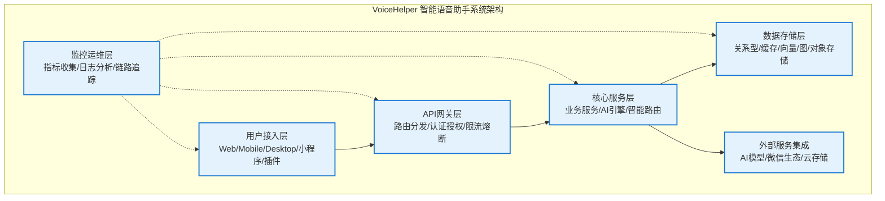
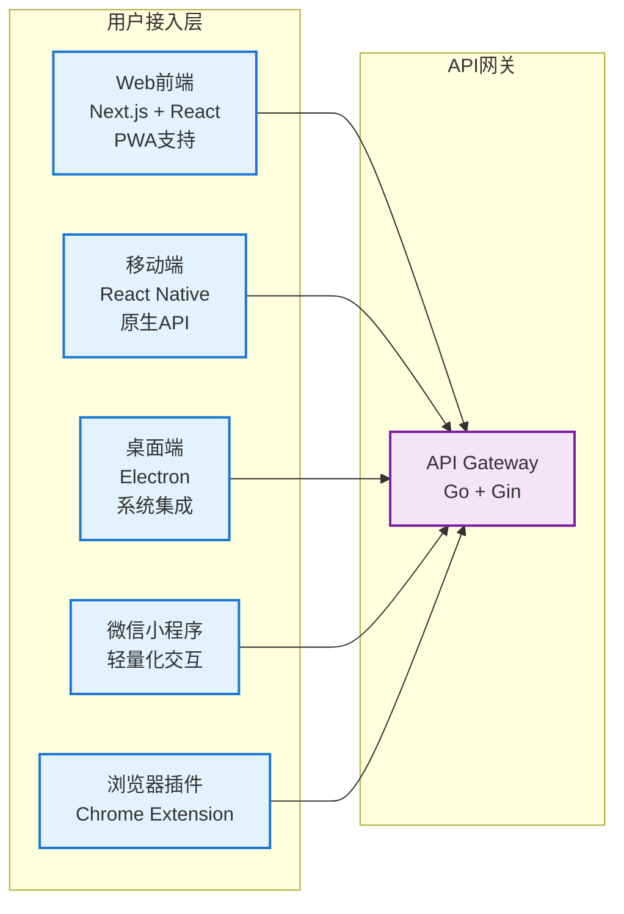
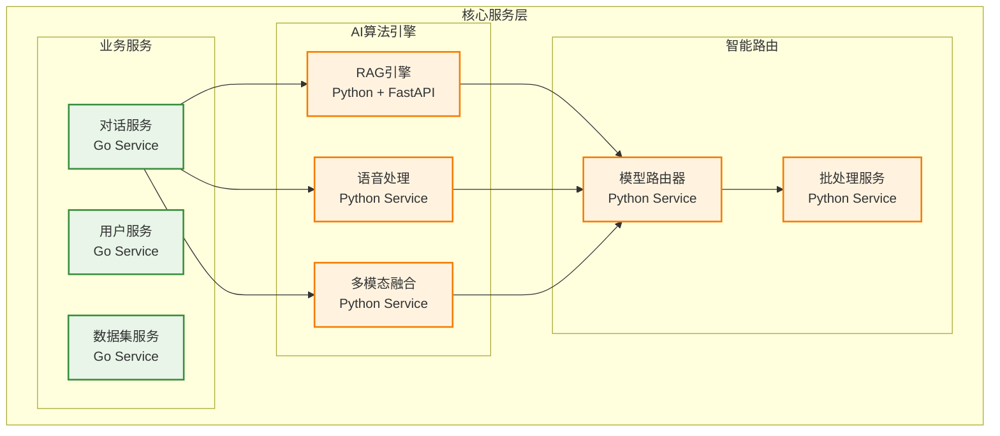
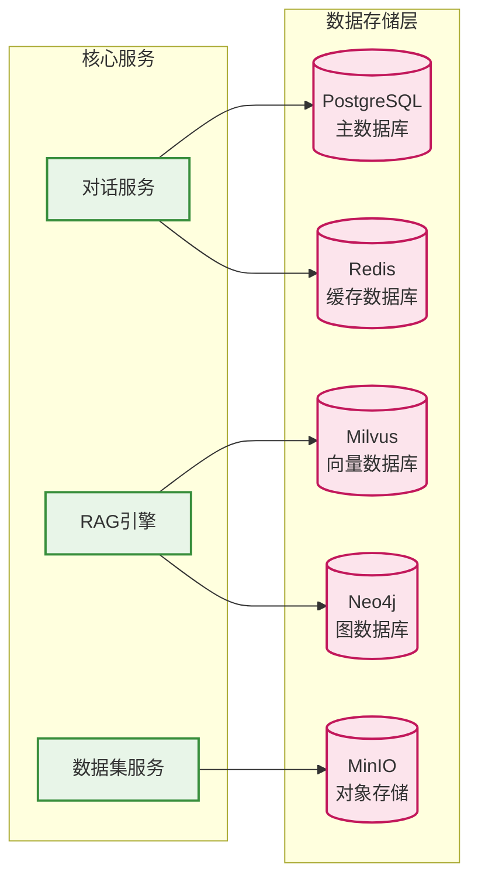

# VoiceHelper智能语音助手系统架构概览

本文档介绍VoiceHelper智能语音助手系统的整体架构设计，涵盖微服务架构、技术栈选型和核心组件设计。

## 概述

VoiceHelper是一个基于微服务架构的智能语音助手系统，集成了RAG（检索增强生成）技术、多模态融合、实时语音处理等技术组件。系统采用分层架构设计，支持多平台部署和横向扩展。

## 1. VoiceHelper整体架构设计

### 1.1 系统架构概览

VoiceHelper采用分层微服务架构，从上到下分为用户接入层、API网关层、核心服务层、数据存储层、外部服务集成和监控运维层。

#### 1.1.1 整体架构层次图



#### 1.1.2 用户接入层架构



#### 1.1.3 核心服务层架构



#### 1.1.4 数据存储层架构



### 1.2 系统模块功能详解

#### 1.2.1 用户接入层模块

#### Web前端 (Next.js + React)

- **核心功能**: 现代化Web应用界面，支持响应式设计和PWA特性
- **技术栈**: Next.js 14 + React 18 + TypeScript + Tailwind CSS
- **主要特性**:
  - 实时语音交互：WebRTC音频采集，实时语音识别和合成
  - 响应式设计：支持桌面端、平板、手机多种屏幕尺寸
  - PWA支持：离线缓存、桌面安装、推送通知
  - 流式对话：SSE实时显示AI回答，提升用户体验
  - 多模态输入：支持文本、语音、图片、文件上传
  - 统一错误处理：集成错误码系统，用户友好的错误提示
  - 结构化日志：页面访问、用户行为、性能指标记录
- **性能指标**: 首屏加载<2s，交互响应<100ms
- **错误码系统**: 前端特有错误码 (8xxxxx)，包含页面加载、API调用、用户交互等错误类型
- **日志系统**: 支持页面访问、用户行为、性能监控、错误追踪等日志类型

#### 移动端 (React Native)

- **核心功能**: 跨平台移动应用，提供原生体验
- **技术栈**: React Native + TypeScript + Redux Toolkit
- **主要特性**:
  - 原生语音API：集成iOS Speech Framework和Android SpeechRecognizer
  - 离线缓存：本地SQLite存储对话历史和用户偏好
  - 推送通知：Firebase Cloud Messaging集成
  - 生物识别：Face ID/Touch ID/指纹解锁
  - 后台处理：语音录制和播放的后台任务管理
- **平台支持**: iOS 12+, Android 8.0+

#### 桌面端 (Electron)

- **核心功能**: 跨平台桌面应用，深度系统集成
- **技术栈**: Electron + React + Node.js
- **主要特性**:
  - 系统集成：系统托盘、全局快捷键、开机自启
  - 快捷键支持：自定义快捷键唤醒和操作
  - 本地存储：用户数据和配置的本地加密存储
  - 窗口管理：多窗口、置顶、最小化到托盘
  - 自动更新：应用程序自动更新机制
  - 统一错误处理：桌面应用特有错误码，窗口管理、文件操作、IPC通信错误处理
  - 结构化日志：窗口生命周期、文件系统操作、IPC通信、性能监控日志
- **系统支持**: Windows 10+, macOS 10.15+, Linux Ubuntu 18.04+
- **错误码系统**: 桌面应用特有错误码 (7xxxxx)，包含窗口管理、文件操作、IPC通信等错误类型
- **日志系统**: 支持窗口管理、文件系统、IPC通信、性能监控、错误追踪等日志类型

#### 微信小程序

- **核心功能**: 轻量化移动端应用，快速启动
- **技术栈**: 微信小程序原生框架 + JavaScript
- **主要特性**:
  - 轻量化交互：精简功能，专注核心对话体验
  - 社交分享：对话内容分享到微信群聊和朋友圈
  - 快速启动：无需安装，即用即走
  - 微信生态：用户授权、支付、消息推送集成
  - 语音输入：微信录音API集成，支持语音转文字
  - 统一错误处理：小程序特有错误码，API调用、权限管理、支付等错误处理
  - 结构化日志：页面访问、用户行为、API调用、支付等日志记录
- **错误码系统**: 小程序特有错误码 (8xxxxx)，包含API调用、权限管理、支付、分享等错误类型
- **日志系统**: 支持页面访问、用户行为、API调用、支付、分享、错误追踪等日志类型
- **性能要求**: 包体积<2MB，启动时间<3s

#### 浏览器插件 (Chrome Extension)

- **核心功能**: 浏览器智能扩展，网页内容分析
- **技术栈**: Chrome Extension API + TypeScript + React
- **主要特性**:
  - 页面内容分析：自动提取网页关键信息和摘要
  - 快速查询：选中文本快速查询和解释
  - 上下文感知：基于当前网页内容的智能问答
  - 悬浮窗口：非侵入式交互界面
  - 多语言翻译：实时翻译和语言检测
- **浏览器支持**: Chrome 88+, Firefox 78+, Edge 88+

#### 1.2.2 API网关层模块

#### API Gateway (Go + Gin)

- **核心功能**: 统一API入口，请求路由和流量管理
- **技术栈**: Go 1.21 + Gin框架 + JWT认证
- **主要特性**:
  - 路由分发：基于路径和方法的智能路由
  - 认证授权：JWT Token验证和RBAC权限控制
  - 限流熔断：令牌桶算法限流，熔断器故障保护
  - 监控日志：请求链路追踪和性能指标收集
  - 协议转换：HTTP/WebSocket/gRPC协议适配
- **性能指标**: QPS 10000+，延迟P95<50ms

#### 负载均衡器

- **核心功能**: 流量分发和健康检查
- **技术栈**: Nginx + Consul + HAProxy
- **主要特性**:
  - 健康检查：定期检测后端服务可用性
  - 故障转移：自动剔除故障节点，流量重新分配
  - 流量分发：轮询、加权轮询、最少连接等算法
  - 会话保持：基于Cookie或IP的会话亲和性
  - SSL终结：HTTPS证书管理和SSL卸载
- **可用性**: 99.99%，故障切换时间<5s

#### 1.2.3 核心服务层模块

#### 对话服务 (Go Service)

- **核心功能**: 对话逻辑处理和会话管理
- **技术栈**: Go + gRPC + PostgreSQL + Redis
- **主要特性**:
  - 会话管理：多轮对话上下文维护和状态管理
  - 上下文维护：对话历史压缩和关键信息提取
  - 多轮对话：支持复杂对话流程和意图识别
  - 意图识别：NLU模型集成，用户意图分类和槽位填充
  - 个性化：用户偏好学习和个性化回复生成
- **性能指标**: 并发会话10000+，响应时间<200ms

#### 用户服务 (Go Service)

- **核心功能**: 用户身份管理和权限控制
- **技术栈**: Go + PostgreSQL + Redis + JWT
- **主要特性**:
  - 用户管理：注册、登录、资料管理、密码重置
  - 权限控制：基于角色的访问控制(RBAC)
  - 个性化配置：用户偏好、主题、语言等设置
  - 使用统计：用户行为分析和使用量统计
  - 多租户：企业级多租户隔离和管理
- **安全特性**: 密码加密、会话管理、防暴力破解

#### 数据集服务 (Go Service)

- **核心功能**: 知识库管理和文档处理
- **技术栈**: Go + PostgreSQL + MinIO + Elasticsearch
- **主要特性**:
  - 知识库管理：文档分类、标签、权限管理
  - 文档处理：多格式文档解析和内容提取
  - 版本控制：文档版本管理和变更追踪
  - 质量评估：文档质量评分和推荐优化
  - 批量操作：文档批量上传、更新、删除
- **支持格式**: PDF, Word, Excel, PPT, TXT, Markdown, HTML

#### 1.2.4 AI算法引擎模块

#### RAG引擎 (Python + FastAPI)

- **核心功能**: 检索增强生成，智能问答核心
- **技术栈**: Python 3.11 + FastAPI + LangChain + Transformers
- **主要特性**:
  - 文档检索：基于向量相似度的语义检索
  - 向量搜索：高维向量空间的相似度计算
  - 重排序：Cross-encoder模型对检索结果重新排序
  - 答案生成：基于检索上下文的答案生成
  - 多策略融合：向量检索+关键词检索+图检索
- **性能指标**: 检索延迟<50ms，召回率97%，准确率92%

#### 语音处理 (Python Service)

- **核心功能**: 端到端语音交互处理
- **技术栈**: Python + Whisper + TTS + PyTorch
- **主要特性**:
  - 语音识别：Whisper模型，支持多语言ASR
  - 语音合成：神经网络TTS，支持情感和韵律控制
  - 情感分析：语音情感识别，准确率90%+
  - 语音增强：噪声抑制和音频质量提升
  - 实时处理：流式语音处理，延迟<150ms
- **语言支持**: 中文、英文、日文、韩文等15种语言

#### 多模态融合 (Python Service)

- **核心功能**: 多模态数据理解和融合
- **技术栈**: Python + OpenCV + PIL + Transformers
- **主要特性**:
  - 图像理解：物体检测、场景识别、OCR文字提取
  - 视频分析：视频内容理解和关键帧提取
  - 文档解析：PDF、Word等结构化文档解析
  - 跨模态检索：图文匹配、视频问答等
  - 特征融合：多模态特征对齐和融合
- **支持模态**: 文本、图像、音频、视频、结构化数据

#### 模型路由器 (Python Service)

- **核心功能**: 智能模型选择和负载均衡
- **技术栈**: Python + FastAPI + Redis + Prometheus
- **主要特性**:
  - 智能分发：基于任务类型和模型能力的智能路由
  - 负载均衡：模型实例负载监控和流量分配
  - 成本优化：基于成本和性能的模型选择策略
  - 性能监控：模型响应时间和准确率监控
  - 故障转移：模型故障自动切换和降级
- **支持模型**: GPT-4, Claude, Gemini, 豆包等10+模型

#### 批处理服务 (Python Service)

- **核心功能**: 批量请求处理和性能优化
- **技术栈**: Python + AsyncIO + Redis Queue
- **主要特性**:
  - 请求合并：相似请求批量处理，提升吞吐量
  - 异步处理：非阻塞异步处理，提高并发能力
  - 优先级调度：基于用户等级和任务紧急度的调度
  - 资源优化：GPU资源池化和动态分配
  - 队列管理：任务队列监控和容量管理
- **性能提升**: 吞吐量提升300%，GPU利用率90%+

#### 1.2.5 数据存储层模块

#### PostgreSQL (关系型数据库)

- **核心功能**: 主数据库，存储结构化数据
- **版本**: PostgreSQL 15
- **主要特性**:
  - 用户数据：用户信息、权限、配置等
  - 会话记录：对话历史、会话状态、统计数据
  - 系统配置：系统参数、模型配置、业务规则
  - 审计日志：操作日志、安全事件、合规记录
  - ACID事务：数据一致性和完整性保证
- **性能配置**: 连接池100，QPS 5000+，存储容量1TB+

#### Redis (缓存数据库)

- **核心功能**: 高性能缓存和会话存储
- **版本**: Redis 7
- **主要特性**:
  - 会话缓存：用户会话状态和临时数据
  - 热点数据：频繁访问的数据缓存
  - 分布式锁：并发控制和资源同步
  - 消息队列：异步任务和事件通知
  - 限流计数：API限流和统计计数
- **性能指标**: QPS 100000+，延迟<1ms，内存使用8GB

#### Milvus (向量数据库)

- **核心功能**: 高维向量存储和相似度检索
- **版本**: Milvus 2.3.4
- **主要特性**:
  - 文档向量：文档嵌入向量存储和索引
  - 语义搜索：基于向量相似度的语义检索
  - 相似度计算：余弦相似度、欧氏距离等度量
  - 索引优化：HNSW、IVF等高效索引算法
  - 水平扩展：分布式部署和数据分片
- **性能指标**: 支持千万级向量，检索延迟<50ms

#### Neo4j (图数据库)

- **核心功能**: 知识图谱存储和图查询
- **版本**: Neo4j 5.0
- **主要特性**:
  - 知识图谱：实体关系图谱存储和管理
  - 关系推理：基于图结构的多跳推理
  - 路径查询：最短路径、关系路径查询
  - 图算法：社区发现、中心性分析等
  - Cypher查询：声明式图查询语言
- **数据规模**: 节点100万+，关系500万+，查询延迟<100ms

#### MinIO (对象存储)

- **核心功能**: 分布式对象存储服务
- **版本**: MinIO Latest
- **主要特性**:
  - 文件存储：文档、图片、音频、视频文件存储
  - 多媒体资源：用户上传的多媒体内容管理
  - 备份归档：数据备份和长期归档存储
  - CDN加速：内容分发网络集成
  - S3兼容：Amazon S3 API兼容
- **存储容量**: 10TB+，并发访问1000+

#### 1.2.6 外部服务集成模块

#### 豆包大模型 (Ark API)

- **核心功能**: 字节跳动豆包大模型API集成
- **模型版本**: ep-20241201140014-vbzjz
- **主要特性**:
  - 对话生成：多轮对话和上下文理解
  - 文本嵌入：文本向量化和语义表示
  - 多轮对话：复杂对话流程支持
  - 函数调用：工具调用和API集成
  - 流式响应：实时流式内容生成
- **性能指标**: 延迟<300ms，QPS 1000+

#### OpenAI (备用模型)

- **核心功能**: OpenAI模型API作为备用选择
- **模型版本**: GPT-4, GPT-3.5-turbo, text-embedding-3-large
- **主要特性**:
  - GPT系列：强大的语言理解和生成能力
  - 嵌入模型：高质量文本向量化
  - 图像生成：DALL-E图像生成能力
  - 代码生成：Codex代码理解和生成
  - 多模态：文本、图像、音频处理
- **使用场景**: 故障转移、特殊任务、性能对比

#### 微信生态集成

- **核心功能**: 微信小程序和生态服务集成
- **主要特性**:
  - 小程序API：微信小程序开发接口
  - 支付接口：微信支付集成
  - 用户授权：微信用户身份验证
  - 消息推送：模板消息和订阅消息
  - 社交分享：内容分享到微信群聊
- **用户覆盖**: 微信生态12亿+用户

#### 云存储服务

- **核心功能**: 云端存储和CDN服务
- **服务商**: 阿里云OSS、腾讯云COS、AWS S3
- **主要特性**:
  - 文件上传：大文件分片上传和断点续传
  - CDN分发：全球内容分发网络
  - 备份同步：多地域数据备份和同步
  - 安全访问：访问控制和权限管理
  - 成本优化：存储类型和生命周期管理
- **存储规模**: 100TB+，全球CDN节点200+

#### 1.2.7 监控运维层模块

#### Prometheus (指标收集)

- **核心功能**: 系统和业务指标收集监控
- **版本**: Prometheus Latest
- **主要特性**:
  - 系统指标：CPU、内存、磁盘、网络监控
  - 业务指标：QPS、延迟、错误率、用户活跃度
  - 告警规则：基于阈值和趋势的智能告警
  - 数据持久化：时序数据存储和查询
  - 服务发现：自动发现和监控新服务
- **数据保留**: 30天详细数据，1年聚合数据

#### Grafana (可视化面板)

- **核心功能**: 监控数据可视化和告警通知
- **版本**: Grafana Latest
- **主要特性**:
  - 实时监控：实时数据展示和刷新
  - 告警通知：邮件、短信、钉钉等多渠道通知
  - 趋势分析：历史数据趋势和预测分析
  - 报表生成：定期监控报表和PDF导出
  - 权限管理：用户权限和数据访问控制
- **仪表盘**: 50+监控面板，覆盖全系统指标

#### ELK Stack (日志系统)

- **核心功能**: 日志收集、存储、分析和可视化
- **组件版本**: Elasticsearch 8.11.0, Logstash, Kibana
- **主要特性**:
  - Elasticsearch：分布式搜索和日志存储
  - Logstash：日志收集、解析和转换
  - Kibana：日志查询、分析和可视化
  - 全文搜索：基于Lucene的全文检索
  - 日志聚合：多服务日志统一收集和分析
- **日志规模**: 日均100GB+，保留90天

#### Jaeger (分布式追踪)

- **核心功能**: 分布式系统链路追踪和性能分析
- **版本**: Jaeger Latest
- **主要特性**:
  - 分布式追踪：跨服务请求链路追踪
  - 性能分析：请求耗时分析和瓶颈识别
  - 错误定位：异常请求快速定位和诊断
  - 依赖关系：服务依赖关系图谱
  - 采样策略：智能采样减少性能影响
- **追踪覆盖**: 100%关键链路，1%全量采样

### 1.3 核心数据结构

#### 1.3.1 对话服务核心结构

```go
// 对话服务主结构体
// 文件路径: backend/internal/service/chat.go
type ChatService struct {
    // 数据库连接
    db     *sql.DB
    cache  *redis.Client
    
    // AI服务客户端
    ragClient    *rag.Client
    voiceClient  *voice.Client
    
    // 配置参数
    config *ChatConfig
    
    // 会话管理器
    sessionManager *SessionManager
    
    // 消息队列
    messageQueue chan *Message
    
    // 上下文管理
    contextManager *ContextManager
}

// 会话信息结构体
type Session struct {
    ID          string                 `json:"id"`
    UserID      string                 `json:"user_id"`
    CreatedAt   time.Time             `json:"created_at"`
    UpdatedAt   time.Time             `json:"updated_at"`
    Context     map[string]interface{} `json:"context"`
    Messages    []*Message            `json:"messages"`
    Status      SessionStatus         `json:"status"`
    Metadata    *SessionMetadata      `json:"metadata"`
}

// 消息结构体
type Message struct {
    ID          string      `json:"id"`
    SessionID   string      `json:"session_id"`
    Role        MessageRole `json:"role"`
    Content     string      `json:"content"`
    ContentType ContentType `json:"content_type"`
    Timestamp   time.Time   `json:"timestamp"`
    Metadata    *MessageMetadata `json:"metadata"`
}

// RAG检索结果
type RetrievalResult struct {
    Documents   []*Document `json:"documents"`
    Scores      []float64   `json:"scores"`
    Query       string      `json:"query"`
    TotalTime   time.Duration `json:"total_time"`
    RetrievalTime time.Duration `json:"retrieval_time"`
    RerankTime    time.Duration `json:"rerank_time"`
}
```

#### 1.3.2 RAG引擎核心结构

```python
# RAG引擎主类
# 文件路径: algo/core/retrieve.py
class RetrieveService:
    """RAG检索服务核心实现"""
    
    def __init__(self):
        self.embeddings = get_embeddings()
        self.milvus = Milvus(
            embedding_function=self.embeddings,
            collection_name=config.DEFAULT_COLLECTION_NAME,
            connection_args={
                "host": config.MILVUS_HOST,
                "port": config.MILVUS_PORT,
                "user": config.MILVUS_USER,
                "password": config.MILVUS_PASSWORD,
            }
        )
        self.reranker = CrossEncoder('BAAI/bge-reranker-m3')
        self.llm_client = ArkClient(
            api_key=config.ARK_API_KEY,
            base_url=config.ARK_BASE_URL
        )
    
    async def stream_query(self, request: QueryRequest) -> AsyncGenerator[str, None]:
        """流式查询处理主流程"""
        try:
            # 1. 提取用户查询
            user_query = self._extract_user_query(request.messages)
            
            # 2. 检索相关文档
            references = await self._retrieve_documents(
                user_query, 
                request.top_k,
                request.filters
            )
            
            # 3. 重排序优化
            if references and len(references) > 1:
                references = await self._rerank_documents(user_query, references)
            
            # 4. 构建提示词
            prompt = self._build_prompt(request.messages, references)
            
            # 5. 调用大模型流式生成
            async for response in self._stream_llm_response(prompt, request):
                yield response
                
        except Exception as e:
            logger.error(f"Stream query error: {e}")
            yield self._format_error_response(str(e))

# 文档结构体
@dataclass
class Document:
    """文档信息结构"""
    chunk_id: str
    source: str
    content: str
    metadata: Dict[str, Any]
    score: float = 0.0
    embedding: Optional[List[float]] = None

# 查询请求结构体
@dataclass
class QueryRequest:
    """查询请求结构"""
    messages: List[Message]
    top_k: int = 5
    temperature: float = 0.7
    max_tokens: int = 2000
    filters: Optional[Dict[str, Any]] = None
    stream: bool = True
```

## 相关文档

- [前端模块深度解析](/posts/voicehelper-frontend-modules/)
- [后端服务核心实现](/posts/voicehelper-backend-services/)
- [AI算法引擎深度分析](/posts/voicehelper-ai-algorithms/)
- [数据存储架构](/posts/voicehelper-data-storage/)
- [系统交互时序图](/posts/voicehelper-system-interactions/)
- [第三方集成与扩展](/posts/voicehelper-third-party-integration/)
- [性能优化与监控](/posts/voicehelper-performance-optimization/)
- [部署与运维](/posts/voicehelper-deployment-operations/)
- [总结与最佳实践](/posts/voicehelper-best-practices/)
- [项目功能清单](/posts/voicehelper-feature-inventory/)
- [版本迭代历程](/posts/voicehelper-version-history/)
- [竞争力分析](/posts/voicehelper-competitive-analysis/)
- [API接口清单](/posts/voicehelper-api-reference/)
- [错误码系统](/posts/voicehelper-error-codes/)
- [版本迭代计划](/posts/voicehelper-version-roadmap/)

