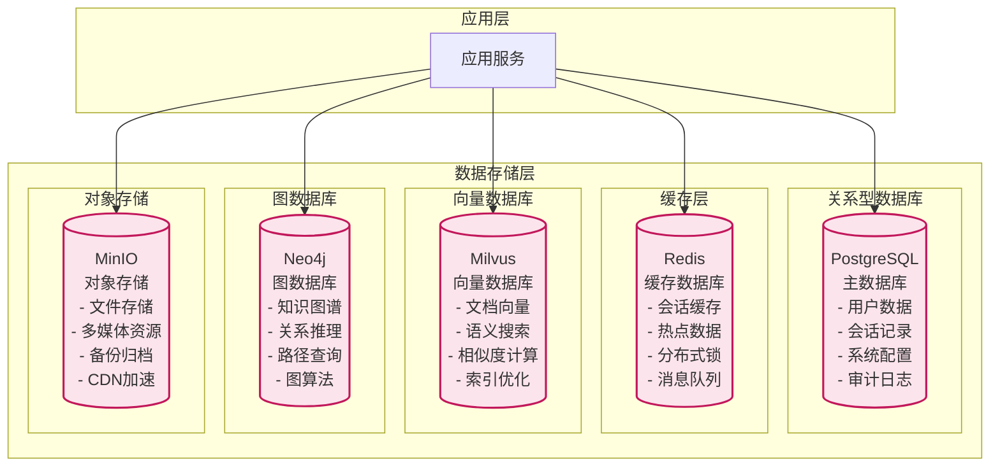
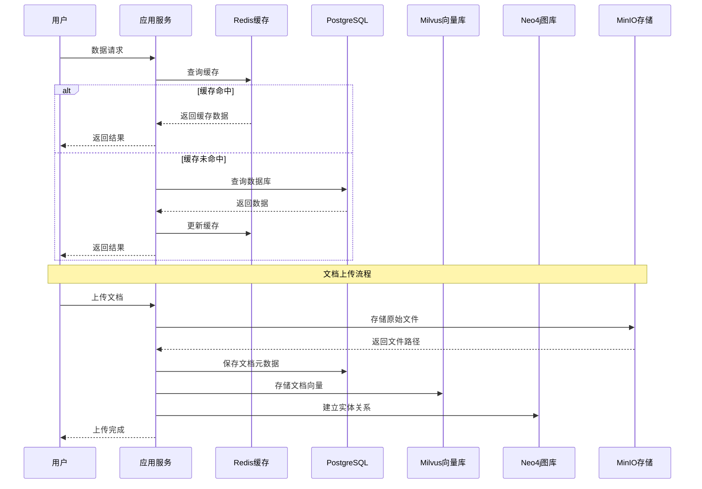

# VoiceHelper数据存储架构

本文档详细介绍VoiceHelper智能语音助手系统的数据存储架构设计，涵盖PostgreSQL、Redis、Milvus、Neo4j、MinIO等数据存储组件的配置与优化。

## 5. 数据存储架构

### 5.1 数据存储层架构概览


  </div>
</div>

#### 5.1.1 数据流转架构图


  </div>
</div>

### 5.2 PostgreSQL 关系型数据库

#### 5.2.1 数据库设计

```sql
-- 用户表
CREATE TABLE users (
    id UUID PRIMARY KEY DEFAULT gen_random_uuid(),
    email VARCHAR(255) UNIQUE NOT NULL,
    username VARCHAR(100) NOT NULL,
    password_hash VARCHAR(255) NOT NULL,
    status VARCHAR(20) DEFAULT 'active',
    created_at TIMESTAMP DEFAULT CURRENT_TIMESTAMP,
    updated_at TIMESTAMP DEFAULT CURRENT_TIMESTAMP,
    last_login_at TIMESTAMP,
    profile JSONB,
    settings JSONB
);

-- 会话表
CREATE TABLE sessions (
    id UUID PRIMARY KEY DEFAULT gen_random_uuid(),
    user_id UUID NOT NULL REFERENCES users(id),
    title VARCHAR(255),
    context JSONB,
    status VARCHAR(20) DEFAULT 'active',
    created_at TIMESTAMP DEFAULT CURRENT_TIMESTAMP,
    updated_at TIMESTAMP DEFAULT CURRENT_TIMESTAMP,
    metadata JSONB
);

-- 消息表
CREATE TABLE messages (
    id UUID PRIMARY KEY DEFAULT gen_random_uuid(),
    session_id UUID NOT NULL REFERENCES sessions(id),
    role VARCHAR(20) NOT NULL,
    content TEXT NOT NULL,
    content_type VARCHAR(50) DEFAULT 'text',
    metadata JSONB,
    created_at TIMESTAMP DEFAULT CURRENT_TIMESTAMP,
    tokens_used INTEGER,
    processing_time_ms INTEGER
);

-- 文档表
CREATE TABLE documents (
    id UUID PRIMARY KEY DEFAULT gen_random_uuid(),
    user_id UUID NOT NULL REFERENCES users(id),
    title VARCHAR(255) NOT NULL,
    content TEXT,
    metadata JSONB,
    status VARCHAR(20) DEFAULT 'processing',
    file_path VARCHAR(500),
    file_size BIGINT,
    mime_type VARCHAR(100),
    created_at TIMESTAMP DEFAULT CURRENT_TIMESTAMP,
    updated_at TIMESTAMP DEFAULT CURRENT_TIMESTAMP
);

-- 文档块表
CREATE TABLE document_chunks (
    id UUID PRIMARY KEY DEFAULT gen_random_uuid(),
    document_id UUID NOT NULL REFERENCES documents(id),
    content TEXT NOT NULL,
    metadata JSONB,
    chunk_index INTEGER NOT NULL,
    token_count INTEGER,
    created_at TIMESTAMP DEFAULT CURRENT_TIMESTAMP
);

-- 用户角色表
CREATE TABLE user_roles (
    id UUID PRIMARY KEY DEFAULT gen_random_uuid(),
    user_id UUID NOT NULL REFERENCES users(id),
    role_name VARCHAR(50) NOT NULL,
    granted_at TIMESTAMP DEFAULT CURRENT_TIMESTAMP,
    granted_by UUID REFERENCES users(id)
);

-- 系统配置表
CREATE TABLE system_configs (
    id UUID PRIMARY KEY DEFAULT gen_random_uuid(),
    config_key VARCHAR(100) UNIQUE NOT NULL,
    config_value JSONB NOT NULL,
    description TEXT,
    created_at TIMESTAMP DEFAULT CURRENT_TIMESTAMP,
    updated_at TIMESTAMP DEFAULT CURRENT_TIMESTAMP
);

-- 审计日志表
CREATE TABLE audit_logs (
    id UUID PRIMARY KEY DEFAULT gen_random_uuid(),
    user_id UUID REFERENCES users(id),
    action VARCHAR(100) NOT NULL,
    resource_type VARCHAR(50) NOT NULL,
    resource_id VARCHAR(255),
    details JSONB,
    ip_address INET,
    user_agent TEXT,
    created_at TIMESTAMP DEFAULT CURRENT_TIMESTAMP
);

-- 索引优化
CREATE INDEX idx_sessions_user_id ON sessions(user_id);
CREATE INDEX idx_sessions_created_at ON sessions(created_at);
CREATE INDEX idx_messages_session_id ON messages(session_id);
CREATE INDEX idx_messages_created_at ON messages(created_at);
CREATE INDEX idx_documents_user_id ON documents(user_id);
CREATE INDEX idx_documents_status ON documents(status);
CREATE INDEX idx_document_chunks_document_id ON document_chunks(document_id);
CREATE INDEX idx_user_roles_user_id ON user_roles(user_id);
CREATE INDEX idx_audit_logs_user_id ON audit_logs(user_id);
CREATE INDEX idx_audit_logs_created_at ON audit_logs(created_at);

-- 分区表设计（按时间分区）
CREATE TABLE messages_2024 PARTITION OF messages
FOR VALUES FROM ('2024-01-01') TO ('2025-01-01');

CREATE TABLE audit_logs_2024 PARTITION OF audit_logs
FOR VALUES FROM ('2024-01-01') TO ('2025-01-01');
```

#### 5.2.2 数据库配置优化

```sql
-- PostgreSQL 配置优化
-- 文件路径: postgresql.conf

-- 内存配置
shared_buffers = 256MB                    # 共享缓冲区
effective_cache_size = 1GB                # 有效缓存大小
work_mem = 4MB                           # 工作内存
maintenance_work_mem = 64MB              # 维护工作内存

-- 连接配置
max_connections = 200                     # 最大连接数
shared_preload_libraries = 'pg_stat_statements'

-- WAL配置
wal_level = replica                      # WAL级别
max_wal_size = 1GB                       # 最大WAL大小
min_wal_size = 80MB                      # 最小WAL大小
checkpoint_completion_target = 0.7        # 检查点完成目标

-- 查询优化
random_page_cost = 1.1                   # 随机页面成本
effective_io_concurrency = 200           # 有效IO并发

-- 日志配置
log_statement = 'mod'                    # 记录修改语句
log_min_duration_statement = 1000        # 记录慢查询（1秒以上）
log_checkpoints = on                     # 记录检查点
log_connections = on                     # 记录连接
log_disconnections = on                  # 记录断开连接
```

### 5.3 Redis 缓存数据库

#### 5.3.1 Redis 架构设计

```go
// Redis管理器
// 文件路径: backend/internal/cache/redis_manager.go
type RedisManager struct {
    client *redis.Client
    config *RedisConfig
}

func NewRedisManager(config *RedisConfig) *RedisManager {
    rdb := redis.NewClient(&redis.Options{
        Addr:         config.Address,
        Password:     config.Password,
        DB:           config.Database,
        PoolSize:     config.PoolSize,
        MinIdleConns: config.MinIdleConns,
        MaxRetries:   config.MaxRetries,
        DialTimeout:  config.DialTimeout,
        ReadTimeout:  config.ReadTimeout,
        WriteTimeout: config.WriteTimeout,
    })
    
    return &RedisManager{
        client: rdb,
        config: config,
    }
}

// 会话缓存
func (rm *RedisManager) CacheSession(session *Session) error {
    key := fmt.Sprintf("session:%s", session.ID)
    data, err := json.Marshal(session)
    if err != nil {
        return err
    }
    
    return rm.client.Set(context.Background(), key, data, time.Hour*24).Err()
}

func (rm *RedisManager) GetSession(sessionID string) (*Session, error) {
    key := fmt.Sprintf("session:%s", sessionID)
    data, err := rm.client.Get(context.Background(), key).Result()
    if err != nil {
        return nil, err
    }
    
    var session Session
    if err := json.Unmarshal([]byte(data), &session); err != nil {
        return nil, err
    }
    
    return &session, nil
}

// 用户缓存
func (rm *RedisManager) CacheUser(user *User) error {
    key := fmt.Sprintf("user:%s", user.ID)
    data, err := json.Marshal(user)
    if err != nil {
        return err
    }
    
    return rm.client.Set(context.Background(), key, data, time.Hour*12).Err()
}

// 分布式锁
func (rm *RedisManager) AcquireLock(key string, expiration time.Duration) (bool, error) {
    result := rm.client.SetNX(context.Background(), key, "1", expiration)
    return result.Val(), result.Err()
}

func (rm *RedisManager) ReleaseLock(key string) error {
    return rm.client.Del(context.Background(), key).Err()
}

// 消息队列
func (rm *RedisManager) PublishMessage(channel string, message interface{}) error {
    data, err := json.Marshal(message)
    if err != nil {
        return err
    }
    
    return rm.client.Publish(context.Background(), channel, data).Err()
}

func (rm *RedisManager) SubscribeChannel(channel string) *redis.PubSub {
    return rm.client.Subscribe(context.Background(), channel)
}

// 限流器
func (rm *RedisManager) RateLimit(key string, limit int, window time.Duration) (bool, error) {
    pipe := rm.client.Pipeline()
    
    // 使用滑动窗口限流
    now := time.Now().Unix()
    windowStart := now - int64(window.Seconds())
    
    // 清理过期的记录
    pipe.ZRemRangeByScore(context.Background(), key, "0", fmt.Sprintf("%d", windowStart))
    
    // 添加当前请求
    pipe.ZAdd(context.Background(), key, &redis.Z{Score: float64(now), Member: now})
    
    // 计算当前窗口内的请求数
    pipe.ZCard(context.Background(), key)
    
    // 设置过期时间
    pipe.Expire(context.Background(), key, window)
    
    results, err := pipe.Exec(context.Background())
    if err != nil {
        return false, err
    }
    
    count := results[2].(*redis.IntCmd).Val()
    return count <= int64(limit), nil
}
```

#### 5.3.2 Redis 配置优化

```conf
# Redis 配置文件
# 文件路径: redis.conf

# 内存配置
maxmemory 2gb
maxmemory-policy allkeys-lru

# 持久化配置
save 900 1
save 300 10
save 60 10000

# AOF配置
appendonly yes
appendfsync everysec
auto-aof-rewrite-percentage 100
auto-aof-rewrite-min-size 64mb

# 网络配置
tcp-keepalive 300
timeout 0

# 客户端配置
maxclients 10000

# 慢查询配置
slowlog-log-slower-than 10000
slowlog-max-len 128

# 安全配置
requirepass your_redis_password
```

### 5.4 Milvus 向量数据库

#### 5.4.1 Milvus 集合设计

```python
# Milvus向量数据库管理
# 文件路径: algo/storage/milvus_manager.py
from pymilvus import Collection, FieldSchema, CollectionSchema, DataType, connections
import numpy as np
from typing import List, Dict, Any, Optional

class MilvusManager:
    """Milvus向量数据库管理器"""
    
    def __init__(self, config: Dict[str, Any]):
        self.config = config
        self.connect()
        self.collections = {}
        
    def connect(self):
        """连接到Milvus"""
        connections.connect(
            alias="default",
            host=self.config["host"],
            port=self.config["port"],
            user=self.config.get("user"),
            password=self.config.get("password")
        )
    
    def create_document_collection(self, collection_name: str = "documents"):
        """创建文档向量集合"""
        
        # 定义字段
        fields = [
            FieldSchema(name="chunk_id", dtype=DataType.VARCHAR, max_length=64, is_primary=True),
            FieldSchema(name="document_id", dtype=DataType.VARCHAR, max_length=64),
            FieldSchema(name="content", dtype=DataType.VARCHAR, max_length=8192),
            FieldSchema(name="embedding", dtype=DataType.FLOAT_VECTOR, dim=1024),
            FieldSchema(name="metadata", dtype=DataType.JSON),
            FieldSchema(name="created_at", dtype=DataType.INT64),
        ]
        
        # 创建集合schema
        schema = CollectionSchema(
            fields=fields,
            description="Document chunks with embeddings"
        )
        
        # 创建集合
        collection = Collection(
            name=collection_name,
            schema=schema,
            using='default'
        )
        
        # 创建索引
        index_params = {
            "metric_type": "COSINE",
            "index_type": "HNSW",
            "params": {
                "M": 16,
                "efConstruction": 200
            }
        }
        
        collection.create_index(
            field_name="embedding",
            index_params=index_params
        )
        
        self.collections[collection_name] = collection
        return collection
    
    def insert_documents(
        self, 
        collection_name: str,
        chunk_ids: List[str],
        document_ids: List[str],
        contents: List[str],
        embeddings: List[List[float]],
        metadata_list: List[Dict[str, Any]]
    ):
        """插入文档向量"""
        
        collection = self.collections.get(collection_name)
        if not collection:
            collection = self.create_document_collection(collection_name)
        
        import time
        current_time = int(time.time() * 1000)
        
        data = [
            chunk_ids,
            document_ids,
            contents,
            embeddings,
            metadata_list,
            [current_time] * len(chunk_ids)
        ]
        
        # 插入数据
        mr = collection.insert(data)
        collection.flush()
        
        return mr
    
    def search_similar_documents(
        self,
        collection_name: str,
        query_embedding: List[float],
        top_k: int = 5,
        filters: Optional[str] = None
    ) -> List[Dict[str, Any]]:
        """搜索相似文档"""
        
        collection = self.collections.get(collection_name)
        if not collection:
            raise ValueError(f"Collection {collection_name} not found")
        
        # 加载集合到内存
        collection.load()
        
        # 搜索参数
        search_params = {
            "metric_type": "COSINE",
            "params": {"ef": 64}
        }
        
        # 执行搜索
        results = collection.search(
            data=[query_embedding],
            anns_field="embedding",
            param=search_params,
            limit=top_k,
            expr=filters,
            output_fields=["chunk_id", "document_id", "content", "metadata"]
        )
        
        # 格式化结果
        documents = []
        for hit in results[0]:
            documents.append({
                "chunk_id": hit.entity.get("chunk_id"),
                "document_id": hit.entity.get("document_id"),
                "content": hit.entity.get("content"),
                "metadata": hit.entity.get("metadata"),
                "score": hit.score
            })
        
        return documents
    
    def delete_documents(self, collection_name: str, document_ids: List[str]):
        """删除文档"""
        collection = self.collections.get(collection_name)
        if not collection:
            return
        
        # 构建删除表达式
        expr = f"document_id in {document_ids}"
        collection.delete(expr)
        collection.flush()
    
    def get_collection_stats(self, collection_name: str) -> Dict[str, Any]:
        """获取集合统计信息"""
        collection = self.collections.get(collection_name)
        if not collection:
            return {}
        
        stats = collection.get_stats()
        return {
            "row_count": stats.get("row_count", 0),
            "data_size": stats.get("data_size", 0),
            "index_size": stats.get("index_size", 0)
        }
```

#### 5.4.2 Milvus 配置优化

```yaml
# Milvus 配置文件
# 文件路径: milvus.yaml

etcd:
  endpoints:
    - localhost:2379
  rootPath: by-dev
  metaSubPath: meta
  kvSubPath: kv

minio:
  address: localhost
  port: 9000
  accessKeyID: minioadmin
  secretAccessKey: minioadmin
  useSSL: false
  bucketName: a-bucket

pulsar:
  address: localhost
  port: 6650
  maxMessageSize: 5242880

rootCoord:
  address: localhost
  port: 53100
  enableActiveStandby: false

proxy:
  port: 19530
  internalPort: 19529

queryCoord:
  address: localhost
  port: 19531
  enableActiveStandby: false

queryNode:
  cacheSize: 32
  port: 21123

indexCoord:
  address: localhost
  port: 31000
  enableActiveStandby: false

indexNode:
  port: 21121

dataCoord:
  address: localhost
  port: 13333
  enableActiveStandby: false

dataNode:
  port: 21124

log:
  level: info
  file:
    rootPath: ""
    maxSize: 300
    maxAge: 10
    maxBackups: 20

# 性能优化配置
common:
  defaultPartitionName: _default
  defaultIndexName: _default_idx
  retentionDuration: 432000
  entityExpiration: -1
  indexSliceSize: 16

# 内存配置
queryNode:
  cacheSize: 32  # GB
  
indexNode:
  enableDisk: true
  diskQuotaInMB: 1024
```

### 5.5 Neo4j 图数据库

#### 5.5.1 Neo4j 图模型设计

```cypher
-- Neo4j 图数据库设计
-- 文件路径: neo4j/schema.cypher

-- 创建约束
CREATE CONSTRAINT entity_id IF NOT EXISTS FOR (e:Entity) REQUIRE e.id IS UNIQUE;
CREATE CONSTRAINT relation_id IF NOT EXISTS FOR (r:Relation) REQUIRE r.id IS UNIQUE;
CREATE CONSTRAINT document_id IF NOT EXISTS FOR (d:Document) REQUIRE d.id IS UNIQUE;

-- 实体节点
CREATE (e:Entity {
    id: "entity_001",
    name: "人工智能",
    type: "概念",
    description: "模拟人类智能的技术",
    created_at: datetime(),
    updated_at: datetime()
});

-- 文档节点
CREATE (d:Document {
    id: "doc_001",
    title: "AI技术发展报告",
    content: "人工智能技术的发展历程...",
    created_at: datetime(),
    updated_at: datetime()
});

-- 关系定义
CREATE (e1:Entity)-[r:RELATED_TO {
    id: "rel_001",
    weight: 0.8,
    type: "概念关联",
    created_at: datetime()
}]->(e2:Entity);

-- 文档包含实体关系
CREATE (d:Document)-[c:CONTAINS {
    confidence: 0.9,
    position: 100,
    context: "在人工智能领域中..."
}]->(e:Entity);

-- 实体共现关系
CREATE (e1:Entity)-[co:CO_OCCURS {
    frequency: 15,
    documents: ["doc_001", "doc_002"],
    strength: 0.7
}]->(e2:Entity);
```

#### 5.5.2 Neo4j 查询优化

```python
# Neo4j图数据库管理
# 文件路径: algo/storage/neo4j_manager.py
from neo4j import GraphDatabase
from typing import List, Dict, Any, Optional
import logging

class Neo4jManager:
    """Neo4j图数据库管理器"""
    
    def __init__(self, uri: str, user: str, password: str):
        self.driver = GraphDatabase.driver(uri, auth=(user, password))
        self.logger = logging.getLogger(__name__)
    
    def close(self):
        """关闭连接"""
        self.driver.close()
    
    def create_entity(self, entity_data: Dict[str, Any]) -> str:
        """创建实体节点"""
        with self.driver.session() as session:
            result = session.run(
                """
                CREATE (e:Entity {
                    id: $id,
                    name: $name,
                    type: $type,
                    description: $description,
                    created_at: datetime(),
                    updated_at: datetime()
                })
                RETURN e.id as entity_id
                """,
                **entity_data
            )
            return result.single()["entity_id"]
    
    def create_relation(
        self, 
        entity1_id: str, 
        entity2_id: str, 
        relation_type: str,
        properties: Dict[str, Any] = None
    ) -> str:
        """创建实体关系"""
        if properties is None:
            properties = {}
            
        with self.driver.session() as session:
            result = session.run(
                f"""
                MATCH (e1:Entity {{id: $entity1_id}})
                MATCH (e2:Entity {{id: $entity2_id}})
                CREATE (e1)-[r:{relation_type} {{
                    id: $relation_id,
                    weight: $weight,
                    created_at: datetime()
                }}]->(e2)
                RETURN r.id as relation_id
                """,
                entity1_id=entity1_id,
                entity2_id=entity2_id,
                relation_id=properties.get("id", f"rel_{entity1_id}_{entity2_id}"),
                weight=properties.get("weight", 1.0)
            )
            return result.single()["relation_id"]
    
    def find_related_entities(
        self, 
        entity_id: str, 
        max_depth: int = 2,
        limit: int = 10
    ) -> List[Dict[str, Any]]:
        """查找相关实体"""
        with self.driver.session() as session:
            result = session.run(
                """
                MATCH (start:Entity {id: $entity_id})
                MATCH path = (start)-[*1..$max_depth]-(related:Entity)
                WHERE start <> related
                RETURN DISTINCT related.id as id,
                       related.name as name,
                       related.type as type,
                       length(path) as distance,
                       reduce(weight = 1.0, r in relationships(path) | weight * r.weight) as relevance_score
                ORDER BY relevance_score DESC, distance ASC
                LIMIT $limit
                """,
                entity_id=entity_id,
                max_depth=max_depth,
                limit=limit
            )
            
            return [dict(record) for record in result]
    
    def find_shortest_path(self, entity1_id: str, entity2_id: str) -> List[Dict[str, Any]]:
        """查找最短路径"""
        with self.driver.session() as session:
            result = session.run(
                """
                MATCH (start:Entity {id: $entity1_id})
                MATCH (end:Entity {id: $entity2_id})
                MATCH path = shortestPath((start)-[*]-(end))
                RETURN [n in nodes(path) | {id: n.id, name: n.name}] as nodes,
                       [r in relationships(path) | {type: type(r), weight: r.weight}] as relationships,
                       length(path) as path_length
                """,
                entity1_id=entity1_id,
                entity2_id=entity2_id
            )
            
            record = result.single()
            if record:
                return {
                    "nodes": record["nodes"],
                    "relationships": record["relationships"],
                    "path_length": record["path_length"]
                }
            return None
    
    def get_entity_neighbors(self, entity_id: str, relation_types: List[str] = None) -> List[Dict[str, Any]]:
        """获取实体邻居"""
        relation_filter = ""
        if relation_types:
            relation_filter = f":{':'.join(relation_types)}"
            
        with self.driver.session() as session:
            result = session.run(
                f"""
                MATCH (e:Entity {{id: $entity_id}})-[r{relation_filter}]-(neighbor:Entity)
                RETURN neighbor.id as id,
                       neighbor.name as name,
                       neighbor.type as type,
                       type(r) as relation_type,
                       r.weight as weight
                ORDER BY r.weight DESC
                """,
                entity_id=entity_id
            )
            
            return [dict(record) for record in result]
    
    def execute_graph_algorithm(self, algorithm: str, parameters: Dict[str, Any]) -> List[Dict[str, Any]]:
        """执行图算法"""
        algorithms = {
            "pagerank": """
                CALL gds.pageRank.stream('entity-graph')
                YIELD nodeId, score
                RETURN gds.util.asNode(nodeId).id as entity_id,
                       gds.util.asNode(nodeId).name as name,
                       score
                ORDER BY score DESC
                LIMIT $limit
            """,
            "community": """
                CALL gds.louvain.stream('entity-graph')
                YIELD nodeId, communityId
                RETURN gds.util.asNode(nodeId).id as entity_id,
                       gds.util.asNode(nodeId).name as name,
                       communityId
                ORDER BY communityId
            """,
            "centrality": """
                CALL gds.betweenness.stream('entity-graph')
                YIELD nodeId, score
                RETURN gds.util.asNode(nodeId).id as entity_id,
                       gds.util.asNode(nodeId).name as name,
                       score
                ORDER BY score DESC
                LIMIT $limit
            """
        }
        
        query = algorithms.get(algorithm)
        if not query:
            raise ValueError(f"Unsupported algorithm: {algorithm}")
        
        with self.driver.session() as session:
            result = session.run(query, **parameters)
            return [dict(record) for record in result]
```

### 5.6 MinIO 对象存储

#### 5.6.1 MinIO 存储管理

```python
# MinIO对象存储管理
# 文件路径: backend/storage/minio_manager.py
from minio import Minio
from minio.error import S3Error
import io
import json
from typing import Optional, Dict, Any, List
import logging

class MinIOManager:
    """MinIO对象存储管理器"""
    
    def __init__(self, config: Dict[str, Any]):
        self.client = Minio(
            endpoint=f"{config['host']}:{config['port']}",
            access_key=config['access_key'],
            secret_key=config['secret_key'],
            secure=config.get('secure', False)
        )
        self.default_bucket = config.get('default_bucket', 'voicehelper')
        self.logger = logging.getLogger(__name__)
        
        # 确保默认bucket存在
        self._ensure_bucket_exists(self.default_bucket)
    
    def _ensure_bucket_exists(self, bucket_name: str):
        """确保bucket存在"""
        try:
            if not self.client.bucket_exists(bucket_name):
                self.client.make_bucket(bucket_name)
                self.logger.info(f"Created bucket: {bucket_name}")
        except S3Error as e:
            self.logger.error(f"Error creating bucket {bucket_name}: {e}")
    
    def upload_file(
        self, 
        file_data: bytes, 
        object_name: str,
        bucket_name: Optional[str] = None,
        content_type: Optional[str] = None,
        metadata: Optional[Dict[str, str]] = None
    ) -> bool:
        """上传文件"""
        bucket_name = bucket_name or self.default_bucket
        
        try:
            # 创建文件流
            file_stream = io.BytesIO(file_data)
            
            # 上传文件
            self.client.put_object(
                bucket_name=bucket_name,
                object_name=object_name,
                data=file_stream,
                length=len(file_data),
                content_type=content_type,
                metadata=metadata
            )
            
            self.logger.info(f"Uploaded file: {object_name} to bucket: {bucket_name}")
            return True
            
        except S3Error as e:
            self.logger.error(f"Error uploading file {object_name}: {e}")
            return False
    
    def download_file(
        self, 
        object_name: str,
        bucket_name: Optional[str] = None
    ) -> Optional[bytes]:
        """下载文件"""
        bucket_name = bucket_name or self.default_bucket
        
        try:
            response = self.client.get_object(bucket_name, object_name)
            data = response.read()
            response.close()
            response.release_conn()
            
            return data
            
        except S3Error as e:
            self.logger.error(f"Error downloading file {object_name}: {e}")
            return None
    
    def delete_file(
        self, 
        object_name: str,
        bucket_name: Optional[str] = None
    ) -> bool:
        """删除文件"""
        bucket_name = bucket_name or self.default_bucket
        
        try:
            self.client.remove_object(bucket_name, object_name)
            self.logger.info(f"Deleted file: {object_name} from bucket: {bucket_name}")
            return True
            
        except S3Error as e:
            self.logger.error(f"Error deleting file {object_name}: {e}")
            return False
    
    def list_files(
        self, 
        prefix: Optional[str] = None,
        bucket_name: Optional[str] = None
    ) -> List[Dict[str, Any]]:
        """列出文件"""
        bucket_name = bucket_name or self.default_bucket
        
        try:
            objects = self.client.list_objects(
                bucket_name, 
                prefix=prefix,
                recursive=True
            )
            
            files = []
            for obj in objects:
                files.append({
                    "name": obj.object_name,
                    "size": obj.size,
                    "last_modified": obj.last_modified,
                    "etag": obj.etag
                })
            
            return files
            
        except S3Error as e:
            self.logger.error(f"Error listing files: {e}")
            return []
    
    def get_file_url(
        self, 
        object_name: str,
        bucket_name: Optional[str] = None,
        expires: int = 3600
    ) -> Optional[str]:
        """获取文件预签名URL"""
        bucket_name = bucket_name or self.default_bucket
        
        try:
            url = self.client.presigned_get_object(
                bucket_name, 
                object_name,
                expires=expires
            )
            return url
            
        except S3Error as e:
            self.logger.error(f"Error generating URL for {object_name}: {e}")
            return None
    
    def upload_json(
        self, 
        data: Dict[str, Any], 
        object_name: str,
        bucket_name: Optional[str] = None
    ) -> bool:
        """上传JSON数据"""
        json_data = json.dumps(data, ensure_ascii=False, indent=2)
        return self.upload_file(
            json_data.encode('utf-8'),
            object_name,
            bucket_name,
            content_type='application/json'
        )
    
    def download_json(
        self, 
        object_name: str,
        bucket_name: Optional[str] = None
    ) -> Optional[Dict[str, Any]]:
        """下载JSON数据"""
        data = self.download_file(object_name, bucket_name)
        if data:
            try:
                return json.loads(data.decode('utf-8'))
            except json.JSONDecodeError as e:
                self.logger.error(f"Error parsing JSON from {object_name}: {e}")
        return None
```

#### 5.6.2 MinIO 配置优化

```yaml
# MinIO 配置文件
# 文件路径: docker-compose.yml (MinIO部分)

version: '3.8'
services:
  minio:
    image: minio/minio:latest
    container_name: voicehelper-minio
    ports:
      - "9000:9000"
      - "9001:9001"
    environment:
      MINIO_ROOT_USER: minioadmin
      MINIO_ROOT_PASSWORD: minioadmin123
      MINIO_BROWSER_REDIRECT_URL: http://localhost:9001
    command: server /data --console-address ":9001"
    volumes:
      - minio_data:/data
    healthcheck:
      test: ["CMD", "curl", "-f", "http://localhost:9000/minio/health/live"]
      interval: 30s
      timeout: 20s
      retries: 3
    networks:
      - voicehelper-network

volumes:
  minio_data:
    driver: local

networks:
  voicehelper-network:
    driver: bridge
```

### 5.7 数据备份与恢复

#### 5.7.1 备份策略

```bash
#!/bin/bash
# 数据备份脚本
# 文件路径: scripts/backup.sh

set -e

BACKUP_DIR="/backup/$(date +%Y%m%d)"
mkdir -p $BACKUP_DIR

# PostgreSQL备份
echo "Backing up PostgreSQL..."
pg_dump -h localhost -U postgres -d voicehelper > $BACKUP_DIR/postgres_backup.sql

# Redis备份
echo "Backing up Redis..."
redis-cli --rdb $BACKUP_DIR/redis_backup.rdb

# Milvus备份
echo "Backing up Milvus..."
# 使用Milvus备份工具
milvus-backup create --collection-names documents --backup-name milvus_$(date +%Y%m%d)

# Neo4j备份
echo "Backing up Neo4j..."
neo4j-admin dump --database=neo4j --to=$BACKUP_DIR/neo4j_backup.dump

# MinIO备份
echo "Backing up MinIO..."
mc mirror minio/voicehelper $BACKUP_DIR/minio_backup/

# 压缩备份文件
echo "Compressing backup..."
tar -czf $BACKUP_DIR.tar.gz -C /backup $(basename $BACKUP_DIR)

# 清理旧备份（保留30天）
find /backup -name "*.tar.gz" -mtime +30 -delete

echo "Backup completed: $BACKUP_DIR.tar.gz"
```

#### 5.7.2 恢复策略

```bash
#!/bin/bash
# 数据恢复脚本
# 文件路径: scripts/restore.sh

set -e

BACKUP_FILE=$1
if [ -z "$BACKUP_FILE" ]; then
    echo "Usage: $0 <backup_file.tar.gz>"
    exit 1
fi

RESTORE_DIR="/tmp/restore_$(date +%s)"
mkdir -p $RESTORE_DIR

# 解压备份文件
echo "Extracting backup..."
tar -xzf $BACKUP_FILE -C $RESTORE_DIR

BACKUP_DIR=$(find $RESTORE_DIR -maxdepth 1 -type d | tail -1)

# 恢复PostgreSQL
echo "Restoring PostgreSQL..."
psql -h localhost -U postgres -d voicehelper < $BACKUP_DIR/postgres_backup.sql

# 恢复Redis
echo "Restoring Redis..."
redis-cli FLUSHALL
redis-cli --pipe < $BACKUP_DIR/redis_backup.rdb

# 恢复Milvus
echo "Restoring Milvus..."
milvus-backup restore --collection-suffix "_restored" --backup-name milvus_backup

# 恢复Neo4j
echo "Restoring Neo4j..."
neo4j-admin load --from=$BACKUP_DIR/neo4j_backup.dump --database=neo4j --force

# 恢复MinIO
echo "Restoring MinIO..."
mc mirror $BACKUP_DIR/minio_backup/ minio/voicehelper

# 清理临时文件
rm -rf $RESTORE_DIR

echo "Restore completed from: $BACKUP_FILE"
```

## 相关文档

- [系统架构概览](/posts/voicehelper-architecture-overview/)
- [前端模块深度解析](/posts/voicehelper-frontend-modules/)
- [后端服务核心实现](/posts/voicehelper-backend-services/)
- [AI算法引擎深度分析](/posts/voicehelper-ai-algorithms/)
- [系统交互时序图](/posts/voicehelper-system-interactions/)
- [第三方集成与扩展](/posts/voicehelper-third-party-integration/)
- [性能优化与监控](/posts/voicehelper-performance-optimization/)
- [部署与运维](/posts/voicehelper-deployment-operations/)
- [总结与最佳实践](/posts/voicehelper-best-practices/)
- [项目功能清单](/posts/voicehelper-feature-inventory/)
- [版本迭代历程](/posts/voicehelper-version-history/)
- [竞争力分析](/posts/voicehelper-competitive-analysis/)
- [API接口清单](/posts/voicehelper-api-reference/)
- [错误码系统](/posts/voicehelper-error-codes/)
- [版本迭代计划](/posts/voicehelper-version-roadmap/)
