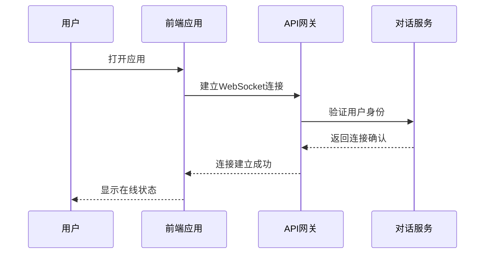
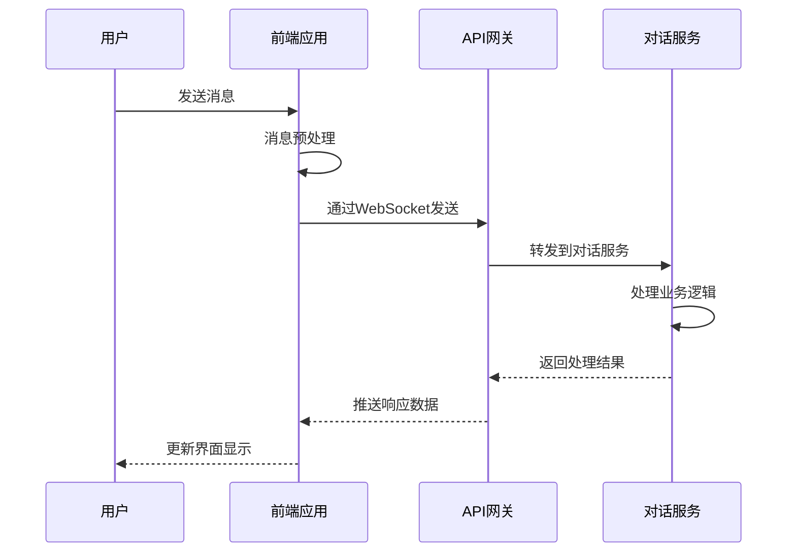
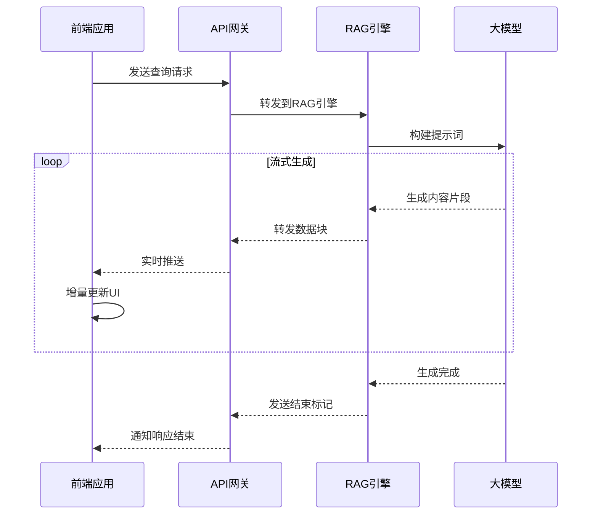

# VoiceHelper前端模块深度解析

本文档详细介绍VoiceHelper智能语音助手系统的前端模块技术实现，涵盖Next.js应用架构、实时通信机制、多端适配策略等核心技术。

## 2. 前端模块深度解析

### 2.1 Next.js应用架构

```typescript
// 前端应用主入口
// 文件路径: frontend/app/layout.tsx
export default function RootLayout({
  children,
}: {
  children: React.ReactNode
}) {
  return (
    <html lang="zh-CN">
      <body className={inter.className}>
        <Providers>
          <div className="min-h-screen bg-gradient-to-br from-blue-50 to-indigo-100">
            <Header />
            <main className="container mx-auto px-4 py-8">
              {children}
            </main>
            <Footer />
          </div>
          <Toaster />
        </Providers>
      </body>
    </html>
  )
}

// 实时通信Hook
// 文件路径: frontend/hooks/useWebSocket.ts
export function useWebSocket(url: string) {
  const [socket, setSocket] = useState<WebSocket | null>(null)
  const [connectionStatus, setConnectionStatus] = useState<ConnectionStatus>('Disconnected')
  const [messageHistory, setMessageHistory] = useState<MessageEvent[]>([])

  const sendMessage = useCallback((message: any) => {
    if (socket && socket.readyState === WebSocket.OPEN) {
      socket.send(JSON.stringify(message))
    }
  }, [socket])

  useEffect(() => {
    const ws = new WebSocket(url)
    
    ws.onopen = () => {
      setConnectionStatus('Connected')
      setSocket(ws)
    }
    
    ws.onmessage = (event) => {
      const message = JSON.parse(event.data)
      setMessageHistory(prev => [...prev, message])
    }
    
    ws.onclose = () => {
      setConnectionStatus('Disconnected')
      setSocket(null)
    }
    
    return () => {
      ws.close()
    }
  }, [url])

  return { socket, connectionStatus, messageHistory, sendMessage }
}
```

### 2.2 实时通信机制

VoiceHelper前端采用WebSocket实现实时通信，支持流式对话和多模态交互。

#### 2.2.1 WebSocket连接建立流程



#### 2.2.2 消息处理流程



#### 2.2.3 流式响应处理



### 2.3 多端适配策略

```typescript
// 多端适配配置
// 文件路径: frontend/lib/platform.ts
export class PlatformAdapter {
  private platform: Platform
  
  constructor() {
    this.platform = this.detectPlatform()
  }
  
  detectPlatform(): Platform {
    if (typeof window === 'undefined') return 'server'
    
    const userAgent = window.navigator.userAgent
    
    if (/MicroMessenger/i.test(userAgent)) return 'wechat'
    if (/Mobile|Android|iPhone|iPad/i.test(userAgent)) return 'mobile'
    if (/Electron/i.test(userAgent)) return 'desktop'
    
    return 'web'
  }
  
  getApiConfig(): ApiConfig {
    const baseConfigs = {
      web: {
        baseURL: process.env.NEXT_PUBLIC_API_URL,
        timeout: 30000,
        enableWebSocket: true,
      },
      mobile: {
        baseURL: process.env.NEXT_PUBLIC_API_URL,
        timeout: 15000,
        enableWebSocket: true,
      },
      wechat: {
        baseURL: process.env.NEXT_PUBLIC_API_URL,
        timeout: 10000,
        enableWebSocket: false, // 微信小程序使用轮询
      },
      desktop: {
        baseURL: 'http://localhost:8080',
        timeout: 60000,
        enableWebSocket: true,
      }
    }
    
    return baseConfigs[this.platform] || baseConfigs.web
  }
}
```

### 2.4 语音交互组件

```typescript
// 语音录制组件
// 文件路径: frontend/components/VoiceRecorder.tsx
export function VoiceRecorder() {
  const [isRecording, setIsRecording] = useState(false)
  const [audioBlob, setAudioBlob] = useState<Blob | null>(null)
  const [transcript, setTranscript] = useState('')
  const mediaRecorderRef = useRef<MediaRecorder | null>(null)
  const audioChunksRef = useRef<Blob[]>([])

  const startRecording = async () => {
    try {
      const stream = await navigator.mediaDevices.getUserMedia({ 
        audio: {
          echoCancellation: true,
          noiseSuppression: true,
          sampleRate: 44100
        } 
      })
      
      const mediaRecorder = new MediaRecorder(stream, {
        mimeType: 'audio/webm;codecs=opus'
      })
      
      mediaRecorderRef.current = mediaRecorder
      audioChunksRef.current = []
      
      mediaRecorder.ondataavailable = (event) => {
        if (event.data.size > 0) {
          audioChunksRef.current.push(event.data)
        }
      }
      
      mediaRecorder.onstop = () => {
        const audioBlob = new Blob(audioChunksRef.current, { 
          type: 'audio/webm;codecs=opus' 
        })
        setAudioBlob(audioBlob)
        processAudio(audioBlob)
      }
      
      mediaRecorder.start(100) // 每100ms收集一次数据
      setIsRecording(true)
      
    } catch (error) {
      console.error('录音启动失败:', error)
    }
  }

  const stopRecording = () => {
    if (mediaRecorderRef.current && isRecording) {
      mediaRecorderRef.current.stop()
      setIsRecording(false)
    }
  }

  const processAudio = async (audioBlob: Blob) => {
    try {
      const formData = new FormData()
      formData.append('audio', audioBlob, 'recording.webm')
      
      const response = await fetch('/api/voice/transcribe', {
        method: 'POST',
        body: formData
      })
      
      const result = await response.json()
      setTranscript(result.transcript)
      
    } catch (error) {
      console.error('语音转文字失败:', error)
    }
  }

  return (
    <div className="voice-recorder">
      <button
        onMouseDown={startRecording}
        onMouseUp={stopRecording}
        onTouchStart={startRecording}
        onTouchEnd={stopRecording}
        className={`voice-button ${isRecording ? 'recording' : ''}`}
      >
        {isRecording ? '🎤 录音中...' : '🎤 按住说话'}
      </button>
      
      {transcript && (
        <div className="transcript">
          <p>识别结果: {transcript}</p>
        </div>
      )}
    </div>
  )
}
```

### 2.5 流式对话组件

```typescript
// 流式对话组件
// 文件路径: frontend/components/StreamingChat.tsx
export function StreamingChat() {
  const [messages, setMessages] = useState<Message[]>([])
  const [isStreaming, setIsStreaming] = useState(false)
  const [currentMessage, setCurrentMessage] = useState('')
  
  const { socket, connectionStatus, sendMessage } = useWebSocket(
    process.env.NEXT_PUBLIC_WS_URL || 'ws://localhost:8080/ws'
  )

  const sendUserMessage = async (content: string) => {
    const userMessage: Message = {
      id: generateId(),
      role: 'user',
      content,
      timestamp: new Date()
    }
    
    setMessages(prev => [...prev, userMessage])
    setIsStreaming(true)
    setCurrentMessage('')
    
    // 发送消息到后端
    sendMessage({
      type: 'chat',
      content,
      sessionId: getCurrentSessionId()
    })
  }

  useEffect(() => {
    if (socket) {
      socket.onmessage = (event) => {
        const data = JSON.parse(event.data)
        
        if (data.type === 'stream_start') {
          setCurrentMessage('')
        } else if (data.type === 'stream_chunk') {
          setCurrentMessage(prev => prev + data.content)
        } else if (data.type === 'stream_end') {
          const assistantMessage: Message = {
            id: generateId(),
            role: 'assistant',
            content: currentMessage,
            timestamp: new Date()
          }
          
          setMessages(prev => [...prev, assistantMessage])
          setCurrentMessage('')
          setIsStreaming(false)
        }
      }
    }
  }, [socket, currentMessage])

  return (
    <div className="streaming-chat">
      <div className="messages-container">
        {messages.map((message) => (
          <MessageBubble key={message.id} message={message} />
        ))}
        
        {isStreaming && (
          <div className="streaming-message">
            <MessageBubble 
              message={{
                id: 'streaming',
                role: 'assistant',
                content: currentMessage,
                timestamp: new Date()
              }} 
              isStreaming={true}
            />
          </div>
        )}
      </div>
      
      <div className="input-container">
        <VoiceRecorder onTranscript={sendUserMessage} />
        <TextInput onSend={sendUserMessage} />
      </div>
    </div>
  )
}
```

### 2.6 状态管理架构

```typescript
// Redux Store配置
// 文件路径: frontend/store/index.ts
export const store = configureStore({
  reducer: {
    chat: chatSlice.reducer,
    user: userSlice.reducer,
    settings: settingsSlice.reducer,
    voice: voiceSlice.reducer,
  },
  middleware: (getDefaultMiddleware) =>
    getDefaultMiddleware({
      serializableCheck: {
        ignoredActions: [FLUSH, REHYDRATE, PAUSE, PERSIST, PURGE, REGISTER],
      },
    }).concat(api.middleware),
})

// 聊天状态管理
// 文件路径: frontend/store/slices/chatSlice.ts
export const chatSlice = createSlice({
  name: 'chat',
  initialState: {
    messages: [] as Message[],
    currentSession: null as Session | null,
    isStreaming: false,
    connectionStatus: 'disconnected' as ConnectionStatus,
  },
  reducers: {
    addMessage: (state, action: PayloadAction<Message>) => {
      state.messages.push(action.payload)
    },
    updateMessage: (state, action: PayloadAction<{id: string, content: string}>) => {
      const message = state.messages.find(m => m.id === action.payload.id)
      if (message) {
        message.content = action.payload.content
      }
    },
    setStreaming: (state, action: PayloadAction<boolean>) => {
      state.isStreaming = action.payload
    },
    setConnectionStatus: (state, action: PayloadAction<ConnectionStatus>) => {
      state.connectionStatus = action.payload
    },
    clearMessages: (state) => {
      state.messages = []
    }
  }
})
```

### 2.7 性能优化策略

```typescript
// 虚拟滚动组件
// 文件路径: frontend/components/VirtualizedMessageList.tsx
export function VirtualizedMessageList({ messages }: { messages: Message[] }) {
  const [containerHeight, setContainerHeight] = useState(0)
  const [scrollTop, setScrollTop] = useState(0)
  
  const itemHeight = 80 // 每条消息的预估高度
  const visibleCount = Math.ceil(containerHeight / itemHeight) + 2
  const startIndex = Math.floor(scrollTop / itemHeight)
  const endIndex = Math.min(startIndex + visibleCount, messages.length)
  
  const visibleMessages = messages.slice(startIndex, endIndex)
  
  return (
    <div 
      className="message-list"
      style={{ height: containerHeight, overflow: 'auto' }}
      onScroll={(e) => setScrollTop(e.currentTarget.scrollTop)}
    >
      <div style={{ height: messages.length * itemHeight, position: 'relative' }}>
        {visibleMessages.map((message, index) => (
          <div
            key={message.id}
            style={{
              position: 'absolute',
              top: (startIndex + index) * itemHeight,
              height: itemHeight,
              width: '100%'
            }}
          >
            <MessageBubble message={message} />
          </div>
        ))}
      </div>
    </div>
  )
}

// 懒加载组件
// 文件路径: frontend/components/LazyComponent.tsx
export function LazyComponent({ 
  children, 
  fallback = <div>Loading...</div> 
}: { 
  children: React.ReactNode
  fallback?: React.ReactNode 
}) {
  const [isVisible, setIsVisible] = useState(false)
  const ref = useRef<HTMLDivElement>(null)
  
  useEffect(() => {
    const observer = new IntersectionObserver(
      ([entry]) => {
        if (entry.isIntersecting) {
          setIsVisible(true)
          observer.disconnect()
        }
      },
      { threshold: 0.1 }
    )
    
    if (ref.current) {
      observer.observe(ref.current)
    }
    
    return () => observer.disconnect()
  }, [])
  
  return (
    <div ref={ref}>
      {isVisible ? children : fallback}
    </div>
  )
}
```

### 2.8 错误处理和监控

```typescript
// 错误边界组件
// 文件路径: frontend/components/ErrorBoundary.tsx
export class ErrorBoundary extends React.Component<
  { children: React.ReactNode },
  { hasError: boolean; error?: Error }
> {
  constructor(props: { children: React.ReactNode }) {
    super(props)
    this.state = { hasError: false }
  }
  
  static getDerivedStateFromError(error: Error) {
    return { hasError: true, error }
  }
  
  componentDidCatch(error: Error, errorInfo: React.ErrorInfo) {
    // 发送错误到监控服务
    console.error('Error caught by boundary:', error, errorInfo)
    
    // 发送到错误监控服务
    if (typeof window !== 'undefined') {
      fetch('/api/errors', {
        method: 'POST',
        headers: { 'Content-Type': 'application/json' },
        body: JSON.stringify({
          error: error.message,
          stack: error.stack,
          componentStack: errorInfo.componentStack,
          timestamp: new Date().toISOString(),
          userAgent: navigator.userAgent,
          url: window.location.href
        })
      })
    }
  }
  
  render() {
    if (this.state.hasError) {
      return (
        <div className="error-fallback">
          <h2>出现了一些问题</h2>
          <p>我们正在努力修复这个问题，请稍后再试。</p>
          <button onClick={() => this.setState({ hasError: false })}>
            重试
          </button>
        </div>
      )
    }
    
    return this.props.children
  }
}

// 性能监控Hook
// 文件路径: frontend/hooks/usePerformanceMonitor.ts
export function usePerformanceMonitor() {
  useEffect(() => {
    // 监控页面加载性能
    const observer = new PerformanceObserver((list) => {
      for (const entry of list.getEntries()) {
        if (entry.entryType === 'navigation') {
          const navEntry = entry as PerformanceNavigationTiming
          
          // 发送性能数据到监控服务
          fetch('/api/performance', {
            method: 'POST',
            headers: { 'Content-Type': 'application/json' },
            body: JSON.stringify({
              type: 'navigation',
              data: {
                domContentLoaded: navEntry.domContentLoadedEventEnd - navEntry.domContentLoadedEventStart,
                loadComplete: navEntry.loadEventEnd - navEntry.loadEventStart,
                firstPaint: performance.getEntriesByName('first-paint')[0]?.startTime,
                firstContentfulPaint: performance.getEntriesByName('first-contentful-paint')[0]?.startTime,
                largestContentfulPaint: performance.getEntriesByName('largest-contentful-paint')[0]?.startTime
              }
            })
          })
        }
      }
    })
    
    observer.observe({ entryTypes: ['navigation', 'paint', 'largest-contentful-paint'] })
    
    return () => observer.disconnect()
  }, [])
}
```

## 相关文档

- [系统架构概览](/posts/voicehelper-architecture-overview/)
- [后端服务核心实现](/posts/voicehelper-backend-services/)
- [AI算法引擎深度分析](/posts/voicehelper-ai-algorithms/)
- [数据存储架构](/posts/voicehelper-data-storage/)
- [系统交互时序图](/posts/voicehelper-system-interactions/)
- [第三方集成与扩展](/posts/voicehelper-third-party-integration/)
- [性能优化与监控](/posts/voicehelper-performance-optimization/)
- [部署与运维](/posts/voicehelper-deployment-operations/)
- [总结与最佳实践](/posts/voicehelper-best-practices/)
- [项目功能清单](/posts/voicehelper-feature-inventory/)
- [版本迭代历程](/posts/voicehelper-version-history/)
- [竞争力分析](/posts/voicehelper-competitive-analysis/)
- [API接口清单](/posts/voicehelper-api-reference/)
- [错误码系统](/posts/voicehelper-error-codes/)
- [版本迭代计划](/posts/voicehelper-version-roadmap/)

