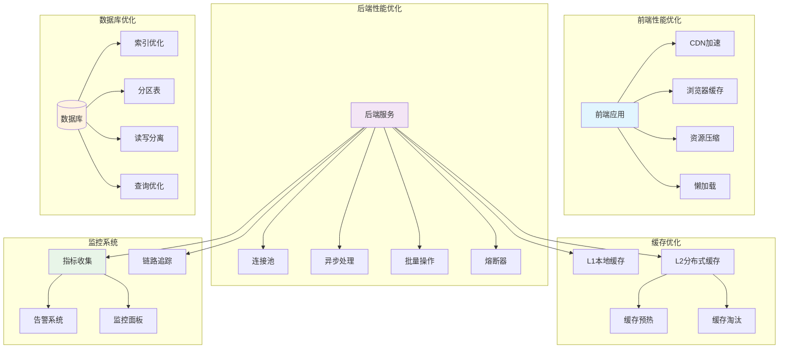
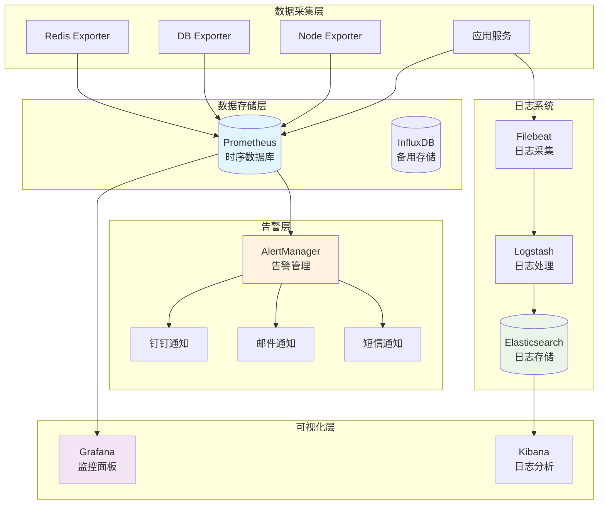

# VoiceHelper性能优化与监控

本文档详细介绍VoiceHelper智能语音助手系统的性能优化策略和监控体系，涵盖性能调优、监控系统、告警机制等关键技术。

## 8. 性能优化与监控

### 8.1 系统性能优化策略

#### 8.1.0 性能优化架构总览


  </div>
</div>

#### 8.1.1 前端性能优化

```typescript
// 前端性能优化配置
// 文件路径: frontend/next.config.js
const nextConfig = {
  // 启用实验性功能
  experimental: {
    optimizeCss: true,
    optimizePackageImports: ['@mui/material', 'lodash'],
  },
  
  // 压缩配置
  compress: true,
  
  // 图片优化
  images: {
    domains: ['cdn.voicehelper.com'],
    formats: ['image/webp', 'image/avif'],
    minimumCacheTTL: 60 * 60 * 24 * 30, // 30天
  },
  
  // Webpack优化
  webpack: (config, { dev, isServer }) => {
    // 生产环境优化
    if (!dev && !isServer) {
      config.optimization.splitChunks = {
        chunks: 'all',
        cacheGroups: {
          vendor: {
            test: /[\\/]node_modules[\\/]/,
            name: 'vendors',
            chunks: 'all',
          },
          common: {
            name: 'common',
            minChunks: 2,
            chunks: 'all',
            enforce: true,
          },
        },
      }
    }
    
    return config
  },
  
  // 头部优化
  async headers() {
    return [
      {
        source: '/(.*)',
        headers: [
          {
            key: 'X-DNS-Prefetch-Control',
            value: 'on'
          },
          {
            key: 'X-Frame-Options',
            value: 'DENY'
          },
          {
            key: 'X-Content-Type-Options',
            value: 'nosniff'
          },
        ],
      },
      {
        source: '/static/(.*)',
        headers: [
          {
            key: 'Cache-Control',
            value: 'public, max-age=31536000, immutable',
          },
        ],
      },
    ]
  },
}

module.exports = nextConfig
```

```typescript
// 前端性能监控Hook
// 文件路径: frontend/hooks/usePerformanceMonitor.ts
import { useEffect, useCallback } from 'react'

interface PerformanceMetrics {
  fcp: number // First Contentful Paint
  lcp: number // Largest Contentful Paint
  fid: number // First Input Delay
  cls: number // Cumulative Layout Shift
  ttfb: number // Time to First Byte
}

export function usePerformanceMonitor() {
  const reportMetrics = useCallback((metrics: Partial<PerformanceMetrics>) => {
    // 发送性能数据到监控服务
    fetch('/api/performance/metrics', {
      method: 'POST',
      headers: { 'Content-Type': 'application/json' },
      body: JSON.stringify({
        ...metrics,
        timestamp: Date.now(),
        userAgent: navigator.userAgent,
        url: window.location.href,
      }),
    }).catch(console.error)
  }, [])

  useEffect(() => {
    // 监控Core Web Vitals
    const observer = new PerformanceObserver((list) => {
      for (const entry of list.getEntries()) {
        switch (entry.entryType) {
          case 'paint':
            if (entry.name === 'first-contentful-paint') {
              reportMetrics({ fcp: entry.startTime })
            }
            break
          case 'largest-contentful-paint':
            reportMetrics({ lcp: entry.startTime })
            break
          case 'first-input':
            reportMetrics({ fid: entry.processingStart - entry.startTime })
            break
          case 'layout-shift':
            if (!entry.hadRecentInput) {
              reportMetrics({ cls: entry.value })
            }
            break
        }
      }
    })

    // 监控不同类型的性能指标
    observer.observe({ entryTypes: ['paint', 'largest-contentful-paint', 'first-input', 'layout-shift'] })

    // 监控导航性能
    const navObserver = new PerformanceObserver((list) => {
      for (const entry of list.getEntries()) {
        if (entry.entryType === 'navigation') {
          const navEntry = entry as PerformanceNavigationTiming
          reportMetrics({
            ttfb: navEntry.responseStart - navEntry.requestStart,
          })
        }
      }
    })

    navObserver.observe({ entryTypes: ['navigation'] })

    return () => {
      observer.disconnect()
      navObserver.disconnect()
    }
  }, [reportMetrics])

  // 监控资源加载性能
  useEffect(() => {
    const resourceObserver = new PerformanceObserver((list) => {
      for (const entry of list.getEntries()) {
        if (entry.entryType === 'resource') {
          const resourceEntry = entry as PerformanceResourceTiming
          
          // 监控慢资源
          if (resourceEntry.duration > 1000) {
            fetch('/api/performance/slow-resources', {
              method: 'POST',
              headers: { 'Content-Type': 'application/json' },
              body: JSON.stringify({
                name: resourceEntry.name,
                duration: resourceEntry.duration,
                size: resourceEntry.transferSize,
                type: resourceEntry.initiatorType,
                timestamp: Date.now(),
              }),
            }).catch(console.error)
          }
        }
      }
    })

    resourceObserver.observe({ entryTypes: ['resource'] })

    return () => resourceObserver.disconnect()
  }, [])
}

// 组件级性能监控
export function withPerformanceMonitoring<T extends object>(
  WrappedComponent: React.ComponentType<T>,
  componentName: string
) {
  return function PerformanceMonitoredComponent(props: T) {
    useEffect(() => {
      const startTime = performance.now()
      
      return () => {
        const endTime = performance.now()
        const renderTime = endTime - startTime
        
        // 报告组件渲染时间
        if (renderTime > 16) { // 超过一帧的时间
          fetch('/api/performance/component-render', {
            method: 'POST',
            headers: { 'Content-Type': 'application/json' },
            body: JSON.stringify({
              component: componentName,
              renderTime,
              timestamp: Date.now(),
            }),
          }).catch(console.error)
        }
      }
    }, [])

    return <WrappedComponent {...props} />
  }
}
```

#### 8.1.2 后端性能优化

```go
// 后端性能优化中间件
// 文件路径: backend/internal/middleware/performance.go
package middleware

import (
    "context"
    "runtime"
    "time"
    
    "github.com/gin-gonic/gin"
    "github.com/prometheus/client_golang/prometheus"
    "github.com/prometheus/client_golang/prometheus/promauto"
)

var (
    // HTTP请求指标
    httpRequestsTotal = promauto.NewCounterVec(
        prometheus.CounterOpts{
            Name: "http_requests_total",
            Help: "Total number of HTTP requests",
        },
        []string{"method", "endpoint", "status"},
    )
    
    httpRequestDuration = promauto.NewHistogramVec(
        prometheus.HistogramOpts{
            Name:    "http_request_duration_seconds",
            Help:    "HTTP request duration in seconds",
            Buckets: prometheus.DefBuckets,
        },
        []string{"method", "endpoint"},
    )
    
    // 系统资源指标
    memoryUsage = promauto.NewGaugeVec(
        prometheus.GaugeOpts{
            Name: "memory_usage_bytes",
            Help: "Memory usage in bytes",
        },
        []string{"type"},
    )
    
    goroutineCount = promauto.NewGauge(
        prometheus.GaugeOpts{
            Name: "goroutines_count",
            Help: "Number of goroutines",
        },
    )
)

// 性能监控中间件
func PerformanceMonitoring() gin.HandlerFunc {
    return func(c *gin.Context) {
        start := time.Now()
        
        // 处理请求
        c.Next()
        
        // 记录指标
        duration := time.Since(start)
        method := c.Request.Method
        endpoint := c.FullPath()
        status := c.Writer.Status()
        
        httpRequestsTotal.WithLabelValues(method, endpoint, string(rune(status))).Inc()
        httpRequestDuration.WithLabelValues(method, endpoint).Observe(duration.Seconds())
        
        // 记录慢请求
        if duration > time.Second {
            logger.Warn("Slow request detected",
                "method", method,
                "endpoint", endpoint,
                "duration", duration,
                "status", status,
            )
        }
    }
}

// 系统资源监控
func StartResourceMonitoring(ctx context.Context) {
    ticker := time.NewTicker(30 * time.Second)
    defer ticker.Stop()
    
    for {
        select {
        case <-ctx.Done():
            return
        case <-ticker.C:
            var m runtime.MemStats
            runtime.ReadMemStats(&m)
            
            // 更新内存指标
            memoryUsage.WithLabelValues("heap_alloc").Set(float64(m.HeapAlloc))
            memoryUsage.WithLabelValues("heap_sys").Set(float64(m.HeapSys))
            memoryUsage.WithLabelValues("stack_sys").Set(float64(m.StackSys))
            
            // 更新协程数量
            goroutineCount.Set(float64(runtime.NumGoroutine()))
        }
    }
}

// 连接池优化
type ConnectionPool struct {
    pool chan *Connection
    maxConnections int
    activeConnections int
    mu sync.RWMutex
}

func NewConnectionPool(maxConnections int) *ConnectionPool {
    return &ConnectionPool{
        pool: make(chan *Connection, maxConnections),
        maxConnections: maxConnections,
    }
}

func (cp *ConnectionPool) Get() (*Connection, error) {
    select {
    case conn := <-cp.pool:
        return conn, nil
    default:
        cp.mu.Lock()
        if cp.activeConnections < cp.maxConnections {
            cp.activeConnections++
            cp.mu.Unlock()
            return cp.createConnection()
        }
        cp.mu.Unlock()
        
        // 等待可用连接
        select {
        case conn := <-cp.pool:
            return conn, nil
        case <-time.After(5 * time.Second):
            return nil, errors.New("connection pool timeout")
        }
    }
}

func (cp *ConnectionPool) Put(conn *Connection) {
    if conn.IsValid() {
        select {
        case cp.pool <- conn:
        default:
            // 池已满，关闭连接
            conn.Close()
            cp.mu.Lock()
            cp.activeConnections--
            cp.mu.Unlock()
        }
    } else {
        conn.Close()
        cp.mu.Lock()
        cp.activeConnections--
        cp.mu.Unlock()
    }
}
```

#### 8.1.3 数据库性能优化

```sql
-- PostgreSQL性能优化配置
-- 文件路径: database/performance_optimization.sql

-- 创建索引优化
CREATE INDEX CONCURRENTLY idx_messages_session_created 
ON messages(session_id, created_at DESC);

CREATE INDEX CONCURRENTLY idx_documents_user_status 
ON documents(user_id, status) WHERE status IN ('completed', 'processing');

CREATE INDEX CONCURRENTLY idx_sessions_user_updated 
ON sessions(user_id, updated_at DESC);

-- 分区表优化
CREATE TABLE messages_2024_01 PARTITION OF messages
FOR VALUES FROM ('2024-01-01') TO ('2024-02-01');

CREATE TABLE messages_2024_02 PARTITION OF messages
FOR VALUES FROM ('2024-02-01') TO ('2024-03-01');

-- 查询优化视图
CREATE MATERIALIZED VIEW user_session_stats AS
SELECT 
    user_id,
    COUNT(*) as total_sessions,
    COUNT(*) FILTER (WHERE status = 'active') as active_sessions,
    MAX(updated_at) as last_activity,
    AVG(EXTRACT(EPOCH FROM (updated_at - created_at))) as avg_session_duration
FROM sessions
GROUP BY user_id;

-- 定期刷新物化视图
CREATE OR REPLACE FUNCTION refresh_user_session_stats()
RETURNS void AS $$
BEGIN
    REFRESH MATERIALIZED VIEW CONCURRENTLY user_session_stats;
END;
$$ LANGUAGE plpgsql;

-- 创建定时任务
SELECT cron.schedule('refresh-stats', '0 */6 * * *', 'SELECT refresh_user_session_stats();');

-- 查询性能监控
CREATE OR REPLACE FUNCTION log_slow_queries()
RETURNS event_trigger AS $$
BEGIN
    -- 记录慢查询
    INSERT INTO slow_query_log (query, duration, timestamp)
    SELECT query, total_time, now()
    FROM pg_stat_statements
    WHERE total_time > 1000; -- 超过1秒的查询
END;
$$ LANGUAGE plpgsql;

-- 自动VACUUM和ANALYZE
ALTER TABLE messages SET (
    autovacuum_vacuum_scale_factor = 0.1,
    autovacuum_analyze_scale_factor = 0.05
);

ALTER TABLE sessions SET (
    autovacuum_vacuum_scale_factor = 0.2,
    autovacuum_analyze_scale_factor = 0.1
);
```

```go
// 数据库连接池优化
// 文件路径: backend/internal/database/pool.go
package database

import (
    "database/sql"
    "time"
    
    _ "github.com/lib/pq"
)

type DatabaseConfig struct {
    DSN             string
    MaxOpenConns    int
    MaxIdleConns    int
    ConnMaxLifetime time.Duration
    ConnMaxIdleTime time.Duration
}

func NewOptimizedDB(config *DatabaseConfig) (*sql.DB, error) {
    db, err := sql.Open("postgres", config.DSN)
    if err != nil {
        return nil, err
    }
    
    // 连接池优化配置
    db.SetMaxOpenConns(config.MaxOpenConns)     // 最大打开连接数
    db.SetMaxIdleConns(config.MaxIdleConns)     // 最大空闲连接数
    db.SetConnMaxLifetime(config.ConnMaxLifetime) // 连接最大生存时间
    db.SetConnMaxIdleTime(config.ConnMaxIdleTime) // 连接最大空闲时间
    
    // 测试连接
    if err := db.Ping(); err != nil {
        return nil, err
    }
    
    return db, nil
}

// 查询优化器
type QueryOptimizer struct {
    db *sql.DB
    cache map[string]*sql.Stmt
    mu sync.RWMutex
}

func NewQueryOptimizer(db *sql.DB) *QueryOptimizer {
    return &QueryOptimizer{
        db: db,
        cache: make(map[string]*sql.Stmt),
    }
}

func (qo *QueryOptimizer) PrepareQuery(name, query string) error {
    stmt, err := qo.db.Prepare(query)
    if err != nil {
        return err
    }
    
    qo.mu.Lock()
    qo.cache[name] = stmt
    qo.mu.Unlock()
    
    return nil
}

func (qo *QueryOptimizer) ExecuteQuery(name string, args ...interface{}) (*sql.Rows, error) {
    qo.mu.RLock()
    stmt, exists := qo.cache[name]
    qo.mu.RUnlock()
    
    if !exists {
        return nil, fmt.Errorf("prepared statement %s not found", name)
    }
    
    return stmt.Query(args...)
}

// 批量操作优化
func (qo *QueryOptimizer) BatchInsert(table string, columns []string, values [][]interface{}) error {
    if len(values) == 0 {
        return nil
    }
    
    // 构建批量插入SQL
    placeholders := make([]string, len(values))
    args := make([]interface{}, 0, len(values)*len(columns))
    
    for i, row := range values {
        placeholder := make([]string, len(columns))
        for j := range columns {
            placeholder[j] = fmt.Sprintf("$%d", len(args)+j+1)
        }
        placeholders[i] = fmt.Sprintf("(%s)", strings.Join(placeholder, ","))
        args = append(args, row...)
    }
    
    query := fmt.Sprintf("INSERT INTO %s (%s) VALUES %s",
        table,
        strings.Join(columns, ","),
        strings.Join(placeholders, ","))
    
    _, err := qo.db.Exec(query, args...)
    return err
}
```

### 8.2 缓存优化策略

#### 8.2.1 多级缓存架构

```go
// 多级缓存实现
// 文件路径: backend/internal/cache/multilevel_cache.go
package cache

import (
    "context"
    "encoding/json"
    "fmt"
    "sync"
    "time"
    
    "github.com/go-redis/redis/v8"
    lru "github.com/hashicorp/golang-lru"
)

type MultiLevelCache struct {
    l1Cache *lru.Cache      // 本地LRU缓存
    l2Cache *redis.Client   // Redis分布式缓存
    stats   *CacheStats
    mu      sync.RWMutex
}

type CacheStats struct {
    L1Hits   int64
    L1Misses int64
    L2Hits   int64
    L2Misses int64
}

func NewMultiLevelCache(l1Size int, redisClient *redis.Client) (*MultiLevelCache, error) {
    l1Cache, err := lru.New(l1Size)
    if err != nil {
        return nil, err
    }
    
    return &MultiLevelCache{
        l1Cache: l1Cache,
        l2Cache: redisClient,
        stats:   &CacheStats{},
    }, nil
}

func (mc *MultiLevelCache) Get(ctx context.Context, key string) (interface{}, error) {
    // 先查L1缓存
    if value, ok := mc.l1Cache.Get(key); ok {
        mc.mu.Lock()
        mc.stats.L1Hits++
        mc.mu.Unlock()
        return value, nil
    }
    
    mc.mu.Lock()
    mc.stats.L1Misses++
    mc.mu.Unlock()
    
    // 查L2缓存
    data, err := mc.l2Cache.Get(ctx, key).Result()
    if err == redis.Nil {
        mc.mu.Lock()
        mc.stats.L2Misses++
        mc.mu.Unlock()
        return nil, ErrCacheMiss
    } else if err != nil {
        return nil, err
    }
    
    mc.mu.Lock()
    mc.stats.L2Hits++
    mc.mu.Unlock()
    
    // 反序列化数据
    var value interface{}
    if err := json.Unmarshal([]byte(data), &value); err != nil {
        return nil, err
    }
    
    // 回填L1缓存
    mc.l1Cache.Add(key, value)
    
    return value, nil
}

func (mc *MultiLevelCache) Set(ctx context.Context, key string, value interface{}, expiration time.Duration) error {
    // 设置L1缓存
    mc.l1Cache.Add(key, value)
    
    // 序列化数据
    data, err := json.Marshal(value)
    if err != nil {
        return err
    }
    
    // 设置L2缓存
    return mc.l2Cache.Set(ctx, key, data, expiration).Err()
}

func (mc *MultiLevelCache) Delete(ctx context.Context, key string) error {
    // 删除L1缓存
    mc.l1Cache.Remove(key)
    
    // 删除L2缓存
    return mc.l2Cache.Del(ctx, key).Err()
}

func (mc *MultiLevelCache) GetStats() CacheStats {
    mc.mu.RLock()
    defer mc.mu.RUnlock()
    return *mc.stats
}

// 缓存预热
func (mc *MultiLevelCache) Warmup(ctx context.Context, keys []string, loader func(string) (interface{}, error)) error {
    for _, key := range keys {
        // 检查是否已缓存
        if _, err := mc.Get(ctx, key); err == nil {
            continue
        }
        
        // 加载数据
        value, err := loader(key)
        if err != nil {
            continue
        }
        
        // 设置缓存
        mc.Set(ctx, key, value, time.Hour)
    }
    
    return nil
}
```

#### 8.2.2 智能缓存策略

```go
// 智能缓存策略
// 文件路径: backend/internal/cache/smart_cache.go
package cache

import (
    "context"
    "hash/fnv"
    "math"
    "sync"
    "time"
)

type SmartCache struct {
    cache     *MultiLevelCache
    analytics *CacheAnalytics
    strategy  CacheStrategy
}

type CacheAnalytics struct {
    accessCount map[string]int64
    accessTime  map[string]time.Time
    hitRate     map[string]float64
    mu          sync.RWMutex
}

type CacheStrategy interface {
    ShouldCache(key string, value interface{}) bool
    GetTTL(key string, value interface{}) time.Duration
    GetPriority(key string) int
}

type AdaptiveCacheStrategy struct {
    analytics *CacheAnalytics
}

func (acs *AdaptiveCacheStrategy) ShouldCache(key string, value interface{}) bool {
    acs.analytics.mu.RLock()
    defer acs.analytics.mu.RUnlock()
    
    // 基于访问频率决定是否缓存
    accessCount := acs.analytics.accessCount[key]
    hitRate := acs.analytics.hitRate[key]
    
    // 访问次数超过阈值且命中率高于50%才缓存
    return accessCount > 5 && hitRate > 0.5
}

func (acs *AdaptiveCacheStrategy) GetTTL(key string, value interface{}) time.Duration {
    acs.analytics.mu.RLock()
    defer acs.analytics.mu.RUnlock()
    
    accessCount := acs.analytics.accessCount[key]
    lastAccess := acs.analytics.accessTime[key]
    
    // 基于访问频率和最近访问时间计算TTL
    baseTTL := time.Hour
    
    // 访问频率越高，TTL越长
    frequencyMultiplier := math.Log(float64(accessCount + 1))
    
    // 最近访问时间越近，TTL越长
    timeSinceAccess := time.Since(lastAccess)
    timeMultiplier := math.Max(0.1, 1.0 - timeSinceAccess.Hours()/24.0)
    
    ttl := time.Duration(float64(baseTTL) * frequencyMultiplier * timeMultiplier)
    
    // 限制TTL范围
    if ttl < time.Minute {
        ttl = time.Minute
    } else if ttl > time.Hour*24 {
        ttl = time.Hour * 24
    }
    
    return ttl
}

func (acs *AdaptiveCacheStrategy) GetPriority(key string) int {
    acs.analytics.mu.RLock()
    defer acs.analytics.mu.RUnlock()
    
    accessCount := acs.analytics.accessCount[key]
    hitRate := acs.analytics.hitRate[key]
    
    // 基于访问频率和命中率计算优先级
    return int(float64(accessCount) * hitRate)
}

// 缓存分片
type ShardedCache struct {
    shards []*MultiLevelCache
    count  int
}

func NewShardedCache(shardCount, l1Size int, redisClients []*redis.Client) (*ShardedCache, error) {
    if len(redisClients) != shardCount {
        return nil, fmt.Errorf("redis clients count mismatch")
    }
    
    shards := make([]*MultiLevelCache, shardCount)
    for i := 0; i < shardCount; i++ {
        cache, err := NewMultiLevelCache(l1Size, redisClients[i])
        if err != nil {
            return nil, err
        }
        shards[i] = cache
    }
    
    return &ShardedCache{
        shards: shards,
        count:  shardCount,
    }, nil
}

func (sc *ShardedCache) getShard(key string) *MultiLevelCache {
    h := fnv.New32a()
    h.Write([]byte(key))
    return sc.shards[h.Sum32()%uint32(sc.count)]
}

func (sc *ShardedCache) Get(ctx context.Context, key string) (interface{}, error) {
    return sc.getShard(key).Get(ctx, key)
}

func (sc *ShardedCache) Set(ctx context.Context, key string, value interface{}, expiration time.Duration) error {
    return sc.getShard(key).Set(ctx, key, value, expiration)
}

func (sc *ShardedCache) Delete(ctx context.Context, key string) error {
    return sc.getShard(key).Delete(ctx, key)
}
```

### 8.3 监控系统实现

#### 8.3.0 监控系统架构图


  </div>
</div>

#### 8.3.1 Prometheus监控配置

```yaml
# Prometheus配置文件
# 文件路径: monitoring/prometheus.yml
global:
  scrape_interval: 15s
  evaluation_interval: 15s

rule_files:
  - "alert_rules.yml"

alerting:
  alertmanagers:
    - static_configs:
        - targets:
          - alertmanager:9093

scrape_configs:
  # VoiceHelper后端服务
  - job_name: 'voicehelper-backend'
    static_configs:
      - targets: ['backend:8080']
    metrics_path: /metrics
    scrape_interval: 10s
    
  # VoiceHelper AI服务
  - job_name: 'voicehelper-ai'
    static_configs:
      - targets: ['ai-service:8000']
    metrics_path: /metrics
    scrape_interval: 15s
    
  # PostgreSQL监控
  - job_name: 'postgres'
    static_configs:
      - targets: ['postgres-exporter:9187']
    
  # Redis监控
  - job_name: 'redis'
    static_configs:
      - targets: ['redis-exporter:9121']
    
  # Milvus监控
  - job_name: 'milvus'
    static_configs:
      - targets: ['milvus:9091']
    
  # 系统监控
  - job_name: 'node-exporter'
    static_configs:
      - targets: ['node-exporter:9100']
    
  # Nginx监控
  - job_name: 'nginx'
    static_configs:
      - targets: ['nginx-exporter:9113']

# 远程写入配置（可选）
remote_write:
  - url: "https://prometheus-remote-write.example.com/api/v1/write"
    basic_auth:
      username: "user"
      password: "password"
```

```yaml
# 告警规则配置
# 文件路径: monitoring/alert_rules.yml
groups:
  - name: voicehelper.rules
    rules:
      # 服务可用性告警
      - alert: ServiceDown
        expr: up == 0
        for: 1m
        labels:
          severity: critical
        annotations:
          summary: "Service {{ $labels.job }} is down"
          description: "Service {{ $labels.job }} has been down for more than 1 minute."
      
      # 高错误率告警
      - alert: HighErrorRate
        expr: rate(http_requests_total{status=~"5.."}[5m]) > 0.1
        for: 2m
        labels:
          severity: warning
        annotations:
          summary: "High error rate detected"
          description: "Error rate is {{ $value }} errors per second for {{ $labels.job }}."
      
      # 高延迟告警
      - alert: HighLatency
        expr: histogram_quantile(0.95, rate(http_request_duration_seconds_bucket[5m])) > 1
        for: 3m
        labels:
          severity: warning
        annotations:
          summary: "High latency detected"
          description: "95th percentile latency is {{ $value }}s for {{ $labels.job }}."
      
      # 内存使用率告警
      - alert: HighMemoryUsage
        expr: (1 - (node_memory_MemAvailable_bytes / node_memory_MemTotal_bytes)) * 100 > 80
        for: 5m
        labels:
          severity: warning
        annotations:
          summary: "High memory usage"
          description: "Memory usage is above 80% (current value: {{ $value }}%)"
      
      # CPU使用率告警
      - alert: HighCPUUsage
        expr: 100 - (avg by(instance) (irate(node_cpu_seconds_total{mode="idle"}[5m])) * 100) > 80
        for: 5m
        labels:
          severity: warning
        annotations:
          summary: "High CPU usage"
          description: "CPU usage is above 80% (current value: {{ $value }}%)"
      
      # 磁盘空间告警
      - alert: DiskSpaceLow
        expr: (node_filesystem_avail_bytes / node_filesystem_size_bytes) * 100 < 10
        for: 1m
        labels:
          severity: critical
        annotations:
          summary: "Disk space low"
          description: "Disk space is below 10% (current value: {{ $value }}%)"
      
      # 数据库连接数告警
      - alert: DatabaseConnectionsHigh
        expr: pg_stat_database_numbackends > 80
        for: 2m
        labels:
          severity: warning
        annotations:
          summary: "High database connections"
          description: "Database connections are above 80 (current value: {{ $value }})"
      
      # Redis内存使用告警
      - alert: RedisMemoryHigh
        expr: redis_memory_used_bytes / redis_memory_max_bytes * 100 > 80
        for: 2m
        labels:
          severity: warning
        annotations:
          summary: "Redis memory usage high"
          description: "Redis memory usage is above 80% (current value: {{ $value }}%)"
```

#### 8.3.2 Grafana仪表盘配置

```json
{
  "dashboard": {
    "id": null,
    "title": "VoiceHelper System Overview",
    "tags": ["voicehelper", "monitoring"],
    "timezone": "browser",
    "panels": [
      {
        "id": 1,
        "title": "Request Rate",
        "type": "graph",
        "targets": [
          {
            "expr": "rate(http_requests_total[5m])",
            "legendFormat": "{{method}} {{endpoint}}"
          }
        ],
        "yAxes": [
          {
            "label": "Requests/sec"
          }
        ],
        "gridPos": {
          "h": 8,
          "w": 12,
          "x": 0,
          "y": 0
        }
      },
      {
        "id": 2,
        "title": "Response Time",
        "type": "graph",
        "targets": [
          {
            "expr": "histogram_quantile(0.95, rate(http_request_duration_seconds_bucket[5m]))",
            "legendFormat": "95th percentile"
          },
          {
            "expr": "histogram_quantile(0.50, rate(http_request_duration_seconds_bucket[5m]))",
            "legendFormat": "50th percentile"
          }
        ],
        "yAxes": [
          {
            "label": "Seconds"
          }
        ],
        "gridPos": {
          "h": 8,
          "w": 12,
          "x": 12,
          "y": 0
        }
      },
      {
        "id": 3,
        "title": "Error Rate",
        "type": "singlestat",
        "targets": [
          {
            "expr": "rate(http_requests_total{status=~\"5..\"}[5m]) / rate(http_requests_total[5m]) * 100"
          }
        ],
        "valueName": "current",
        "format": "percent",
        "thresholds": "1,5",
        "colorBackground": true,
        "gridPos": {
          "h": 4,
          "w": 6,
          "x": 0,
          "y": 8
        }
      },
      {
        "id": 4,
        "title": "Active Sessions",
        "type": "singlestat",
        "targets": [
          {
            "expr": "active_sessions_total"
          }
        ],
        "valueName": "current",
        "format": "short",
        "gridPos": {
          "h": 4,
          "w": 6,
          "x": 6,
          "y": 8
        }
      },
      {
        "id": 5,
        "title": "Memory Usage",
        "type": "graph",
        "targets": [
          {
            "expr": "memory_usage_bytes{type=\"heap_alloc\"}",
            "legendFormat": "Heap Allocated"
          },
          {
            "expr": "memory_usage_bytes{type=\"heap_sys\"}",
            "legendFormat": "Heap System"
          }
        ],
        "yAxes": [
          {
            "label": "Bytes",
            "logBase": 1
          }
        ],
        "gridPos": {
          "h": 8,
          "w": 12,
          "x": 12,
          "y": 8
        }
      },
      {
        "id": 6,
        "title": "Database Performance",
        "type": "graph",
        "targets": [
          {
            "expr": "pg_stat_database_tup_fetched",
            "legendFormat": "Tuples Fetched"
          },
          {
            "expr": "pg_stat_database_tup_inserted",
            "legendFormat": "Tuples Inserted"
          },
          {
            "expr": "pg_stat_database_tup_updated",
            "legendFormat": "Tuples Updated"
          }
        ],
        "gridPos": {
          "h": 8,
          "w": 24,
          "x": 0,
          "y": 16
        }
      }
    ],
    "time": {
      "from": "now-1h",
      "to": "now"
    },
    "refresh": "5s"
  }
}
```

#### 8.3.3 自定义监控指标

```go
// 自定义监控指标
// 文件路径: backend/internal/metrics/custom_metrics.go
package metrics

import (
    "time"
    
    "github.com/prometheus/client_golang/prometheus"
    "github.com/prometheus/client_golang/prometheus/promauto"
)

var (
    // 业务指标
    ActiveSessions = promauto.NewGauge(prometheus.GaugeOpts{
        Name: "active_sessions_total",
        Help: "Total number of active sessions",
    })
    
    MessageProcessingTime = promauto.NewHistogramVec(
        prometheus.HistogramOpts{
            Name:    "message_processing_duration_seconds",
            Help:    "Time spent processing messages",
            Buckets: []float64{0.1, 0.5, 1.0, 2.0, 5.0, 10.0},
        },
        []string{"message_type"},
    )
    
    RAGRetrievalTime = promauto.NewHistogram(prometheus.HistogramOpts{
        Name:    "rag_retrieval_duration_seconds",
        Help:    "Time spent on RAG retrieval",
        Buckets: []float64{0.01, 0.05, 0.1, 0.2, 0.5, 1.0},
    })
    
    VectorSearchLatency = promauto.NewHistogram(prometheus.HistogramOpts{
        Name:    "vector_search_duration_seconds",
        Help:    "Vector search latency",
        Buckets: []float64{0.001, 0.005, 0.01, 0.05, 0.1, 0.2},
    })
    
    LLMTokensUsed = promauto.NewCounterVec(
        prometheus.CounterOpts{
            Name: "llm_tokens_used_total",
            Help: "Total number of LLM tokens used",
        },
        []string{"model", "user_tier"},
    )
    
    CacheHitRate = promauto.NewGaugeVec(
        prometheus.GaugeOpts{
            Name: "cache_hit_rate",
            Help: "Cache hit rate by cache level",
        },
        []string{"level"},
    )
    
    DocumentProcessingQueue = promauto.NewGauge(prometheus.GaugeOpts{
        Name: "document_processing_queue_size",
        Help: "Number of documents in processing queue",
    })
    
    UserActivityRate = promauto.NewGaugeVec(
        prometheus.GaugeOpts{
            Name: "user_activity_rate",
            Help: "User activity rate by time period",
        },
        []string{"period"},
    )
)

// 指标收集器
type MetricsCollector struct {
    sessionManager *SessionManager
    cacheManager   *CacheManager
    queueManager   *QueueManager
}

func NewMetricsCollector(sm *SessionManager, cm *CacheManager, qm *QueueManager) *MetricsCollector {
    return &MetricsCollector{
        sessionManager: sm,
        cacheManager:   cm,
        queueManager:   qm,
    }
}

func (mc *MetricsCollector) StartCollection() {
    ticker := time.NewTicker(30 * time.Second)
    go func() {
        for range ticker.C {
            mc.collectMetrics()
        }
    }()
}

func (mc *MetricsCollector) collectMetrics() {
    // 收集活跃会话数
    ActiveSessions.Set(float64(mc.sessionManager.GetActiveSessionCount()))
    
    // 收集缓存命中率
    l1Stats := mc.cacheManager.GetL1Stats()
    l2Stats := mc.cacheManager.GetL2Stats()
    
    if l1Stats.Total > 0 {
        CacheHitRate.WithLabelValues("l1").Set(float64(l1Stats.Hits) / float64(l1Stats.Total))
    }
    
    if l2Stats.Total > 0 {
        CacheHitRate.WithLabelValues("l2").Set(float64(l2Stats.Hits) / float64(l2Stats.Total))
    }
    
    // 收集队列大小
    DocumentProcessingQueue.Set(float64(mc.queueManager.GetQueueSize("document_processing")))
    
    // 收集用户活跃度
    hourlyActive := mc.sessionManager.GetActiveUsersInPeriod(time.Hour)
    dailyActive := mc.sessionManager.GetActiveUsersInPeriod(24 * time.Hour)
    
    UserActivityRate.WithLabelValues("hourly").Set(float64(hourlyActive))
    UserActivityRate.WithLabelValues("daily").Set(float64(dailyActive))
}

// 性能追踪装饰器
func TrackPerformance(metric prometheus.Observer) func(func()) {
    return func(fn func()) {
        start := time.Now()
        defer func() {
            metric.Observe(time.Since(start).Seconds())
        }()
        fn()
    }
}

// 使用示例
func ProcessMessage(messageType string, processFn func()) {
    timer := MessageProcessingTime.WithLabelValues(messageType)
    TrackPerformance(timer)(processFn)
}
```

### 8.4 告警系统实现

#### 8.4.1 AlertManager配置

```yaml
# AlertManager配置文件
# 文件路径: monitoring/alertmanager.yml
global:
  smtp_smarthost: 'smtp.gmail.com:587'
  smtp_from: 'alerts@voicehelper.com'
  smtp_auth_username: 'alerts@voicehelper.com'
  smtp_auth_password: 'your-app-password'

route:
  group_by: ['alertname', 'cluster', 'service']
  group_wait: 10s
  group_interval: 10s
  repeat_interval: 1h
  receiver: 'default'
  routes:
    - match:
        severity: critical
      receiver: 'critical-alerts'
      group_wait: 5s
      repeat_interval: 30m
    - match:
        severity: warning
      receiver: 'warning-alerts'
      repeat_interval: 2h

receivers:
  - name: 'default'
    email_configs:
      - to: 'team@voicehelper.com'
        subject: '[VoiceHelper] Alert: {{ .GroupLabels.alertname }}'
        body: |
          {{ range .Alerts }}
          Alert: {{ .Annotations.summary }}
          Description: {{ .Annotations.description }}
          Labels: {{ range .Labels.SortedPairs }}{{ .Name }}={{ .Value }} {{ end }}
          {{ end }}

  - name: 'critical-alerts'
    email_configs:
      - to: 'oncall@voicehelper.com'
        subject: '[CRITICAL] VoiceHelper Alert: {{ .GroupLabels.alertname }}'
        body: |
          🚨 CRITICAL ALERT 🚨
          
          {{ range .Alerts }}
          Alert: {{ .Annotations.summary }}
          Description: {{ .Annotations.description }}
          Severity: {{ .Labels.severity }}
          Service: {{ .Labels.job }}
          Time: {{ .StartsAt }}
          {{ end }}
    webhook_configs:
      - url: 'http://dingtalk-webhook:8080/webhook'
        send_resolved: true

  - name: 'warning-alerts'
    email_configs:
      - to: 'team@voicehelper.com'
        subject: '[WARNING] VoiceHelper Alert: {{ .GroupLabels.alertname }}'
        body: |
          ⚠️ Warning Alert
          
          {{ range .Alerts }}
          Alert: {{ .Annotations.summary }}
          Description: {{ .Annotations.description }}
          {{ end }}

inhibit_rules:
  - source_match:
      severity: 'critical'
    target_match:
      severity: 'warning'
    equal: ['alertname', 'cluster', 'service']
```

#### 8.4.2 智能告警系统

```go
// 智能告警系统
// 文件路径: backend/internal/alerting/smart_alerting.go
package alerting

import (
    "context"
    "fmt"
    "math"
    "sync"
    "time"
)

type AlertLevel int

const (
    AlertLevelInfo AlertLevel = iota
    AlertLevelWarning
    AlertLevelCritical
)

type Alert struct {
    ID          string
    Name        string
    Level       AlertLevel
    Message     string
    Labels      map[string]string
    Annotations map[string]string
    StartsAt    time.Time
    EndsAt      time.Time
    Resolved    bool
}

type AlertRule struct {
    Name        string
    Expression  string
    Duration    time.Duration
    Level       AlertLevel
    Annotations map[string]string
}

type SmartAlertManager struct {
    rules           []AlertRule
    activeAlerts    map[string]*Alert
    alertHistory    []*Alert
    suppressions    map[string]time.Time
    escalationRules map[AlertLevel][]NotificationChannel
    mu              sync.RWMutex
}

type NotificationChannel interface {
    Send(alert *Alert) error
    GetName() string
}

func NewSmartAlertManager() *SmartAlertManager {
    return &SmartAlertManager{
        activeAlerts:    make(map[string]*Alert),
        suppressions:    make(map[string]time.Time),
        escalationRules: make(map[AlertLevel][]NotificationChannel),
    }
}

func (sam *SmartAlertManager) AddRule(rule AlertRule) {
    sam.mu.Lock()
    defer sam.mu.Unlock()
    sam.rules = append(sam.rules, rule)
}

func (sam *SmartAlertManager) AddNotificationChannel(level AlertLevel, channel NotificationChannel) {
    sam.mu.Lock()
    defer sam.mu.Unlock()
    sam.escalationRules[level] = append(sam.escalationRules[level], channel)
}

func (sam *SmartAlertManager) EvaluateRules(ctx context.Context, metrics map[string]float64) {
    sam.mu.Lock()
    defer sam.mu.Unlock()
    
    for _, rule := range sam.rules {
        if sam.evaluateExpression(rule.Expression, metrics) {
            sam.triggerAlert(rule)
        } else {
            sam.resolveAlert(rule.Name)
        }
    }
}

func (sam *SmartAlertManager) triggerAlert(rule AlertRule) {
    alertID := rule.Name
    
    // 检查是否被抑制
    if suppressUntil, exists := sam.suppressions[alertID]; exists {
        if time.Now().Before(suppressUntil) {
            return
        }
        delete(sam.suppressions, alertID)
    }
    
    // 检查是否已经存在活跃告警
    if existingAlert, exists := sam.activeAlerts[alertID]; exists {
        // 更新告警时间
        existingAlert.EndsAt = time.Now().Add(rule.Duration)
        return
    }
    
    // 创建新告警
    alert := &Alert{
        ID:          alertID,
        Name:        rule.Name,
        Level:       rule.Level,
        Message:     rule.Annotations["summary"],
        Labels:      map[string]string{"alertname": rule.Name},
        Annotations: rule.Annotations,
        StartsAt:    time.Now(),
        EndsAt:      time.Now().Add(rule.Duration),
        Resolved:    false,
    }
    
    sam.activeAlerts[alertID] = alert
    sam.alertHistory = append(sam.alertHistory, alert)
    
    // 发送通知
    go sam.sendNotifications(alert)
}

func (sam *SmartAlertManager) resolveAlert(alertName string) {
    if alert, exists := sam.activeAlerts[alertName]; exists {
        alert.Resolved = true
        alert.EndsAt = time.Now()
        delete(sam.activeAlerts, alertName)
        
        // 发送解决通知
        go sam.sendResolutionNotification(alert)
    }
}

func (sam *SmartAlertManager) sendNotifications(alert *Alert) {
    channels := sam.escalationRules[alert.Level]
    
    for _, channel := range channels {
        if err := channel.Send(alert); err != nil {
            fmt.Printf("Failed to send alert via %s: %v\n", channel.GetName(), err)
        }
    }
    
    // 智能抑制：根据告警频率动态调整抑制时间
    suppressDuration := sam.calculateSuppressionDuration(alert)
    sam.suppressions[alert.ID] = time.Now().Add(suppressDuration)
}

func (sam *SmartAlertManager) calculateSuppressionDuration(alert *Alert) time.Duration {
    // 统计最近1小时内同类告警的频率
    count := 0
    oneHourAgo := time.Now().Add(-time.Hour)
    
    for _, historyAlert := range sam.alertHistory {
        if historyAlert.Name == alert.Name && historyAlert.StartsAt.After(oneHourAgo) {
            count++
        }
    }
    
    // 基于频率计算抑制时间
    baseDuration := 5 * time.Minute
    if count > 10 {
        // 高频告警，延长抑制时间
        return time.Duration(math.Min(float64(baseDuration)*math.Pow(1.5, float64(count-10)), float64(time.Hour)))
    }
    
    return baseDuration
}

func (sam *SmartAlertManager) evaluateExpression(expression string, metrics map[string]float64) bool {
    // 简化的表达式求值器
    // 实际实现中应该使用更完善的表达式解析器
    switch expression {
    case "cpu_usage > 80":
        return metrics["cpu_usage"] > 80
    case "memory_usage > 80":
        return metrics["memory_usage"] > 80
    case "error_rate > 0.05":
        return metrics["error_rate"] > 0.05
    case "response_time > 1":
        return metrics["response_time"] > 1
    default:
        return false
    }
}

// 告警聚合
func (sam *SmartAlertManager) AggregateAlerts() map[string][]*Alert {
    sam.mu.RLock()
    defer sam.mu.RUnlock()
    
    aggregated := make(map[string][]*Alert)
    
    for _, alert := range sam.activeAlerts {
        key := fmt.Sprintf("%s_%s", alert.Labels["service"], alert.Level)
        aggregated[key] = append(aggregated[key], alert)
    }
    
    return aggregated
}

// 告警统计
func (sam *SmartAlertManager) GetAlertStats() map[string]interface{} {
    sam.mu.RLock()
    defer sam.mu.RUnlock()
    
    stats := map[string]interface{}{
        "active_alerts":    len(sam.activeAlerts),
        "total_alerts":     len(sam.alertHistory),
        "suppressed_alerts": len(sam.suppressions),
    }
    
    // 按级别统计
    levelCounts := make(map[AlertLevel]int)
    for _, alert := range sam.activeAlerts {
        levelCounts[alert.Level]++
    }
    
    stats["by_level"] = levelCounts
    
    return stats
}
```

## 相关文档

- [系统架构概览](/posts/voicehelper-architecture-overview/)
- [前端模块深度解析](/posts/voicehelper-frontend-modules/)
- [后端服务核心实现](/posts/voicehelper-backend-services/)
- [AI算法引擎深度分析](/posts/voicehelper-ai-algorithms/)
- [数据存储架构](/posts/voicehelper-data-storage/)
- [系统交互时序图](/posts/voicehelper-system-interactions/)
- [第三方集成与扩展](/posts/voicehelper-third-party-integration/)
- [部署与运维](/posts/voicehelper-deployment-operations/)
- [总结与最佳实践](/posts/voicehelper-best-practices/)
- [项目功能清单](/posts/voicehelper-feature-inventory/)
- [版本迭代历程](/posts/voicehelper-version-history/)
- [竞争力分析](/posts/voicehelper-competitive-analysis/)
- [API接口清单](/posts/voicehelper-api-reference/)
- [错误码系统](/posts/voicehelper-error-codes/)
- [版本迭代计划](/posts/voicehelper-version-roadmap/)
