# VoiceHelper系统交互时序图

本文档详细介绍VoiceHelper智能语音助手系统的各种交互时序图，涵盖用户交互流程、服务间通信、数据流转等核心交互场景。

## 6. 系统交互时序图

### 6.0 系统交互架构总览

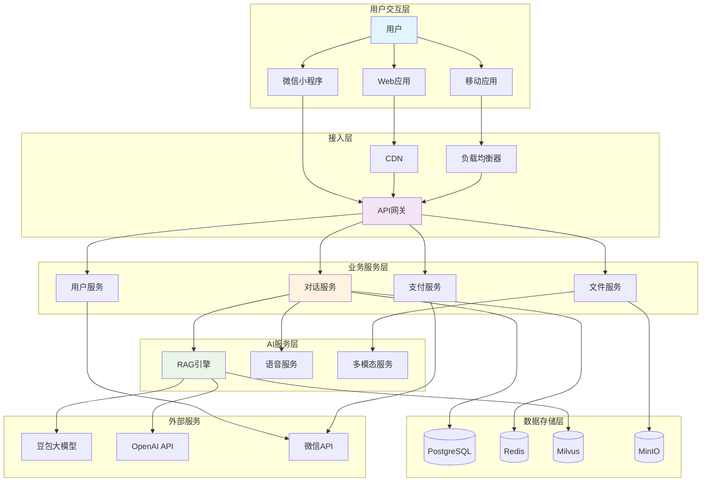
```mermaid
graph TB
    subgraph "用户交互层"
        User[用户]
        WebApp[Web应用]
        MobileApp[移动应用]
        WxMP[微信小程序]
    end
    
    subgraph "接入层"
        CDN[CDN]
        LB[负载均衡器]
        Gateway[API网关]
    end
    
    subgraph "业务服务层"
        ChatService[对话服务]
        UserService[用户服务]
        FileService[文件服务]
        PaymentService[支付服务]
    end
    
    subgraph "AI服务层"
        RAGEngine[RAG引擎]
        VoiceService[语音服务]
        MultiModal[多模态服务]
    end
    
    subgraph "数据存储层"
        PostgreSQL[(PostgreSQL)]
        Redis[(Redis)]
        Milvus[(Milvus)]
        MinIO[(MinIO)]
    end
    
    subgraph "外部服务"
        DoubaoAPI[豆包大模型]
        OpenAIAPI[OpenAI API]
        WxAPI[微信API]
    end
    
    User --> WebApp
    User --> MobileApp
    User --> WxMP
    
    WebApp --> CDN
    MobileApp --> LB
    WxMP --> Gateway
    
    CDN --> Gateway
    LB --> Gateway
    
    Gateway --> ChatService
    Gateway --> UserService
    Gateway --> FileService
    Gateway --> PaymentService
    
    ChatService --> RAGEngine
    ChatService --> VoiceService
    FileService --> MultiModal
    
    RAGEngine --> DoubaoAPI
    RAGEngine --> OpenAIAPI
    UserService --> WxAPI
    PaymentService --> WxAPI
    
    ChatService --> PostgreSQL
    ChatService --> Redis
    RAGEngine --> Milvus
    FileService --> MinIO
    
    style User fill:#e1f5fe
    style Gateway fill:#f3e5f5
    style ChatService fill:#fff3e0
    style RAGEngine fill:#e8f5e8
```
  

### 6.1 用户对话交互流程

#### 6.1.1 文本对话时序图

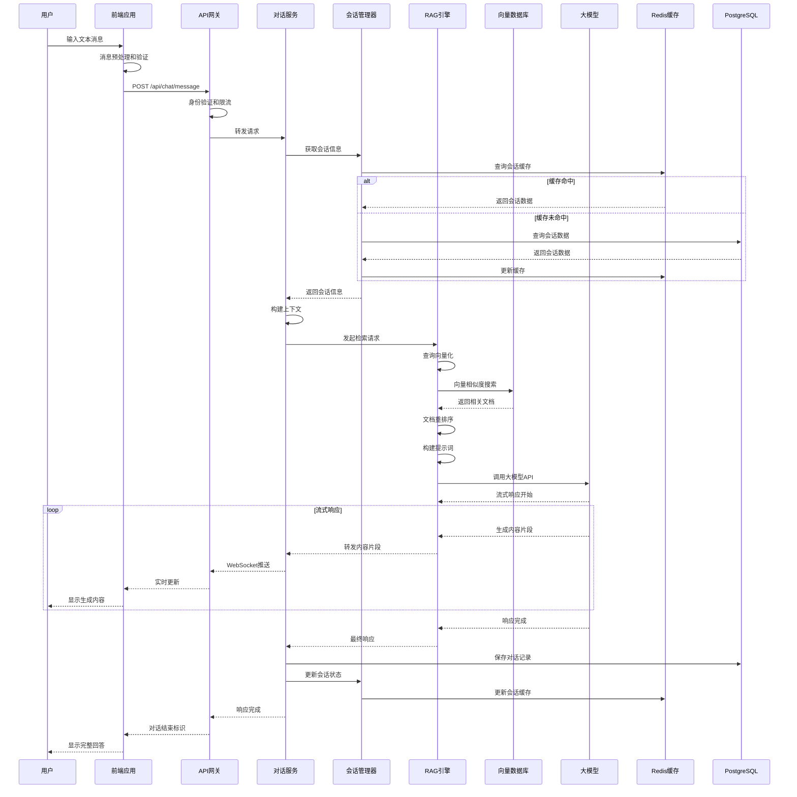
```mermaid
sequenceDiagram
    participant User as 用户
    participant Frontend as 前端应用
    participant Gateway as API网关
    participant ChatService as 对话服务
    participant SessionMgr as 会话管理器
    participant RAGEngine as RAG引擎
    participant VectorDB as 向量数据库
    participant LLM as 大模型
    participant Cache as Redis缓存
    participant DB as PostgreSQL

    User->>Frontend: 输入文本消息
    Frontend->>Frontend: 消息预处理和验证
    Frontend->>Gateway: POST /api/chat/message
    
    Gateway->>Gateway: 身份验证和限流
    Gateway->>ChatService: 转发请求
    
    ChatService->>SessionMgr: 获取会话信息
    SessionMgr->>Cache: 查询会话缓存
    
    alt 缓存命中
        Cache-->>SessionMgr: 返回会话数据
    else 缓存未命中
        SessionMgr->>DB: 查询会话数据
        DB-->>SessionMgr: 返回会话数据
        SessionMgr->>Cache: 更新缓存
    end
    
    SessionMgr-->>ChatService: 返回会话信息
    
    ChatService->>ChatService: 构建上下文
    ChatService->>RAGEngine: 发起检索请求
    
    RAGEngine->>RAGEngine: 查询向量化
    RAGEngine->>VectorDB: 向量相似度搜索
    VectorDB-->>RAGEngine: 返回相关文档
    
    RAGEngine->>RAGEngine: 文档重排序
    RAGEngine->>RAGEngine: 构建提示词
    
    RAGEngine->>LLM: 调用大模型API
    LLM-->>RAGEngine: 流式响应开始
    
    loop 流式响应
        LLM-->>RAGEngine: 生成内容片段
        RAGEngine-->>ChatService: 转发内容片段
        ChatService-->>Gateway: WebSocket推送
        Gateway-->>Frontend: 实时更新
        Frontend-->>User: 显示生成内容
    end
    
    LLM-->>RAGEngine: 响应完成
    RAGEngine-->>ChatService: 最终响应
    
    ChatService->>DB: 保存对话记录
    ChatService->>SessionMgr: 更新会话状态
    SessionMgr->>Cache: 更新会话缓存
    
    ChatService-->>Gateway: 响应完成
    Gateway-->>Frontend: 对话结束标识
    Frontend-->>User: 显示完整回答
```

#### 6.1.2 语音对话时序图

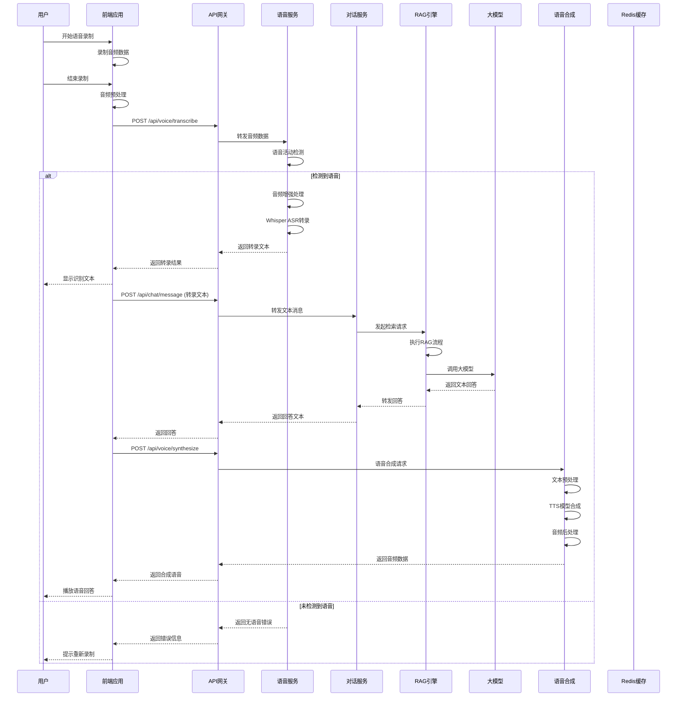
```mermaid
sequenceDiagram
    participant User as 用户
    participant Frontend as 前端应用
    participant Gateway as API网关
    participant VoiceService as 语音服务
    participant ChatService as 对话服务
    participant RAGEngine as RAG引擎
    participant LLM as 大模型
    participant TTSService as 语音合成
    participant Cache as Redis缓存

    User->>Frontend: 开始语音录制
    Frontend->>Frontend: 录制音频数据
    User->>Frontend: 结束录制
    
    Frontend->>Frontend: 音频预处理
    Frontend->>Gateway: POST /api/voice/transcribe
    
    Gateway->>VoiceService: 转发音频数据
    VoiceService->>VoiceService: 语音活动检测
    
    alt 检测到语音
        VoiceService->>VoiceService: 音频增强处理
        VoiceService->>VoiceService: Whisper ASR转录
        VoiceService-->>Gateway: 返回转录文本
        Gateway-->>Frontend: 返回转录结果
        Frontend-->>User: 显示识别文本
        
        Frontend->>Gateway: POST /api/chat/message (转录文本)
        Gateway->>ChatService: 转发文本消息
        
        ChatService->>RAGEngine: 发起检索请求
        RAGEngine->>RAGEngine: 执行RAG流程
        RAGEngine->>LLM: 调用大模型
        
        LLM-->>RAGEngine: 返回文本回答
        RAGEngine-->>ChatService: 转发回答
        ChatService-->>Gateway: 返回回答文本
        Gateway-->>Frontend: 返回回答
        
        Frontend->>Gateway: POST /api/voice/synthesize
        Gateway->>TTSService: 语音合成请求
        TTSService->>TTSService: 文本预处理
        TTSService->>TTSService: TTS模型合成
        TTSService->>TTSService: 音频后处理
        TTSService-->>Gateway: 返回音频数据
        Gateway-->>Frontend: 返回合成语音
        Frontend-->>User: 播放语音回答
        
    else 未检测到语音
        VoiceService-->>Gateway: 返回无语音错误
        Gateway-->>Frontend: 返回错误信息
        Frontend-->>User: 提示重新录制
    end
```

### 6.2 文档管理交互流程

#### 6.2.1 文档上传处理时序图

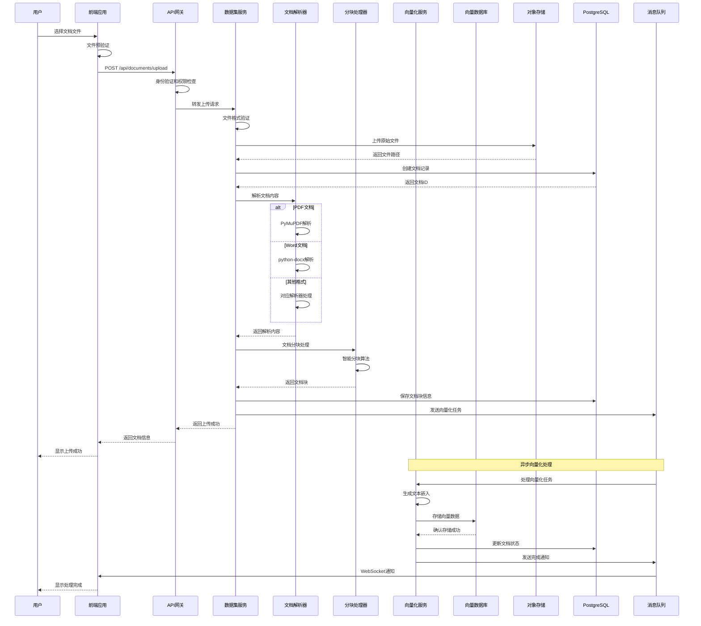
```mermaid
sequenceDiagram
    participant User as 用户
    participant Frontend as 前端应用
    participant Gateway as API网关
    participant DatasetService as 数据集服务
    participant FileParser as 文档解析器
    participant ChunkProcessor as 分块处理器
    participant EmbeddingService as 向量化服务
    participant VectorDB as 向量数据库
    participant MinIO as 对象存储
    participant DB as PostgreSQL
    participant Queue as 消息队列

    User->>Frontend: 选择文档文件
    Frontend->>Frontend: 文件预验证
    Frontend->>Gateway: POST /api/documents/upload
    
    Gateway->>Gateway: 身份验证和权限检查
    Gateway->>DatasetService: 转发上传请求
    
    DatasetService->>DatasetService: 文件格式验证
    DatasetService->>MinIO: 上传原始文件
    MinIO-->>DatasetService: 返回文件路径
    
    DatasetService->>DB: 创建文档记录
    DB-->>DatasetService: 返回文档ID
    
    DatasetService->>FileParser: 解析文档内容
    
    alt PDF文档
        FileParser->>FileParser: PyMuPDF解析
    else Word文档
        FileParser->>FileParser: python-docx解析
    else 其他格式
        FileParser->>FileParser: 对应解析器处理
    end
    
    FileParser-->>DatasetService: 返回解析内容
    
    DatasetService->>ChunkProcessor: 文档分块处理
    ChunkProcessor->>ChunkProcessor: 智能分块算法
    ChunkProcessor-->>DatasetService: 返回文档块
    
    DatasetService->>DB: 保存文档块信息
    DatasetService->>Queue: 发送向量化任务
    
    DatasetService-->>Gateway: 返回上传成功
    Gateway-->>Frontend: 返回文档信息
    Frontend-->>User: 显示上传成功
    
    Note over Queue, EmbeddingService: 异步向量化处理
    
    Queue->>EmbeddingService: 处理向量化任务
    EmbeddingService->>EmbeddingService: 生成文本嵌入
    EmbeddingService->>VectorDB: 存储向量数据
    VectorDB-->>EmbeddingService: 确认存储成功
    
    EmbeddingService->>DB: 更新文档状态
    EmbeddingService->>Queue: 发送完成通知
    
    Queue->>Frontend: WebSocket通知
    Frontend-->>User: 显示处理完成
```

#### 6.2.2 文档检索时序图

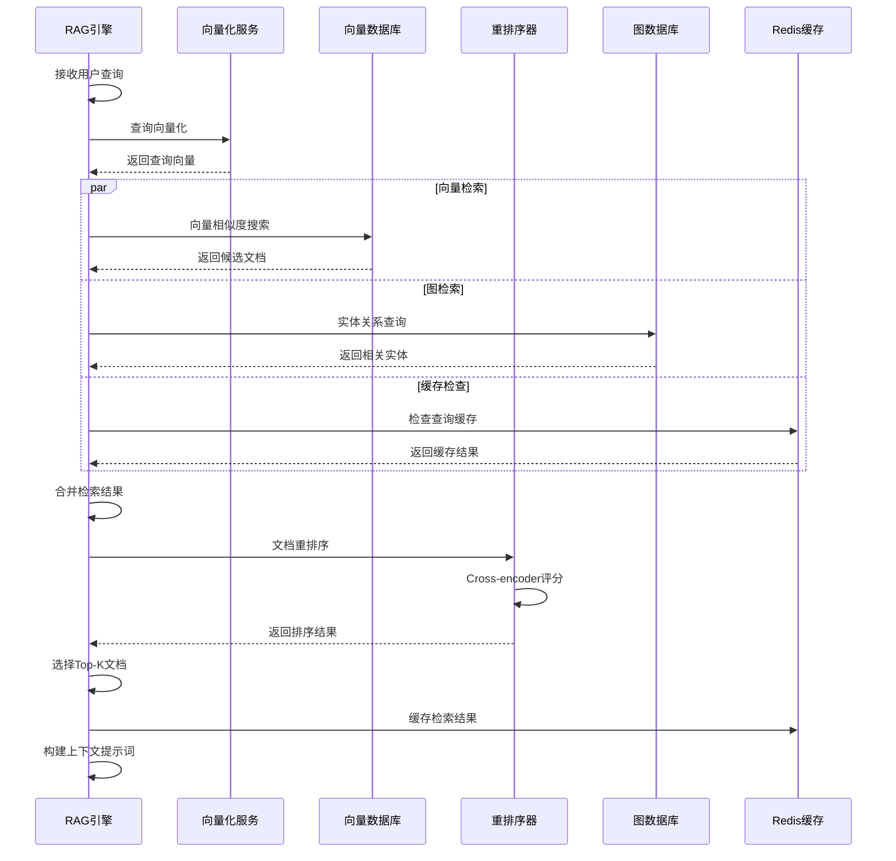
```mermaid
sequenceDiagram
    participant RAGEngine as RAG引擎
    participant EmbeddingService as 向量化服务
    participant VectorDB as 向量数据库
    participant Reranker as 重排序器
    participant GraphDB as 图数据库
    participant Cache as Redis缓存

    RAGEngine->>RAGEngine: 接收用户查询
    RAGEngine->>EmbeddingService: 查询向量化
    EmbeddingService-->>RAGEngine: 返回查询向量
    
    par 向量检索
        RAGEngine->>VectorDB: 向量相似度搜索
        VectorDB-->>RAGEngine: 返回候选文档
    and 图检索
        RAGEngine->>GraphDB: 实体关系查询
        GraphDB-->>RAGEngine: 返回相关实体
    and 缓存检查
        RAGEngine->>Cache: 检查查询缓存
        Cache-->>RAGEngine: 返回缓存结果
    end
    
    RAGEngine->>RAGEngine: 合并检索结果
    RAGEngine->>Reranker: 文档重排序
    Reranker->>Reranker: Cross-encoder评分
    Reranker-->>RAGEngine: 返回排序结果
    
    RAGEngine->>RAGEngine: 选择Top-K文档
    RAGEngine->>Cache: 缓存检索结果
    RAGEngine->>RAGEngine: 构建上下文提示词
```

### 6.3 用户管理交互流程

#### 6.3.1 用户注册登录时序图

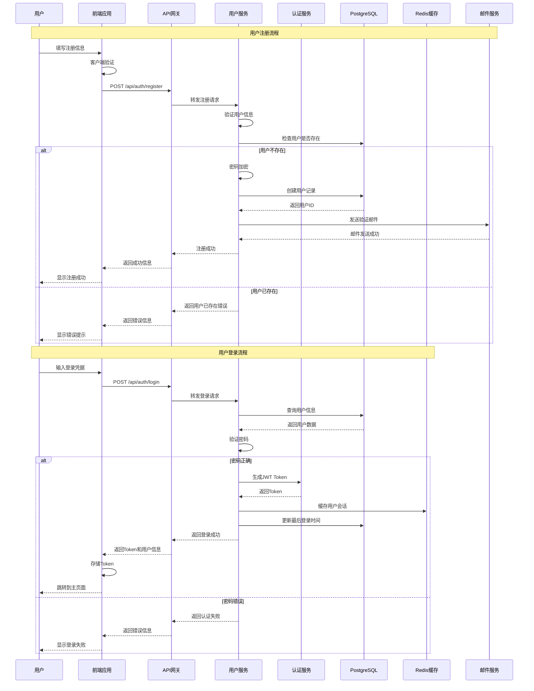
```mermaid
sequenceDiagram
    participant User as 用户
    participant Frontend as 前端应用
    participant Gateway as API网关
    participant UserService as 用户服务
    participant AuthService as 认证服务
    participant DB as PostgreSQL
    participant Cache as Redis缓存
    participant EmailService as 邮件服务

    Note over User, EmailService: 用户注册流程
    
    User->>Frontend: 填写注册信息
    Frontend->>Frontend: 客户端验证
    Frontend->>Gateway: POST /api/auth/register
    
    Gateway->>UserService: 转发注册请求
    UserService->>UserService: 验证用户信息
    UserService->>DB: 检查用户是否存在
    
    alt 用户不存在
        UserService->>UserService: 密码加密
        UserService->>DB: 创建用户记录
        DB-->>UserService: 返回用户ID
        
        UserService->>EmailService: 发送验证邮件
        EmailService-->>UserService: 邮件发送成功
        
        UserService-->>Gateway: 注册成功
        Gateway-->>Frontend: 返回成功信息
        Frontend-->>User: 显示注册成功
        
    else 用户已存在
        UserService-->>Gateway: 返回用户已存在错误
        Gateway-->>Frontend: 返回错误信息
        Frontend-->>User: 显示错误提示
    end
    
    Note over User, Cache: 用户登录流程
    
    User->>Frontend: 输入登录凭据
    Frontend->>Gateway: POST /api/auth/login
    
    Gateway->>UserService: 转发登录请求
    UserService->>DB: 查询用户信息
    DB-->>UserService: 返回用户数据
    
    UserService->>UserService: 验证密码
    
    alt 密码正确
        UserService->>AuthService: 生成JWT Token
        AuthService-->>UserService: 返回Token
        
        UserService->>Cache: 缓存用户会话
        UserService->>DB: 更新最后登录时间
        
        UserService-->>Gateway: 返回登录成功
        Gateway-->>Frontend: 返回Token和用户信息
        Frontend->>Frontend: 存储Token
        Frontend-->>User: 跳转到主页面
        
    else 密码错误
        UserService-->>Gateway: 返回认证失败
        Gateway-->>Frontend: 返回错误信息
        Frontend-->>User: 显示登录失败
    end
```

#### 6.3.2 权限验证时序图

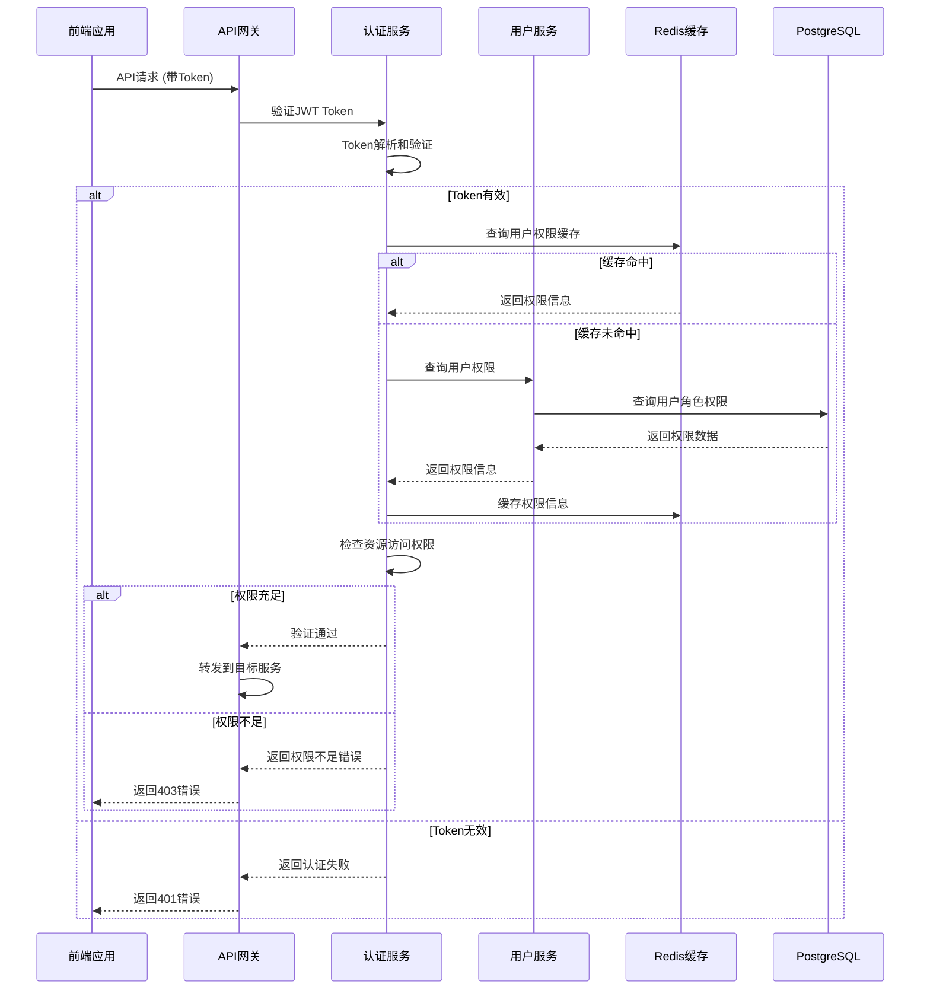
```mermaid
sequenceDiagram
    participant Frontend as 前端应用
    participant Gateway as API网关
    participant AuthService as 认证服务
    participant UserService as 用户服务
    participant Cache as Redis缓存
    participant DB as PostgreSQL

    Frontend->>Gateway: API请求 (带Token)
    Gateway->>AuthService: 验证JWT Token
    
    AuthService->>AuthService: Token解析和验证
    
    alt Token有效
        AuthService->>Cache: 查询用户权限缓存
        
        alt 缓存命中
            Cache-->>AuthService: 返回权限信息
        else 缓存未命中
            AuthService->>UserService: 查询用户权限
            UserService->>DB: 查询用户角色权限
            DB-->>UserService: 返回权限数据
            UserService-->>AuthService: 返回权限信息
            AuthService->>Cache: 缓存权限信息
        end
        
        AuthService->>AuthService: 检查资源访问权限
        
        alt 权限充足
            AuthService-->>Gateway: 验证通过
            Gateway->>Gateway: 转发到目标服务
        else 权限不足
            AuthService-->>Gateway: 返回权限不足错误
            Gateway-->>Frontend: 返回403错误
        end
        
    else Token无效
        AuthService-->>Gateway: 返回认证失败
        Gateway-->>Frontend: 返回401错误
    end
```

### 6.4 系统监控交互流程

#### 6.4.1 性能监控时序图

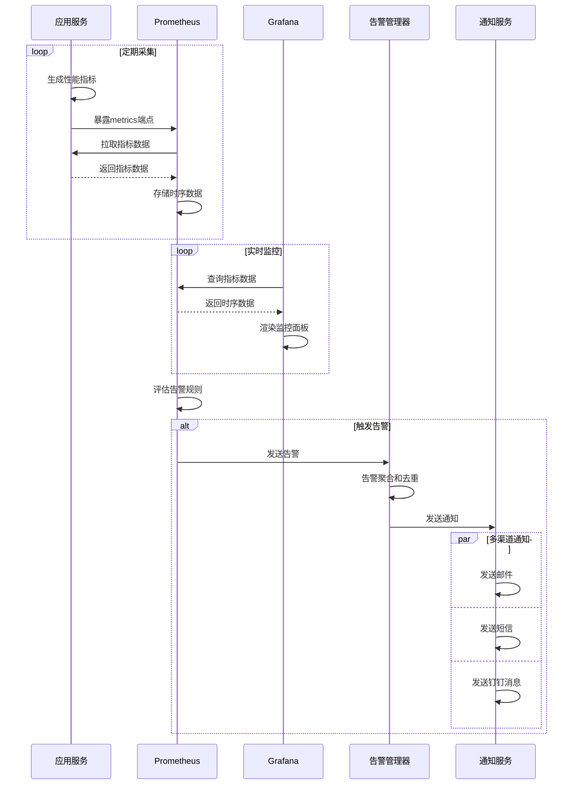
```mermaid
sequenceDiagram
    participant Service as 应用服务
    participant Prometheus as Prometheus
    participant Grafana as Grafana
    participant AlertManager as 告警管理器
    participant NotificationService as 通知服务

    loop 定期采集
        Service->>Service: 生成性能指标
        Service->>Prometheus: 暴露metrics端点
        Prometheus->>Service: 拉取指标数据
        Service-->>Prometheus: 返回指标数据
        Prometheus->>Prometheus: 存储时序数据
    end
    
    loop 实时监控
        Grafana->>Prometheus: 查询指标数据
        Prometheus-->>Grafana: 返回时序数据
        Grafana->>Grafana: 渲染监控面板
    end
    
    Prometheus->>Prometheus: 评估告警规则
    
    alt 触发告警
        Prometheus->>AlertManager: 发送告警
        AlertManager->>AlertManager: 告警聚合和去重
        AlertManager->>NotificationService: 发送通知
        
        par 多渠道通知
            NotificationService->>NotificationService: 发送邮件
        and
            NotificationService->>NotificationService: 发送短信
        and
            NotificationService->>NotificationService: 发送钉钉消息
        end
    end
```

#### 6.4.2 日志收集时序图

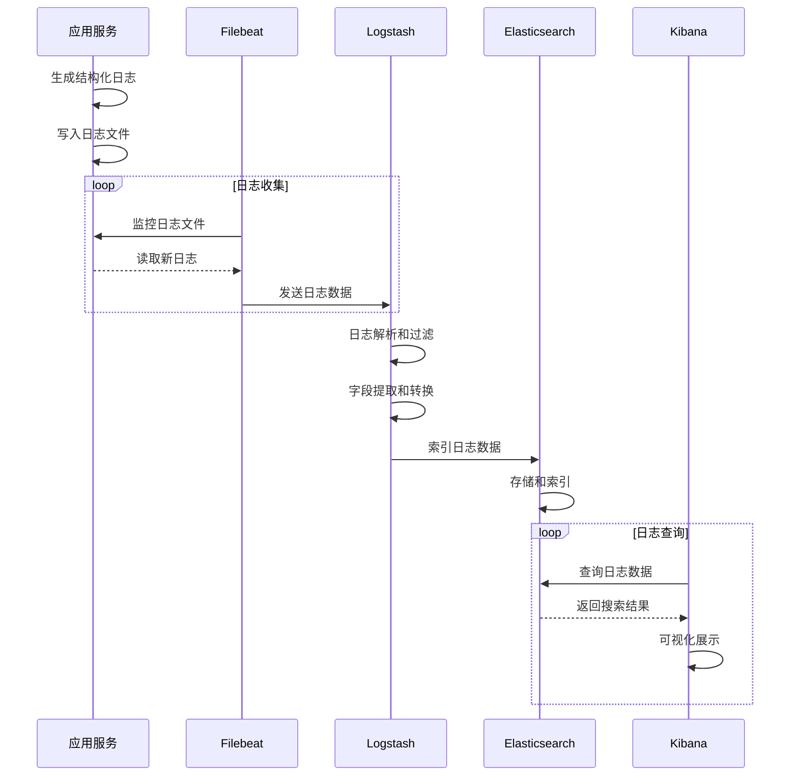
```mermaid
sequenceDiagram
    participant Service as 应用服务
    participant Filebeat as Filebeat
    participant Logstash as Logstash
    participant Elasticsearch as Elasticsearch
    participant Kibana as Kibana

    Service->>Service: 生成结构化日志
    Service->>Service: 写入日志文件
    
    loop 日志收集
        Filebeat->>Service: 监控日志文件
        Service-->>Filebeat: 读取新日志
        Filebeat->>Logstash: 发送日志数据
    end
    
    Logstash->>Logstash: 日志解析和过滤
    Logstash->>Logstash: 字段提取和转换
    Logstash->>Elasticsearch: 索引日志数据
    
    Elasticsearch->>Elasticsearch: 存储和索引
    
    loop 日志查询
        Kibana->>Elasticsearch: 查询日志数据
        Elasticsearch-->>Kibana: 返回搜索结果
        Kibana->>Kibana: 可视化展示
    end
```

### 6.5 错误处理交互流程

#### 6.5.1 服务异常处理时序图

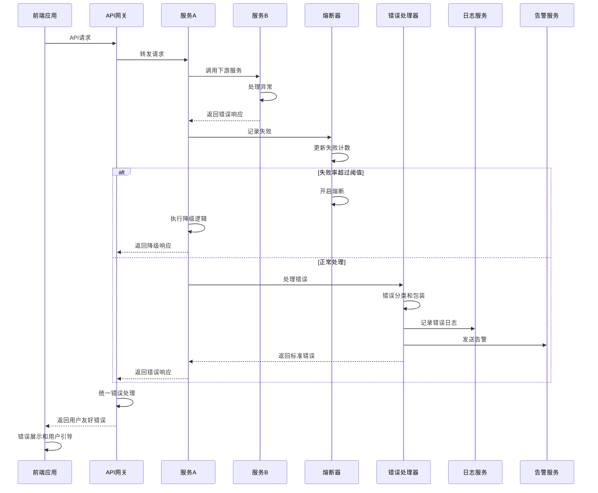
```mermaid
sequenceDiagram
    participant Frontend as 前端应用
    participant Gateway as API网关
    participant ServiceA as 服务A
    participant ServiceB as 服务B
    participant CircuitBreaker as 熔断器
    participant ErrorHandler as 错误处理器
    participant LogService as 日志服务
    participant AlertService as 告警服务

    Frontend->>Gateway: API请求
    Gateway->>ServiceA: 转发请求
    ServiceA->>ServiceB: 调用下游服务
    
    ServiceB->>ServiceB: 处理异常
    ServiceB-->>ServiceA: 返回错误响应
    
    ServiceA->>CircuitBreaker: 记录失败
    CircuitBreaker->>CircuitBreaker: 更新失败计数
    
    alt 失败率超过阈值
        CircuitBreaker->>CircuitBreaker: 开启熔断
        ServiceA->>ServiceA: 执行降级逻辑
        ServiceA-->>Gateway: 返回降级响应
    else 正常处理
        ServiceA->>ErrorHandler: 处理错误
        ErrorHandler->>ErrorHandler: 错误分类和包装
        ErrorHandler->>LogService: 记录错误日志
        ErrorHandler->>AlertService: 发送告警
        ErrorHandler-->>ServiceA: 返回标准错误
        ServiceA-->>Gateway: 返回错误响应
    end
    
    Gateway->>Gateway: 统一错误处理
    Gateway-->>Frontend: 返回用户友好错误
    Frontend->>Frontend: 错误展示和用户引导
```

#### 6.5.2 分布式事务处理时序图

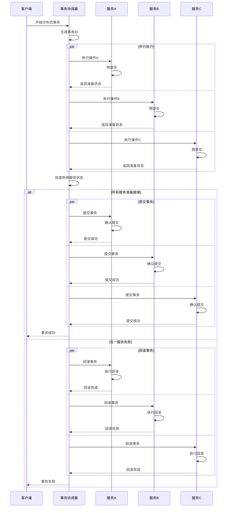
```mermaid
sequenceDiagram
    participant Client as 客户端
    participant Coordinator as 事务协调器
    participant ServiceA as 服务A
    participant ServiceB as 服务B
    participant ServiceC as 服务C

    Client->>Coordinator: 开始分布式事务
    Coordinator->>Coordinator: 生成事务ID
    
    par 并行执行
        Coordinator->>ServiceA: 执行操作A
        ServiceA->>ServiceA: 预提交
        ServiceA-->>Coordinator: 返回准备状态
    and
        Coordinator->>ServiceB: 执行操作B
        ServiceB->>ServiceB: 预提交
        ServiceB-->>Coordinator: 返回准备状态
    and
        Coordinator->>ServiceC: 执行操作C
        ServiceC->>ServiceC: 预提交
        ServiceC-->>Coordinator: 返回准备状态
    end
    
    Coordinator->>Coordinator: 检查所有服务状态
    
    alt 所有服务准备就绪
        par 提交事务
            Coordinator->>ServiceA: 提交事务
            ServiceA->>ServiceA: 确认提交
            ServiceA-->>Coordinator: 提交成功
        and
            Coordinator->>ServiceB: 提交事务
            ServiceB->>ServiceB: 确认提交
            ServiceB-->>Coordinator: 提交成功
        and
            Coordinator->>ServiceC: 提交事务
            ServiceC->>ServiceC: 确认提交
            ServiceC-->>Coordinator: 提交成功
        end
        
        Coordinator-->>Client: 事务成功
        
    else 任一服务失败
        par 回滚事务
            Coordinator->>ServiceA: 回滚事务
            ServiceA->>ServiceA: 执行回滚
            ServiceA-->>Coordinator: 回滚完成
        and
            Coordinator->>ServiceB: 回滚事务
            ServiceB->>ServiceB: 执行回滚
            ServiceB-->>Coordinator: 回滚完成
        and
            Coordinator->>ServiceC: 回滚事务
            ServiceC->>ServiceC: 执行回滚
            ServiceC-->>Coordinator: 回滚完成
        end
        
        Coordinator-->>Client: 事务失败
    end
```

### 6.6 缓存更新交互流程

#### 6.6.1 缓存一致性时序图

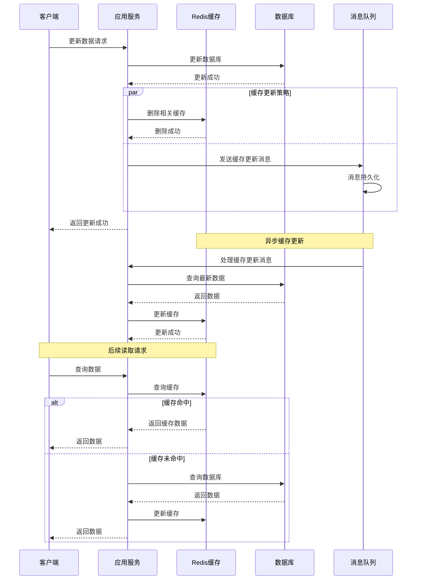
```mermaid
sequenceDiagram
    participant Client as 客户端
    participant Service as 应用服务
    participant Cache as Redis缓存
    participant DB as 数据库
    participant MQ as 消息队列

    Client->>Service: 更新数据请求
    Service->>DB: 更新数据库
    DB-->>Service: 更新成功
    
    par 缓存更新策略
        Service->>Cache: 删除相关缓存
        Cache-->>Service: 删除成功
    and
        Service->>MQ: 发送缓存更新消息
        MQ->>MQ: 消息持久化
    end
    
    Service-->>Client: 返回更新成功
    
    Note over MQ, Cache: 异步缓存更新
    
    MQ->>Service: 处理缓存更新消息
    Service->>DB: 查询最新数据
    DB-->>Service: 返回数据
    Service->>Cache: 更新缓存
    Cache-->>Service: 更新成功
    
    Note over Client, Cache: 后续读取请求
    
    Client->>Service: 查询数据
    Service->>Cache: 查询缓存
    
    alt 缓存命中
        Cache-->>Service: 返回缓存数据
        Service-->>Client: 返回数据
    else 缓存未命中
        Service->>DB: 查询数据库
        DB-->>Service: 返回数据
        Service->>Cache: 更新缓存
        Service-->>Client: 返回数据
    end
```

### 6.7 负载均衡交互流程

#### 6.7.1 服务发现和负载均衡时序图

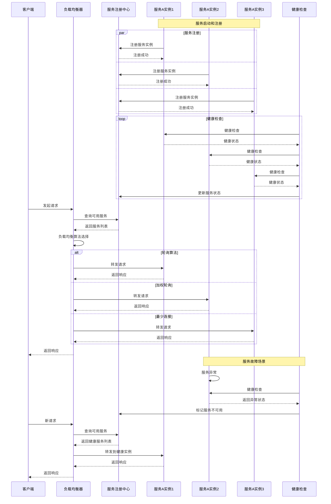
```mermaid
sequenceDiagram
    participant Client as 客户端
    participant LoadBalancer as 负载均衡器
    participant ServiceRegistry as 服务注册中心
    participant ServiceA1 as 服务A实例1
    participant ServiceA2 as 服务A实例2
    participant ServiceA3 as 服务A实例3
    participant HealthCheck as 健康检查

    Note over ServiceA1, ServiceA3: 服务启动和注册
    
    par 服务注册
        ServiceA1->>ServiceRegistry: 注册服务实例
        ServiceRegistry-->>ServiceA1: 注册成功
    and
        ServiceA2->>ServiceRegistry: 注册服务实例
        ServiceRegistry-->>ServiceA2: 注册成功
    and
        ServiceA3->>ServiceRegistry: 注册服务实例
        ServiceRegistry-->>ServiceA3: 注册成功
    end
    
    loop 健康检查
        HealthCheck->>ServiceA1: 健康检查
        ServiceA1-->>HealthCheck: 健康状态
        HealthCheck->>ServiceA2: 健康检查
        ServiceA2-->>HealthCheck: 健康状态
        HealthCheck->>ServiceA3: 健康检查
        ServiceA3-->>HealthCheck: 健康状态
        HealthCheck->>ServiceRegistry: 更新服务状态
    end
    
    Client->>LoadBalancer: 发起请求
    LoadBalancer->>ServiceRegistry: 查询可用服务
    ServiceRegistry-->>LoadBalancer: 返回服务列表
    
    LoadBalancer->>LoadBalancer: 负载均衡算法选择
    
    alt 轮询算法
        LoadBalancer->>ServiceA1: 转发请求
        ServiceA1-->>LoadBalancer: 返回响应
    else 加权轮询
        LoadBalancer->>ServiceA2: 转发请求
        ServiceA2-->>LoadBalancer: 返回响应
    else 最少连接
        LoadBalancer->>ServiceA3: 转发请求
        ServiceA3-->>LoadBalancer: 返回响应
    end
    
    LoadBalancer-->>Client: 返回响应
    
    Note over ServiceA2, HealthCheck: 服务故障场景
    
    ServiceA2->>ServiceA2: 服务异常
    HealthCheck->>ServiceA2: 健康检查
    ServiceA2-->>HealthCheck: 返回异常状态
    HealthCheck->>ServiceRegistry: 标记服务不可用
    
    Client->>LoadBalancer: 新请求
    LoadBalancer->>ServiceRegistry: 查询可用服务
    ServiceRegistry-->>LoadBalancer: 返回健康服务列表
    LoadBalancer->>ServiceA1: 转发到健康实例
    ServiceA1-->>LoadBalancer: 返回响应
    LoadBalancer-->>Client: 返回响应
```

## 相关文档

- [系统架构概览](/posts/voicehelper-architecture-overview/)
- [前端模块深度解析](/posts/voicehelper-frontend-modules/)
- [后端服务核心实现](/posts/voicehelper-backend-services/)
- [AI算法引擎深度分析](/posts/voicehelper-ai-algorithms/)
- [数据存储架构](/posts/voicehelper-data-storage/)
- [第三方集成与扩展](/posts/voicehelper-third-party-integration/)
- [性能优化与监控](/posts/voicehelper-performance-optimization/)
- [部署与运维](/posts/voicehelper-deployment-operations/)
- [总结与最佳实践](/posts/voicehelper-best-practices/)
- [项目功能清单](/posts/voicehelper-feature-inventory/)
- [版本迭代历程](/posts/voicehelper-version-history/)
- [竞争力分析](/posts/voicehelper-competitive-analysis/)
- [API接口清单](/posts/voicehelper-api-reference/)
- [错误码系统](/posts/voicehelper-error-codes/)
- [版本迭代计划](/posts/voicehelper-version-roadmap/)
