# VoiceHelper第三方集成与扩展

本文档详细介绍VoiceHelper智能语音助手系统的第三方服务集成方案，涵盖豆包大模型、OpenAI、微信生态、云存储等外部服务的集成实现。

## 7. 第三方集成与扩展

### 7.1 豆包大模型集成

#### 7.1.0 第三方集成架构总览

```mermaid
graph TB
    subgraph "VoiceHelper核心系统"
        Core[核心服务层]
        API[API网关]
        Auth[认证授权]
    end
    
    subgraph "AI模型服务"
        Doubao[豆包大模型<br/>ep-20241201140014-vbzjz]
        OpenAI[OpenAI GPT<br/>gpt-4/gpt-3.5-turbo]
        Claude[Claude-3<br/>claude-3-sonnet]
    end
    
    subgraph "微信生态"
        WxMP[微信小程序]
        WxPay[微信支付]
        WxLogin[微信登录]
    end
    
    subgraph "云存储服务"
        AliyunOSS[阿里云OSS]
        TencentCOS[腾讯云COS]
        MinIO[MinIO对象存储]
    end
    
    subgraph "监控告警"
        DingTalk[钉钉机器人]
        Email[邮件服务]
        SMS[短信服务]
    end
    
    Core --> Doubao
    Core --> OpenAI
    Core --> Claude
    
    API --> WxMP
    Auth --> WxLogin
    Core --> WxPay
    
    Core --> AliyunOSS
    Core --> TencentCOS
    Core --> MinIO
    
    Core --> DingTalk
    Core --> Email
    Core --> SMS
    
    style Core fill:#e1f5fe
    style Doubao fill:#f3e5f5
    style WxMP fill:#fff3e0
    style AliyunOSS fill:#e8f5e8
```



#### 7.1.1 豆包API客户端实现

```python
# 豆包大模型API客户端
# 文件路径: algo/clients/ark_client.py
import asyncio
import json
import aiohttp
from typing import Dict, Any, AsyncGenerator, Optional, List
import logging
from dataclasses import dataclass

@dataclass
class ArkConfig:
    """豆包API配置"""
    api_key: str
    base_url: str
    model_id: str
    timeout: int = 30
    max_retries: int = 3
    retry_delay: float = 1.0

class ArkClient:
    """豆包大模型API客户端"""
    
    def __init__(self, config: ArkConfig):
        self.config = config
        self.session = None
        self.logger = logging.getLogger(__name__)
    
    async def __aenter__(self):
        """异步上下文管理器入口"""
        self.session = aiohttp.ClientSession(
            timeout=aiohttp.ClientTimeout(total=self.config.timeout),
            headers={
                "Authorization": f"Bearer {self.config.api_key}",
                "Content-Type": "application/json"
            }
        )
        return self
    
    async def __aexit__(self, exc_type, exc_val, exc_tb):
        """异步上下文管理器退出"""
        if self.session:
            await self.session.close()
    
    async def chat_completion(
        self,
        messages: List[Dict[str, str]],
        temperature: float = 0.7,
        max_tokens: int = 2000,
        stream: bool = False,
        **kwargs
    ) -> Dict[str, Any]:
        """聊天完成API调用"""
        
        payload = {
            "model": self.config.model_id,
            "messages": messages,
            "temperature": temperature,
            "max_tokens": max_tokens,
            "stream": stream,
            **kwargs
        }
        
        url = f"{self.config.base_url}/chat/completions"
        
        for attempt in range(self.config.max_retries):
            try:
                async with self.session.post(url, json=payload) as response:
                    if response.status == 200:
                        if stream:
                            return self._handle_stream_response(response)
                        else:
                            return await response.json()
                    else:
                        error_text = await response.text()
                        self.logger.error(f"API error {response.status}: {error_text}")
                        
                        if response.status == 429:  # 限流
                            await asyncio.sleep(self.config.retry_delay * (2 ** attempt))
                            continue
                        elif response.status >= 500:  # 服务器错误
                            await asyncio.sleep(self.config.retry_delay * (2 ** attempt))
                            continue
                        else:
                            raise Exception(f"API error {response.status}: {error_text}")
                            
            except asyncio.TimeoutError:
                self.logger.warning(f"Request timeout, attempt {attempt + 1}")
                if attempt < self.config.max_retries - 1:
                    await asyncio.sleep(self.config.retry_delay * (2 ** attempt))
                    continue
                raise
            except Exception as e:
                self.logger.error(f"Request failed: {e}")
                if attempt < self.config.max_retries - 1:
                    await asyncio.sleep(self.config.retry_delay * (2 ** attempt))
                    continue
                raise
        
        raise Exception(f"Max retries ({self.config.max_retries}) exceeded")
    
    async def _handle_stream_response(self, response) -> AsyncGenerator[Dict[str, Any], None]:
        """处理流式响应"""
        async for line in response.content:
            line = line.decode('utf-8').strip()
            
            if line.startswith('data: '):
                data = line[6:]  # 移除 'data: ' 前缀
                
                if data == '[DONE]':
                    break
                
                try:
                    chunk = json.loads(data)
                    yield chunk
                except json.JSONDecodeError:
                    continue
    
    async def embeddings(
        self,
        texts: List[str],
        model: Optional[str] = None
    ) -> Dict[str, Any]:
        """文本嵌入API调用"""
        
        payload = {
            "model": model or "text-embedding-v1",
            "input": texts
        }
        
        url = f"{self.config.base_url}/embeddings"
        
        async with self.session.post(url, json=payload) as response:
            if response.status == 200:
                return await response.json()
            else:
                error_text = await response.text()
                raise Exception(f"Embeddings API error {response.status}: {error_text}")
    
    async def function_call(
        self,
        messages: List[Dict[str, str]],
        functions: List[Dict[str, Any]],
        function_call: Optional[str] = "auto"
    ) -> Dict[str, Any]:
        """函数调用API"""
        
        payload = {
            "model": self.config.model_id,
            "messages": messages,
            "functions": functions,
            "function_call": function_call
        }
        
        url = f"{self.config.base_url}/chat/completions"
        
        async with self.session.post(url, json=payload) as response:
            if response.status == 200:
                return await response.json()
            else:
                error_text = await response.text()
                raise Exception(f"Function call API error {response.status}: {error_text}")

# 豆包客户端工厂
class ArkClientFactory:
    """豆包客户端工厂"""
    
    _instances = {}
    
    @classmethod
    def get_client(cls, config: ArkConfig) -> ArkClient:
        """获取客户端实例（单例模式）"""
        key = f"{config.base_url}_{config.model_id}"
        
        if key not in cls._instances:
            cls._instances[key] = ArkClient(config)
        
        return cls._instances[key]
    
    @classmethod
    async def close_all(cls):
        """关闭所有客户端"""
        for client in cls._instances.values():
            if client.session:
                await client.session.close()
        cls._instances.clear()
```

#### 7.1.2 豆包模型路由器

```python
# 豆包模型路由器
# 文件路径: algo/router/ark_router.py
from typing import Dict, Any, List, Optional
import asyncio
from dataclasses import dataclass
from enum import Enum

class ModelCapability(Enum):
    """模型能力枚举"""
    CHAT = "chat"
    EMBEDDING = "embedding"
    FUNCTION_CALL = "function_call"
    CODE_GENERATION = "code_generation"
    MULTIMODAL = "multimodal"

@dataclass
class ModelInfo:
    """模型信息"""
    model_id: str
    name: str
    capabilities: List[ModelCapability]
    max_tokens: int
    cost_per_1k_tokens: float
    latency_ms: int
    quality_score: float

class ArkModelRouter:
    """豆包模型路由器"""
    
    def __init__(self):
        self.models = self._initialize_models()
        self.performance_stats = {}
    
    def _initialize_models(self) -> Dict[str, ModelInfo]:
        """初始化模型信息"""
        return {
            "doubao-pro": ModelInfo(
                model_id="ep-20241201140014-vbzjz",
                name="豆包Pro",
                capabilities=[
                    ModelCapability.CHAT,
                    ModelCapability.FUNCTION_CALL,
                    ModelCapability.CODE_GENERATION
                ],
                max_tokens=4096,
                cost_per_1k_tokens=0.1,
                latency_ms=300,
                quality_score=0.92
            ),
            "doubao-lite": ModelInfo(
                model_id="ep-20241201140014-lite",
                name="豆包Lite",
                capabilities=[ModelCapability.CHAT],
                max_tokens=2048,
                cost_per_1k_tokens=0.05,
                latency_ms=150,
                quality_score=0.85
            ),
            "doubao-embedding": ModelInfo(
                model_id="text-embedding-v1",
                name="豆包嵌入模型",
                capabilities=[ModelCapability.EMBEDDING],
                max_tokens=512,
                cost_per_1k_tokens=0.02,
                latency_ms=100,
                quality_score=0.90
            )
        }
    
    def select_model(
        self,
        capability: ModelCapability,
        priority: str = "balanced",  # balanced, cost, speed, quality
        max_tokens: Optional[int] = None
    ) -> Optional[ModelInfo]:
        """选择最适合的模型"""
        
        # 过滤具备所需能力的模型
        candidates = [
            model for model in self.models.values()
            if capability in model.capabilities
        ]
        
        if not candidates:
            return None
        
        # 根据token限制过滤
        if max_tokens:
            candidates = [
                model for model in candidates
                if model.max_tokens >= max_tokens
            ]
        
        if not candidates:
            return None
        
        # 根据优先级选择
        if priority == "cost":
            return min(candidates, key=lambda m: m.cost_per_1k_tokens)
        elif priority == "speed":
            return min(candidates, key=lambda m: m.latency_ms)
        elif priority == "quality":
            return max(candidates, key=lambda m: m.quality_score)
        else:  # balanced
            # 综合评分：质量40% + 速度30% + 成本30%
            def score(model):
                speed_score = 1.0 - (model.latency_ms / 1000)  # 归一化速度分数
                cost_score = 1.0 - (model.cost_per_1k_tokens / 1.0)  # 归一化成本分数
                return (
                    0.4 * model.quality_score +
                    0.3 * max(0, speed_score) +
                    0.3 * max(0, cost_score)
                )
            
            return max(candidates, key=score)
    
    def get_model_by_id(self, model_id: str) -> Optional[ModelInfo]:
        """根据ID获取模型信息"""
        for model in self.models.values():
            if model.model_id == model_id:
                return model
        return None
    
    async def update_performance_stats(
        self,
        model_id: str,
        latency_ms: float,
        success: bool,
        tokens_used: int
    ):
        """更新模型性能统计"""
        if model_id not in self.performance_stats:
            self.performance_stats[model_id] = {
                "avg_latency": latency_ms,
                "success_rate": 1.0 if success else 0.0,
                "total_requests": 1,
                "total_tokens": tokens_used
            }
        else:
            stats = self.performance_stats[model_id]
            total_requests = stats["total_requests"]
            
            # 更新平均延迟
            stats["avg_latency"] = (
                (stats["avg_latency"] * total_requests + latency_ms) /
                (total_requests + 1)
            )
            
            # 更新成功率
            stats["success_rate"] = (
                (stats["success_rate"] * total_requests + (1.0 if success else 0.0)) /
                (total_requests + 1)
            )
            
            stats["total_requests"] += 1
            stats["total_tokens"] += tokens_used
```

### 7.2 OpenAI集成

#### 7.2.0 多模型路由架构图

```mermaid
sequenceDiagram
    participant Client as 客户端
    participant Router as 统一路由器
    participant ArkClient as 豆包客户端
    participant OpenAIClient as OpenAI客户端
    participant ClaudeClient as Claude客户端
    participant Monitor as 性能监控

    Client->>Router: 发送请求
    Router->>Router: 分析请求类型和优先级
    
    alt 成本优先策略
        Router->>ArkClient: 路由到豆包模型
        ArkClient->>ArkClient: 调用豆包API
        ArkClient-->>Router: 返回响应
    else 质量优先策略
        Router->>OpenAIClient: 路由到GPT-4
        OpenAIClient->>OpenAIClient: 调用OpenAI API
        OpenAIClient-->>Router: 返回响应
    else 故障转移
        Router->>ArkClient: 尝试豆包模型
        ArkClient-->>Router: 返回错误
        Router->>OpenAIClient: 故障转移到OpenAI
        OpenAIClient-->>Router: 返回响应
    end
    
    Router->>Monitor: 记录性能指标
    Router-->>Client: 返回最终响应
```



#### 7.2.1 OpenAI客户端实现

```python
# OpenAI API客户端
# 文件路径: algo/clients/openai_client.py
import openai
from openai import AsyncOpenAI
from typing import Dict, Any, List, Optional, AsyncGenerator
import asyncio
import logging
from dataclasses import dataclass

@dataclass
class OpenAIConfig:
    """OpenAI配置"""
    api_key: str
    base_url: Optional[str] = None
    organization: Optional[str] = None
    timeout: int = 30
    max_retries: int = 3

class OpenAIClient:
    """OpenAI API客户端"""
    
    def __init__(self, config: OpenAIConfig):
        self.config = config
        self.client = AsyncOpenAI(
            api_key=config.api_key,
            base_url=config.base_url,
            organization=config.organization,
            timeout=config.timeout,
            max_retries=config.max_retries
        )
        self.logger = logging.getLogger(__name__)
    
    async def chat_completion(
        self,
        messages: List[Dict[str, str]],
        model: str = "gpt-3.5-turbo",
        temperature: float = 0.7,
        max_tokens: Optional[int] = None,
        stream: bool = False,
        **kwargs
    ) -> Dict[str, Any]:
        """聊天完成"""
        try:
            response = await self.client.chat.completions.create(
                model=model,
                messages=messages,
                temperature=temperature,
                max_tokens=max_tokens,
                stream=stream,
                **kwargs
            )
            
            if stream:
                return self._handle_stream_response(response)
            else:
                return response.model_dump()
                
        except Exception as e:
            self.logger.error(f"OpenAI chat completion error: {e}")
            raise
    
    async def _handle_stream_response(self, response) -> AsyncGenerator[Dict[str, Any], None]:
        """处理流式响应"""
        async for chunk in response:
            yield chunk.model_dump()
    
    async def embeddings(
        self,
        texts: List[str],
        model: str = "text-embedding-3-large"
    ) -> Dict[str, Any]:
        """文本嵌入"""
        try:
            response = await self.client.embeddings.create(
                model=model,
                input=texts
            )
            return response.model_dump()
            
        except Exception as e:
            self.logger.error(f"OpenAI embeddings error: {e}")
            raise
    
    async def image_generation(
        self,
        prompt: str,
        model: str = "dall-e-3",
        size: str = "1024x1024",
        quality: str = "standard",
        n: int = 1
    ) -> Dict[str, Any]:
        """图像生成"""
        try:
            response = await self.client.images.generate(
                model=model,
                prompt=prompt,
                size=size,
                quality=quality,
                n=n
            )
            return response.model_dump()
            
        except Exception as e:
            self.logger.error(f"OpenAI image generation error: {e}")
            raise
    
    async def speech_to_text(
        self,
        audio_file: bytes,
        model: str = "whisper-1",
        language: Optional[str] = None
    ) -> Dict[str, Any]:
        """语音转文字"""
        try:
            response = await self.client.audio.transcriptions.create(
                model=model,
                file=audio_file,
                language=language
            )
            return response.model_dump()
            
        except Exception as e:
            self.logger.error(f"OpenAI speech to text error: {e}")
            raise
    
    async def text_to_speech(
        self,
        text: str,
        model: str = "tts-1",
        voice: str = "alloy",
        response_format: str = "mp3"
    ) -> bytes:
        """文字转语音"""
        try:
            response = await self.client.audio.speech.create(
                model=model,
                voice=voice,
                input=text,
                response_format=response_format
            )
            return response.content
            
        except Exception as e:
            self.logger.error(f"OpenAI text to speech error: {e}")
            raise
```

#### 7.2.2 多模型统一接口

```python
# 多模型统一接口
# 文件路径: algo/clients/unified_client.py
from typing import Dict, Any, List, Optional, AsyncGenerator, Union
from enum import Enum
import asyncio
from .ark_client import ArkClient, ArkConfig
from .openai_client import OpenAIClient, OpenAIConfig

class ModelProvider(Enum):
    """模型提供商"""
    ARK = "ark"
    OPENAI = "openai"
    CLAUDE = "claude"

class UnifiedLLMClient:
    """统一大模型客户端"""
    
    def __init__(self):
        self.clients = {}
        self.default_provider = ModelProvider.ARK
    
    def add_ark_client(self, config: ArkConfig, name: str = "default"):
        """添加豆包客户端"""
        self.clients[f"ark_{name}"] = ArkClient(config)
    
    def add_openai_client(self, config: OpenAIConfig, name: str = "default"):
        """添加OpenAI客户端"""
        self.clients[f"openai_{name}"] = OpenAIClient(config)
    
    async def chat_completion(
        self,
        messages: List[Dict[str, str]],
        provider: Optional[ModelProvider] = None,
        model: Optional[str] = None,
        **kwargs
    ) -> Union[Dict[str, Any], AsyncGenerator[Dict[str, Any], None]]:
        """统一聊天完成接口"""
        
        provider = provider or self.default_provider
        client_key = f"{provider.value}_default"
        
        if client_key not in self.clients:
            raise ValueError(f"Client for provider {provider.value} not found")
        
        client = self.clients[client_key]
        
        if provider == ModelProvider.ARK:
            return await client.chat_completion(messages, **kwargs)
        elif provider == ModelProvider.OPENAI:
            model = model or "gpt-3.5-turbo"
            return await client.chat_completion(messages, model=model, **kwargs)
        else:
            raise ValueError(f"Unsupported provider: {provider.value}")
    
    async def embeddings(
        self,
        texts: List[str],
        provider: Optional[ModelProvider] = None,
        model: Optional[str] = None
    ) -> Dict[str, Any]:
        """统一嵌入接口"""
        
        provider = provider or self.default_provider
        client_key = f"{provider.value}_default"
        
        if client_key not in self.clients:
            raise ValueError(f"Client for provider {provider.value} not found")
        
        client = self.clients[client_key]
        
        if provider == ModelProvider.ARK:
            return await client.embeddings(texts, model)
        elif provider == ModelProvider.OPENAI:
            model = model or "text-embedding-3-large"
            return await client.embeddings(texts, model)
        else:
            raise ValueError(f"Unsupported provider: {provider.value}")
    
    async def fallback_chat_completion(
        self,
        messages: List[Dict[str, str]],
        providers: List[ModelProvider],
        **kwargs
    ) -> Dict[str, Any]:
        """故障转移聊天完成"""
        
        last_error = None
        
        for provider in providers:
            try:
                return await self.chat_completion(
                    messages, 
                    provider=provider, 
                    **kwargs
                )
            except Exception as e:
                last_error = e
                continue
        
        raise Exception(f"All providers failed. Last error: {last_error}")
```

### 7.3 微信生态集成

#### 7.3.0 微信生态集成架构图

```mermaid
graph TB
    subgraph "微信生态"
        WxUser[微信用户]
        WxMP[微信小程序]
        WxPay[微信支付]
        WxLogin[微信登录]
        WxShare[微信分享]
    end
    
    subgraph "VoiceHelper后端"
        Gateway[API网关]
        AuthService[认证服务]
        PaymentService[支付服务]
        UserService[用户服务]
        ChatService[对话服务]
    end
    
    subgraph "微信服务器"
        WxServer[微信服务器]
        WxPayServer[微信支付服务器]
    end
    
    WxUser --> WxMP
    WxMP --> Gateway
    
    WxMP --> WxLogin
    WxLogin --> AuthService
    AuthService --> WxServer
    
    WxMP --> WxPay
    WxPay --> PaymentService
    PaymentService --> WxPayServer
    
    WxMP --> WxShare
    WxShare --> UserService
    
    Gateway --> ChatService
    Gateway --> UserService
    
    style WxMP fill:#e1f5fe
    style Gateway fill:#f3e5f5
    style WxServer fill:#fff3e0
```



#### 7.3.1 微信小程序API集成

```javascript
// 微信小程序API集成
// 文件路径: miniprogram/utils/api.js

class WeChatAPI {
  constructor(config) {
    this.baseURL = config.baseURL
    this.timeout = config.timeout || 10000
    this.token = wx.getStorageSync('token') || ''
  }

  // 统一请求方法
  async request(options) {
    const { url, method = 'GET', data = {}, header = {} } = options
    
    return new Promise((resolve, reject) => {
      wx.request({
        url: `${this.baseURL}${url}`,
        method,
        data,
        header: {
          'Content-Type': 'application/json',
          'Authorization': this.token ? `Bearer ${this.token}` : '',
          ...header
        },
        timeout: this.timeout,
        success: (res) => {
          if (res.statusCode === 200) {
            resolve(res.data)
          } else if (res.statusCode === 401) {
            // Token过期，重新登录
            this.reLogin()
            reject(new Error('登录已过期'))
          } else {
            reject(new Error(`请求失败: ${res.statusCode}`))
          }
        },
        fail: (err) => {
          reject(new Error(`网络错误: ${err.errMsg}`))
        }
      })
    })
  }

  // 微信登录
  async wxLogin() {
    return new Promise((resolve, reject) => {
      wx.login({
        success: async (res) => {
          if (res.code) {
            try {
              const result = await this.request({
                url: '/api/auth/wx-login',
                method: 'POST',
                data: { code: res.code }
              })
              
              this.token = result.token
              wx.setStorageSync('token', result.token)
              wx.setStorageSync('userInfo', result.userInfo)
              
              resolve(result)
            } catch (error) {
              reject(error)
            }
          } else {
            reject(new Error('获取登录凭证失败'))
          }
        },
        fail: reject
      })
    })
  }

  // 获取用户信息
  async getUserProfile() {
    return new Promise((resolve, reject) => {
      wx.getUserProfile({
        desc: '用于完善用户资料',
        success: (res) => {
          resolve(res.userInfo)
        },
        fail: reject
      })
    })
  }

  // 发送对话消息
  async sendMessage(sessionId, content, contentType = 'text') {
    return this.request({
      url: '/api/chat/message',
      method: 'POST',
      data: {
        sessionId,
        content,
        contentType
      }
    })
  }

  // 上传文件
  async uploadFile(filePath, fileName) {
    return new Promise((resolve, reject) => {
      wx.uploadFile({
        url: `${this.baseURL}/api/files/upload`,
        filePath,
        name: 'file',
        formData: {
          fileName
        },
        header: {
          'Authorization': this.token ? `Bearer ${this.token}` : ''
        },
        success: (res) => {
          if (res.statusCode === 200) {
            resolve(JSON.parse(res.data))
          } else {
            reject(new Error(`上传失败: ${res.statusCode}`))
          }
        },
        fail: reject
      })
    })
  }

  // 录音功能
  startRecord() {
    const recorderManager = wx.getRecorderManager()
    
    recorderManager.start({
      duration: 60000, // 最长60秒
      sampleRate: 16000,
      numberOfChannels: 1,
      encodeBitRate: 48000,
      format: 'mp3'
    })
    
    return recorderManager
  }

  // 语音转文字
  async speechToText(audioPath) {
    return this.request({
      url: '/api/voice/transcribe',
      method: 'POST',
      data: {
        audioPath
      }
    })
  }

  // 重新登录
  async reLogin() {
    try {
      await this.wxLogin()
    } catch (error) {
      wx.showToast({
        title: '登录失败',
        icon: 'error'
      })
    }
  }

  // 支付功能
  async wxPay(orderInfo) {
    return new Promise((resolve, reject) => {
      wx.requestPayment({
        ...orderInfo,
        success: resolve,
        fail: reject
      })
    })
  }

  // 分享功能
  async shareToFriends(title, path, imageUrl) {
    return new Promise((resolve, reject) => {
      wx.shareAppMessage({
        title,
        path,
        imageUrl,
        success: resolve,
        fail: reject
      })
    })
  }
}

// 导出API实例
const api = new WeChatAPI({
  baseURL: 'https://api.voicehelper.com'
})

export default api
```

#### 7.3.2 微信支付集成

```go
// 微信支付集成
// 文件路径: backend/internal/payment/wechat_pay.go
package payment

import (
    "context"
    "crypto/md5"
    "encoding/xml"
    "fmt"
    "io"
    "net/http"
    "sort"
    "strings"
    "time"
)

type WeChatPayConfig struct {
    AppID     string
    MchID     string
    APIKey    string
    NotifyURL string
}

type WeChatPayClient struct {
    config *WeChatPayConfig
    client *http.Client
}

type UnifiedOrderRequest struct {
    AppID          string `xml:"appid"`
    MchID          string `xml:"mch_id"`
    NonceStr       string `xml:"nonce_str"`
    Sign           string `xml:"sign"`
    Body           string `xml:"body"`
    OutTradeNo     string `xml:"out_trade_no"`
    TotalFee       int    `xml:"total_fee"`
    SpbillCreateIP string `xml:"spbill_create_ip"`
    NotifyURL      string `xml:"notify_url"`
    TradeType      string `xml:"trade_type"`
    OpenID         string `xml:"openid,omitempty"`
}

type UnifiedOrderResponse struct {
    ReturnCode string `xml:"return_code"`
    ReturnMsg  string `xml:"return_msg"`
    AppID      string `xml:"appid"`
    MchID      string `xml:"mch_id"`
    NonceStr   string `xml:"nonce_str"`
    Sign       string `xml:"sign"`
    ResultCode string `xml:"result_code"`
    PrepayID   string `xml:"prepay_id"`
    TradeType  string `xml:"trade_type"`
}

func NewWeChatPayClient(config *WeChatPayConfig) *WeChatPayClient {
    return &WeChatPayClient{
        config: config,
        client: &http.Client{
            Timeout: 30 * time.Second,
        },
    }
}

func (w *WeChatPayClient) UnifiedOrder(ctx context.Context, req *UnifiedOrderRequest) (*UnifiedOrderResponse, error) {
    // 设置基本参数
    req.AppID = w.config.AppID
    req.MchID = w.config.MchID
    req.NonceStr = generateNonceStr()
    req.NotifyURL = w.config.NotifyURL
    
    // 生成签名
    req.Sign = w.generateSign(req)
    
    // 构建XML请求
    xmlData, err := xml.Marshal(req)
    if err != nil {
        return nil, fmt.Errorf("marshal request error: %v", err)
    }
    
    // 发送请求
    resp, err := w.client.Post(
        "https://api.mch.weixin.qq.com/pay/unifiedorder",
        "application/xml",
        strings.NewReader(string(xmlData)),
    )
    if err != nil {
        return nil, fmt.Errorf("request error: %v", err)
    }
    defer resp.Body.Close()
    
    // 解析响应
    body, err := io.ReadAll(resp.Body)
    if err != nil {
        return nil, fmt.Errorf("read response error: %v", err)
    }
    
    var response UnifiedOrderResponse
    if err := xml.Unmarshal(body, &response); err != nil {
        return nil, fmt.Errorf("unmarshal response error: %v", err)
    }
    
    return &response, nil
}

func (w *WeChatPayClient) generateSign(req *UnifiedOrderRequest) string {
    // 参数排序
    params := map[string]string{
        "appid":            req.AppID,
        "mch_id":           req.MchID,
        "nonce_str":        req.NonceStr,
        "body":             req.Body,
        "out_trade_no":     req.OutTradeNo,
        "total_fee":        fmt.Sprintf("%d", req.TotalFee),
        "spbill_create_ip": req.SpbillCreateIP,
        "notify_url":       req.NotifyURL,
        "trade_type":       req.TradeType,
    }
    
    if req.OpenID != "" {
        params["openid"] = req.OpenID
    }
    
    // 按key排序
    var keys []string
    for k := range params {
        keys = append(keys, k)
    }
    sort.Strings(keys)
    
    // 构建签名字符串
    var signStr strings.Builder
    for i, k := range keys {
        if i > 0 {
            signStr.WriteString("&")
        }
        signStr.WriteString(fmt.Sprintf("%s=%s", k, params[k]))
    }
    signStr.WriteString("&key=" + w.config.APIKey)
    
    // MD5签名
    h := md5.New()
    h.Write([]byte(signStr.String()))
    return strings.ToUpper(fmt.Sprintf("%x", h.Sum(nil)))
}

func generateNonceStr() string {
    return fmt.Sprintf("%d", time.Now().UnixNano())
}

// 支付结果通知处理
func (w *WeChatPayClient) HandleNotify(xmlData []byte) (*PaymentNotification, error) {
    var notify PaymentNotification
    if err := xml.Unmarshal(xmlData, &notify); err != nil {
        return nil, fmt.Errorf("unmarshal notify error: %v", err)
    }
    
    // 验证签名
    if !w.verifyNotifySign(&notify) {
        return nil, fmt.Errorf("invalid signature")
    }
    
    return &notify, nil
}

type PaymentNotification struct {
    ReturnCode    string `xml:"return_code"`
    ReturnMsg     string `xml:"return_msg"`
    AppID         string `xml:"appid"`
    MchID         string `xml:"mch_id"`
    NonceStr      string `xml:"nonce_str"`
    Sign          string `xml:"sign"`
    ResultCode    string `xml:"result_code"`
    OpenID        string `xml:"openid"`
    TradeType     string `xml:"trade_type"`
    BankType      string `xml:"bank_type"`
    TotalFee      int    `xml:"total_fee"`
    TransactionID string `xml:"transaction_id"`
    OutTradeNo    string `xml:"out_trade_no"`
    TimeEnd       string `xml:"time_end"`
}

func (w *WeChatPayClient) verifyNotifySign(notify *PaymentNotification) bool {
    // 构建签名参数
    params := map[string]string{
        "return_code":    notify.ReturnCode,
        "return_msg":     notify.ReturnMsg,
        "appid":          notify.AppID,
        "mch_id":         notify.MchID,
        "nonce_str":      notify.NonceStr,
        "result_code":    notify.ResultCode,
        "openid":         notify.OpenID,
        "trade_type":     notify.TradeType,
        "bank_type":      notify.BankType,
        "total_fee":      fmt.Sprintf("%d", notify.TotalFee),
        "transaction_id": notify.TransactionID,
        "out_trade_no":   notify.OutTradeNo,
        "time_end":       notify.TimeEnd,
    }
    
    // 生成签名
    expectedSign := w.generateSignFromParams(params)
    return expectedSign == notify.Sign
}

func (w *WeChatPayClient) generateSignFromParams(params map[string]string) string {
    // 按key排序
    var keys []string
    for k := range params {
        if params[k] != "" {
            keys = append(keys, k)
        }
    }
    sort.Strings(keys)
    
    // 构建签名字符串
    var signStr strings.Builder
    for i, k := range keys {
        if i > 0 {
            signStr.WriteString("&")
        }
        signStr.WriteString(fmt.Sprintf("%s=%s", k, params[k]))
    }
    signStr.WriteString("&key=" + w.config.APIKey)
    
    // MD5签名
    h := md5.New()
    h.Write([]byte(signStr.String()))
    return strings.ToUpper(fmt.Sprintf("%x", h.Sum(nil)))
}
```

### 7.4 云存储服务集成

#### 7.4.1 阿里云OSS集成

```go
// 阿里云OSS集成
// 文件路径: backend/internal/storage/aliyun_oss.go
package storage

import (
    "bytes"
    "fmt"
    "io"
    "path/filepath"
    "time"
    
    "github.com/aliyun/aliyun-oss-go-sdk/oss"
)

type AliyunOSSConfig struct {
    Endpoint        string
    AccessKeyID     string
    AccessKeySecret string
    BucketName      string
    Region          string
}

type AliyunOSSClient struct {
    client *oss.Client
    bucket *oss.Bucket
    config *AliyunOSSConfig
}

func NewAliyunOSSClient(config *AliyunOSSConfig) (*AliyunOSSClient, error) {
    client, err := oss.New(config.Endpoint, config.AccessKeyID, config.AccessKeySecret)
    if err != nil {
        return nil, fmt.Errorf("create OSS client error: %v", err)
    }
    
    bucket, err := client.Bucket(config.BucketName)
    if err != nil {
        return nil, fmt.Errorf("get bucket error: %v", err)
    }
    
    return &AliyunOSSClient{
        client: client,
        bucket: bucket,
        config: config,
    }, nil
}

func (a *AliyunOSSClient) UploadFile(objectKey string, data []byte, contentType string) error {
    reader := bytes.NewReader(data)
    
    options := []oss.Option{
        oss.ContentType(contentType),
        oss.Meta("upload-time", time.Now().Format(time.RFC3339)),
    }
    
    err := a.bucket.PutObject(objectKey, reader, options...)
    if err != nil {
        return fmt.Errorf("upload file error: %v", err)
    }
    
    return nil
}

func (a *AliyunOSSClient) DownloadFile(objectKey string) ([]byte, error) {
    body, err := a.bucket.GetObject(objectKey)
    if err != nil {
        return nil, fmt.Errorf("download file error: %v", err)
    }
    defer body.Close()
    
    data, err := io.ReadAll(body)
    if err != nil {
        return nil, fmt.Errorf("read file error: %v", err)
    }
    
    return data, nil
}

func (a *AliyunOSSClient) DeleteFile(objectKey string) error {
    err := a.bucket.DeleteObject(objectKey)
    if err != nil {
        return fmt.Errorf("delete file error: %v", err)
    }
    
    return nil
}

func (a *AliyunOSSClient) GetFileURL(objectKey string, expireTime time.Duration) (string, error) {
    signedURL, err := a.bucket.SignURL(objectKey, oss.HTTPGet, int64(expireTime.Seconds()))
    if err != nil {
        return "", fmt.Errorf("generate signed URL error: %v", err)
    }
    
    return signedURL, nil
}

func (a *AliyunOSSClient) ListFiles(prefix string, maxKeys int) ([]oss.ObjectProperties, error) {
    lsRes, err := a.bucket.ListObjects(oss.Prefix(prefix), oss.MaxKeys(maxKeys))
    if err != nil {
        return nil, fmt.Errorf("list files error: %v", err)
    }
    
    return lsRes.Objects, nil
}

// 分片上传大文件
func (a *AliyunOSSClient) MultipartUpload(objectKey string, filePath string) error {
    chunks, err := oss.SplitFileByPartNum(filePath, 3)
    if err != nil {
        return fmt.Errorf("split file error: %v", err)
    }
    
    fd, err := os.Open(filePath)
    if err != nil {
        return fmt.Errorf("open file error: %v", err)
    }
    defer fd.Close()
    
    // 初始化分片上传
    imur, err := a.bucket.InitiateMultipartUpload(objectKey)
    if err != nil {
        return fmt.Errorf("initiate multipart upload error: %v", err)
    }
    
    var parts []oss.UploadPart
    for _, chunk := range chunks {
        fd.Seek(chunk.Offset, 0)
        
        // 上传分片
        part, err := a.bucket.UploadPart(imur, fd, chunk.Size, chunk.Number)
        if err != nil {
            // 取消分片上传
            a.bucket.AbortMultipartUpload(imur)
            return fmt.Errorf("upload part error: %v", err)
        }
        parts = append(parts, part)
    }
    
    // 完成分片上传
    _, err = a.bucket.CompleteMultipartUpload(imur, parts)
    if err != nil {
        return fmt.Errorf("complete multipart upload error: %v", err)
    }
    
    return nil
}
```

#### 7.4.2 腾讯云COS集成

```go
// 腾讯云COS集成
// 文件路径: backend/internal/storage/tencent_cos.go
package storage

import (
    "bytes"
    "context"
    "fmt"
    "net/http"
    "net/url"
    "time"
    
    "github.com/tencentyun/cos-go-sdk-v5"
)

type TencentCOSConfig struct {
    SecretID  string
    SecretKey string
    Region    string
    Bucket    string
}

type TencentCOSClient struct {
    client *cos.Client
    config *TencentCOSConfig
}

func NewTencentCOSClient(config *TencentCOSConfig) *TencentCOSClient {
    u, _ := url.Parse(fmt.Sprintf("https://%s.cos.%s.myqcloud.com", config.Bucket, config.Region))
    b := &cos.BaseURL{BucketURL: u}
    
    client := cos.NewClient(b, &http.Client{
        Transport: &cos.AuthorizationTransport{
            SecretID:  config.SecretID,
            SecretKey: config.SecretKey,
        },
    })
    
    return &TencentCOSClient{
        client: client,
        config: config,
    }
}

func (t *TencentCOSClient) UploadFile(ctx context.Context, objectKey string, data []byte, contentType string) error {
    reader := bytes.NewReader(data)
    
    _, err := t.client.Object.Put(ctx, objectKey, reader, &cos.ObjectPutOptions{
        ObjectPutHeaderOptions: &cos.ObjectPutHeaderOptions{
            ContentType: contentType,
        },
    })
    
    if err != nil {
        return fmt.Errorf("upload file error: %v", err)
    }
    
    return nil
}

func (t *TencentCOSClient) DownloadFile(ctx context.Context, objectKey string) ([]byte, error) {
    resp, err := t.client.Object.Get(ctx, objectKey, nil)
    if err != nil {
        return nil, fmt.Errorf("download file error: %v", err)
    }
    defer resp.Body.Close()
    
    data, err := io.ReadAll(resp.Body)
    if err != nil {
        return nil, fmt.Errorf("read file error: %v", err)
    }
    
    return data, nil
}

func (t *TencentCOSClient) DeleteFile(ctx context.Context, objectKey string) error {
    _, err := t.client.Object.Delete(ctx, objectKey)
    if err != nil {
        return fmt.Errorf("delete file error: %v", err)
    }
    
    return nil
}

func (t *TencentCOSClient) GetPresignedURL(ctx context.Context, objectKey string, expireTime time.Duration) (string, error) {
    presignedURL, err := t.client.Object.GetPresignedURL(ctx, http.MethodGet, objectKey, t.config.SecretID, t.config.SecretKey, expireTime, nil)
    if err != nil {
        return "", fmt.Errorf("generate presigned URL error: %v", err)
    }
    
    return presignedURL.String(), nil
}

func (t *TencentCOSClient) ListFiles(ctx context.Context, prefix string, maxKeys int) (*cos.BucketGetResult, error) {
    opt := &cos.BucketGetOptions{
        Prefix:  prefix,
        MaxKeys: maxKeys,
    }
    
    result, _, err := t.client.Bucket.Get(ctx, opt)
    if err != nil {
        return nil, fmt.Errorf("list files error: %v", err)
    }
    
    return result, nil
}
```

### 7.5 监控和告警集成

#### 7.5.1 钉钉告警集成

```go
// 钉钉告警集成
// 文件路径: backend/internal/notification/dingtalk.go
package notification

import (
    "bytes"
    "crypto/hmac"
    "crypto/sha256"
    "encoding/base64"
    "encoding/json"
    "fmt"
    "net/http"
    "net/url"
    "strconv"
    "time"
)

type DingTalkConfig struct {
    WebhookURL string
    Secret     string
}

type DingTalkClient struct {
    config *DingTalkConfig
    client *http.Client
}

type DingTalkMessage struct {
    MsgType string `json:"msgtype"`
    Text    *Text  `json:"text,omitempty"`
    At      *At    `json:"at,omitempty"`
}

type Text struct {
    Content string `json:"content"`
}

type At struct {
    AtMobiles []string `json:"atMobiles,omitempty"`
    IsAtAll   bool     `json:"isAtAll,omitempty"`
}

func NewDingTalkClient(config *DingTalkConfig) *DingTalkClient {
    return &DingTalkClient{
        config: config,
        client: &http.Client{
            Timeout: 10 * time.Second,
        },
    }
}

func (d *DingTalkClient) SendTextMessage(content string, atMobiles []string, isAtAll bool) error {
    message := &DingTalkMessage{
        MsgType: "text",
        Text: &Text{
            Content: content,
        },
        At: &At{
            AtMobiles: atMobiles,
            IsAtAll:   isAtAll,
        },
    }
    
    return d.sendMessage(message)
}

func (d *DingTalkClient) SendAlertMessage(title, content, level string) error {
    emoji := "🔔"
    switch level {
    case "critical":
        emoji = "🚨"
    case "warning":
        emoji = "⚠️"
    case "info":
        emoji = "ℹ️"
    }
    
    message := fmt.Sprintf("%s %s\n\n%s\n\n时间: %s", 
        emoji, title, content, time.Now().Format("2006-01-02 15:04:05"))
    
    return d.SendTextMessage(message, nil, level == "critical")
}

func (d *DingTalkClient) sendMessage(message *DingTalkMessage) error {
    // 生成签名
    timestamp := time.Now().UnixNano() / 1e6
    sign := d.generateSign(timestamp)
    
    // 构建URL
    webhookURL := fmt.Sprintf("%s&timestamp=%d&sign=%s", 
        d.config.WebhookURL, timestamp, url.QueryEscape(sign))
    
    // 序列化消息
    data, err := json.Marshal(message)
    if err != nil {
        return fmt.Errorf("marshal message error: %v", err)
    }
    
    // 发送请求
    resp, err := d.client.Post(webhookURL, "application/json", bytes.NewBuffer(data))
    if err != nil {
        return fmt.Errorf("send request error: %v", err)
    }
    defer resp.Body.Close()
    
    if resp.StatusCode != http.StatusOK {
        return fmt.Errorf("request failed with status: %d", resp.StatusCode)
    }
    
    return nil
}

func (d *DingTalkClient) generateSign(timestamp int64) string {
    stringToSign := fmt.Sprintf("%d\n%s", timestamp, d.config.Secret)
    
    h := hmac.New(sha256.New, []byte(d.config.Secret))
    h.Write([]byte(stringToSign))
    
    return base64.StdEncoding.EncodeToString(h.Sum(nil))
}
```

#### 7.5.2 邮件告警集成

```go
// 邮件告警集成
// 文件路径: backend/internal/notification/email.go
package notification

import (
    "fmt"
    "net/smtp"
    "strings"
)

type EmailConfig struct {
    SMTPHost     string
    SMTPPort     int
    Username     string
    Password     string
    FromAddress  string
    FromName     string
}

type EmailClient struct {
    config *EmailConfig
}

func NewEmailClient(config *EmailConfig) *EmailClient {
    return &EmailClient{
        config: config,
    }
}

func (e *EmailClient) SendEmail(to []string, subject, body string) error {
    auth := smtp.PlainAuth("", e.config.Username, e.config.Password, e.config.SMTPHost)
    
    msg := e.buildMessage(to, subject, body)
    
    addr := fmt.Sprintf("%s:%d", e.config.SMTPHost, e.config.SMTPPort)
    
    err := smtp.SendMail(addr, auth, e.config.FromAddress, to, []byte(msg))
    if err != nil {
        return fmt.Errorf("send email error: %v", err)
    }
    
    return nil
}

func (e *EmailClient) SendAlertEmail(to []string, title, content, level string) error {
    subject := fmt.Sprintf("[VoiceHelper Alert - %s] %s", strings.ToUpper(level), title)
    
    body := fmt.Sprintf(`
<!DOCTYPE html>
<html>
<head>
    <meta charset="UTF-8">
    <title>%s</title>
</head>
<body>
    <div style="font-family: Arial, sans-serif; max-width: 600px; margin: 0 auto;">
        <div style="background-color: %s; color: white; padding: 20px; text-align: center;">
            <h1>%s</h1>
        </div>
        <div style="padding: 20px; background-color: #f9f9f9;">
            <h2>告警详情</h2>
            <p style="white-space: pre-wrap;">%s</p>
            <hr>
            <p><strong>时间:</strong> %s</p>
            <p><strong>系统:</strong> VoiceHelper智能语音助手</p>
        </div>
    </div>
</body>
</html>
    `, title, e.getLevelColor(level), title, content, time.Now().Format("2006-01-02 15:04:05"))
    
    return e.SendEmail(to, subject, body)
}

func (e *EmailClient) buildMessage(to []string, subject, body string) string {
    msg := fmt.Sprintf("From: %s <%s>\r\n", e.config.FromName, e.config.FromAddress)
    msg += fmt.Sprintf("To: %s\r\n", strings.Join(to, ","))
    msg += fmt.Sprintf("Subject: %s\r\n", subject)
    msg += "MIME-Version: 1.0\r\n"
    msg += "Content-Type: text/html; charset=UTF-8\r\n"
    msg += "\r\n"
    msg += body
    
    return msg
}

func (e *EmailClient) getLevelColor(level string) string {
    switch level {
    case "critical":
        return "#dc3545"
    case "warning":
        return "#ffc107"
    case "info":
        return "#17a2b8"
    default:
        return "#6c757d"
    }
}
```

## 相关文档

- [系统架构概览](/posts/voicehelper-architecture-overview/)
- [前端模块深度解析](/posts/voicehelper-frontend-modules/)
- [后端服务核心实现](/posts/voicehelper-backend-services/)
- [AI算法引擎深度分析](/posts/voicehelper-ai-algorithms/)
- [数据存储架构](/posts/voicehelper-data-storage/)
- [系统交互时序图](/posts/voicehelper-system-interactions/)
- [性能优化与监控](/posts/voicehelper-performance-optimization/)
- [部署与运维](/posts/voicehelper-deployment-operations/)
- [总结与最佳实践](/posts/voicehelper-best-practices/)
- [项目功能清单](/posts/voicehelper-feature-inventory/)
- [版本迭代历程](/posts/voicehelper-version-history/)
- [竞争力分析](/posts/voicehelper-competitive-analysis/)
- [API接口清单](/posts/voicehelper-api-reference/)
- [错误码系统](/posts/voicehelper-error-codes/)
- [版本迭代计划](/posts/voicehelper-version-roadmap/)
