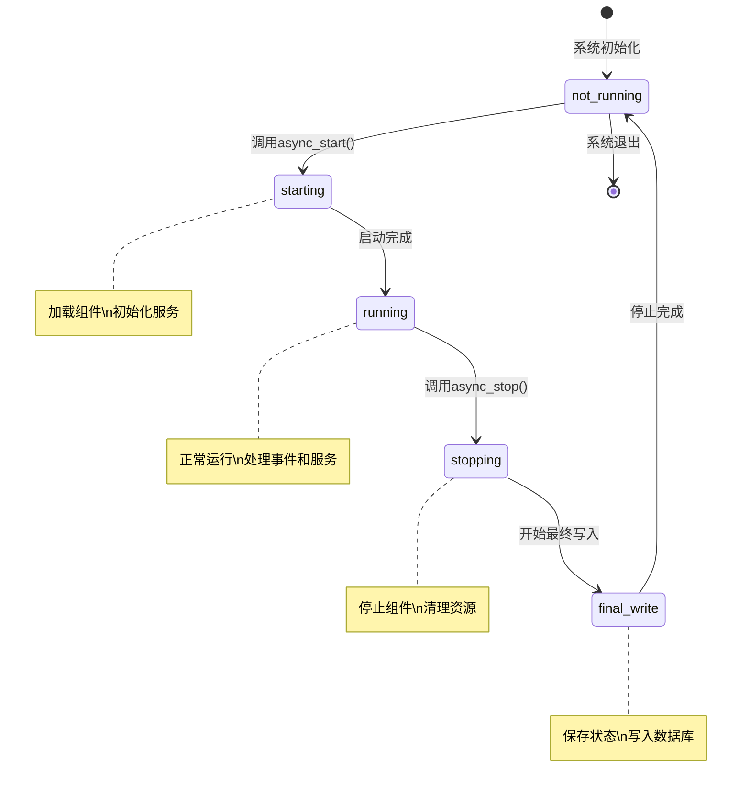
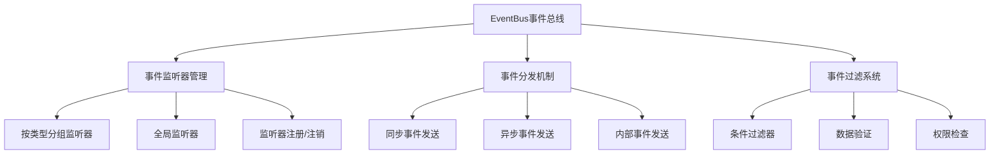
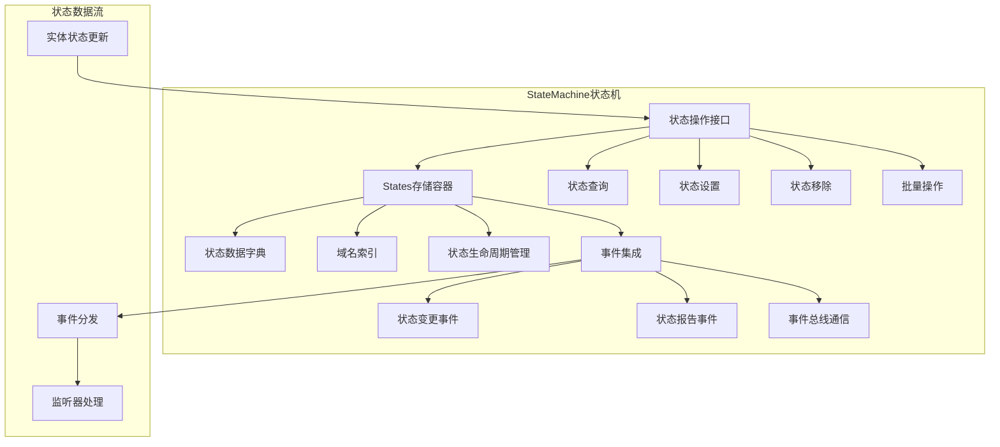
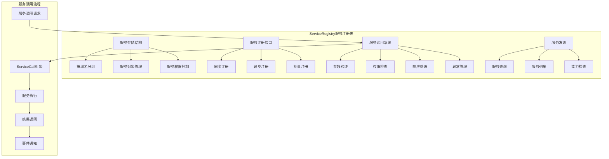
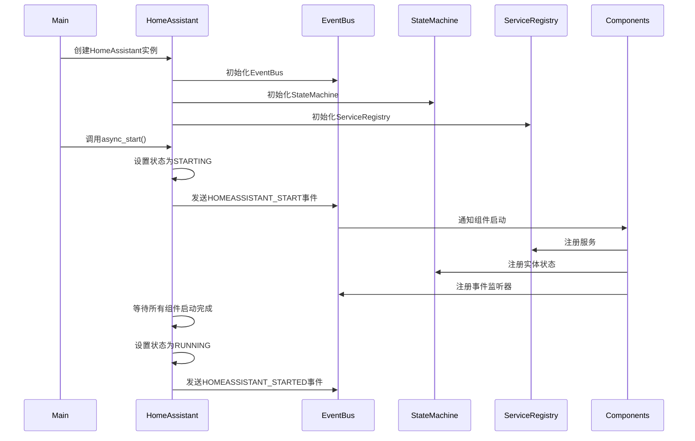
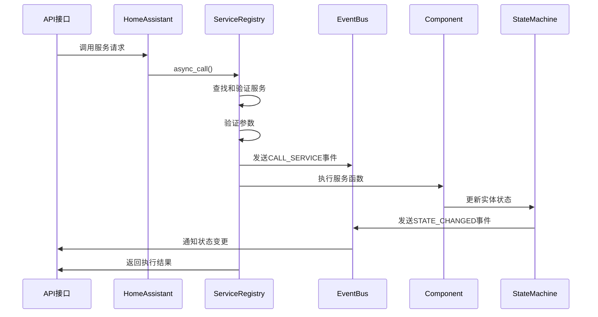
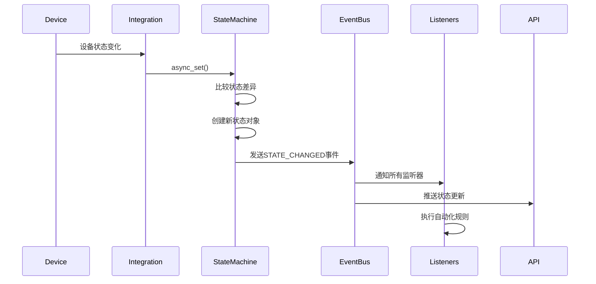

## 概述

本文档深入分析Home Assistant Core的核心模块，重点分析`homeassistant/core.py`中的四个关键类：
- `HomeAssistant` - 系统核心类
- `EventBus` - 事件总线
- `StateMachine` - 状态机
- `ServiceRegistry` - 服务注册表

这些类构成了Home Assistant系统的核心基础设施，处理事件流转、状态管理和服务调用。

## 1. HomeAssistant 核心类

### 1.1 类定义与结构

```python
class HomeAssistant:
    """Home Assistant系统根对象，负责整个家居自动化系统的运行管理"""
    
    # 关键组件引用
    auth: AuthManager                    # 认证管理器
    http: HomeAssistantHTTP             # HTTP服务器
    config_entries: ConfigEntries        # 配置条目管理器
    
    def __init__(self, config_dir: str) -> None:
        """初始化Home Assistant实例
        
        参数:
            config_dir: 配置文件目录路径，用于存储所有配置文件
        """
        # 数据存储容器 - 组件间共享数据的字典
        self.data = HassDict()
        
        # 异步事件循环 - 整个系统的事件循环基础
        self.loop = asyncio.get_running_loop()
        
        # 任务管理 - 跟踪活跃的异步任务
        self._tasks: set[asyncio.Future[Any]] = set()
        self._background_tasks: set[asyncio.Future[Any]] = set()
        
        # 核心组件初始化
        self.bus = EventBus(self)               # 事件总线
        self.services = ServiceRegistry(self)   # 服务注册表  
        self.states = StateMachine(self.bus, self.loop)  # 状态机
        self.config = Config(self, config_dir)  # 配置管理器
        
        # 系统状态控制
        self.state: CoreState = CoreState.not_running  # 当前运行状态
        self.exit_code: int = 0                        # 退出代码
        
        # 线程和超时管理
        self.timeout: TimeoutManager = TimeoutManager()  # 超时管理器
        self.import_executor = InterruptibleThreadPoolExecutor(
            max_workers=1, thread_name_prefix="ImportExecutor"
        )  # 导入模块专用线程池
        
        # 事件循环线程ID，用于线程安全检查
        self.loop_thread_id = self.loop._thread_id
```

### 1.2 核心状态管理

```python
class CoreState(enum.Enum):
    """系统核心状态枚举"""
    not_running = "NOT_RUNNING"    # 未启动
    starting = "STARTING"          # 启动中
    running = "RUNNING"            # 运行中
    stopping = "STOPPING"         # 停止中
    final_write = "FINAL_WRITE"    # 最终写入阶段
    not_running = "NOT_RUNNING"    # 已停止
```

**状态转换图：**



### 1.3 启动流程详解

```python
async def async_start(self) -> None:
    """系统异步启动流程 - 系统启动的核心方法"""
    
    # 1. 记录启动信息
    _LOGGER.info("Starting Home Assistant %s", __version__)
    
    # 2. 状态转换：not_running -> starting
    self.set_state(CoreState.starting)
    
    # 3. 发送核心配置更新事件
    self.bus.async_fire_internal(EVENT_CORE_CONFIG_UPDATE)
    
    # 4. 发送系统启动事件 - 通知所有监听器系统开始启动
    self.bus.async_fire_internal(EVENT_HOMEASSISTANT_START)
    
    # 5. 等待所有启动任务完成（最多15秒超时）
    if self._tasks:
        _done, pending = await asyncio.wait(
            self._tasks, timeout=TIMEOUT_EVENT_START
        )
        
        # 如果有未完成的任务，记录警告但继续启动
        if pending:
            _LOGGER.warning(
                "Something is blocking Home Assistant from wrapping up the start up"
                " phase. We're going to continue anyway."
            )
    
    # 6. 状态转换：starting -> running
    self.set_state(CoreState.running)
    
    # 7. 发送系统启动完成事件
    self.bus.async_fire_internal(EVENT_HOMEASSISTANT_STARTED)
    
    _LOGGER.info("Home Assistant started successfully")
```

### 1.4 任务管理机制

```python
def create_task(self, target: Coroutine[Any, Any, _T], *, eager: bool = True) -> asyncio.Task[_T]:
    """创建并管理异步任务
    
    参数:
        target: 要执行的协程对象
        eager: 是否立即开始执行任务（Python 3.12+特性）
        
    返回值:
        创建的任务对象
    
    功能说明:
        - 自动将任务添加到任务跟踪集合
        - 任务完成时自动从集合中移除
        - 支持任务异常处理和日志记录
    """
    if eager:
        # 使用eager任务创建（性能优化）
        task = create_eager_task(target, loop=self.loop)
    else:
        task = self.loop.create_task(target)
    
    # 添加到任务跟踪集合
    self._tasks.add(task)
    
    # 设置任务完成回调
    task.add_done_callback(self._tasks.discard)
    
    return task

async def async_add_executor_job(
    self, target: Callable[..., _T], *args: Any
) -> _T:
    """在线程池中执行阻塞函数
    
    参数:
        target: 要执行的函数
        *args: 函数参数
        
    返回值:
        函数执行结果
        
    功能说明:
        - 将CPU密集型或I/O阻塞操作放到线程池执行
        - 避免阻塞主事件循环
        - 自动处理异常和结果返回
    """
    return await self.loop.run_in_executor(None, target, *args)
```

## 2. EventBus 事件总线

### 2.1 事件总线架构



### 2.2 核心数据结构

```python
class EventBus:
    """事件总线实现 - 支持发布-订阅模式的事件系统"""
    
    __slots__ = ("_debug", "_hass", "_listeners", "_match_all_listeners")
    
    def __init__(self, hass: HomeAssistant) -> None:
        """初始化事件总线
        
        参数:
            hass: Home Assistant核心实例引用
        """
        # 按事件类型分组的监听器字典
        # key: 事件类型, value: 监听器列表
        self._listeners: defaultdict[
            EventType[Any] | str, list[_FilterableJobType[Any]]
        ] = defaultdict(list)
        
        # 监听所有事件的全局监听器列表
        self._match_all_listeners: list[_FilterableJobType[Any]] = []
        self._listeners[MATCH_ALL] = self._match_all_listeners
        
        self._hass = hass
        self._debug = False
        
        # 监听日志级别变化，动态调整调试模式
        self.async_listen(EVENT_LOGGING_CHANGED, self._async_logging_changed)
```

### 2.3 事件监听机制

```python
@callback
def async_listen(
    self,
    event_type: EventType[_DataT] | str,
    listener: Callable[[Event[_DataT]], Coroutine[Any, Any, None] | None],
    event_filter: Callable[[_DataT], bool] | None = None,
    run_immediately: bool | object = _SENTINEL,
) -> CALLBACK_TYPE:
    """注册事件监听器
    
    参数:
        event_type: 监听的事件类型，使用MATCH_ALL可监听所有事件
        listener: 事件处理函数，可以是同步或异步函数
        event_filter: 可选的事件数据过滤函数
        run_immediately: 是否立即运行（已弃用参数）
        
    返回值:
        取消监听器注册的函数
        
    功能说明:
        - 支持按事件类型精确监听
        - 支持全局事件监听（MATCH_ALL）
        - 支持事件数据过滤
        - 返回取消注册函数，便于清理
    """
    # 参数验证
    if run_immediately is not _SENTINEL:
        import warnings
        warnings.warn(
            "run_immediately is deprecated and will be removed",
            DeprecationWarning,
            stacklevel=2,
        )
    
    # 验证事件类型长度
    _verify_event_type_length_or_raise(event_type)
    
    # 创建任务包装器
    job = HassJob(listener)
    event_filter_tuple = (job, event_filter)
    
    # 根据事件类型添加到对应监听器列表
    if event_type == MATCH_ALL:
        self._match_all_listeners.append(event_filter_tuple)
    else:
        self._listeners[event_type].append(event_filter_tuple)
    
    # 返回取消注册函数
    @callback
    def async_remove_listener() -> None:
        """移除事件监听器"""
        try:
            if event_type == MATCH_ALL:
                self._match_all_listeners.remove(event_filter_tuple)
            else:
                self._listeners[event_type].remove(event_filter_tuple)
                
                # 如果该事件类型没有监听器了，清理字典条目
                if not self._listeners[event_type]:
                    self._listeners.pop(event_type)
        except ValueError:
            # 监听器已经被移除，忽略错误
            pass
    
    return async_remove_listener
```

### 2.4 事件分发算法

```python
@callback
def async_fire_internal(
    self,
    event_type: EventType[_DataT] | str,
    event_data: _DataT | None = None,
    origin: EventOrigin = EventOrigin.local,
    context: Context | None = None,
    time_fired: float | None = None,
) -> None:
    """内部事件分发实现 - 高性能事件分发核心算法
    
    参数:
        event_type: 事件类型标识
        event_data: 事件携带的数据
        origin: 事件来源（本地/远程）
        context: 事件上下文信息
        time_fired: 事件触发时间戳
        
    功能说明:
        - 高效的事件分发算法
        - 支持事件过滤和条件判断
        - 异常处理和错误恢复
        - 性能优化的监听器查找
    """
    # 调试模式下记录事件处理日志
    if self._debug:
        _LOGGER.debug(
            "Bus:Handling %s", _event_repr(event_type, origin, event_data)
        )
    
    # 获取特定类型的监听器
    listeners = self._listeners.get(event_type, EMPTY_LIST)
    
    # 获取全局监听器（某些事件类型除外）
    if event_type not in EVENTS_EXCLUDED_FROM_MATCH_ALL:
        match_all_listeners = self._match_all_listeners
    else:
        match_all_listeners = EMPTY_LIST
    
    # 延迟创建事件对象（性能优化）
    event: Event[_DataT] | None = None
    
    # 遍历所有相关监听器
    for job, event_filter in listeners + match_all_listeners:
        # 应用事件过滤器
        if event_filter is not None:
            try:
                if event_data is None or not event_filter(event_data):
                    continue  # 过滤器不匹配，跳过此监听器
            except Exception:
                _LOGGER.exception("Error in event filter")
                continue
        
        # 延迟创建事件对象
        if not event:
            event = Event(
                event_type,
                event_data,
                origin,
                time_fired,
                context,
            )
        
        # 执行监听器回调
        try:
            self._hass.async_run_hass_job(job, event)
        except Exception:
            _LOGGER.exception("Error running job: %s", job)
```

### 2.5 事件类型定义

```python
# 系统级核心事件
EVENT_HOMEASSISTANT_START = "homeassistant_start"       # 系统启动事件
EVENT_HOMEASSISTANT_STARTED = "homeassistant_started"   # 系统启动完成
EVENT_HOMEASSISTANT_STOP = "homeassistant_stop"         # 系统停止事件
EVENT_HOMEASSISTANT_FINAL_WRITE = "homeassistant_final_write"  # 最终写入事件

# 状态相关事件
EVENT_STATE_CHANGED = "state_changed"    # 实体状态变更事件
EVENT_STATE_REPORTED = "state_reported"  # 实体状态报告事件

# 服务相关事件
EVENT_SERVICE_REGISTERED = "service_registered"  # 服务注册事件
EVENT_SERVICE_REMOVED = "service_removed"        # 服务移除事件
EVENT_CALL_SERVICE = "call_service"              # 服务调用事件

# 配置相关事件
EVENT_CORE_CONFIG_UPDATE = "core_config_update"  # 核心配置更新事件
```

## 3. StateMachine 状态机

### 3.1 状态机架构设计



### 3.2 核心数据结构

```python
class StateMachine:
    """状态机实现 - 管理系统中所有实体的状态信息"""
    
    __slots__ = ("_bus", "_loop", "_reservations", "_states", "_states_data")
    
    def __init__(self, bus: EventBus, loop: asyncio.events.AbstractEventLoop) -> None:
        """初始化状态机
        
        参数:
            bus: 事件总线引用，用于发送状态变更事件
            loop: 异步事件循环引用
        """
        # States容器 - 高效的状态存储结构
        self._states = States()
        
        # 直接访问States的内部字典，提升读取性能
        self._states_data = self._states.data
        
        # 实体ID预留集合 - 防止ID冲突
        self._reservations: set[str] = set()
        
        # 事件总线和事件循环引用
        self._bus = bus
        self._loop = loop
```

### 3.3 状态查询接口

```python
def get(self, entity_id: str) -> State | None:
    """获取实体状态 - 线程安全的状态查询方法
    
    参数:
        entity_id: 实体ID，格式为 "domain.object_id"
        
    返回值:
        实体状态对象，不存在时返回None
        
    功能说明:
        - 线程安全，可在任意线程调用
        - 支持大小写不敏感查询
        - 高性能直接字典访问
    """
    return self._states_data.get(entity_id) or self._states_data.get(
        entity_id.lower()
    )

def is_state(self, entity_id: str, state: str) -> bool:
    """检查实体是否处于指定状态
    
    参数:
        entity_id: 实体ID
        state: 要检查的状态值
        
    返回值:
        实体存在且状态匹配返回True，否则返回False
    """
    state_obj = self.get(entity_id)
    return state_obj is not None and state_obj.state == state

@callback
def async_all(
    self, domain_filter: str | Iterable[str] | None = None
) -> list[State]:
    """获取所有状态列表 - 异步版本
    
    参数:
        domain_filter: 域名过滤器，可以是单个域名或域名列表
        
    返回值:
        符合条件的所有状态对象列表
        
    功能说明:
        - 支持按域名过滤
        - 高效的批量状态查询
        - 必须在事件循环中调用
    """
    if domain_filter is None:
        # 返回所有状态
        return list(self._states_data.values())
    
    if isinstance(domain_filter, str):
        # 单个域名过滤
        return list(self._states.domain_states(domain_filter.lower()))
    
    # 多个域名过滤
    states: list[State] = []
    for domain in domain_filter:
        states.extend(self._states.domain_states(domain))
    return states
```

### 3.4 状态设置机制

```python
@callback
def async_set(
    self,
    entity_id: str,
    new_state: str,
    attributes: Mapping[str, Any] | None = None,
    force_update: bool = False,
    context: Context | None = None,
) -> None:
    """异步设置实体状态 - 状态变更的核心方法
    
    参数:
        entity_id: 实体ID，必须符合 "domain.object_id" 格式
        new_state: 新的状态值（字符串）
        attributes: 可选的属性字典
        force_update: 是否强制更新（即使状态未变化）
        context: 操作上下文，包含用户、来源等信息
        
    功能说明:
        - 验证实体ID格式和状态值长度
        - 处理状态变更逻辑和事件分发
        - 支持属性深度比较和增量更新
        - 自动管理状态对象生命周期
    """
    # 实体ID标准化（转为小写）
    entity_id = entity_id.lower()
    new_state = validate_state(new_state)
    
    # 获取当前状态
    old_state = self._states_data.get(entity_id)
    
    # 如果状态对象不存在，创建新的状态对象
    if old_state is None:
        same_state = False
        same_attrs = False
        last_changed = last_reported = dt_util.utcnow()
    else:
        # 比较状态和属性是否发生变化
        same_state = old_state.state == new_state
        same_attrs = old_state.attributes == attributes
        last_changed = old_state.last_changed if same_state else dt_util.utcnow()
        last_reported = dt_util.utcnow()
    
    # 如果状态和属性都没有变化，且不是强制更新
    if same_state and same_attrs and not force_update:
        # 发送状态报告事件（表示状态被重复设置）
        if old_state:
            state_reported_data: EventStateReportedData = {
                "entity_id": entity_id,
                "last_reported": last_reported,
                "new_state": old_state,
                "old_last_reported": old_state.last_reported,
            }
            self._bus.async_fire_internal(
                EVENT_STATE_REPORTED,
                state_reported_data,
                context=context,
            )
        return
    
    # 创建新的状态对象
    new_state_obj = State(
        entity_id,
        new_state,
        attributes,
        last_changed,
        last_reported,
        context,
        domain=split_entity_id(entity_id)[0]  # 从entity_id提取域名
    )
    
    # 更新状态存储
    self._states[entity_id] = new_state_obj
    
    # 标记旧状态对象为过期
    if old_state:
        old_state.expire()
    
    # 发送状态变更事件
    state_changed_data: EventStateChangedData = {
        "entity_id": entity_id,
        "old_state": old_state,
        "new_state": new_state_obj,
    }
    self._bus.async_fire_internal(
        EVENT_STATE_CHANGED,
        state_changed_data,
        context=context,
    )
```

### 3.5 State状态对象

```python
@dataclass(slots=True, frozen=True, kw_only=True)
class State:
    """实体状态对象 - 不可变的状态数据容器"""
    
    # 基本标识信息
    entity_id: str                                    # 实体ID
    state: str                                        # 状态值
    attributes: ReadOnlyDict[str, Any] = field(
        default_factory=ReadOnlyDict, compare=False
    )                                                 # 只读属性字典
    
    # 时间戳信息
    last_changed: datetime.datetime = field(
        default_factory=dt_util.utcnow, compare=False
    )                                                 # 状态最后变更时间
    last_reported: datetime.datetime = field(
        default_factory=dt_util.utcnow, compare=False
    )                                                 # 状态最后报告时间
    last_updated: datetime.datetime = field(
        init=False, default_factory=dt_util.utcnow, compare=False
    )                                                 # 状态最后更新时间（已弃用）
    
    # 上下文和元数据
    context: Context = field(
        default_factory=Context, compare=False
    )                                                 # 操作上下文
    domain: str | None = field(default=None, compare=False)  # 实体域名
    
    # 内部状态管理
    _as_dict: dict[str, Any] = field(
        default_factory=dict, init=False, compare=False
    )                                                 # 字典缓存
    
    def as_dict(self) -> dict[str, Any]:
        """将状态对象转换为字典格式 - 用于JSON序列化
        
        返回值:
            包含状态信息的字典，可用于API响应和持久化存储
        """
        if not self._as_dict:
            # 构建状态字典（延迟计算，提升性能）
            self._as_dict = {
                "entity_id": self.entity_id,
                "state": self.state,
                "attributes": dict(self.attributes),
                "last_changed": self.last_changed.isoformat(),
                "last_reported": self.last_reported.isoformat(),
                "last_updated": self.last_updated.isoformat(),  # 向后兼容
                "context": self.context.as_dict(),
            }
        return self._as_dict
    
    def expire(self) -> None:
        """标记状态对象为过期 - 清理缓存数据"""
        self._as_dict.clear()
```

## 4. ServiceRegistry 服务注册表

### 4.1 服务架构设计



### 4.2 核心数据结构

```python
class ServiceRegistry:
    """服务注册表 - 管理系统中所有可调用的服务"""
    
    __slots__ = ("_hass", "_services")
    
    def __init__(self, hass: HomeAssistant) -> None:
        """初始化服务注册表
        
        参数:
            hass: Home Assistant核心实例引用
        """
        # 服务存储结构：{域名: {服务名: 服务对象}}
        self._services: dict[str, dict[str, Service]] = {}
        self._hass = hass

@dataclass(slots=True, frozen=True)
class Service:
    """服务对象定义 - 封装服务的所有信息"""
    
    func: HassJob[..., Coroutine[Any, Any, ServiceResponse] | ServiceResponse]  # 服务函数
    schema: vol.Schema | None                      # 参数验证模式
    domain: str                                    # 服务所属域名
    service: str                                   # 服务名称
    supports_response: SupportsResponse            # 是否支持响应数据
    
    def __post_init__(self) -> None:
        """服务对象初始化后处理"""
        # 验证服务函数类型
        if self.func.job_type is None:
            object.__setattr__(
                self.func, "job_type", 
                get_hassjob_callable_job_type(self.func.target)
            )
```

### 4.3 服务注册机制

```python
@callback
def async_register(
    self,
    domain: str,
    service: str,
    service_func: Callable[[ServiceCall], Coroutine[Any, Any, ServiceResponse] | ServiceResponse | None],
    schema: VolSchemaType | None = None,
    supports_response: SupportsResponse = SupportsResponse.NONE,
    job_type: HassJobType | None = None,
) -> None:
    """异步注册服务 - 服务注册的核心方法
    
    参数:
        domain: 服务域名（如'light'、'switch'等）
        service: 服务名称（如'turn_on'、'turn_off'等）
        service_func: 服务实现函数，可以是同步或异步函数
        schema: 参数验证模式，用于验证服务调用参数
        supports_response: 服务是否支持返回响应数据
        job_type: 任务类型，用于性能优化
        
    功能说明:
        - 参数验证和规范化
        - 服务函数包装和优化
        - 事件通知和日志记录
        - 线程安全保证
    """
    # 验证必须在事件循环线程中调用
    self._hass.verify_event_loop_thread("hass.services.async_register")
    
    # 调用内部注册方法
    self._async_register(
        domain, service, service_func, schema, supports_response, job_type
    )

@callback
def _async_register(
    self,
    domain: str,
    service: str,
    service_func: Callable,
    schema: VolSchemaType | None = None,
    supports_response: SupportsResponse = SupportsResponse.NONE,
    job_type: HassJobType | None = None,
) -> None:
    """内部服务注册实现"""
    
    # 规范化域名和服务名（转为小写）
    domain = domain.lower()
    service = service.lower()
    
    # 创建服务对象
    service_obj = Service(
        HassJob(service_func, job_type=job_type),  # 包装为HassJob
        schema,
        domain,
        service,
        supports_response=supports_response,
    )
    
    # 确保域名存在于服务字典中
    if domain not in self._services:
        self._services[domain] = {}
    
    # 注册服务
    self._services[domain][service] = service_obj
    
    # 发送服务注册事件
    service_registered_data = {
        "domain": domain,
        "service": service,
    }
    self._hass.bus.async_fire_internal(
        EVENT_SERVICE_REGISTERED,
        service_registered_data,
    )
    
    _LOGGER.info("Registered service %s.%s", domain, service)
```

### 4.4 服务调用机制

```python
async def async_call(
    self,
    domain: str,
    service: str,
    service_data: dict[str, Any] | None = None,
    blocking: bool = True,
    context: Context | None = None,
    limit: float | None = SERVICE_CALL_LIMIT,
    target: dict[str, Any] | None = None,
    return_response: bool = False,
) -> ServiceResponse:
    """异步调用服务 - 服务调用的核心实现
    
    参数:
        domain: 服务域名
        service: 服务名称  
        service_data: 服务调用参数
        blocking: 是否阻塞等待服务完成
        context: 调用上下文
        limit: 调用超时时间（秒）
        target: 目标实体选择器
        return_response: 是否返回响应数据
        
    返回值:
        服务响应数据（如果支持的话）
        
    功能说明:
        - 服务查找和验证
        - 参数验证和处理
        - 权限检查
        - 超时控制
        - 异常处理和恢复
    """
    # 规范化域名和服务名
    domain = domain.lower()
    service = service.lower()
    
    # 创建服务调用上下文
    if context is None:
        context = Context()
    
    # 查找服务实现
    try:
        handler = self._services[domain][service]
    except KeyError:
        raise ServiceNotFound(domain, service) from None
    
    # 验证响应支持
    if return_response and handler.supports_response == SupportsResponse.NONE:
        raise HomeAssistantError(
            f"Service {domain}.{service} does not support response data"
        )
    
    # 参数验证
    if handler.schema:
        try:
            processed_data = handler.schema(service_data or {})
        except vol.Invalid as ex:
            raise ServiceValidationError(
                f"Invalid service data for {domain}.{service}: {ex}"
            ) from ex
    else:
        processed_data = service_data or {}
    
    # 创建服务调用对象
    service_call = ServiceCall(
        domain,
        service,
        processed_data,
        context,
        return_response=return_response,
    )
    
    # 发送服务调用事件
    call_service_data = {
        "domain": domain,
        "service": service,
        "service_data": processed_data,
    }
    self._hass.bus.async_fire_internal(
        EVENT_CALL_SERVICE,
        call_service_data,
        context=context,
    )
    
    # 执行服务调用
    try:
        # 设置超时控制
        if limit is not None:
            async with asyncio.timeout(limit):
                response = await self._execute_service(handler, service_call)
        else:
            response = await self._execute_service(handler, service_call)
        
        return response
        
    except asyncio.TimeoutError:
        _LOGGER.warning("Service %s.%s timed out", domain, service)
        raise
    except Exception as ex:
        _LOGGER.error("Error executing service %s.%s: %s", domain, service, ex)
        raise

async def _execute_service(
    self, handler: Service, service_call: ServiceCall
) -> ServiceResponse:
    """执行服务调用的内部方法
    
    参数:
        handler: 服务处理对象
        service_call: 服务调用对象
        
    返回值:
        服务执行结果
    """
    try:
        # 执行服务函数
        result = await self._hass.async_run_hass_job(
            handler.func, service_call
        )
        
        # 处理返回值
        if service_call.return_response:
            return result
        
        return None
        
    except Exception as ex:
        # 记录服务执行异常
        _LOGGER.exception(
            "Error executing service %s.%s", 
            service_call.domain, 
            service_call.service
        )
        raise
```

## 5. 核心模块交互流程

### 5.1 系统启动时序



### 5.2 服务调用流程



### 5.3 状态变更流程



## 6. 性能优化要点

### 6.1 内存优化
- **`__slots__`使用**：核心类都使用`__slots__`减少内存占用
- **延迟加载**：状态字典缓存采用延迟计算策略
- **对象池**：重用常见对象如Context、Event等

### 6.2 执行效率优化
- **直接字典访问**：StateMachine使用`_states_data`直接访问
- **事件过滤**：EventBus在分发前先过滤不必要的事件
- **任务类型优化**：使用`eager_task`提升任务创建性能

### 6.3 线程安全设计
- **事件循环验证**：关键方法都验证调用线程
- **callback装饰器**：标记线程安全的方法
- **锁机制**：在必要处使用asyncio.Lock保护共享资源

## 7. 最佳实践总结

1. **事件驱动**：充分利用事件系统实现组件解耦
2. **异步优先**：所有I/O操作都采用异步模式
3. **错误处理**：完善的异常捕获和恢复机制
4. **性能监控**：关键路径都有性能监控和日志
5. **向后兼容**：API变更时保持向后兼容性

这些核心模块构成了Home Assistant强大而灵活的基础架构，支撑着整个智能家居生态系统的运行。

## 下一步分析

接下来将继续深入分析：
- [组件系统架构](/posts/03-组件系统分析/)
- [API接口系统](/posts/05-API接口分析/)
- [配置和存储系统](/posts/06-数据存储分析/)
