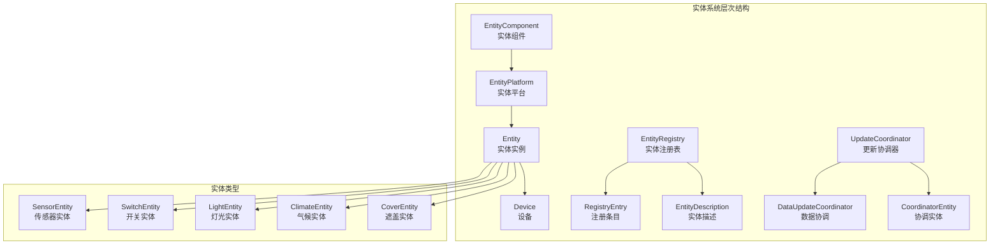
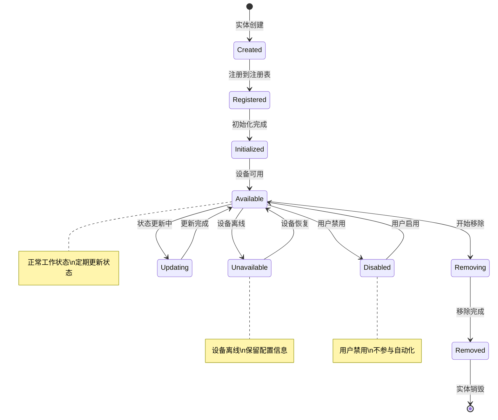
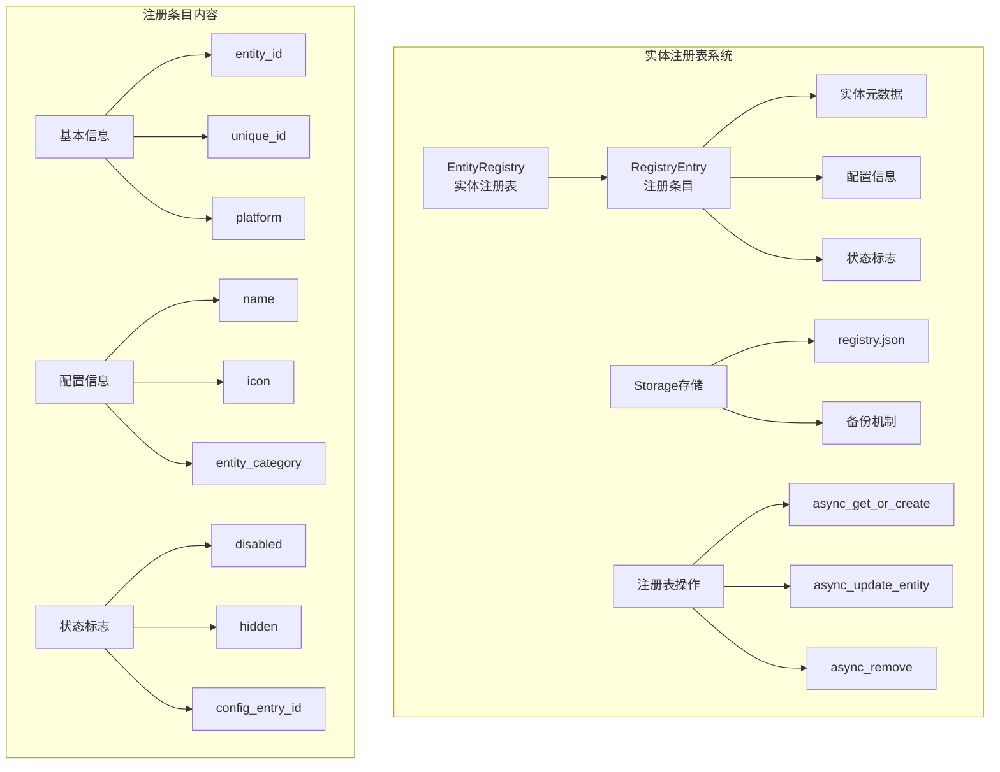

# Home Assistant Core 源码深度解析 - 实体平台系统篇

## 概述

实体平台系统是Home Assistant的核心架构之一，负责管理所有设备和服务的抽象表示。本文档深入分析实体生命周期、平台管理机制、以及实体与系统其他组件的交互关系。

## 1. 实体系统整体架构

### 1.1 系统层次结构



### 1.2 实体生命周期状态



## 2. EntityComponent 实体组件详解

### 2.1 EntityComponent核心实现

```python
class EntityComponent[_EntityT: entity.Entity = entity.Entity]:
    """实体组件类 - 管理特定域的所有平台和实体
    
    职责:
        1. 管理域级别的实体平台（如所有的light平台）
        2. 处理平台的动态加载和发现
        3. 提供实体的统一访问接口
        4. 协调实体的生命周期管理
        
    核心概念:
        - 一个域对应一个EntityComponent（如light域）
        - 一个EntityComponent管理多个EntityPlatform（如hue.light, mqtt.light）
        - 提供域级别的服务和事件处理
    """
    
    def __init__(
        self,
        logger: logging.Logger,
        domain: str,
        hass: HomeAssistant,
        scan_interval: timedelta = DEFAULT_SCAN_INTERVAL,
    ) -> None:
        """初始化实体组件
        
        参数:
            logger: 日志记录器
            domain: 实体域名（如'light'、'sensor'）
            hass: Home Assistant核心实例
            scan_interval: 默认状态更新间隔
            
        初始化过程:
            1. 设置基础属性和配置
            2. 创建域平台用于直接添加实体
            3. 初始化平台字典和实体存储
            4. 注册到全局组件实例字典
        """
        self.logger = logger
        self.hass = hass
        self.domain = domain
        self.scan_interval = scan_interval
        
        # 配置存储
        self.config: ConfigType | None = None
        
        # 创建域平台 - 用于direct entity添加（不通过特定平台）
        domain_platform = self._async_init_entity_platform(domain, None)
        
        # 平台存储字典
        # key: 平台标识符或(平台名, 扫描间隔, 命名空间)的元组
        # value: EntityPlatform实例
        self._platforms: dict[
            str | tuple[str, timedelta | None, str | None], EntityPlatform
        ] = {domain: domain_platform}
        
        # 实体添加方法的快速访问
        self.async_add_entities = domain_platform.async_add_entities
        self.add_entities = domain_platform.add_entities
        
        # 实体存储 - 指向域平台的实体字典
        self._entities: dict[str, entity.Entity] = domain_platform.domain_entities
        
        # 注册到全局组件实例字典
        hass.data.setdefault(DATA_INSTANCES, {})[domain] = self
    
    @property
    def entities(self) -> Iterable[_EntityT]:
        """返回所有实体的迭代器
        
        返回值:
            包含该域所有实体的可迭代对象
            
        注意事项:
            由于底层字典可能在异步上下文中发生变化，
            异步迭代时建议先用list()创建副本
        """
        return self._entities.values()
    
    def get_entity(self, entity_id: str) -> _EntityT | None:
        """获取指定ID的实体对象
        
        参数:
            entity_id: 实体ID，格式为'domain.object_id'
            
        返回值:
            实体对象，不存在时返回None
        """
        return self._entities.get(entity_id)
    
    async def async_setup(self, config: ConfigType) -> None:
        """异步设置实体组件 - 组件初始化的核心方法
        
        参数:
            config: 全局配置字典
            
        设置流程:
            1. 注册系统停止事件监听器
            2. 从配置中加载平台
            3. 设置平台发现监听器
            4. 为每个配置的平台创建设置任务
        """
        # 注册系统关闭监听器
        self.register_shutdown()
        
        # 保存配置引用
        self.config = config
        
        # 处理配置中的平台设置
        # 支持配置格式：
        # light:
        #   - platform: hue
        #     host: 192.168.1.100
        #   - platform: mqtt
        #     name: mqtt_lights
        for p_type, p_config in conf_util.config_per_platform(config, self.domain):
            if p_type is not None:
                # 为每个平台创建异步设置任务
                self.hass.async_create_task_internal(
                    self.async_setup_platform(p_type, p_config),
                    f"EntityComponent setup platform {p_type} {self.domain}",
                    eager_start=True,  # 立即开始执行
                )
        
        # 设置动态平台发现监听器
        # 当其他组件动态加载平台时触发
        discovery.async_listen_platform(
            self.hass, self.domain, self._async_component_platform_discovered
        )
    
    async def async_setup_platform(
        self,
        platform_type: str,
        platform_config: ConfigType,
        discovery_info: DiscoveryInfoType = None,
    ) -> EntityPlatform | None:
        """异步设置单个平台 - 平台设置的核心逻辑
        
        参数:
            platform_type: 平台类型名称（如'hue'、'mqtt'）
            platform_config: 平台特定配置
            discovery_info: 发现信息（可选）
            
        返回值:
            创建的EntityPlatform实例，失败时返回None
            
        设置流程:
            1. 准备平台模块
            2. 提取平台配置参数
            3. 创建EntityPlatform实例
            4. 执行平台的async_setup_platform方法
            5. 注册平台到组件
        """
        try:
            # 准备平台模块和集成
            platform, integration = await async_prepare_setup_platform(
                self.hass, self.config or {}, self.domain, platform_type
            )
            
            if platform is None:
                self.logger.error("Platform %s not found", platform_type)
                return None
            
            # 提取平台配置参数
            scan_interval = platform_config.get(CONF_SCAN_INTERVAL, self.scan_interval)
            entity_namespace = platform_config.get(CONF_ENTITY_NAMESPACE)
            
            # 创建平台键用于缓存
            platform_key = (platform_type, scan_interval, entity_namespace)
            
            # 检查是否已经设置过相同的平台
            if platform_key in self._platforms:
                self.logger.warning(
                    "Platform %s already set up with same configuration", 
                    platform_type
                )
                return self._platforms[platform_key]
            
            # 创建EntityPlatform实例
            entity_platform = self._async_init_entity_platform(
                platform_type,
                platform,
                scan_interval=scan_interval,
                entity_namespace=entity_namespace,
            )
            
            # 缓存平台实例
            self._platforms[platform_key] = entity_platform
            
            # 执行平台设置
            if hasattr(platform, "async_setup_platform"):
                # 现代异步设置方法
                setup_success = await platform.async_setup_platform(
                    self.hass, 
                    platform_config, 
                    entity_platform.async_add_entities,
                    discovery_info
                )
            elif hasattr(platform, "setup_platform"):
                # 传统同步设置方法（已弃用）
                setup_success = await self.hass.async_add_executor_job(
                    platform.setup_platform,
                    self.hass,
                    platform_config,
                    entity_platform.add_entities,
                    discovery_info
                )
            else:
                self.logger.error(
                    "Platform %s does not implement setup method", 
                    platform_type
                )
                return None
            
            if setup_success is False:
                self.logger.error("Platform %s setup failed", platform_type)
                return None
            
            self.logger.info("Platform %s setup completed", platform_type)
            return entity_platform
            
        except Exception as err:
            self.logger.exception(
                "Error setting up platform %s: %s", 
                platform_type, err
            )
            return None
    
    def _async_init_entity_platform(
        self,
        platform_name: str,
        platform: ModuleType | None,
        *,
        scan_interval: timedelta | None = None,
        entity_namespace: str | None = None,
    ) -> EntityPlatform:
        """初始化EntityPlatform实例 - 平台对象的工厂方法
        
        参数:
            platform_name: 平台名称
            platform: 平台模块对象
            scan_interval: 扫描间隔
            entity_namespace: 实体命名空间
            
        返回值:
            配置好的EntityPlatform实例
        """
        return EntityPlatform(
            hass=self.hass,
            logger=self.logger,
            domain=self.domain,
            platform_name=platform_name,
            platform=platform,
            scan_interval=scan_interval or self.scan_interval,
            entity_namespace=entity_namespace,
        )
    
    def register_shutdown(self) -> None:
        """注册系统关闭事件监听器
        
        功能:
            监听HOME_ASSISTANT_STOP事件，
            在系统停止时清理组件资源
        """
        self.hass.bus.async_listen_once(
            EVENT_HOMEASSISTANT_STOP, 
            self._async_shutdown
        )
    
    async def _async_shutdown(self, event: Event) -> None:
        """异步关闭组件 - 清理所有资源
        
        清理内容:
            1. 停止所有平台的定时器
            2. 取消正在进行的任务
            3. 清理实体引用
            4. 从全局实例字典中移除
        """
        self.logger.info("Shutting down entity component %s", self.domain)
        
        # 关闭所有平台
        for platform in self._platforms.values():
            await platform.async_reset()
        
        # 清理实例引用
        instances = self.hass.data.get(DATA_INSTANCES, {})
        instances.pop(self.domain, None)
        
        self.logger.info("Entity component %s shutdown completed", self.domain)
```

## 3. EntityPlatform 实体平台详解

### 3.1 EntityPlatform核心架构

```python
class EntityPlatform:
    """实体平台类 - 管理单个平台的所有实体
    
    实例示例:
        - 'hue.light' 平台管理所有Philips Hue灯泡实体
        - 'mqtt.sensor' 平台管理所有MQTT传感器实体
        - 'template.switch' 平台管理所有模板开关实体
        
    核心职责:
        1. 管理平台内的实体注册和注销
        2. 协调实体的状态更新机制
        3. 处理实体的并发更新控制
        4. 管理实体的生命周期事件
    """
    
    def __init__(
        self,
        *,
        hass: HomeAssistant,
        logger: Logger,
        domain: str,
        platform_name: str,
        platform: EntityPlatformModule | None,
        scan_interval: timedelta,
        entity_namespace: str | None,
    ) -> None:
        """初始化实体平台
        
        参数:
            hass: Home Assistant核心实例
            logger: 日志记录器
            domain: 实体域名（如'light'）
            platform_name: 平台名称（如'hue'）
            platform: 平台模块对象
            scan_interval: 状态扫描间隔
            entity_namespace: 实体命名空间（可选）
        """
        self.hass = hass
        self.logger = logger
        self.platform = platform
        self.scan_interval = scan_interval
        self.scan_interval_seconds = scan_interval.total_seconds()
        self.entity_namespace = entity_namespace
        self.config_entry: config_entries.ConfigEntry | None = None
        
        # 实体存储 - 仅包含此平台的实体
        # key: entity_id, value: Entity实例
        self.entities: dict[str, Entity] = {}
        
        # 任务管理
        self._tasks: list[asyncio.Task[None]] = []
        self._setup_complete = False
        
        # 定时器管理
        self._async_polling_timer: asyncio.TimerHandle | None = None
        self._async_cancel_retry_setup: CALLBACK_TYPE | None = None
        
        # 并发控制
        self._process_updates: asyncio.Lock | None = None
        self.parallel_updates: asyncio.Semaphore | None = None
        self._update_in_sequence: bool = False
        
        # 平台为None表示这是EntityComponent的"catch-all"平台
        self.parallel_updates_created = platform is None
        
        # 全局实体存储引用
        # 按域名分组的实体字典 - 如 light: {entity_id: Entity}
        self.domain_entities = hass.data.setdefault(
            DATA_DOMAIN_ENTITIES, {}
        ).setdefault(domain, {})
        
        # 按域名+平台分组的实体字典 - 如 light.hue: {entity_id: Entity}  
        self.domain_platform_entities = hass.data.setdefault(
            DATA_DOMAIN_PLATFORM_ENTITIES, {}
        ).setdefault(f"{domain}.{platform_name}", {})
    
    @property
    def platform_name(self) -> str:
        """平台名称属性"""
        return self._platform_name
    
    def async_add_entities(
        self,
        new_entities: Iterable[Entity],
        update_before_add: bool = False,
    ) -> None:
        """异步添加实体到平台 - 实体注册的主要入口点
        
        参数:
            new_entities: 要添加的实体列表
            update_before_add: 添加前是否先更新状态
            
        功能:
            1. 验证实体的有效性
            2. 设置实体的平台关联
            3. 注册实体到各个存储字典
            4. 触发实体初始化流程
            
        注意:
            此方法必须在事件循环中调用
        """
        if not isinstance(new_entities, list):
            new_entities = list(new_entities)
        
        if not new_entities:
            return
        
        self.logger.debug(
            "Adding %d entities for platform %s.%s",
            len(new_entities),
            self.domain,
            self.platform_name,
        )
        
        # 创建实体添加任务
        self.hass.async_create_task_internal(
            self._async_add_entities(
                new_entities, 
                update_before_add=update_before_add
            ),
            f"EntityPlatform add entities {self.platform_name} {self.domain}",
            eager_start=True,
        )
    
    def add_entities(
        self,
        new_entities: Iterable[Entity],
        update_before_add: bool = False,
    ) -> None:
        """同步添加实体（兼容性方法）
        
        将同步调用转换为异步调用，
        用于兼容旧版本的平台实现
        """
        run_callback_threadsafe(
            self.hass.loop,
            partial(
                self.async_add_entities,
                new_entities,
                update_before_add=update_before_add,
            ),
        ).result()
    
    async def _async_add_entities(
        self,
        entities: list[Entity],
        update_before_add: bool,
    ) -> None:
        """内部异步添加实体实现 - 实体添加的核心逻辑
        
        参数:
            entities: 实体列表
            update_before_add: 是否在添加前更新状态
            
        处理流程:
            1. 获取实体注册表
            2. 为每个实体分配entity_id
            3. 验证实体的唯一性
            4. 处理实体注册和启用状态
            5. 执行实体初始化
        """
        # 获取实体注册表
        entity_registry = er.async_get(self.hass)
        
        # 批量处理所有实体
        tasks = []
        for entity in entities:
            if entity.hass is not None:
                self.logger.warning(
                    "Entity %s is already assigned to hass",
                    getattr(entity, "entity_id", "Unknown")
                )
                continue
            
            # 创建实体添加任务
            task = self.hass.async_create_task(
                self._async_add_entity(
                    entity,
                    update_before_add=update_before_add,
                    entity_registry=entity_registry,
                )
            )
            tasks.append(task)
        
        if tasks:
            # 等待所有实体添加完成
            await asyncio.gather(*tasks)
    
    async def _async_add_entity(
        self,
        entity: Entity,
        update_before_add: bool,
        entity_registry: EntityRegistry,
        config_subentry_id: str | None = None,
    ) -> None:
        """添加单个实体的完整流程 - 实体生命周期管理的核心
        
        参数:
            entity: 要添加的实体
            update_before_add: 是否在添加前更新
            entity_registry: 实体注册表
            config_subentry_id: 配置子条目ID
            
        详细流程:
            1. 设置实体基础属性
            2. 生成或验证entity_id
            3. 处理实体注册表条目
            4. 检查实体启用状态
            5. 执行实体初始化
            6. 注册到各个存储容器
        """
        # 第一步：设置实体基础属性
        entity.hass = self.hass
        entity.platform = self
        entity._entity_component_unrecorded_attributes = frozenset(
            ENTITY_COMPONENT_UNRECORDED_ATTRIBUTES
        )
        
        # 第二步：处理实体ID生成
        suggested_entity_id = entity.entity_id
        if suggested_entity_id is not None:
            # 验证现有entity_id格式
            if not valid_entity_id(suggested_entity_id):
                self.logger.error(
                    "Invalid entity ID: %s. Expected format: domain.object_id",
                    suggested_entity_id
                )
                entity.add_to_platform_abort()
                return
        else:
            # 生成新的entity_id
            suggested_object_id = entity.suggested_object_id
            if suggested_object_id is None:
                self.logger.error(
                    "Entity %s does not have a suggested object ID",
                    entity
                )
                entity.add_to_platform_abort()
                return
            
            # 计算完整的entity_id
            suggested_entity_id = async_calculate_suggested_object_id(
                entity, self.entity_namespace, suggested_object_id
            )
        
        # 第三步：处理实体注册表
        registry_entry = None
        if entity.unique_id is not None:
            # 通过unique_id查找或创建注册表条目
            registry_entry = entity_registry.async_get_or_create(
                domain=entity.platform.domain,
                platform=entity.platform.platform_name,
                unique_id=entity.unique_id,
                config_entry=self.config_entry,
                suggested_object_id=entity.suggested_object_id,
                config_subentry_id=config_subentry_id,
                original_name=entity.name,
                original_device_class=entity.device_class,
                original_icon=entity.icon,
            )
            
            # 使用注册表中的entity_id
            entity_id = registry_entry.entity_id
            entity.registry_entry = registry_entry
            entity.entity_id = entity_id
        else:
            # 无unique_id的实体，直接使用建议的entity_id
            entity_id = suggested_entity_id
            entity.entity_id = entity_id
        
        # 第四步：检查实体启用状态
        if registry_entry and registry_entry.disabled:
            self.logger.debug(
                "Not adding entity %s because it's disabled",
                registry_entry.name or entity.name or f"{self.platform_name} {entity.unique_id}"
            )
            entity.add_to_platform_abort()
            return
        
        # 第五步：检查实体ID冲突
        if entity_id in self.domain_entities:
            self.logger.error(
                "Entity %s already exists in domain %s",
                entity_id, self.domain
            )
            entity.add_to_platform_abort()
            return
        
        # 第六步：注册实体到存储容器
        self.entities[entity_id] = entity
        self.domain_entities[entity_id] = entity
        self.domain_platform_entities[entity_id] = entity
        
        # 第七步：预留状态机中的状态位置
        # 防止在add_to_platform_finish执行前被其他实体占用相同ID
        if not entity.registry_entry or not entity.registry_entry.disabled:
            self.hass.states.async_reserve(entity.entity_id)
        
        # 第八步：设置实体移除回调
        def remove_entity_cb() -> None:
            """实体移除时的清理回调"""
            self.entities.pop(entity_id, None)
            self.domain_entities.pop(entity_id, None)  
            self.domain_platform_entities.pop(entity_id, None)
        
        entity.async_on_remove(remove_entity_cb)
        
        # 第九步：完成实体添加到平台
        await entity.add_to_platform_finish()
        
        self.logger.debug("Entity %s added to platform %s", entity_id, self.platform_name)
```

### 3.2 实体更新协调机制

```python
class EntityUpdateCoordinator:
    """实体更新协调器 - 管理实体的状态更新机制
    
    功能:
        1. 协调多个实体的并发更新
        2. 实现背压控制防止系统过载
        3. 提供智能的更新调度策略
        4. 处理更新异常和恢复
    """
    
    def __init__(self, platform: EntityPlatform):
        self.platform = platform
        self.hass = platform.hass
        self.logger = platform.logger
        
        # 并发控制
        self._parallel_updates = platform.parallel_updates
        self._update_lock = asyncio.Lock()
        
        # 更新统计
        self._update_count = 0
        self._failed_updates = 0
        self._last_update_time = 0
    
    async def async_update_entities(self, entities: list[Entity]) -> None:
        """协调多个实体的状态更新
        
        参数:
            entities: 需要更新的实体列表
            
        更新策略:
            1. 根据平台配置决定并发或顺序更新
            2. 应用背压控制防止过载
            3. 处理更新异常和重试
            4. 记录更新统计信息
        """
        if not entities:
            return
        
        self.logger.debug("Updating %d entities", len(entities))
        start_time = time.time()
        
        try:
            if self._parallel_updates:
                # 并发更新模式
                await self._async_parallel_update(entities)
            else:
                # 顺序更新模式
                await self._async_sequential_update(entities)
            
            # 记录更新统计
            update_time = time.time() - start_time
            self._update_count += len(entities)
            self._last_update_time = time.time()
            
            self.logger.debug(
                "Updated %d entities in %.2f seconds",
                len(entities), update_time
            )
            
            # 检查更新性能
            if update_time > SLOW_UPDATE_WARNING:
                self.logger.warning(
                    "Entity update took %.2f seconds (slow), consider optimization",
                    update_time
                )
            
        except Exception as err:
            self._failed_updates += len(entities)
            self.logger.error("Entity update failed: %s", err)
            raise
    
    async def _async_parallel_update(self, entities: list[Entity]) -> None:
        """并发更新实体状态
        
        特点:
            - 使用信号量控制并发数量
            - 防止过多并发请求造成系统过载
            - 单个实体更新失败不影响其他实体
        """
        semaphore = self._parallel_updates
        
        async def update_entity_with_semaphore(entity: Entity) -> None:
            async with semaphore:
                try:
                    await entity.async_update_ha_state(force_refresh=True)
                except Exception as err:
                    self.logger.error(
                        "Error updating entity %s: %s",
                        entity.entity_id, err
                    )
        
        # 创建所有更新任务
        tasks = [
            self.hass.async_create_task(
                update_entity_with_semaphore(entity),
                f"update {entity.entity_id}"
            )
            for entity in entities
        ]
        
        # 等待所有更新完成（允许部分失败）
        await asyncio.gather(*tasks, return_exceptions=True)
    
    async def _async_sequential_update(self, entities: list[Entity]) -> None:
        """顺序更新实体状态
        
        适用场景:
            - 设备不支持并发访问
            - 网络带宽有限的情况
            - 需要保证更新顺序的场景
        """
        for entity in entities:
            try:
                await entity.async_update_ha_state(force_refresh=True)
            except Exception as err:
                self.logger.error(
                    "Error updating entity %s: %s",
                    entity.entity_id, err
                )
                # 继续更新其他实体
                continue
    
    def get_update_statistics(self) -> dict[str, Any]:
        """获取更新统计信息"""
        return {
            "total_updates": self._update_count,
            "failed_updates": self._failed_updates,
            "success_rate": (
                (self._update_count - self._failed_updates) / self._update_count
                if self._update_count > 0 else 0
            ),
            "last_update_time": self._last_update_time,
        }
```

## 4. Entity 实体基类深度解析

### 4.1 实体生命周期管理

```python
class Entity:
    """Home Assistant实体基类 - 所有设备和服务的抽象基础
    
    核心概念:
        - 实体是Home Assistant中所有"物品"的抽象表示
        - 每个实体都有唯一的entity_id和可选的unique_id
        - 实体通过状态(state)和属性(attributes)描述其当前情况
        - 实体的生命周期由平台系统管理
        
    关键属性:
        - entity_id: 全局唯一标识符，格式为"domain.object_id"
        - unique_id: 设备级唯一标识，用于实体注册表管理
        - state: 实体的当前状态值
        - attributes: 实体的扩展属性字典
        - available: 实体是否可用（设备是否在线）
    """
    
    # 核心标识属性
    entity_id: str = None                    # 实体ID
    hass: HomeAssistant = None              # Home Assistant引用
    platform: EntityPlatform = None        # 所属平台引用
    
    # 实体描述
    entity_description: EntityDescription   # 实体描述对象
    
    # 生命周期状态
    _removed = False                        # 实体是否已移除
    _slow_reported = False                  # 是否已报告慢更新
    
    # 状态相关属性
    _attr_available: bool = True            # 实体可用性
    _attr_state: StateType = STATE_UNKNOWN # 实体状态
    _attr_should_poll: bool = True          # 是否需要轮询
    
    def __init_subclass__(cls, **kwargs: Any) -> None:
        """子类初始化钩子 - 自动处理实体子类的特殊设置
        
        功能:
            1. 合并未记录属性集合
            2. 设置类级别的元数据
            3. 验证子类的正确性
        """
        super().__init_subclass__(**kwargs)
        
        # 合并未记录属性（不会保存到状态机的属性）
        cls.__combined_unrecorded_attributes = (
            cls._entity_component_unrecorded_attributes | cls._unrecorded_attributes
        )
    
    async def add_to_platform_start(
        self,
        hass: HomeAssistant,
        platform: EntityPlatform,
        parallel_updates: asyncio.Semaphore | None,
    ) -> None:
        """实体添加到平台的开始阶段 - 实体生命周期的起点
        
        参数:
            hass: Home Assistant核心实例
            platform: 所属平台
            parallel_updates: 并发更新信号量
            
        初始化内容:
            1. 设置核心引用
            2. 初始化状态管理
            3. 准备生命周期钩子
            4. 设置并发控制
        """
        # 设置核心引用
        self.hass = hass
        self.platform = platform
        
        # 初始化移除回调列表
        self._async_remove_listeners: list[CALLBACK_TYPE] = []
        
        # 设置并发更新控制
        self._parallel_updates = parallel_updates
        
        # 调用子类的初始化钩子
        await self.async_added_to_hass()
    
    async def add_to_platform_finish(self) -> None:
        """完成实体添加到平台 - 实体初始化的最后阶段
        
        功能:
            1. 将实体状态写入状态机
            2. 开始状态轮询（如果需要）
            3. 发送实体就绪事件
            4. 标记初始化完成
        """
        # 写入初始状态到状态机
        await self.async_update_ha_state()
        
        # 启动轮询（如果需要）
        if self.should_poll:
            await self._async_schedule_polling()
        
        self.logger.debug("Entity %s added to platform", self.entity_id)
    
    def add_to_platform_abort(self) -> None:
        """中止实体添加过程 - 处理添加失败的情况
        
        调用场景:
            - 实体ID验证失败
            - 实体被禁用
            - 依赖资源不可用
            - 配置错误
        """
        self._removed = True
        
        # 调用清理钩子
        self.hass.create_task(
            self.async_will_remove_from_hass(),
            f"Entity {self.entity_id} remove cleanup"
        )
        
        self.logger.debug("Entity %s addition aborted", self.entity_id or "Unknown")
    
    async def async_remove(self) -> None:
        """异步移除实体 - 实体生命周期的终点
        
        移除流程:
            1. 标记实体为已移除状态
            2. 调用子类清理钩子
            3. 执行所有移除监听器
            4. 从状态机中移除状态
            5. 清理平台引用
        """
        if self._removed:
            return
        
        self._removed = True
        self.logger.info("Removing entity %s", self.entity_id)
        
        # 调用子类清理钩子
        await self.async_will_remove_from_hass()
        
        # 执行所有移除监听器
        for listener in self._async_remove_listeners:
            try:
                listener()
            except Exception as err:
                self.logger.error(
                    "Error in remove listener for %s: %s", 
                    self.entity_id, err
                )
        
        # 从状态机中移除
        if self.entity_id:
            self.hass.states.async_remove(self.entity_id)
        
        # 清理引用
        self.hass = None
        self.platform = None
        
        self.logger.debug("Entity %s removed successfully", self.entity_id)
    
    def async_on_remove(self, func: CALLBACK_TYPE) -> None:
        """注册实体移除时的回调函数
        
        参数:
            func: 移除时要执行的回调函数
            
        用途:
            - 清理外部资源
            - 关闭网络连接
            - 取消定时器
            - 注销事件监听器
        """
        if self._removed:
            # 如果实体已经移除，立即执行回调
            func()
        else:
            self._async_remove_listeners.append(func)
    
    # 生命周期钩子方法（子类可重写）
    async def async_added_to_hass(self) -> None:
        """实体添加到Home Assistant时调用的钩子
        
        子类重写用途:
            - 订阅事件监听器
            - 建立外部连接
            - 初始化状态监控
            - 设置定时器
        """
        pass
    
    async def async_will_remove_from_hass(self) -> None:
        """实体即将从Home Assistant移除时调用的钩子
        
        子类重写用途:
            - 清理外部连接
            - 取消事件订阅
            - 保存状态信息
            - 释放资源
        """
        pass
```

### 4.2 状态更新机制

```python
    async def async_update_ha_state(self, force_refresh: bool = False) -> None:
        """更新Home Assistant中的实体状态 - 状态同步的核心方法
        
        参数:
            force_refresh: 是否强制刷新实体数据
            
        更新流程:
            1. 检查实体可用性
            2. 调用数据更新方法
            3. 生成状态对象
            4. 写入状态机
            5. 处理更新异常
        """
        if self._removed:
            self.logger.warning("Attempted to update removed entity %s", self.entity_id)
            return
        
        # 检查并发更新控制
        if self._parallel_updates:
            await self._parallel_updates.acquire()
            try:
                await self._async_update_ha_state_impl(force_refresh)
            finally:
                self._parallel_updates.release()
        else:
            await self._async_update_ha_state_impl(force_refresh)
    
    async def _async_update_ha_state_impl(self, force_refresh: bool) -> None:
        """状态更新的具体实现"""
        start_time = time.time()
        
        try:
            # 刷新实体数据（如果需要）
            if force_refresh:
                await self.async_update()
            
            # 检查实体可用性
            if not self.available:
                # 实体不可用，设置为unavailable状态
                state = STATE_UNAVAILABLE
                attributes = {}
            else:
                # 获取当前状态和属性
                state = self.state
                attributes = self.extra_state_attributes or {}
                
                # 添加标准属性
                if self.device_class:
                    attributes[ATTR_DEVICE_CLASS] = self.device_class
                
                if self.unit_of_measurement:
                    attributes[ATTR_UNIT_OF_MEASUREMENT] = self.unit_of_measurement
            
            # 写入状态机
            self.hass.states.async_set(
                self.entity_id,
                state,
                attributes,
                force_update=self.force_update,
            )
            
            # 性能监控
            update_time = time.time() - start_time
            if update_time > SLOW_UPDATE_WARNING:
                if not self._slow_reported:
                    self.logger.warning(
                        "Entity %s update took %.2f seconds (slow)",
                        self.entity_id, update_time
                    )
                    self._slow_reported = True
            else:
                self._slow_reported = False
                
        except Exception as err:
            self.logger.error(
                "Error updating state for %s: %s",
                self.entity_id, err
            )
            
            # 设置为不可用状态
            self.hass.states.async_set(
                self.entity_id,
                STATE_UNAVAILABLE,
                {},
            )
            raise
    
    async def async_update(self) -> None:
        """更新实体数据的方法 - 子类重写以实现数据获取逻辑
        
        子类实现示例:
            - 从API获取最新数据
            - 读取设备传感器值
            - 查询数据库状态
            - 计算派生值
            
        注意事项:
            - 此方法应该更新实体的内部状态
            - 不应该直接调用async_update_ha_state
            - 应该处理网络异常和设备离线情况
        """
        pass
    
    @cached_property
    def state(self) -> StateType:
        """返回实体的当前状态值
        
        返回值:
            实体状态，可以是字符串、数字或None
            
        状态类型:
            - 开关类：'on', 'off'
            - 传感器类：数值或字符串
            - 未知状态：'unknown'
            - 不可用：'unavailable'
        """
        return self._attr_state
    
    @cached_property  
    def available(self) -> bool:
        """返回实体是否可用
        
        返回值:
            实体可用状态
            
        可用性判断:
            - 设备是否在线
            - 网络连接是否正常
            - 数据是否有效
        """
        return self._attr_available
    
    @cached_property
    def extra_state_attributes(self) -> dict[str, Any] | None:
        """返回实体的额外状态属性
        
        返回值:
            属性字典，包含实体的详细信息
            
        常见属性:
            - friendly_name: 友好名称
            - icon: 图标
            - unit_of_measurement: 测量单位
            - device_class: 设备类型
        """
        return self._attr_extra_state_attributes
    
    @property
    def should_poll(self) -> bool:
        """返回是否需要轮询更新
        
        返回值:
            需要轮询返回True，推送更新返回False
            
        轮询策略:
            - True: 定期调用async_update获取状态
            - False: 设备主动推送状态变更
        """
        return self._attr_should_poll
```

## 5. 实体注册表系统

### 5.1 实体注册表架构



### 5.2 实体注册表核心实现

```python
@dataclass(slots=True, frozen=True, kw_only=True)
class RegistryEntry:
    """实体注册表条目 - 实体的持久化元数据存储
    
    用途:
        1. 存储实体的永久性信息
        2. 管理实体的启用/禁用状态
        3. 维护实体的用户自定义配置
        4. 提供实体的历史追踪信息
        
    持久化策略:
        - 数据存储在.storage/core.entity_registry文件中
        - 支持热更新和自动备份
        - 提供版本兼容性和迁移机制
    """
    
    # 基础标识信息
    entity_id: str                          # 当前实体ID
    unique_id: str                          # 设备唯一标识
    platform: str                          # 所属平台名称
    domain: str                            # 实体域名
    
    # 配置条目关联
    config_entry_id: str | None = None     # 关联的配置条目ID
    config_subentry_id: str | None = None  # 子配置条目ID
    
    # 用户自定义信息
    name: str | None = None                # 用户自定义名称
    icon: str | None = None                # 用户自定义图标
    entity_category: EntityCategory | None = None  # 实体分类
    
    # 状态标志
    disabled_by: RegistryEntryDisabler | None = None    # 禁用原因
    hidden_by: RegistryEntryHider | None = None         # 隐藏原因
    
    # 原始信息（来自集成）
    original_name: str | None = None       # 原始名称
    original_icon: str | None = None       # 原始图标
    original_device_class: str | None = None  # 原始设备类型
    
    # 设备关联
    device_id: str | None = None           # 关联的设备ID
    area_id: str | None = None             # 所属区域ID
    labels: set[str] = field(default_factory=set)  # 标签集合
    
    # 元数据
    created_at: datetime = field(default_factory=dt_util.utcnow)  # 创建时间
    modified_at: datetime = field(default_factory=dt_util.utcnow)  # 修改时间
    
    @property
    def disabled(self) -> bool:
        """实体是否被禁用"""
        return self.disabled_by is not None
    
    @property
    def hidden(self) -> bool:
        """实体是否被隐藏"""
        return self.hidden_by is not None

class EntityRegistry:
    """实体注册表类 - 管理所有实体的注册信息和生命周期
    
    核心功能:
        1. 实体注册和注销管理
        2. 实体元数据持久化存储
        3. 实体配置的动态更新
        4. 实体状态的批量操作
        
    设计特点:
        - 基于unique_id的实体识别
        - 支持实体ID的动态变更
        - 提供完整的CRUD操作接口
        - 集成配置条目生命周期管理
    """
    
    def __init__(self, hass: HomeAssistant) -> None:
        """初始化实体注册表
        
        参数:
            hass: Home Assistant核心实例
        """
        self.hass = hass
        self._store = hass.helpers.storage.Store(
            STORAGE_VERSION,
            STORAGE_KEY,
            encoder=EntityRegistryJSONEncoder,
        )
        
        # 实体存储字典
        # key: entity_id, value: RegistryEntry
        self.entities: dict[str, RegistryEntry] = {}
        
        # 索引字典用于快速查找
        self._entity_by_unique_id: dict[str, RegistryEntry] = {}
        self._entities_by_config_entry: dict[str, set[RegistryEntry]] = defaultdict(set)
        self._entities_by_device: dict[str, set[RegistryEntry]] = defaultdict(set)
        
        # 变更跟踪
        self._async_scheduled_save: CALLBACK_TYPE | None = None
    
    async def async_load(self) -> None:
        """异步加载注册表数据 - 从存储中恢复实体注册信息
        
        加载过程:
            1. 从存储文件读取数据
            2. 验证和清理数据格式
            3. 重建索引字典
            4. 处理数据迁移
        """
        data = await self._store.async_load()
        
        if data is None:
            # 首次启动，初始化空注册表
            self._async_schedule_save()
            return
        
        # 处理数据版本迁移
        if data.get("version", 1) < STORAGE_VERSION:
            data = await self._async_migrate_data(data)
        
        # 重建实体字典和索引
        entities = data.get("entities", [])
        for entity_data in entities:
            try:
                entry = RegistryEntry(**entity_data)
                self._add_entry_to_indexes(entry)
            except (TypeError, ValueError) as err:
                self.logger.error(
                    "Error loading registry entry %s: %s",
                    entity_data.get("entity_id", "Unknown"), err
                )
        
        self.logger.info("Loaded %d entities from registry", len(self.entities))
    
    def async_get_or_create(
        self,
        domain: str,
        platform: str,
        unique_id: str,
        *,
        config_entry: ConfigEntry | None = None,
        config_subentry_id: str | None = None,
        suggested_object_id: str | None = None,
        original_name: str | None = None,
        original_device_class: str | None = None,
        original_icon: str | None = None,
    ) -> RegistryEntry:
        """获取或创建实体注册条目 - 实体注册的核心方法
        
        参数:
            domain: 实体域名
            platform: 平台名称
            unique_id: 设备唯一标识
            config_entry: 关联的配置条目
            suggested_object_id: 建议的对象ID
            original_name: 原始名称
            original_device_class: 原始设备类型
            original_icon: 原始图标
            
        返回值:
            实体注册条目（新创建或已存在）
            
        查找策略:
            1. 首先通过unique_id查找现有条目
            2. 如果不存在，创建新的注册条目
            3. 如果存在但信息有变化，更新条目
        """
        # 构建复合unique_id包含平台信息
        normalized_unique_id = f"{platform}.{unique_id}"
        
        # 查找现有条目
        existing_entry = self._entity_by_unique_id.get(normalized_unique_id)
        
        if existing_entry:
            # 检查是否需要更新现有条目
            update_data = {}
            
            # 检查原始信息是否有变化
            if (original_name is not None and 
                existing_entry.original_name != original_name):
                update_data["original_name"] = original_name
            
            if (original_icon is not None and
                existing_entry.original_icon != original_icon):
                update_data["original_icon"] = original_icon
                
            if (original_device_class is not None and
                existing_entry.original_device_class != original_device_class):
                update_data["original_device_class"] = original_device_class
            
            # 如果有变化，更新条目
            if update_data:
                return self.async_update_entity(
                    existing_entry.entity_id,
                    **update_data
                )
            
            return existing_entry
        
        # 创建新的实体ID
        if suggested_object_id:
            entity_id = f"{domain}.{suggested_object_id}"
        else:
            entity_id = f"{domain}.{unique_id.lower()}"
        
        # 确保entity_id唯一性
        entity_id = self._generate_unique_entity_id(domain, entity_id)
        
        # 创建新的注册条目
        new_entry = RegistryEntry(
            entity_id=entity_id,
            unique_id=normalized_unique_id,
            platform=platform,
            domain=domain,
            config_entry_id=config_entry.entry_id if config_entry else None,
            config_subentry_id=config_subentry_id,
            original_name=original_name,
            original_device_class=original_device_class,
            original_icon=original_icon,
            created_at=dt_util.utcnow(),
        )
        
        # 添加到注册表
        self._add_entry_to_indexes(new_entry)
        self._async_schedule_save()
        
        # 发送注册事件
        self.hass.bus.async_fire(
            EVENT_ENTITY_REGISTRY_UPDATED,
            {
                "action": "create",
                "entity_id": entity_id,
                "changes": {},
            }
        )
        
        self.logger.debug("Created registry entry for %s", entity_id)
        return new_entry
    
    def async_update_entity(
        self,
        entity_id: str,
        *,
        name: str | UndefinedType | None = UNDEFINED,
        icon: str | UndefinedType | None = UNDEFINED,
        entity_category: EntityCategory | UndefinedType | None = UNDEFINED,
        disabled_by: RegistryEntryDisabler | UndefinedType | None = UNDEFINED,
        hidden_by: RegistryEntryHider | UndefinedType | None = UNDEFINED,
        area_id: str | UndefinedType | None = UNDEFINED,
        labels: set[str] | UndefinedType = UNDEFINED,
        **kwargs: Any,
    ) -> RegistryEntry:
        """更新实体注册条目 - 修改实体的注册信息
        
        参数:
            entity_id: 要更新的实体ID
            name: 新的显示名称
            icon: 新的图标
            entity_category: 新的实体分类
            disabled_by: 禁用原因
            hidden_by: 隐藏原因
            area_id: 新的区域ID
            labels: 新的标签集合
            
        返回值:
            更新后的注册条目
            
        更新策略:
            - 只更新提供的字段
            - 自动更新修改时间戳
            - 重建相关索引
            - 发送更新事件
        """
        existing_entry = self.entities.get(entity_id)
        if not existing_entry:
            raise ValueError(f"Entity {entity_id} not found in registry")
        
        # 准备更新数据
        update_data = {}
        changes = {}
        
        # 处理各个更新字段
        if name is not UNDEFINED and name != existing_entry.name:
            update_data["name"] = name
            changes["name"] = name
        
        if icon is not UNDEFINED and icon != existing_entry.icon:
            update_data["icon"] = icon
            changes["icon"] = icon
            
        if (entity_category is not UNDEFINED and 
            entity_category != existing_entry.entity_category):
            update_data["entity_category"] = entity_category
            changes["entity_category"] = entity_category
        
        if disabled_by is not UNDEFINED and disabled_by != existing_entry.disabled_by:
            update_data["disabled_by"] = disabled_by
            changes["disabled_by"] = disabled_by
        
        if hidden_by is not UNDEFINED and hidden_by != existing_entry.hidden_by:
            update_data["hidden_by"] = hidden_by
            changes["hidden_by"] = hidden_by
            
        if area_id is not UNDEFINED and area_id != existing_entry.area_id:
            update_data["area_id"] = area_id
            changes["area_id"] = area_id
        
        if labels is not UNDEFINED and labels != existing_entry.labels:
            update_data["labels"] = set(labels) if labels else set()
            changes["labels"] = update_data["labels"]
        
        # 添加其他kwargs参数
        for key, value in kwargs.items():
            if hasattr(existing_entry, key) and getattr(existing_entry, key) != value:
                update_data[key] = value
                changes[key] = value
        
        # 如果没有变化，直接返回
        if not update_data:
            return existing_entry
        
        # 添加修改时间戳
        update_data["modified_at"] = dt_util.utcnow()
        
        # 创建新的条目
        updated_entry = dataclasses.replace(existing_entry, **update_data)
        
        # 更新索引
        self._remove_entry_from_indexes(existing_entry)
        self._add_entry_to_indexes(updated_entry)
        
        # 保存变更
        self._async_schedule_save()
        
        # 发送更新事件
        self.hass.bus.async_fire(
            EVENT_ENTITY_REGISTRY_UPDATED,
            {
                "action": "update",
                "entity_id": entity_id,
                "changes": changes,
            }
        )
        
        self.logger.debug("Updated registry entry for %s: %s", entity_id, changes)
        return updated_entry
    
    def _add_entry_to_indexes(self, entry: RegistryEntry) -> None:
        """将条目添加到所有索引字典"""
        # 主索引
        self.entities[entry.entity_id] = entry
        
        # unique_id索引
        if entry.unique_id:
            self._entity_by_unique_id[entry.unique_id] = entry
        
        # 配置条目索引
        if entry.config_entry_id:
            self._entities_by_config_entry[entry.config_entry_id].add(entry)
        
        # 设备索引
        if entry.device_id:
            self._entities_by_device[entry.device_id].add(entry)
    
    def _remove_entry_from_indexes(self, entry: RegistryEntry) -> None:
        """从所有索引字典中移除条目"""
        # 主索引
        self.entities.pop(entry.entity_id, None)
        
        # unique_id索引
        if entry.unique_id:
            self._entity_by_unique_id.pop(entry.unique_id, None)
        
        # 配置条目索引
        if entry.config_entry_id:
            config_entries = self._entities_by_config_entry.get(entry.config_entry_id)
            if config_entries:
                config_entries.discard(entry)
                if not config_entries:
                    del self._entities_by_config_entry[entry.config_entry_id]
        
        # 设备索引
        if entry.device_id:
            device_entries = self._entities_by_device.get(entry.device_id)
            if device_entries:
                device_entries.discard(entry)
                if not device_entries:
                    del self._entities_by_device[entry.device_id]
    
    def _generate_unique_entity_id(self, domain: str, suggested_id: str) -> str:
        """生成唯一的entity_id"""
        base_id = suggested_id
        counter = 1
        
        while base_id in self.entities:
            base_id = f"{suggested_id}_{counter}"
            counter += 1
        
        return base_id
    
    def _async_schedule_save(self) -> None:
        """安排延迟保存注册表数据"""
        if self._async_scheduled_save is not None:
            return
        
        # 延迟保存以批量处理多个更改
        self._async_scheduled_save = self.hass.async_call_later(
            SAVE_DELAY, self._async_save
        )
    
    async def _async_save(self, _: Any = None) -> None:
        """异步保存注册表数据到存储"""
        self._async_scheduled_save = None
        
        data = {
            "version": STORAGE_VERSION,
            "entities": [
                dataclasses.asdict(entry) for entry in self.entities.values()
            ]
        }
        
        await self._store.async_save(data)
        self.logger.debug("Saved entity registry with %d entities", len(self.entities))
```

## 6. 专门化实体类型

### 6.1 传感器实体 (SensorEntity)

```python
class SensorEntity(Entity):
    """传感器实体基类 - 用于表示测量和监控数据的实体
    
    传感器特点:
        - 只读数据，不支持控制操作
        - 通常有数值状态和测量单位
        - 支持设备类型分类
        - 可提供历史数据和趋势分析
        
    常见传感器类型:
        - 温度传感器：温度测量
        - 湿度传感器：湿度百分比
        - 能耗传感器：功率或电量
        - 计数传感器：事件计数
    """
    
    # 传感器特定属性
    _attr_device_class: SensorDeviceClass | None = None     # 设备类型
    _attr_native_unit_of_measurement: str | None = None     # 原始单位
    _attr_native_value: StateType = None                    # 原始数值
    _attr_state_class: SensorStateClass | None = None      # 状态类型
    
    @cached_property
    def device_class(self) -> SensorDeviceClass | str | None:
        """返回传感器的设备类型
        
        设备类型用于:
            - 前端显示优化
            - 自动单位转换
            - 图标选择
            - 数据分析分类
        """
        if hasattr(self, "_attr_device_class"):
            return self._attr_device_class
        if hasattr(self, "entity_description"):
            return self.entity_description.device_class
        return None
    
    @cached_property
    def state_class(self) -> SensorStateClass | str | None:
        """返回传感器的状态类型
        
        状态类型:
            - measurement: 瞬时测量值
            - total: 累计总量
            - total_increasing: 单调递增总量
        """
        if hasattr(self, "_attr_state_class"):
            return self._attr_state_class
        if hasattr(self, "entity_description"):
            return self.entity_description.state_class
        return None
    
    @cached_property
    def native_unit_of_measurement(self) -> str | None:
        """返回传感器的原始测量单位"""
        if hasattr(self, "_attr_native_unit_of_measurement"):
            return self._attr_native_unit_of_measurement
        if hasattr(self, "entity_description"):
            return self.entity_description.native_unit_of_measurement
        return None
    
    @cached_property
    def native_value(self) -> StateType:
        """返回传感器的原始数值"""
        return self._attr_native_value
    
    @final
    @cached_property
    def state(self) -> StateType:
        """返回经过单位转换后的状态值"""
        numeric_value = self.native_value
        
        if numeric_value is None or self.native_unit_of_measurement is None:
            return numeric_value
        
        # 执行单位转换
        device_class = self.device_class
        if device_class in UNIT_CONVERTERS:
            return UNIT_CONVERTERS[device_class].convert_from_native(
                numeric_value,
                self.native_unit_of_measurement,
                self.hass.config.units
            )
        
        return numeric_value

# 传感器实现示例
class TemperatureSensor(SensorEntity):
    """温度传感器实现示例"""
    
    def __init__(self, api_client, sensor_id):
        self._api_client = api_client
        self._sensor_id = sensor_id
        self._attr_device_class = SensorDeviceClass.TEMPERATURE
        self._attr_native_unit_of_measurement = UnitOfTemperature.CELSIUS
        self._attr_state_class = SensorStateClass.MEASUREMENT
        self._attr_unique_id = f"temp_{sensor_id}"
        self._attr_name = f"Temperature {sensor_id}"
    
    async def async_update(self) -> None:
        """获取最新的温度数据"""
        try:
            data = await self._api_client.get_sensor_data(self._sensor_id)
            self._attr_native_value = data["temperature"]
            self._attr_available = True
        except Exception as err:
            self.logger.error("Error updating temperature sensor: %s", err)
            self._attr_available = False
```

### 6.2 开关实体 (SwitchEntity)

```python
class SwitchEntity(ToggleEntity):
    """开关实体基类 - 表示可控制的二元状态设备
    
    开关特点:
        - 支持开启/关闭操作
        - 状态为'on'或'off'
        - 可能支持功率监控
        - 通常表示插座、继电器等设备
    """
    
    @cached_property
    def device_class(self) -> SwitchDeviceClass | str | None:
        """返回开关的设备类型
        
        设备类型:
            - outlet: 电源插座
            - switch: 普通开关
            - breaker: 断路器
        """
        if hasattr(self, "_attr_device_class"):
            return self._attr_device_class
        if hasattr(self, "entity_description"):
            return self.entity_description.device_class
        return None
    
    async def async_turn_on(self, **kwargs: Any) -> None:
        """异步开启开关 - 子类必须实现
        
        参数:
            **kwargs: 额外的控制参数
            
        实现要点:
            - 发送开启命令到设备
            - 处理命令执行异常
            - 可选择立即更新状态或等待设备反馈
        """
        raise NotImplementedError()
    
    async def async_turn_off(self, **kwargs: Any) -> None:
        """异步关闭开关 - 子类必须实现"""
        raise NotImplementedError()

# 开关实现示例
class SmartPlug(SwitchEntity):
    """智能插座实现示例"""
    
    def __init__(self, api_client, device_id):
        self._api_client = api_client
        self._device_id = device_id
        self._attr_device_class = SwitchDeviceClass.OUTLET
        self._attr_unique_id = f"plug_{device_id}"
        self._attr_name = f"Smart Plug {device_id}"
        self._attr_is_on = False
        
    async def async_turn_on(self, **kwargs: Any) -> None:
        """开启智能插座"""
        try:
            await self._api_client.turn_on_device(self._device_id)
            self._attr_is_on = True
            self.async_write_ha_state()
        except Exception as err:
            self.logger.error("Error turning on smart plug: %s", err)
            raise
    
    async def async_turn_off(self, **kwargs: Any) -> None:
        """关闭智能插座"""
        try:
            await self._api_client.turn_off_device(self._device_id)
            self._attr_is_on = False
            self.async_write_ha_state()
        except Exception as err:
            self.logger.error("Error turning off smart plug: %s", err)
            raise
    
    async def async_update(self) -> None:
        """更新智能插座状态"""
        try:
            state = await self._api_client.get_device_state(self._device_id)
            self._attr_is_on = state["power_on"]
            self._attr_available = True
        except Exception as err:
            self.logger.error("Error updating smart plug: %s", err)
            self._attr_available = False
```

### 6.3 灯光实体 (LightEntity)

```python
class LightEntity(ToggleEntity):
    """灯光实体基类 - 表示可调节的照明设备
    
    灯光特性:
        - 支持开关控制
        - 可调节亮度
        - 可能支持色彩控制
        - 可能支持色温调节
        - 支持效果模式
    """
    
    # 灯光特定属性
    _attr_supported_color_modes: set[ColorMode] | None = None   # 支持的色彩模式
    _attr_color_mode: ColorMode | str | None = None             # 当前色彩模式
    _attr_brightness: int | None = None                         # 亮度值 (0-255)
    _attr_hs_color: tuple[float, float] | None = None          # HSV色彩
    _attr_rgb_color: tuple[int, int, int] | None = None        # RGB色彩
    _attr_color_temp_kelvin: int | None = None                  # 色温值 (开尔文)
    _attr_effect: str | None = None                             # 当前效果
    _attr_effect_list: list[str] | None = None                 # 效果列表
    
    @cached_property
    def supported_color_modes(self) -> set[ColorMode] | set[str] | None:
        """返回支持的色彩模式集合
        
        色彩模式:
            - onoff: 仅开关
            - brightness: 亮度调节
            - color_temp: 色温调节
            - hs: HSV色彩
            - rgb: RGB色彩
            - rgbw: RGBW色彩
        """
        if hasattr(self, "_attr_supported_color_modes"):
            return self._attr_supported_color_modes
        if hasattr(self, "entity_description"):
            return self.entity_description.supported_color_modes
        return None
    
    @cached_property
    def color_mode(self) -> ColorMode | str | None:
        """返回当前的色彩模式"""
        return self._attr_color_mode
    
    @cached_property
    def brightness(self) -> int | None:
        """返回当前亮度 (0-255)"""
        return self._attr_brightness
    
    @cached_property
    def hs_color(self) -> tuple[float, float] | None:
        """返回HSV色彩值 (色相0-360, 饱和度0-100)"""
        return self._attr_hs_color
    
    @cached_property
    def color_temp_kelvin(self) -> int | None:
        """返回色温值 (开尔文)"""
        return self._attr_color_temp_kelvin
    
    @cached_property
    def effect(self) -> str | None:
        """返回当前效果"""
        return self._attr_effect
    
    @cached_property
    def effect_list(self) -> list[str] | None:
        """返回可用效果列表"""
        return self._attr_effect_list
    
    async def async_turn_on(self, **kwargs: Any) -> None:
        """异步开启灯光 - 子类必须实现
        
        支持的参数:
            brightness: 亮度值 (0-255)
            hs_color: HSV色彩元组
            rgb_color: RGB色彩元组
            color_temp_kelvin: 色温值
            effect: 效果名称
        """
        raise NotImplementedError()
    
    async def async_turn_off(self, **kwargs: Any) -> None:
        """异步关闭灯光 - 子类必须实现"""
        raise NotImplementedError()

# 灯光实现示例
class SmartBulb(LightEntity):
    """智能灯泡实现示例"""
    
    def __init__(self, api_client, bulb_id):
        self._api_client = api_client
        self._bulb_id = bulb_id
        self._attr_unique_id = f"bulb_{bulb_id}"
        self._attr_name = f"Smart Bulb {bulb_id}"
        self._attr_supported_color_modes = {
            ColorMode.ONOFF,
            ColorMode.BRIGHTNESS,
            ColorMode.COLOR_TEMP,
            ColorMode.HS,
        }
        self._attr_color_mode = ColorMode.HS
        
    async def async_turn_on(self, **kwargs: Any) -> None:
        """开启智能灯泡并应用设置"""
        try:
            # 构建控制命令
            command = {"power": True}
            
            if ATTR_BRIGHTNESS in kwargs:
                brightness = kwargs[ATTR_BRIGHTNESS]
                command["brightness"] = int(brightness / 255 * 100)
                self._attr_brightness = brightness
                
            if ATTR_HS_COLOR in kwargs:
                hs_color = kwargs[ATTR_HS_COLOR]
                command["hue"] = int(hs_color[0])
                command["saturation"] = int(hs_color[1])
                self._attr_hs_color = hs_color
                
            if ATTR_COLOR_TEMP_KELVIN in kwargs:
                color_temp = kwargs[ATTR_COLOR_TEMP_KELVIN]
                command["color_temp"] = color_temp
                self._attr_color_temp_kelvin = color_temp
                
            # 发送控制命令
            await self._api_client.control_bulb(self._bulb_id, command)
            
            self._attr_is_on = True
            self.async_write_ha_state()
            
        except Exception as err:
            self.logger.error("Error turning on smart bulb: %s", err)
            raise
    
    async def async_turn_off(self, **kwargs: Any) -> None:
        """关闭智能灯泡"""
        try:
            await self._api_client.control_bulb(self._bulb_id, {"power": False})
            self._attr_is_on = False
            self.async_write_ha_state()
        except Exception as err:
            self.logger.error("Error turning off smart bulb: %s", err)
            raise
```

## 7. 实体系统最佳实践

### 7.1 实体开发最佳实践

```python
"""实体开发最佳实践指南"""

# 1. 使用EntityDescription简化实体定义
@dataclass(frozen=True, kw_only=True)
class MySensorEntityDescription(SensorEntityDescription):
    """自定义传感器实体描述"""
    
    api_key: str | None = None              # API访问键
    data_path: str | None = None            # 数据路径
    transform: Callable[[Any], Any] | None = None  # 数据转换函数

class MySensorEntity(SensorEntity):
    """基于EntityDescription的传感器实体"""
    
    entity_description: MySensorEntityDescription
    
    def __init__(
        self,
        coordinator: DataUpdateCoordinator,
        description: MySensorEntityDescription,
    ) -> None:
        self.coordinator = coordinator
        self.entity_description = description
        
        # 自动设置基础属性
        self._attr_unique_id = f"sensor_{description.key}"
        self._attr_device_info = coordinator.device_info
        
    @cached_property
    def native_value(self) -> StateType:
        """从协调器数据中提取状态值"""
        if not self.coordinator.data:
            return None
            
        # 使用数据路径提取值
        data = self.coordinator.data
        for path_part in self.entity_description.data_path.split('.'):
            data = data.get(path_part)
            if data is None:
                return None
        
        # 应用数据转换
        if self.entity_description.transform:
            return self.entity_description.transform(data)
            
        return data

# 2. 实体可用性管理
class ResilientEntity(Entity):
    """具有弹性错误处理的实体基类"""
    
    def __init__(self):
        super().__init__()
        self._last_successful_update = 0
        self._consecutive_failures = 0
        self._max_failures = 3
        self._failure_timeout = 300  # 5分钟
    
    async def async_update(self) -> None:
        """带有错误跟踪的更新方法"""
        try:
            await self._async_fetch_data()
            
            # 重置失败计数
            self._consecutive_failures = 0
            self._last_successful_update = time.time()
            self._attr_available = True
            
        except Exception as err:
            self._consecutive_failures += 1
            
            # 判断是否应该标记为不可用
            if self._consecutive_failures >= self._max_failures:
                self._attr_available = False
                self.logger.warning(
                    "Entity %s marked unavailable after %d consecutive failures",
                    self.entity_id, self._consecutive_failures
                )
            
            # 长时间失败后完全标记为不可用
            time_since_success = time.time() - self._last_successful_update
            if time_since_success > self._failure_timeout:
                self._attr_available = False
                
            raise
    
    async def _async_fetch_data(self) -> None:
        """子类实现的数据获取方法"""
        raise NotImplementedError()

# 3. 性能优化的实体更新
class BatchUpdateMixin:
    """批量更新混入类"""
    
    _batch_updates: dict[str, Any] = {}
    _batch_timer: asyncio.Handle | None = None
    
    def schedule_batch_update(self, key: str, value: Any) -> None:
        """安排批量更新"""
        self._batch_updates[key] = value
        
        if self._batch_timer:
            self._batch_timer.cancel()
            
        self._batch_timer = self.hass.loop.call_later(
            0.1,  # 100ms延迟
            lambda: self.hass.async_create_task(self._async_flush_updates())
        )
    
    async def _async_flush_updates(self) -> None:
        """刷新批量更新"""
        if not self._batch_updates:
            return
            
        updates = self._batch_updates.copy()
        self._batch_updates.clear()
        self._batch_timer = None
        
        # 应用所有更新
        for key, value in updates.items():
            setattr(self, f"_attr_{key}", value)
        
        # 写入状态
        self.async_write_ha_state()

# 4. 设备信息管理
class DeviceBasedEntity(Entity):
    """基于设备的实体基类"""
    
    def __init__(self, device_info: DeviceInfo, entity_key: str):
        super().__init__()
        self._attr_device_info = device_info
        self._attr_unique_id = f"{device_info['identifiers']}-{entity_key}"
        
    @cached_property
    def device_info(self) -> DeviceInfo:
        """返回设备信息"""
        return {
            "identifiers": self._device_identifiers,
            "name": self._device_name,
            "manufacturer": self._device_manufacturer,
            "model": self._device_model,
            "sw_version": self._device_sw_version,
            "hw_version": self._device_hw_version,
            "configuration_url": self._device_config_url,
        }
```

### 7.2 性能监控和调试

```python
"""实体性能监控和调试工具"""

class EntityPerformanceMonitor:
    """实体性能监控器"""
    
    def __init__(self, hass: HomeAssistant):
        self.hass = hass
        self._update_times: defaultdict[str, list[float]] = defaultdict(list)
        self._slow_entities: set[str] = set()
        
    def record_update_time(self, entity_id: str, update_time: float) -> None:
        """记录实体更新时间"""
        self._update_times[entity_id].append(update_time)
        
        # 保持最近100次记录
        if len(self._update_times[entity_id]) > 100:
            self._update_times[entity_id] = self._update_times[entity_id][-100:]
        
        # 检查慢实体
        if update_time > SLOW_UPDATE_WARNING:
            self._slow_entities.add(entity_id)
    
    def get_performance_report(self) -> dict[str, Any]:
        """生成性能报告"""
        report = {
            "total_entities": len(self._update_times),
            "slow_entities": len(self._slow_entities),
            "entity_performance": {},
        }
        
        for entity_id, times in self._update_times.items():
            if len(times) >= 10:  # 至少10次记录
                avg_time = sum(times) / len(times)
                max_time = max(times)
                
                report["entity_performance"][entity_id] = {
                    "average_update_time": avg_time,
                    "max_update_time": max_time,
                    "update_count": len(times),
                    "is_slow": entity_id in self._slow_entities,
                }
        
        return report

# 实体调试装饰器
def debug_entity_update(func):
    """实体更新调试装饰器"""
    @wraps(func)
    async def wrapper(self, *args, **kwargs):
        start_time = time.time()
        entity_id = getattr(self, 'entity_id', 'Unknown')
        
        self.logger.debug("Starting update for %s", entity_id)
        
        try:
            result = await func(self, *args, **kwargs)
            update_time = time.time() - start_time
            
            self.logger.debug(
                "Update completed for %s in %.3f seconds",
                entity_id, update_time
            )
            
            # 记录性能数据
            if hasattr(self.hass, 'entity_performance_monitor'):
                self.hass.entity_performance_monitor.record_update_time(
                    entity_id, update_time
                )
            
            return result
            
        except Exception as err:
            update_time = time.time() - start_time
            self.logger.error(
                "Update failed for %s after %.3f seconds: %s",
                entity_id, update_time, err
            )
            raise
    
    return wrapper
```

## 8. 总结

实体平台系统是Home Assistant的核心架构，通过以下关键特性实现了强大的设备管理能力：

### 8.1 核心优势
1. **统一抽象**：所有设备都通过Entity统一抽象
2. **生命周期管理**：完整的实体生命周期控制
3. **注册表系统**：持久化的实体元数据管理
4. **平台隔离**：不同平台的实体相互独立
5. **性能优化**：智能的更新调度和并发控制

### 8.2 扩展能力
- 支持数十种不同类型的实体
- 灵活的实体属性和状态管理
- 强大的设备信息关联
- 丰富的实体分类和组织方式

### 8.3 最佳实践
- 使用EntityDescription简化实体定义
- 实现弹性的错误处理和恢复机制
- 优化实体更新性能和资源使用
- 提供完整的调试和监控能力

这个实体平台系统为Home Assistant提供了灵活而强大的设备抽象层，使其能够统一管理各种不同类型的智能设备和服务。

## 下一步分析

接下来将继续分析：
- [配置和数据存储系统](./06-数据存储分析.md) - 深入分析配置管理和数据持久化机制
