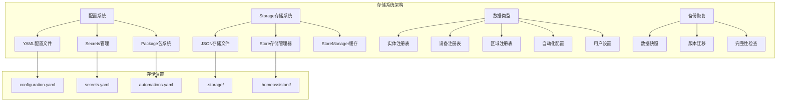
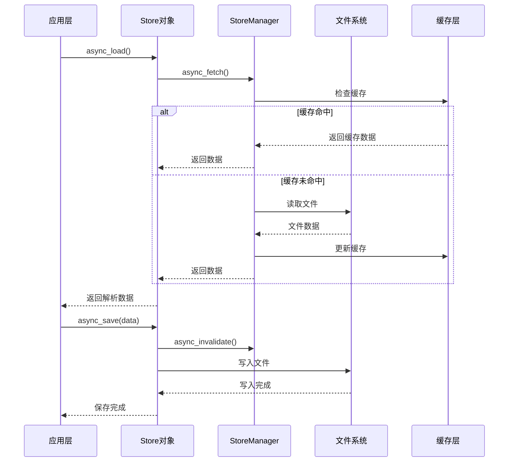
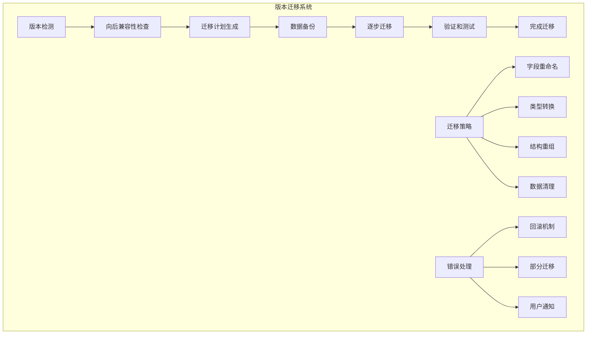

# Home Assistant Core 源码深度解析 - 数据存储系统篇

## 概述

数据存储系统是Home Assistant的基础设施之一，负责管理配置文件、状态数据、用户设置等各类信息的持久化存储。本文档深入分析存储系统的架构设计、实现机制和数据管理策略。

## 1. 存储系统整体架构

### 1.1 存储架构概览



### 1.2 数据流架构



## 2. Store 存储核心类详解

### 2.1 Store类架构设计

```python
class Store[_T: Mapping[str, Any] | Sequence[Any]]:
    """存储管理核心类 - 提供结构化数据的持久化存储
    
    设计原则:
        1. 类型安全：使用泛型确保数据类型一致性
        2. 异步优先：所有I/O操作都是异步的
        3. 原子性：提供原子写入保证数据完整性
        4. 版本化：支持数据结构的版本迁移
        5. 性能优化：智能缓存和延迟写入
        
    核心功能:
        - 异步数据加载和保存
        - 数据版本管理和迁移
        - 写入锁和并发控制
        - 延迟写入和批量操作
        - 错误处理和恢复机制
    """
    
    def __init__(
        self,
        hass: HomeAssistant,
        version: int,
        key: str,
        private: bool = False,
        *,
        atomic_writes: bool = False,
        encoder: type[JSONEncoder] | None = None,
        minor_version: int = 1,
        read_only: bool = False,
    ) -> None:
        """初始化Store实例
        
        参数:
            hass: Home Assistant核心实例
            version: 主版本号，用于重大数据结构变更
            key: 存储键，对应文件名
            private: 是否为私有数据（影响文件权限）
            atomic_writes: 是否使用原子写入
            encoder: 自定义JSON编码器
            minor_version: 次版本号，用于小幅数据结构调整
            read_only: 是否为只读存储
            
        初始化内容:
            1. 设置基础属性和配置参数
            2. 初始化锁机制和异步控制
            3. 注册存储管理器
            4. 设置文件路径和权限
        """
        # 版本管理
        self.version = version
        self.minor_version = minor_version
        self.key = key
        
        # 核心引用
        self.hass = hass
        self._manager = get_internal_store_manager(hass)
        
        # 配置选项
        self._private = private                          # 私有数据标志
        self._atomic_writes = atomic_writes             # 原子写入标志
        self._read_only = read_only                     # 只读模式标志
        self._encoder = encoder                         # JSON编码器
        
        # 状态管理
        self._data: dict[str, Any] | None = None        # 待写入数据
        self._load_future: asyncio.Future[_T | None] | None = None  # 加载Future
        
        # 并发控制
        self._write_lock = asyncio.Lock()              # 写入锁
        self._delay_handle: asyncio.TimerHandle | None = None    # 延迟写入句柄
        
        # 事件监听器
        self._unsub_final_write_listener: CALLBACK_TYPE | None = None
        
        # 性能优化
        self._next_write_time = 0.0                    # 下次写入时间
    
    @cached_property
    def path(self) -> str:
        """返回存储文件的完整路径
        
        路径格式: {config_dir}/.storage/{key}
        
        返回值:
            存储文件的绝对路径字符串
        """
        return self.hass.config.path(STORAGE_DIR, self.key)
    
    def make_read_only(self) -> None:
        """将存储设置为只读模式
        
        用途:
            - 防止意外修改重要配置
            - 在系统维护时保护数据
            - 实现配置的版本控制
            
        注意:
            此操作是不可逆的
        """
        self._read_only = True
        _LOGGER.debug("Store %s set to read-only mode", self.key)
    
    async def async_load(self) -> _T | None:
        """异步加载存储数据 - 数据读取的主要入口点
        
        返回值:
            存储的数据对象，首次加载或文件不存在时返回None
            
        加载流程:
            1. 检查是否有正在进行的加载操作
            2. 从存储管理器获取缓存数据
            3. 如果缓存未命中，从文件系统读取
            4. 处理数据版本迁移
            5. 解析和验证数据格式
            6. 缓存数据供后续使用
            
        并发控制:
            多个并发加载请求会共享同一个Future，
            确保文件只被读取一次。
        """
        if self._load_future is None:
            # 创建加载Future，避免并发加载
            self._load_future = self.hass.loop.create_future()
            
            try:
                # 执行实际的加载逻辑
                data = await self._async_load_data()
                self._load_future.set_result(data)
                return data
            except Exception as err:
                # 设置异常并清理Future
                self._load_future.set_exception(err)
                self._load_future = None
                raise
        else:
            # 等待现有的加载操作完成
            return await self._load_future
    
    async def _async_load_data(self) -> _T | None:
        """执行实际的数据加载逻辑
        
        返回值:
            加载的数据对象
            
        加载策略:
            1. 首先尝试从存储管理器缓存获取
            2. 缓存未命中时从文件系统读取
            3. 处理文件格式错误和版本迁移
            4. 验证数据完整性
        """
        # 尝试从存储管理器获取数据
        manager_data = self._manager.async_fetch(self.key)
        
        if manager_data is not None:
            found, data = manager_data
            if found:
                if data is None:
                    return None
                
                # 处理版本迁移
                return await self._async_handle_version_migration(data)
        
        # 缓存未命中，从文件读取
        return await self._async_load_from_file()
    
    async def _async_load_from_file(self) -> _T | None:
        """从文件系统异步加载数据
        
        返回值:
            文件中的数据对象
            
        错误处理:
            - FileNotFoundError: 文件不存在，返回None
            - JSONDecodeError: JSON格式错误，记录错误并返回None
            - PermissionError: 权限错误，抛出异常
        """
        try:
            # 在执行器中读取文件（避免阻塞事件循环）
            data = await self.hass.async_add_executor_job(
                self._load_file_data, self.path
            )
            
            if data is None:
                return None
            
            # 处理版本迁移
            return await self._async_handle_version_migration(data)
            
        except FileNotFoundError:
            # 文件不存在是正常情况（首次运行）
            _LOGGER.debug("Store file %s not found, returning None", self.path)
            return None
            
        except (JSONDecodeError, ValueError) as err:
            # JSON解析错误
            _LOGGER.error(
                "Error loading JSON from %s: %s. This might indicate "
                "data corruption. Please restore from backup if available.",
                self.path, err
            )
            return None
            
        except PermissionError as err:
            # 权限错误
            _LOGGER.error("Permission denied accessing %s: %s", self.path, err)
            raise HomeAssistantError(f"Cannot access storage file: {err}") from err
    
    def _load_file_data(self, path: str) -> dict[str, Any] | None:
        """同步读取文件数据 - 在执行器中运行
        
        参数:
            path: 文件路径
            
        返回值:
            解析的JSON数据
            
        功能:
            1. 检查文件是否存在
            2. 读取文件内容
            3. 解析JSON数据
            4. 验证基础数据格式
        """
        if not os.path.isfile(path):
            return None
        
        try:
            with open(path, 'r', encoding='utf-8') as file:
                content = file.read()
            
            if not content.strip():
                _LOGGER.warning("Store file %s is empty", path)
                return None
            
            # 解析JSON数据
            data = json_util.json_loads(content)
            
            if not isinstance(data, dict):
                _LOGGER.error("Store file %s does not contain a JSON object", path)
                return None
            
            return data
            
        except Exception as err:
            _LOGGER.error("Error reading store file %s: %s", path, err)
            raise
    
    async def _async_handle_version_migration(
        self, data: dict[str, Any]
    ) -> _T | None:
        """处理数据版本迁移 - 确保数据结构与当前版本兼容
        
        参数:
            data: 从存储中加载的原始数据
            
        返回值:
            迁移后的数据对象
            
        迁移策略:
            1. 检查数据版本与当前版本的兼容性
            2. 执行必要的数据结构转换
            3. 更新版本标记
            4. 自动保存迁移后的数据
        """
        stored_version = data.get("version", 1)
        stored_minor_version = data.get("minor_version", 1)
        
        # 检查版本兼容性
        if stored_version > self.version:
            # 数据版本过新，无法处理
            raise HomeAssistantError(
                f"Store {self.key} has version {stored_version} which is newer "
                f"than supported version {self.version}. Please update "
                f"Home Assistant to a newer version."
            )
        
        # 执行版本迁移
        if (stored_version < self.version or 
            (stored_version == self.version and stored_minor_version < self.minor_version)):
            
            _LOGGER.info(
                "Migrating store %s from version %d.%d to %d.%d",
                self.key, stored_version, stored_minor_version,
                self.version, self.minor_version
            )
            
            try:
                # 调用迁移函数
                migrated_data = await self._async_migrate_func(
                    stored_version, stored_minor_version, data.get("data")
                )
                
                # 更新版本信息
                data["version"] = self.version
                data["minor_version"] = self.minor_version
                data["data"] = migrated_data
                
                # 保存迁移后的数据
                await self._async_save_migrated_data(data)
                
                _LOGGER.info("Store %s migration completed successfully", self.key)
                
            except Exception as err:
                _LOGGER.error("Migration failed for store %s: %s", self.key, err)
                raise HomeAssistantError(f"Store migration failed: {err}") from err
        
        return data.get("data")
    
    async def _async_migrate_func(
        self, old_major_version: int, old_minor_version: int, old_data: Any
    ) -> Any:
        """数据迁移函数 - 子类重写以实现具体的迁移逻辑
        
        参数:
            old_major_version: 旧主版本号
            old_minor_version: 旧次版本号
            old_data: 旧版本的数据
            
        返回值:
            迁移后的新版本数据
            
        实现要点:
            - 保持向后兼容性
            - 处理数据缺失和格式错误
            - 提供默认值和数据修复
            - 记录迁移过程和潜在问题
        """
        # 默认实现：不进行任何迁移
        # 子类应该重写此方法以实现具体的迁移逻辑
        return old_data
    
    async def async_save(self, data: _T) -> None:
        """异步保存数据 - 数据写入的主要入口点
        
        参数:
            data: 要保存的数据对象
            
        保存流程:
            1. 检查只读模式
            2. 准备保存数据结构
            3. 使用延迟写入机制
            4. 注册最终写入监听器
            5. 执行实际的文件写入
            
        性能优化:
            - 延迟写入：合并短时间内的多次写入
            - 原子操作：防止写入过程中的数据损坏
            - 最终写入：确保系统关闭时数据不丢失
        """
        if self._read_only:
            _LOGGER.warning("Attempted to save to read-only store %s", self.key)
            return
        
        # 准备保存的数据结构
        save_data = {
            "version": self.version,
            "minor_version": self.minor_version,
            "key": self.key,
            "data": data,
        }
        
        # 如果data是函数，延迟执行
        if callable(data):
            save_data["data_func"] = data
            del save_data["data"]
        
        # 设置待保存数据
        self._data = save_data
        
        # 设置延迟写入
        self._async_setup_delayed_write()
        
        # 注册最终写入监听器
        self._async_setup_final_write_listener()
    
    def _async_setup_delayed_write(self) -> None:
        """设置延迟写入机制 - 优化频繁写入的性能
        
        延迟写入策略:
            1. 短时间内的多次保存请求被合并
            2. 减少磁盘I/O操作的频率
            3. 提高系统整体性能
            4. 在系统关闭时确保数据完整性
        """
        # 取消现有的延迟写入
        if self._delay_handle:
            self._delay_handle.cancel()
        
        # 计算延迟写入时间
        now = time.time()
        
        # 如果距离上次写入时间过短，延迟写入
        if now < self._next_write_time:
            delay = self._next_write_time - now
        else:
            delay = 0.1  # 默认延迟100ms
        
        # 设置延迟写入定时器
        self._delay_handle = self.hass.loop.call_later(
            delay, 
            lambda: self.hass.async_create_task(
                self._async_handle_write_data(),
                f"Store {self.key} delayed write"
            )
        )
        
        # 更新下次写入时间
        self._next_write_time = now + delay + 0.5  # 500ms间隔
    
    def _async_setup_final_write_listener(self) -> None:
        """设置最终写入监听器 - 确保系统关闭时数据不丢失
        
        功能:
            监听HOME_ASSISTANT_FINAL_WRITE事件，
            在系统关闭前强制写入所有未保存的数据
        """
        if self._unsub_final_write_listener is None:
            self._unsub_final_write_listener = self.hass.bus.async_listen_once(
                EVENT_HOMEASSISTANT_FINAL_WRITE,
                self._async_callback_final_write
            )
    
    async def _async_callback_final_write(self, _event: Event) -> None:
        """最终写入事件回调 - 处理系统关闭时的强制写入
        
        参数:
            _event: 最终写入事件对象
        """
        _LOGGER.debug("Final write triggered for store %s", self.key)
        await self._async_handle_write_data()
    
    async def _async_handle_write_data(self, *_args: Any) -> None:
        """处理数据写入的核心逻辑 - 执行实际的文件写入操作
        
        写入流程:
            1. 获取写入锁防止并发写入
            2. 清理延迟写入和事件监听器
            3. 准备写入数据
            4. 执行原子写入操作
            5. 处理写入异常和错误恢复
            
        错误处理:
            - 序列化错误：JSON编码失败
            - 写入错误：磁盘空间不足、权限问题
            - 系统错误：I/O异常、硬件故障
        """
        async with self._write_lock:
            # 清理状态
            self._async_cleanup_delay_listener()
            self._async_cleanup_final_write_listener()
            
            # 获取待写入数据
            if self._data is None:
                # 数据已被其他写入操作消费
                _LOGGER.debug("No data to write for store %s", self.key)
                return
            
            data = self._data
            self._data = None
            
            # 检查只读模式
            if self._read_only:
                _LOGGER.debug("Skipping write for read-only store %s", self.key)
                return
            
            # 通知存储管理器数据即将更新
            self._manager.async_invalidate(self.key)
            
            try:
                # 执行文件写入
                await self._async_write_data(self.path, data)
                _LOGGER.debug("Successfully wrote store %s", self.key)
                
            except (json_util.SerializationError, WriteError) as err:
                _LOGGER.error("Error writing store %s: %s", self.key, err)
                # 不重新抛出异常，避免影响系统运行
            
            except Exception as err:
                _LOGGER.error("Unexpected error writing store %s: %s", self.key, err)
    
    async def _async_write_data(self, path: str, data: dict[str, Any]) -> None:
        """异步写入数据到文件
        
        参数:
            path: 目标文件路径
            data: 要写入的数据字典
            
        功能:
            在执行器中执行文件写入操作，
            避免阻塞主事件循环
        """
        await self.hass.async_add_executor_job(
            self._write_data, path, data
        )
    
    def _write_data(self, path: str, data: dict[str, Any]) -> None:
        """同步写入数据到文件 - 在执行器中运行
        
        参数:
            path: 目标文件路径
            data: 要写入的数据字典
            
        写入策略:
            1. 确保目标目录存在
            2. 处理延迟执行的数据函数
            3. 使用指定的编码器序列化数据
            4. 根据配置选择原子写入或普通写入
            5. 设置适当的文件权限
        """
        # 确保目标目录存在
        os.makedirs(os.path.dirname(path), exist_ok=True)
        
        # 处理延迟执行的数据函数
        if "data_func" in data:
            try:
                data["data"] = data.pop("data_func")()
            except Exception as err:
                _LOGGER.error("Error executing data function for store %s: %s", self.key, err)
                raise
        
        # 执行文件写入
        _LOGGER.debug("Writing store data to %s", path)
        
        try:
            json_helper.save_json(
                path,
                data,
                private=self._private,           # 私有文件权限
                encoder=self._encoder,          # 自定义编码器
                atomic_writes=self._atomic_writes,  # 原子写入
            )
            
        except Exception as err:
            _LOGGER.error("Failed to write store file %s: %s", path, err)
            raise WriteError(f"Unable to write store file: {err}") from err
    
    def _async_cleanup_delay_listener(self) -> None:
        """清理延迟写入监听器"""
        if self._delay_handle:
            self._delay_handle.cancel()
            self._delay_handle = None
    
    def _async_cleanup_final_write_listener(self) -> None:
        """清理最终写入监听器"""
        if self._unsub_final_write_listener:
            self._unsub_final_write_listener()
            self._unsub_final_write_listener = None
    
    async def async_remove(self) -> None:
        """异步删除存储文件和相关数据
        
        功能:
            1. 清理内存中的缓存数据
            2. 取消所有待处理的写入操作
            3. 从文件系统删除存储文件
            4. 清理相关的监听器和句柄
            
        用途:
            - 删除不再需要的存储
            - 清理临时数据
            - 重置存储状态
        """
        # 通知存储管理器清理缓存
        self._manager.async_invalidate(self.key)
        
        # 清理监听器和句柄
        self._async_cleanup_delay_listener()
        self._async_cleanup_final_write_listener()
        
        # 清理内存状态
        self._data = None
        self._load_future = None
        
        # 删除文件
        try:
            await self.hass.async_add_executor_job(os.unlink, self.path)
            _LOGGER.info("Removed store file %s", self.path)
        except FileNotFoundError:
            # 文件不存在是正常情况
            _LOGGER.debug("Store file %s already removed", self.path)
        except Exception as err:
            _LOGGER.error("Error removing store file %s: %s", self.path, err)
            raise
```

### 2.2 存储管理器系统

```python
class _StoreManager:
    """存储管理器 - 统一管理所有Store实例的缓存和生命周期
    
    核心功能:
        1. 全局存储缓存管理
        2. 文件系统监控和预加载
        3. 存储清理和内存优化
        4. 并发访问控制
        
    设计原则:
        - 单例模式：全局唯一的存储管理器
        - 预加载优化：启动时预加载常用数据
        - 智能缓存：基于访问模式的缓存策略
        - 资源清理：定期清理不活跃的缓存
    """
    
    def __init__(self, hass: HomeAssistant) -> None:
        """初始化存储管理器
        
        参数:
            hass: Home Assistant核心实例
            
        初始化内容:
            1. 设置存储路径和配置
            2. 初始化缓存字典
            3. 设置文件系统监控
            4. 注册清理定时器
        """
        self._hass = hass
        
        # 缓存管理
        self._invalidated: set[str] = set()                                    # 失效的缓存键
        self._data_preload: dict[str, json_util.JsonValueType] = {}           # 预加载数据缓存
        self._files: set[str] | None = None                                   # 存储目录文件列表
        
        # 文件系统配置
        self._storage_path: Path = Path(hass.config.config_dir).joinpath(STORAGE_DIR)
        
        # 清理管理
        self._cancel_cleanup: asyncio.TimerHandle | None = None
        
        _LOGGER.debug("StoreManager initialized for path: %s", self._storage_path)
    
    async def async_initialize(self) -> None:
        """异步初始化存储管理器
        
        初始化流程:
            1. 扫描现有存储文件
            2. 预加载重要数据
            3. 注册系统事件监听器
            4. 启动后台清理任务
        """
        # 初始化文件系统扫描
        await self._hass.async_add_executor_job(self._initialize_files)
        
        # 注册系统启动完成监听器
        self._hass.bus.async_listen_once(
            EVENT_HOMEASSISTANT_STARTED,
            self._async_schedule_cleanup,
        )
        
        _LOGGER.info(
            "StoreManager initialized with %d existing files", 
            len(self._files) if self._files else 0
        )
    
    def _initialize_files(self) -> None:
        """初始化文件系统扫描 - 在执行器中运行
        
        功能:
            1. 检查存储目录是否存在
            2. 扫描现有的存储文件
            3. 预加载重要配置文件
            4. 检测损坏的文件
        """
        if not self._storage_path.exists():
            # 创建存储目录
            self._storage_path.mkdir(parents=True, exist_ok=True)
            _LOGGER.info("Created storage directory: %s", self._storage_path)
            self._files = set()
            return
        
        try:
            # 扫描存储目录
            all_files = os.listdir(self._storage_path)
            
            # 过滤有效的JSON文件
            self._files = {
                f for f in all_files 
                if f.endswith('.json') or f.endswith('')  # 允许无扩展名的文件
            }
            
            _LOGGER.debug("Found %d storage files", len(self._files))
            
            # 预加载关键文件
            self._preload_critical_files()
            
        except Exception as err:
            _LOGGER.error("Error initializing storage files: %s", err)
            self._files = set()
    
    def _preload_critical_files(self) -> None:
        """预加载关键配置文件
        
        预加载策略:
            - 实体注册表：启动时必需
            - 设备注册表：设备发现需要
            - 区域注册表：UI显示需要
            - 用户配置：权限验证需要
        """
        critical_files = {
            'entity_registry',
            'device_registry', 
            'area_registry',
            'auth',
            'auth_provider.homeassistant',
        }
        
        for filename in critical_files:
            if filename in self._files:
                try:
                    file_path = self._storage_path / filename
                    if file_path.exists():
                        with open(file_path, 'r', encoding='utf-8') as f:
                            data = json_util.json_loads(f.read())
                            self._data_preload[filename] = data
                            
                        _LOGGER.debug("Preloaded critical file: %s", filename)
                        
                except Exception as err:
                    _LOGGER.warning("Failed to preload %s: %s", filename, err)
    
    @callback
    def async_invalidate(self, key: str) -> None:
        """使缓存失效 - Store保存数据时调用
        
        参数:
            key: 存储键
            
        功能:
            1. 标记缓存为失效状态
            2. 清除预加载的数据
            3. 防止使用过期的缓存数据
        """
        if "/" not in key:  # 只处理简单键名
            self._invalidated.add(key)
            self._data_preload.pop(key, None)
            
            _LOGGER.debug("Invalidated cache for key: %s", key)
    
    @callback
    def async_fetch(
        self, key: str
    ) -> tuple[bool, json_util.JsonValueType | None] | None:
        """获取缓存数据 - Store加载数据时调用
        
        参数:
            key: 存储键
            
        返回值:
            (found, data)元组：
            - found: 是否在缓存中找到数据
            - data: 缓存的数据内容
            None: 无法提供缓存数据（需要从文件加载）
            
        缓存策略:
            1. 检查缓存失效状态
            2. 返回预加载的数据
            3. 根据文件存在性返回状态
        """
        # 检查缓存是否失效
        if key in self._invalidated:
            _LOGGER.debug("Cache invalidated for key: %s", key)
            return None
        
        # 检查预加载数据
        if key in self._data_preload:
            data = self._data_preload[key]
            _LOGGER.debug("Cache hit for key: %s", key)
            return (True, data)
        
        # 检查文件是否存在
        if self._files is not None:
            if key not in self._files:
                # 文件不存在
                _LOGGER.debug("File not found for key: %s", key)
                return (False, None)
        
        # 无法提供缓存数据
        return None
    
    @callback
    def _async_schedule_cleanup(self, _event: Event) -> None:
        """调度清理任务 - 系统启动完成后调用
        
        参数:
            _event: 系统启动事件
            
        功能:
            定期清理不活跃的缓存数据，
            释放内存资源
        """
        self._cancel_cleanup = self._hass.loop.call_later(
            MANAGER_CLEANUP_DELAY,
            lambda: self._hass.async_create_task(
                self._async_cleanup_cache(),
                "StoreManager cache cleanup"
            )
        )
        
        _LOGGER.debug("Scheduled cache cleanup in %d seconds", MANAGER_CLEANUP_DELAY)
    
    async def _async_cleanup_cache(self) -> None:
        """清理缓存数据
        
        清理策略:
            1. 清理失效标记
            2. 保留活跃数据
            3. 释放不必要的内存
            4. 调度下次清理
        """
        # 清理失效标记
        old_invalidated_count = len(self._invalidated)
        self._invalidated.clear()
        
        # 清理预加载数据（保留关键数据）
        critical_keys = {'entity_registry', 'device_registry', 'area_registry'}
        keys_to_remove = [
            key for key in self._data_preload.keys()
            if key not in critical_keys
        ]
        
        for key in keys_to_remove:
            del self._data_preload[key]
        
        _LOGGER.debug(
            "Cache cleanup completed: cleared %d invalidated keys, "
            "removed %d preloaded entries, kept %d critical entries",
            old_invalidated_count,
            len(keys_to_remove),
            len(self._data_preload)
        )
        
        # 调度下次清理
        self._cancel_cleanup = self._hass.loop.call_later(
            MANAGER_CLEANUP_DELAY,
            lambda: self._hass.async_create_task(
                self._async_cleanup_cache(),
                "StoreManager cache cleanup"
            )
        )
    
    def get_storage_statistics(self) -> dict[str, Any]:
        """获取存储统计信息
        
        返回值:
            包含存储使用情况的统计字典
        """
        return {
            "storage_path": str(self._storage_path),
            "total_files": len(self._files) if self._files else 0,
            "preloaded_entries": len(self._data_preload),
            "invalidated_keys": len(self._invalidated),
            "cache_memory_usage": self._calculate_cache_size(),
        }
    
    def _calculate_cache_size(self) -> int:
        """计算缓存占用的内存大小（估算）
        
        返回值:
            缓存大小的字节数估算
        """
        total_size = 0
        
        for data in self._data_preload.values():
            if data is not None:
                # 简单的大小估算
                total_size += len(str(data).encode('utf-8'))
        
        return total_size
```

## 3. 配置系统深度解析

### 3.1 YAML配置架构

```python
"""Home Assistant配置系统架构"""

async def async_hass_config_yaml(hass: HomeAssistant) -> dict:
    """异步加载Home Assistant YAML配置文件
    
    参数:
        hass: Home Assistant核心实例
        
    返回值:
        解析后的配置字典
        
    加载流程:
        1. 创建Secrets管理器
        2. 加载主配置文件
        3. 处理YAML错误和路径修正
        4. 验证域名有效性
        5. 合并Package配置
        6. 返回最终配置
        
    错误处理:
        - YAML语法错误：提供详细的错误位置
        - 域名验证错误：记录无效域名并移除
        - Package合并错误：跳过问题包继续加载
    """
    # 创建密钥管理器
    secrets = Secrets(Path(hass.config.config_dir))
    
    try:
        # 在执行器中加载配置文件
        config = await hass.loop.run_in_executor(
            None,
            load_yaml_config_file,
            hass.config.path(YAML_CONFIG_FILE),
            secrets,
        )
        
    except HomeAssistantError as exc:
        # 处理YAML解析错误
        if not (base_exc := exc.__cause__) or not isinstance(base_exc, MarkedYAMLError):
            raise
        
        # 修正错误路径为相对路径
        if base_exc.context_mark and base_exc.context_mark.name:
            base_exc.context_mark.name = _relpath(hass, base_exc.context_mark.name)
        if base_exc.problem_mark and base_exc.problem_mark.name:
            base_exc.problem_mark.name = _relpath(hass, base_exc.problem_mark.name)
        raise
    
    # 验证和清理无效域名
    invalid_domains = []
    for key in config:
        try:
            cv.domain_key(key)
        except vol.Invalid as exc:
            # 构建错误位置信息
            suffix = ""
            if annotation := find_annotation(config, exc.path):
                suffix = f" at {_relpath(hass, annotation[0])}, line {annotation[1]}"
            
            _LOGGER.error("Invalid domain '%s'%s", key, suffix)
            invalid_domains.append(key)
    
    # 移除无效域名
    for invalid_domain in invalid_domains:
        config.pop(invalid_domain)
    
    # 合并Package配置
    core_config = config.get(HOMEASSISTANT_DOMAIN, {})
    try:
        await merge_packages_config(
            hass, config, core_config.get(CONF_PACKAGES, {})
        )
    except vol.Invalid as exc:
        _LOGGER.error("Invalid package configuration: %s", exc)
    
    return config

def load_yaml_config_file(
    config_path: str, secrets: Secrets | None = None
) -> dict[Any, Any]:
    """解析YAML配置文件 - 在执行器中运行
    
    参数:
        config_path: 配置文件路径
        secrets: 密钥管理器实例
        
    返回值:
        解析后的配置字典
        
    功能:
        1. 使用YAML加载器解析文件
        2. 验证配置文件格式
        3. 处理空值转换
        4. 集成密钥替换
        
    错误处理:
        - 文件不存在：抛出FileNotFoundError
        - YAML格式错误：抛出HomeAssistantError
        - 类型错误：非字典格式的配置
    """
    try:
        # 加载YAML配置
        conf_dict = load_yaml_dict(config_path, secrets)
    except YamlTypeError as exc:
        msg = (
            f"The configuration file {os.path.basename(config_path)} "
            "does not contain a dictionary"
        )
        _LOGGER.error(msg)
        raise HomeAssistantError(msg) from exc
    
    # 转换None值为空字典
    for key, value in conf_dict.items():
        conf_dict[key] = value or {}
    
    return conf_dict
```

### 3.2 Secrets 密钥管理系统

```python
class Secrets:
    """密钥管理系统 - 安全管理敏感配置信息
    
    功能特性:
        1. 从secrets.yaml文件加载敏感信息
        2. 在配置文件中使用!secret标记替换
        3. 支持嵌套密钥引用
        4. 提供密钥验证和错误处理
        
    安全特性:
        - 密钥文件权限控制
        - 内存中密钥保护
        - 访问日志记录
        - 密钥泄露防护
    """
    
    def __init__(self, config_dir: Path) -> None:
        """初始化密钥管理器
        
        参数:
            config_dir: 配置目录路径
        """
        self._config_dir = config_dir
        self._secrets_path = config_dir / SECRET_YAML
        self._secrets: dict[str, Any] | None = None
        self._load_time: float | None = None
        self._cache_ttl = 300  # 5分钟缓存
        
    def get_secret(self, key: str) -> Any:
        """获取密钥值
        
        参数:
            key: 密钥名称
            
        返回值:
            密钥对应的值
            
        功能:
            1. 检查缓存有效性
            2. 重新加载过期的密钥
            3. 查找并返回密钥值
            4. 处理密钥不存在的情况
        """
        # 检查是否需要加载密钥
        if self._should_reload_secrets():
            self._load_secrets()
        
        if self._secrets is None:
            raise HomeAssistantError(f"Secrets file {SECRET_YAML} not found")
        
        if key not in self._secrets:
            raise HomeAssistantError(f"Secret '{key}' not found in {SECRET_YAML}")
        
        return self._secrets[key]
    
    def _should_reload_secrets(self) -> bool:
        """检查是否需要重新加载密钥
        
        返回值:
            是否需要重新加载
            
        检查条件:
            - 首次加载
            - 缓存过期
            - 文件修改时间变化
        """
        if self._secrets is None or self._load_time is None:
            return True
        
        # 检查缓存过期
        if time.time() - self._load_time > self._cache_ttl:
            return True
        
        # 检查文件修改时间
        try:
            if self._secrets_path.exists():
                file_mtime = self._secrets_path.stat().st_mtime
                if file_mtime > self._load_time:
                    return True
        except Exception:
            # 文件访问错误，重新加载
            return True
        
        return False
    
    def _load_secrets(self) -> None:
        """加载密钥文件
        
        功能:
            1. 检查文件存在性和权限
            2. 解析YAML格式的密钥
            3. 验证密钥格式和内容
            4. 更新缓存和时间戳
            
        安全检查:
            - 文件权限验证
            - 内容格式验证
            - 密钥名称规范检查
        """
        if not self._secrets_path.exists():
            _LOGGER.debug("Secrets file %s not found", self._secrets_path)
            self._secrets = {}
            self._load_time = time.time()
            return
        
        try:
            # 检查文件权限
            self._check_secrets_file_permissions()
            
            # 加载YAML内容
            with open(self._secrets_path, 'r', encoding='utf-8') as file:
                content = file.read()
            
            secrets_dict = yaml.safe_load(content)
            
            if not isinstance(secrets_dict, dict):
                raise HomeAssistantError(
                    f"Secrets file {SECRET_YAML} must contain a dictionary"
                )
            
            # 验证密钥名称
            for key in secrets_dict:
                if not isinstance(key, str):
                    raise HomeAssistantError(
                        f"Secret key '{key}' must be a string"
                    )
                
                if not key.replace('_', '').replace('-', '').isalnum():
                    _LOGGER.warning(
                        "Secret key '%s' contains special characters, "
                        "consider using alphanumeric characters only", key
                    )
            
            self._secrets = secrets_dict
            self._load_time = time.time()
            
            _LOGGER.debug("Loaded %d secrets from %s", len(secrets_dict), SECRET_YAML)
            
        except Exception as err:
            _LOGGER.error("Error loading secrets file %s: %s", self._secrets_path, err)
            raise HomeAssistantError(f"Error loading secrets: {err}") from err
    
    def _check_secrets_file_permissions(self) -> None:
        """检查密钥文件权限
        
        安全要求:
            - 文件应只对所有者可读写
            - 不应对组和其他用户可读
            - 在生产环境中强制执行权限检查
        """
        if not os.name == 'posix':
            # 非POSIX系统跳过权限检查
            return
        
        try:
            file_stat = self._secrets_path.stat()
            file_mode = file_stat.st_mode
            
            # 检查文件权限 (应该是600或400)
            if file_mode & 0o077:  # 组和其他用户有权限
                if not is_docker_env():  # Docker环境中权限可能不同
                    _LOGGER.warning(
                        "Secrets file %s has insecure permissions. "
                        "Consider running 'chmod 600 %s' to secure it.",
                        self._secrets_path, self._secrets_path
                    )
                    
        except Exception as err:
            _LOGGER.debug("Could not check secrets file permissions: %s", err)
```

### 3.3 Package包系统

```python
async def merge_packages_config(
    hass: HomeAssistant,
    config: dict,
    packages: dict[str, Any],
) -> dict:
    """合并Package包配置到主配置中
    
    参数:
        hass: Home Assistant核心实例
        config: 主配置字典
        packages: 包配置字典
        
    返回值:
        合并后的配置字典
        
    Package系统特性:
        1. 模块化配置管理
        2. 配置复用和共享
        3. 复杂配置的组织
        4. 条件配置加载
        
    合并策略:
        - 字典类型：递归合并
        - 列表类型：追加合并
        - 标量类型：覆盖合并
        - 冲突检测：报告重复键
    """
    # 验证包配置格式
    _PACKAGES_CONFIG_SCHEMA(packages)
    
    invalid_packages = []
    merged_config = deepcopy(config)
    
    for pack_name, pack_conf in packages.items():
        _LOGGER.debug("Processing package: %s", pack_name)
        
        try:
            # 验证包定义
            _validate_package_definition(pack_name, pack_conf)
            
        except vol.Invalid as exc:
            _LOGGER.error(
                "Invalid package definition '%s': %s. "
                "Package will not be initialized",
                pack_name, exc
            )
            invalid_packages.append(pack_name)
            continue
        
        # 合并包配置
        try:
            duplicate_key = _recursive_merge(merged_config, pack_conf)
            
            if duplicate_key:
                _LOGGER.warning(
                    "Package '%s' attempts to override key '%s'. "
                    "Original value will be kept.",
                    pack_name, duplicate_key
                )
                
        except Exception as err:
            _LOGGER.error(
                "Error merging package '%s': %s",
                pack_name, err
            )
            invalid_packages.append(pack_name)
            continue
    
    # 清理无效包
    for invalid_package in invalid_packages:
        packages.pop(invalid_package, None)
    
    _LOGGER.info(
        "Successfully merged %d packages, %d packages had errors",
        len(packages), len(invalid_packages)
    )
    
    return merged_config

def _recursive_merge(conf: dict[str, Any], package: dict[str, Any]) -> str | None:
    """递归合并包配置
    
    参数:
        conf: 目标配置字典
        package: 包配置字典
        
    返回值:
        冲突的键名，无冲突时返回None
        
    合并逻辑:
        1. 字典：递归合并子键
        2. 列表：连接列表内容
        3. 标量：检查冲突并覆盖
    """
    duplicate_key: str | None = None
    
    for key, pack_conf in package.items():
        if isinstance(pack_conf, dict):
            # 字典类型：递归合并
            if not pack_conf:
                continue  # 跳过空字典
            
            # 确保目标键存在
            conf[key] = conf.get(key, OrderedDict())
            
            # 递归合并
            nested_duplicate = _recursive_merge(conf[key], pack_conf)
            if nested_duplicate and not duplicate_key:
                duplicate_key = f"{key}.{nested_duplicate}"
                
        elif isinstance(pack_conf, list):
            # 列表类型：追加合并
            existing_list = cv.ensure_list(conf.get(key, []))
            package_list = cv.ensure_list(pack_conf)
            
            # 合并并去除假值
            merged_list = cv.remove_falsy(existing_list + package_list)
            conf[key] = merged_list
            
        else:
            # 标量类型：检查冲突
            if conf.get(key) is not None and not duplicate_key:
                duplicate_key = key
            
            conf[key] = pack_conf
    
    return duplicate_key

def _validate_package_definition(name: str, conf: Any) -> None:
    """验证包定义的有效性
    
    参数:
        name: 包名称
        conf: 包配置
        
    验证内容:
        1. 包名称格式（slug格式）
        2. 包配置结构
        3. 必需字段检查
        4. 配置值类型验证
        
    抛出异常:
        vol.Invalid: 验证失败时
    """
    # 验证包名称格式
    cv.slug(name)
    
    # 验证包配置结构
    _PACKAGE_DEFINITION_SCHEMA(conf)
    
    # 额外的包级别验证
    if not isinstance(conf, dict):
        raise vol.Invalid(f"Package '{name}' must be a dictionary")
    
    if not conf:
        raise vol.Invalid(f"Package '{name}' cannot be empty")
    
    # 检查保留键名
    reserved_keys = {'homeassistant', 'packages'}
    for key in conf:
        if key in reserved_keys:
            _LOGGER.warning(
                "Package '%s' defines reserved key '%s', "
                "which may cause unexpected behavior",
                name, key
            )
```

## 4. 数据迁移和版本管理

### 4.1 版本迁移架构



### 4.2 版本迁移实现

```python
class DataMigrator:
    """数据迁移管理器 - 处理存储数据的版本升级
    
    核心功能:
        1. 版本兼容性检查
        2. 自动数据迁移
        3. 迁移失败回滚
        4. 迁移进度跟踪
        
    迁移策略:
        - 渐进式迁移：逐个版本升级
        - 原子性操作：要么全部成功要么全部回滚
        - 数据保护：迁移前自动备份
        - 错误恢复：提供多种恢复选项
    """
    
    def __init__(self, store: Store, logger: Logger):
        self.store = store
        self.logger = logger
        self._migration_map: dict[tuple[int, int], Callable] = {}
        
    def register_migration(
        self,
        from_version: int,
        from_minor: int,
        migration_func: Callable[[Any], Any],
    ) -> None:
        """注册版本迁移函数
        
        参数:
            from_version: 源主版本号
            from_minor: 源次版本号  
            migration_func: 迁移处理函数
        """
        key = (from_version, from_minor)
        self._migration_map[key] = migration_func
        
        self.logger.debug(
            "Registered migration from version %d.%d",
            from_version, from_minor
        )
    
    async def async_migrate_data(
        self,
        old_version: int,
        old_minor: int,
        data: Any,
    ) -> Any:
        """执行数据迁移
        
        参数:
            old_version: 旧主版本号
            old_minor: 旧次版本号
            data: 待迁移数据
            
        返回值:
            迁移后的数据
            
        迁移过程:
            1. 创建数据备份
            2. 计算迁移路径
            3. 逐步执行迁移
            4. 验证迁移结果
            5. 清理临时数据
        """
        self.logger.info(
            "Starting migration from version %d.%d to %d.%d",
            old_version, old_minor,
            self.store.version, self.store.minor_version
        )
        
        # 创建数据备份
        backup_data = deepcopy(data)
        
        try:
            # 计算迁移路径
            migration_path = self._calculate_migration_path(
                old_version, old_minor
            )
            
            # 执行迁移步骤
            current_data = data
            for step_version, step_minor in migration_path:
                migration_func = self._migration_map[(step_version, step_minor)]
                
                self.logger.debug(
                    "Applying migration step %d.%d",
                    step_version, step_minor
                )
                
                current_data = await self._apply_migration_step(
                    migration_func, current_data
                )
            
            # 验证迁移结果
            self._validate_migrated_data(current_data)
            
            self.logger.info("Data migration completed successfully")
            return current_data
            
        except Exception as err:
            self.logger.error("Migration failed: %s", err)
            
            # 尝试恢复备份数据
            try:
                self.logger.info("Attempting to restore backup data")
                return backup_data
            except Exception as restore_err:
                self.logger.error("Failed to restore backup: %s", restore_err)
                raise HomeAssistantError(
                    f"Migration failed and backup restoration failed: {err}"
                ) from err
            
            raise HomeAssistantError(f"Data migration failed: {err}") from err
    
    def _calculate_migration_path(
        self, from_version: int, from_minor: int
    ) -> list[tuple[int, int]]:
        """计算迁移路径
        
        参数:
            from_version: 起始主版本
            from_minor: 起始次版本
            
        返回值:
            迁移步骤列表
            
        路径计算:
            找到从当前版本到目标版本的最短迁移路径
        """
        target_version = self.store.version
        target_minor = self.store.minor_version
        
        path = []
        current_version = from_version
        current_minor = from_minor
        
        while (current_version, current_minor) != (target_version, target_minor):
            # 查找下一个可用的迁移步骤
            next_step = self._find_next_migration_step(
                current_version, current_minor, target_version, target_minor
            )
            
            if next_step is None:
                raise HomeAssistantError(
                    f"No migration path found from {current_version}.{current_minor} "
                    f"to {target_version}.{target_minor}"
                )
            
            path.append(next_step)
            current_version, current_minor = next_step
        
        return path
    
    def _find_next_migration_step(
        self,
        current_version: int,
        current_minor: int,
        target_version: int,
        target_minor: int,
    ) -> tuple[int, int] | None:
        """查找下一个迁移步骤
        
        查找策略:
            1. 优先选择次版本升级
            2. 然后选择主版本升级
            3. 选择最接近目标的步骤
        """
        candidates = []
        
        for (step_version, step_minor) in self._migration_map:
            # 检查是否为有效的下一步
            if (step_version == current_version and step_minor > current_minor) or \
               (step_version > current_version):
                
                # 检查是否超出目标版本
                if (step_version < target_version or 
                    (step_version == target_version and step_minor <= target_minor)):
                    candidates.append((step_version, step_minor))
        
        if not candidates:
            return None
        
        # 选择最接近当前版本的候选
        return min(candidates)
    
    async def _apply_migration_step(
        self, migration_func: Callable, data: Any
    ) -> Any:
        """应用单个迁移步骤
        
        参数:
            migration_func: 迁移函数
            data: 输入数据
            
        返回值:
            迁移后的数据
        """
        try:
            # 检查迁移函数是否为协程
            if asyncio.iscoroutinefunction(migration_func):
                return await migration_func(data)
            else:
                return migration_func(data)
                
        except Exception as err:
            self.logger.error("Migration step failed: %s", err)
            raise
    
    def _validate_migrated_data(self, data: Any) -> None:
        """验证迁移后的数据
        
        参数:
            data: 迁移后的数据
            
        验证内容:
            1. 数据类型正确性
            2. 必需字段存在性
            3. 数据完整性检查
            4. 格式规范性验证
        """
        if data is None:
            raise HomeAssistantError("Migrated data cannot be None")
        
        # 基础类型检查
        if not isinstance(data, (dict, list)):
            raise HomeAssistantError(
                f"Migrated data must be dict or list, got {type(data)}"
            )
        
        # 更多具体验证由子类实现
        self.logger.debug("Data validation passed")

# 具体的迁移实现示例
class EntityRegistryMigrator(DataMigrator):
    """实体注册表迁移器"""
    
    def __init__(self, store: Store, logger: Logger):
        super().__init__(store, logger)
        
        # 注册迁移函数
        self.register_migration(1, 0, self._migrate_1_0_to_1_1)
        self.register_migration(1, 1, self._migrate_1_1_to_2_0)
        self.register_migration(2, 0, self._migrate_2_0_to_2_1)
    
    def _migrate_1_0_to_1_1(self, data: dict) -> dict:
        """从1.0迁移到1.1 - 添加entity_category字段"""
        if not isinstance(data, dict) or 'entities' not in data:
            return data
        
        migrated_entities = []
        for entity in data['entities']:
            # 添加默认entity_category
            if 'entity_category' not in entity:
                entity['entity_category'] = None
            migrated_entities.append(entity)
        
        data['entities'] = migrated_entities
        self.logger.debug("Migrated %d entities to version 1.1", len(migrated_entities))
        return data
    
    async def _migrate_1_1_to_2_0(self, data: dict) -> dict:
        """从1.1迁移到2.0 - 重构设备关联"""
        if not isinstance(data, dict) or 'entities' not in data:
            return data
        
        # 异步处理复杂迁移逻辑
        migrated_entities = []
        for entity in data['entities']:
            # 转换设备关联格式
            if 'device_id' in entity and isinstance(entity['device_id'], str):
                # 保持现有格式
                pass
            elif 'device' in entity:
                # 从旧格式转换
                entity['device_id'] = entity.pop('device', {}).get('id')
            
            migrated_entities.append(entity)
        
        data['entities'] = migrated_entities
        self.logger.debug("Migrated %d entities to version 2.0", len(migrated_entities))
        return data
    
    def _validate_migrated_data(self, data: Any) -> None:
        """验证实体注册表数据"""
        super()._validate_migrated_data(data)
        
        if not isinstance(data, dict):
            raise HomeAssistantError("Entity registry data must be a dictionary")
        
        if 'entities' not in data:
            raise HomeAssistantError("Entity registry must contain 'entities' key")
        
        entities = data['entities']
        if not isinstance(entities, list):
            raise HomeAssistantError("Entities must be a list")
        
        # 验证每个实体条目
        for i, entity in enumerate(entities):
            if not isinstance(entity, dict):
                raise HomeAssistantError(f"Entity {i} must be a dictionary")
            
            required_fields = ['entity_id', 'unique_id', 'platform', 'domain']
            for field in required_fields:
                if field not in entity:
                    raise HomeAssistantError(
                        f"Entity {i} missing required field: {field}"
                    )
        
        self.logger.debug("Entity registry validation completed")
```

## 5. 存储性能优化

### 5.1 缓存策略

```python
class StorageCache:
    """存储缓存系统 - 优化频繁访问的数据读写性能
    
    缓存特性:
        1. LRU淘汰策略
        2. 时间过期机制
        3. 内存使用限制
        4. 智能预加载
        5. 写入合并优化
    """
    
    def __init__(self, max_size: int = 1000, ttl: int = 300):
        self._cache: dict[str, CacheEntry] = {}
        self._access_order: list[str] = []
        self._max_size = max_size
        self._ttl = ttl
        self._stats = CacheStats()
        
    def get(self, key: str) -> Any | None:
        """获取缓存数据"""
        if key not in self._cache:
            self._stats.misses += 1
            return None
        
        entry = self._cache[key]
        
        # 检查过期
        if time.time() - entry.timestamp > self._ttl:
            self._remove_entry(key)
            self._stats.expires += 1
            return None
        
        # 更新访问顺序
        self._update_access_order(key)
        self._stats.hits += 1
        
        return deepcopy(entry.data)
    
    def set(self, key: str, data: Any) -> None:
        """设置缓存数据"""
        # 检查大小限制
        if len(self._cache) >= self._max_size and key not in self._cache:
            self._evict_lru()
        
        # 创建缓存条目
        entry = CacheEntry(
            data=deepcopy(data),
            timestamp=time.time(),
            size=self._calculate_size(data),
        )
        
        self._cache[key] = entry
        self._update_access_order(key)
        self._stats.sets += 1

@dataclass
class CacheEntry:
    """缓存条目"""
    data: Any
    timestamp: float
    size: int
    access_count: int = 0

@dataclass 
class CacheStats:
    """缓存统计"""
    hits: int = 0
    misses: int = 0
    sets: int = 0
    expires: int = 0
    evictions: int = 0
```

### 5.2 I/O优化策略

```python
class OptimizedStore(Store):
    """优化的存储类 - 提供更好的I/O性能
    
    优化策略:
        1. 批量写入合并
        2. 压缩存储支持
        3. 异步I/O队列
        4. 写入缓冲机制
        5. 读取预测和预加载
    """
    
    def __init__(self, *args, **kwargs):
        super().__init__(*args, **kwargs)
        
        # I/O优化配置
        self._write_buffer_size = 64 * 1024  # 64KB缓冲
        self._compression_enabled = kwargs.get('compression', False)
        self._async_write_queue = asyncio.Queue(maxsize=100)
        
        # 性能统计
        self._io_stats = IOStats()
        
        # 启动写入队列处理器
        if not kwargs.get('read_only', False):
            self.hass.async_create_task(
                self._async_write_queue_processor(),
                f"Store {self.key} write queue"
            )
    
    async def _async_write_data(self, path: str, data: dict) -> None:
        """优化的异步写入"""
        write_request = WriteRequest(
            path=path,
            data=data,
            timestamp=time.time(),
            compression=self._compression_enabled,
        )
        
        try:
            await self._async_write_queue.put(write_request)
            self._io_stats.queued_writes += 1
        except asyncio.QueueFull:
            # 队列满时同步写入
            await super()._async_write_data(path, data)
            self._io_stats.direct_writes += 1
    
    async def _async_write_queue_processor(self) -> None:
        """写入队列处理器"""
        batch_requests = []
        batch_timeout = 0.1  # 100ms批处理超时
        
        while True:
            try:
                # 等待写入请求
                request = await asyncio.wait_for(
                    self._async_write_queue.get(),
                    timeout=batch_timeout
                )
                
                batch_requests.append(request)
                
                # 检查是否需要处理批次
                if (len(batch_requests) >= 10 or  # 批次大小限制
                    time.time() - batch_requests[0].timestamp > batch_timeout):
                    
                    await self._process_write_batch(batch_requests)
                    batch_requests.clear()
                    
            except asyncio.TimeoutError:
                # 处理累积的请求
                if batch_requests:
                    await self._process_write_batch(batch_requests)
                    batch_requests.clear()
                    
            except Exception as err:
                self.logger.error("Write queue processor error: %s", err)
    
    async def _process_write_batch(self, requests: list[WriteRequest]) -> None:
        """处理写入批次"""
        if not requests:
            return
        
        # 合并相同文件的写入
        file_batches = {}
        for request in requests:
            if request.path not in file_batches:
                file_batches[request.path] = []
            file_batches[request.path].append(request)
        
        # 并发处理不同文件
        tasks = [
            self._write_file_batch(path, batch)
            for path, batch in file_batches.items()
        ]
        
        await asyncio.gather(*tasks, return_exceptions=True)
    
    async def _write_file_batch(
        self, path: str, requests: list[WriteRequest]
    ) -> None:
        """处理单个文件的写入批次"""
        if not requests:
            return
        
        # 使用最新的数据
        latest_request = max(requests, key=lambda r: r.timestamp)
        
        try:
            await self.hass.async_add_executor_job(
                self._optimized_write_file,
                path,
                latest_request.data,
                latest_request.compression,
            )
            
            self._io_stats.batch_writes += 1
            
        except Exception as err:
            self.logger.error("Batch write failed for %s: %s", path, err)
    
    def _optimized_write_file(
        self, path: str, data: dict, use_compression: bool
    ) -> None:
        """优化的文件写入"""
        start_time = time.time()
        
        try:
            # 准备数据
            if "data_func" in data:
                data["data"] = data.pop("data_func")()
            
            # 序列化数据
            json_data = json_util.json_dumps(data, encoder=self._encoder)
            
            # 压缩数据（如果启用）
            if use_compression and len(json_data) > 1024:  # 只压缩大于1KB的数据
                import gzip
                json_data = gzip.compress(json_data.encode('utf-8'))
                use_binary_mode = True
            else:
                json_data = json_data.encode('utf-8')
                use_binary_mode = False
            
            # 原子写入
            temp_path = f"{path}.tmp"
            
            os.makedirs(os.path.dirname(path), exist_ok=True)
            
            mode = 'wb' if use_binary_mode else 'w'
            with open(temp_path, mode) as f:
                if use_binary_mode:
                    f.write(json_data)
                else:
                    f.write(json_data.decode('utf-8'))
            
            # 设置文件权限
            if self._private:
                os.chmod(temp_path, 0o600)
            else:
                os.chmod(temp_path, 0o644)
            
            # 原子替换
            os.replace(temp_path, path)
            
            # 记录统计
            write_time = time.time() - start_time
            self._io_stats.total_write_time += write_time
            self._io_stats.bytes_written += len(json_data)
            
            if write_time > 0.5:  # 写入时间超过500ms
                self.logger.warning(
                    "Slow write detected for %s: %.2f seconds, %d bytes",
                    path, write_time, len(json_data)
                )
            
        except Exception as err:
            # 清理临时文件
            with suppress(FileNotFoundError):
                os.unlink(f"{path}.tmp")
            raise

@dataclass
class WriteRequest:
    """写入请求"""
    path: str
    data: dict
    timestamp: float
    compression: bool = False

@dataclass
class IOStats:
    """I/O统计"""
    queued_writes: int = 0
    direct_writes: int = 0
    batch_writes: int = 0
    total_write_time: float = 0
    bytes_written: int = 0
```

## 6. 最佳实践和使用模式

### 6.1 存储设计最佳实践

```python
"""存储系统最佳实践指南"""

# 1. 合理的数据结构设计
class WellDesignedStore:
    """设计良好的存储示例"""
    
    def __init__(self, hass: HomeAssistant):
        self.store = Store(
            hass,
            version=1,
            key="my_integration_data",
            atomic_writes=True,      # 重要数据启用原子写入
            encoder=MyDataEncoder,   # 使用自定义编码器
        )
    
    async def async_load_data(self) -> MyDataStructure:
        """加载数据时的最佳实践"""
        try:
            raw_data = await self.store.async_load()
            
            if raw_data is None:
                # 提供合理的默认值
                return MyDataStructure.create_default()
            
            # 验证数据完整性
            return MyDataStructure.from_dict(raw_data)
            
        except Exception as err:
            # 记录错误并提供降级方案
            _LOGGER.error("Failed to load data: %s", err)
            return MyDataStructure.create_default()
    
    async def async_save_data(self, data: MyDataStructure) -> None:
        """保存数据时的最佳实践"""
        try:
            # 验证数据有效性
            if not data.is_valid():
                raise ValueError("Invalid data structure")
            
            # 转换为可序列化格式
            serializable_data = data.to_dict()
            
            # 保存数据
            await self.store.async_save(serializable_data)
            
        except Exception as err:
            _LOGGER.error("Failed to save data: %s", err)
            raise

# 2. 性能优化的使用模式
class PerformantStorageManager:
    """性能优化的存储管理"""
    
    def __init__(self, hass: HomeAssistant):
        self.hass = hass
        self._cache = {}
        self._pending_saves = {}
        self._save_delay = 2.0  # 2秒延迟合并写入
    
    async def async_get_data(self, key: str) -> Any:
        """获取数据（带缓存）"""
        if key in self._cache:
            return self._cache[key]
        
        store = Store(self.hass, 1, key)
        data = await store.async_load()
        
        # 缓存数据
        self._cache[key] = data
        return data
    
    def async_update_data(self, key: str, data: Any) -> None:
        """更新数据（延迟写入）"""
        self._cache[key] = data
        
        # 取消现有的保存任务
        if key in self._pending_saves:
            self._pending_saves[key].cancel()
        
        # 调度延迟保存
        self._pending_saves[key] = self.hass.loop.call_later(
            self._save_delay,
            lambda: self.hass.async_create_task(
                self._async_save_data(key, data)
            )
        )
    
    async def _async_save_data(self, key: str, data: Any) -> None:
        """执行延迟保存"""
        try:
            store = Store(self.hass, 1, key)
            await store.async_save(data)
            
            # 清理挂起的保存任务
            self._pending_saves.pop(key, None)
            
        except Exception as err:
            _LOGGER.error("Failed to save data for %s: %s", key, err)

# 3. 数据完整性保护
class DataIntegrityManager:
    """数据完整性管理"""
    
    def __init__(self, store: Store):
        self.store = store
        self._checksum_store = Store(
            store.hass,
            1,
            f"{store.key}_checksums",
            private=True,
        )
    
    async def async_save_with_integrity(self, data: Any) -> None:
        """带完整性检查的保存"""
        # 计算数据校验和
        checksum = self._calculate_checksum(data)
        
        # 保存数据和校验和
        await asyncio.gather(
            self.store.async_save(data),
            self._checksum_store.async_save({"checksum": checksum}),
        )
    
    async def async_load_with_verification(self) -> Any:
        """带验证的加载"""
        # 并行加载数据和校验和
        data, checksum_data = await asyncio.gather(
            self.store.async_load(),
            self._checksum_store.async_load(),
        )
        
        if data is None:
            return None
        
        # 验证数据完整性
        if checksum_data:
            expected_checksum = checksum_data.get("checksum")
            actual_checksum = self._calculate_checksum(data)
            
            if expected_checksum != actual_checksum:
                _LOGGER.error(
                    "Data integrity check failed for %s",
                    self.store.key
                )
                raise HomeAssistantError("Data corruption detected")
        
        return data
    
    def _calculate_checksum(self, data: Any) -> str:
        """计算数据校验和"""
        import hashlib
        
        # 序列化数据
        json_str = json_util.json_dumps(data, sort_keys=True)
        
        # 计算SHA256哈希
        return hashlib.sha256(json_str.encode('utf-8')).hexdigest()
```

### 6.2 监控和调试

```python
class StorageMonitor:
    """存储系统监控"""
    
    def __init__(self, hass: HomeAssistant):
        self.hass = hass
        self._metrics = defaultdict(StorageMetrics)
        
        # 注册监控服务
        hass.services.async_register(
            "storage", "get_stats", self.async_get_stats
        )
    
    def record_operation(
        self, store_key: str, operation: str, duration: float, size: int = 0
    ) -> None:
        """记录存储操作"""
        metrics = self._metrics[store_key]
        
        if operation == "load":
            metrics.loads += 1
            metrics.load_time += duration
        elif operation == "save":
            metrics.saves += 1
            metrics.save_time += duration
            metrics.bytes_written += size
        
        # 检查慢操作
        if duration > 1.0:  # 超过1秒的操作
            _LOGGER.warning(
                "Slow storage %s for %s: %.2f seconds",
                operation, store_key, duration
            )
    
    async def async_get_stats(self, call: ServiceCall) -> dict:
        """获取存储统计信息"""
        stats = {}
        
        for store_key, metrics in self._metrics.items():
            stats[store_key] = {
                "loads": metrics.loads,
                "saves": metrics.saves,
                "load_time": round(metrics.load_time, 3),
                "save_time": round(metrics.save_time, 3),
                "bytes_written": metrics.bytes_written,
                "avg_load_time": (
                    round(metrics.load_time / metrics.loads, 3)
                    if metrics.loads > 0 else 0
                ),
                "avg_save_time": (
                    round(metrics.save_time / metrics.saves, 3)
                    if metrics.saves > 0 else 0
                ),
            }
        
        return stats

@dataclass
class StorageMetrics:
    """存储指标"""
    loads: int = 0
    saves: int = 0
    load_time: float = 0
    save_time: float = 0
    bytes_written: int = 0
```

## 7. 总结

Home Assistant的数据存储系统提供了完整的数据持久化解决方案，通过以下核心特性确保了系统的可靠性和性能：

### 7.1 核心优势
1. **类型安全**：泛型Store类确保数据类型一致性
2. **异步优先**：全面的异步I/O支持
3. **原子操作**：防止数据损坏的原子写入
4. **版本管理**：自动的数据结构迁移
5. **性能优化**：智能缓存和延迟写入

### 7.2 系统特色  
- **统一接口**：Store类提供一致的存储API
- **配置灵活**：支持YAML配置和动态包系统
- **安全可靠**：密钥管理和权限控制
- **容错机制**：完善的错误处理和恢复

### 7.3 实践价值
- 为大规模IoT数据提供稳定的存储基础
- 支持复杂的配置管理需求
- 提供了优秀的数据迁移和版本管理范例
- 展示了高性能存储系统的设计原则

这个存储系统为Home Assistant提供了坚实的数据基础，支撑着整个智能家居平台的稳定运行。

## 下一步分析

接下来将继续分析其他重要模块：
- [服务和自动化系统](./09-服务自动化分析.md) - 深入分析Home Assistant的服务调用和自动化引擎
