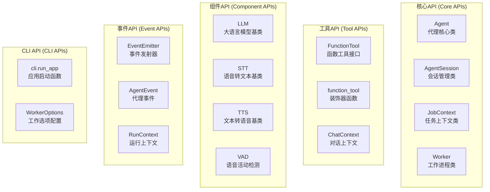
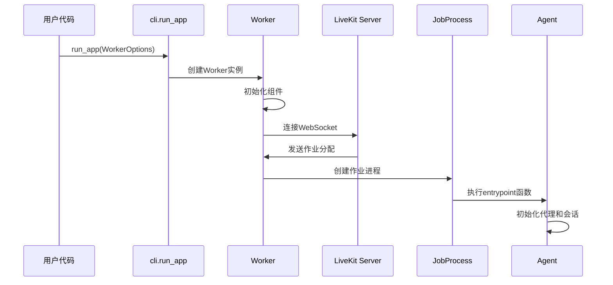
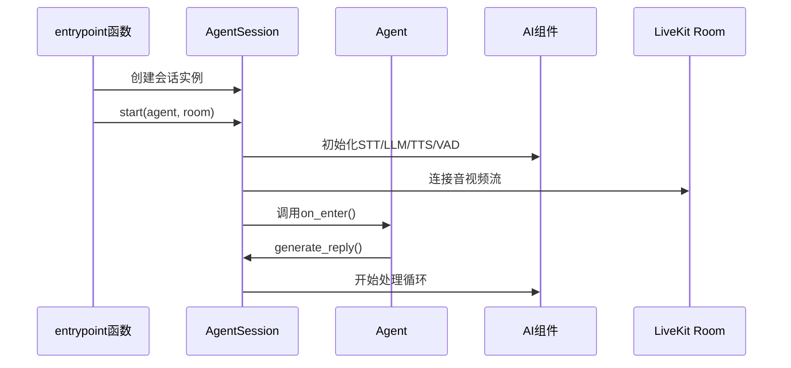
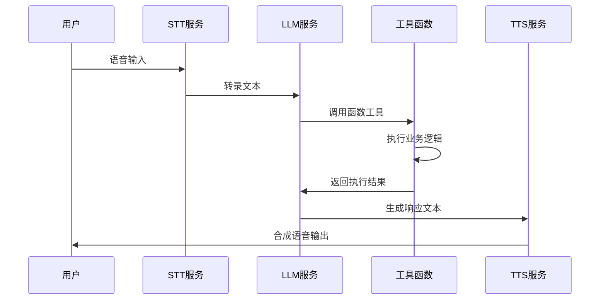

## 1. 核心API概览

LiveKit Agents框架提供了一套完整的API来构建实时语音代理。以下是主要的公共API入口点：

### 1.1 主要API类别



## 2. 核心API详细分析

### 2.1 Agent 类

#### 2.1.1 类定义和构造函数

```python
class Agent:
    """
    Agent类是LiveKit Agents框架的核心，代表一个基于LLM的语音代理
    
    主要功能：
    - 定义代理的行为指令和工具集
    - 管理与各种AI服务的集成
    - 处理用户交互和生成响应
    - 支持动态工具添加和更新
    """
    
    def __init__(
        self,
        *,
        instructions: str,                                    # 代理指令，定义代理行为
        chat_ctx: NotGivenOr[llm.ChatContext | None] = NOT_GIVEN,  # 聊天上下文
        tools: list[llm.FunctionTool | llm.RawFunctionTool] | None = None,  # 工具列表
        turn_detection: NotGivenOr[TurnDetectionMode | None] = NOT_GIVEN,   # 转换检测模式
        stt: NotGivenOr[stt.STT | STTModels | str | None] = NOT_GIVEN,      # 语音转文本
        vad: NotGivenOr[vad.VAD | None] = NOT_GIVEN,                        # 语音活动检测
        llm: NotGivenOr[llm.LLM | llm.RealtimeModel | LLMModels | str | None] = NOT_GIVEN,  # 大语言模型
        tts: NotGivenOr[tts.TTS | TTSModels | str | None] = NOT_GIVEN,      # 文本转语音
        mcp_servers: NotGivenOr[list[mcp.MCPServer] | None] = NOT_GIVEN,    # MCP服务器列表
        allow_interruptions: NotGivenOr[bool] = NOT_GIVEN,                  # 是否允许中断
        min_consecutive_speech_delay: NotGivenOr[float] = NOT_GIVEN,        # 最小连续语音延迟
        use_tts_aligned_transcript: NotGivenOr[bool] = NOT_GIVEN,           # 使用TTS对齐转录
        min_endpointing_delay: NotGivenOr[float] = NOT_GIVEN,               # 最小端点延迟
        max_endpointing_delay: NotGivenOr[float] = NOT_GIVEN,               # 最大端点延迟
    ) -> None:
        """
        Agent构造函数详细说明：
        
        参数处理流程：
        1. 初始化工具列表，包括显式传入的工具和通过装饰器发现的工具
        2. 创建或复制聊天上下文，确保工具正确关联
        3. 处理字符串类型的组件配置，自动转换为相应的实例
        4. 保存所有配置参数供后续使用
        """
        tools = tools or []
        self._instructions = instructions
        
        # 自动发现使用@function_tool装饰的方法
        self._tools = tools.copy() + find_function_tools(self)
        
        # 创建聊天上下文，包含所有工具
        self._chat_ctx = chat_ctx.copy(tools=self._tools) if chat_ctx else ChatContext.empty()
        
        # 智能组件初始化：支持字符串配置自动转换
        if isinstance(stt, str):
            stt = inference.STT(model=stt)  # 自动创建STT实例
        if isinstance(llm, str):
            llm = inference.LLM(model=llm)  # 自动创建LLM实例
        if isinstance(tts, str):
            tts = inference.TTS(model=tts)  # 自动创建TTS实例
        
        # 保存所有配置
        self._stt = stt
        self._llm = llm
        self._tts = tts
        self._vad = vad
        # ... 其他参数保存
```

#### 2.1.2 关键方法

```python
class Agent:
    @property
    def label(self) -> str:
        """
        获取代理标签
        
        返回值：
        - str: 代理的显示标签，用于日志和调试
        """
        return getattr(self, "_label", self.__class__.__name__)
    
    @property
    def tools(self) -> list[llm.FunctionTool]:
        """
        获取代理工具列表
        
        返回值：
        - list[FunctionTool]: 当前代理可用的所有工具函数
        """
        return self._tools.copy()
    
    async def update_tools(self, tools: list[llm.FunctionTool]) -> None:
        """
        动态更新代理工具集
        
        参数：
        - tools: 新的工具列表
        
        功能说明：
        - 运行时动态添加或删除工具
        - 自动更新聊天上下文中的工具引用
        - 支持热更新，无需重启代理
        """
        self._tools = tools
        self._chat_ctx = self._chat_ctx.copy(tools=tools)
        
        # 如果代理正在运行，通知会话更新
        if hasattr(self, '_session'):
            await self._session._update_agent_tools(self)
    
    async def on_enter(self) -> None:
        """
        代理进入会话时的回调函数
        
        功能说明：
        - 代理被添加到会话时自动调用
        - 子类可重写此方法实现自定义入口逻辑
        - 常用于生成欢迎消息或初始化状态
        """
        pass
    
    async def on_exit(self) -> None:
        """
        代理退出会话时的回调函数
        
        功能说明：
        - 代理从会话中移除时调用
        - 用于清理资源和保存状态
        - 子类可重写实现自定义清理逻辑
        """
        pass
```

### 2.2 AgentSession 类

#### 2.2.1 构造函数详细分析

```python
class AgentSession(rtc.EventEmitter[EventTypes], Generic[Userdata_T]):
    """
    AgentSession是LiveKit Agents的运行时核心，负责：
    - 协调媒体流、语音/LLM组件和工具编排
    - 处理音频、视频、文本I/O与STT、VAD、TTS、LLM的交互
    - 管理转换检测、端点检测、中断和多步工具调用
    - 通过事件回调暴露所有功能，让开发者专注于工具函数编写
    """
    
    def __init__(
        self,
        *,
        turn_detection: NotGivenOr[TurnDetectionMode] = NOT_GIVEN,
        stt: NotGivenOr[stt.STT | STTModels | str] = NOT_GIVEN,
        vad: NotGivenOr[vad.VAD] = NOT_GIVEN,
        llm: NotGivenOr[llm.LLM | llm.RealtimeModel | LLMModels | str] = NOT_GIVEN,
        tts: NotGivenOr[tts.TTS | TTSModels | str] = NOT_GIVEN,
        mcp_servers: NotGivenOr[list[mcp.MCPServer]] = NOT_GIVEN,
        userdata: NotGivenOr[Userdata_T] = NOT_GIVEN,
        allow_interruptions: bool = True,
        discard_audio_if_uninterruptible: bool = True,
        min_interruption_duration: float = 0.5,
        min_interruption_words: int = 0,
        min_endpointing_delay: float = 0.5,
        max_endpointing_delay: float = 6.0,
        max_tool_steps: int = 3,
        video_sampler: NotGivenOr[_VideoSampler | None] = NOT_GIVEN,
        user_away_timeout: float | None = 15.0,
        false_interruption_timeout: float | None = 2.0,
        resume_false_interruption: bool = True,
        min_consecutive_speech_delay: float = 0.0,
        use_tts_aligned_transcript: NotGivenOr[bool] = NOT_GIVEN,
        tts_text_transforms: NotGivenOr[Sequence[TextTransforms] | None] = NOT_GIVEN,
        preemptive_generation: bool = False,
        conn_options: NotGivenOr[SessionConnectOptions] = NOT_GIVEN,
        loop: asyncio.AbstractEventLoop | None = None,
    ) -> None:
```

#### 2.2.2 参数详细说明

| 参数名 | 类型 | 默认值 | 说明 |
|--------|------|--------|------|
| `turn_detection` | TurnDetectionMode | NOT_GIVEN | 转换检测策略：stt/vad/realtime_llm/manual |
| `stt` | STT/str | NOT_GIVEN | 语音转文本后端，支持字符串模型名 |
| `vad` | VAD | NOT_GIVEN | 语音活动检测器 |
| `llm` | LLM/RealtimeModel/str | NOT_GIVEN | 大语言模型或实时模型 |
| `tts` | TTS/str | NOT_GIVEN | 文本转语音引擎 |
| `allow_interruptions` | bool | True | 是否允许用户中断代理发言 |
| `min_interruption_duration` | float | 0.5 | 注册为中断的最小语音长度(秒) |
| `min_endpointing_delay` | float | 0.5 | 端点检测后的最小等待时间(秒) |
| `max_endpointing_delay` | float | 6.0 | 强制终止转换的最大等待时间(秒) |
| `max_tool_steps` | int | 3 | 每个LLM回合的最大连续工具调用数 |
| `preemptive_generation` | bool | False | 是否启用预先生成响应 |

#### 2.2.3 核心方法

```python
class AgentSession:
    async def start(
        self,
        agent: Agent,
        room: rtc.Room,
        *,
        room_input_options: RoomInputOptions | None = None,
        room_output_options: RoomOutputOptions | None = None,
    ) -> None:
        """
        启动代理会话
        
        参数：
        - agent: 要运行的代理实例
        - room: LiveKit房间对象
        - room_input_options: 房间输入选项配置
        - room_output_options: 房间输出选项配置
        
        功能说明：
        1. 初始化音视频I/O管道
        2. 连接各个AI组件（STT、LLM、TTS、VAD）
        3. 启动事件监听和处理循环
        4. 调用代理的on_enter回调
        
        调用链路：
        start() -> _initialize_components() -> _setup_pipelines() -> _start_event_loop()
        """
        self._agent = agent
        self._room = room
        
        # 初始化组件
        await self._initialize_components()
        
        # 设置音视频管道
        await self._setup_pipelines(room_input_options, room_output_options)
        
        # 启动事件处理循环
        await self._start_event_loop()
        
        # 调用代理入口回调
        if hasattr(agent, 'on_enter'):
            await agent.on_enter()
    
    async def generate_reply(
        self,
        *,
        instructions: str | None = None,
        tools: list[llm.FunctionTool] | None = None,
    ) -> None:
        """
        生成代理回复
        
        参数：
        - instructions: 可选的特殊指令，覆盖代理默认指令
        - tools: 可选的工具列表，覆盖代理默认工具
        
        功能说明：
        - 触发LLM生成响应
        - 支持临时指令和工具覆盖
        - 自动处理工具调用和TTS合成
        
        调用链路：
        generate_reply() -> _prepare_llm_request() -> _call_llm() -> _process_response()
        """
        # 准备LLM请求
        request_ctx = await self._prepare_llm_request(instructions, tools)
        
        # 调用LLM生成响应
        response = await self._call_llm(request_ctx)
        
        # 处理响应（工具调用、TTS等）
        await self._process_response(response)
```

### 2.3 JobContext 类

#### 2.3.1 类定义和主要属性

```python
class JobContext:
    """
    JobContext表示一个交互会话的起点，类似于Web服务器中的请求处理器
    
    主要功能：
    - 管理与LiveKit房间的连接
    - 提供日志上下文和元数据
    - 处理会话生命周期事件
    - 管理资源清理和关闭回调
    """
    
    def __init__(
        self,
        *,
        proc: JobProcess,           # 关联的作业进程
        info: RunningJobInfo,       # 运行中的作业信息
        room: rtc.Room,            # LiveKit房间对象
        publisher: rtc.LocalParticipant | None = None,  # 本地参与者
    ) -> None:
        self._proc = proc
        self._info = info
        self._room = room
        self._publisher = publisher
        self._shutdown_callbacks: list[Callable[[], Awaitable[None]]] = []
        self._log_context_fields: dict[str, Any] = {}
    
    @property
    def room(self) -> rtc.Room:
        """
        获取关联的LiveKit房间
        
        返回值：
        - rtc.Room: 当前会话的房间对象
        """
        return self._room
    
    @property
    def proc(self) -> JobProcess:
        """
        获取关联的作业进程
        
        返回值：
        - JobProcess: 当前作业的进程对象，包含共享数据和配置
        """
        return self._proc
    
    @property
    def log_context_fields(self) -> dict[str, Any]:
        """
        获取日志上下文字段
        
        返回值：
        - dict: 日志记录中包含的上下文信息
        """
        return self._log_context_fields
    
    @log_context_fields.setter
    def log_context_fields(self, value: dict[str, Any]) -> None:
        """
        设置日志上下文字段
        
        参数：
        - value: 要设置的上下文字段字典
        """
        self._log_context_fields = value
```

#### 2.3.2 核心方法

```python
class JobContext:
    async def connect(
        self,
        *,
        auto_subscribe: AutoSubscribe = AutoSubscribe.SUBSCRIBE_ALL,
        rtc_config: rtc.RtcConfiguration | None = None,
        room_options: rtc.RoomOptions | None = None,
        participant_kinds: list[rtc.ParticipantKind.ValueType] | None = None,
    ) -> None:
        """
        连接到LiveKit房间
        
        参数：
        - auto_subscribe: 自动订阅策略
        - rtc_config: RTC配置选项
        - room_options: 房间选项配置
        - participant_kinds: 参与者类型过滤
        
        功能说明：
        1. 使用提供的令牌连接到LiveKit服务器
        2. 根据配置自动订阅音视频流
        3. 设置参与者事件监听
        4. 初始化房间状态
        
        调用链路：
        connect() -> room.connect() -> _setup_subscriptions() -> _register_events()
        """
        # 连接到房间
        await self._room.connect(
            url=self._info.url,
            token=self._info.token,
            options=room_options,
            rtc_config=rtc_config,
        )
        
        # 设置自动订阅
        await self._setup_subscriptions(auto_subscribe, participant_kinds)
        
        # 注册事件监听器
        self._register_room_events()
    
    def add_shutdown_callback(
        self, 
        callback: Callable[[], Awaitable[None]]
    ) -> None:
        """
        添加关闭回调函数
        
        参数：
        - callback: 会话结束时要执行的异步回调函数
        
        功能说明：
        - 在会话结束时自动执行清理操作
        - 支持多个回调函数，按添加顺序执行
        - 常用于资源清理、数据保存等操作
        """
        self._shutdown_callbacks.append(callback)
    
    async def wait_for_participant(
        self,
        *,
        identity: str | None = None,
        timeout: float = 10.0,
        participant_kinds: list[rtc.ParticipantKind.ValueType] | None = None,
    ) -> rtc.RemoteParticipant:
        """
        等待特定参与者加入房间
        
        参数：
        - identity: 参与者身份标识（可选）
        - timeout: 等待超时时间（秒）
        - participant_kinds: 参与者类型过滤
        
        返回值：
        - rtc.RemoteParticipant: 匹配条件的参与者对象
        
        功能说明：
        - 阻塞等待直到符合条件的参与者加入
        - 支持按身份或类型过滤参与者
        - 超时后抛出TimeoutError异常
        """
        return await wait_for_participant(
            self._room,
            identity=identity,
            timeout=timeout,
            participant_kinds=participant_kinds or DEFAULT_PARTICIPANT_KINDS,
        )
```

### 2.4 Worker 类

#### 2.4.1 工作进程配置

```python
@dataclass
class WorkerOptions:
    """
    Worker配置选项
    
    属性说明：
    - entrypoint_fnc: 入口点函数，每个新作业的处理函数
    - prewarm_fnc: 预热函数，进程启动时的初始化函数
    - request_fnc: 请求处理函数，作业请求的自定义处理逻辑
    - initialize_process_fnc: 进程初始化函数
    - worker_type: 工作进程类型（ROOM/PUBLISHER）
    - permissions: 工作进程权限配置
    - max_retry: 最大重试次数
    - ws_url: WebSocket服务器URL
    - api_key: API密钥
    - api_secret: API密钥
    - port: HTTP服务器端口
    - host: HTTP服务器主机
    """
    entrypoint_fnc: Callable[[JobContext], Awaitable[None]] | None = None
    prewarm_fnc: Callable[[JobProcess], Any] | None = None
    request_fnc: Callable[[JobRequest], Awaitable[None]] | None = None
    initialize_process_fnc: Callable[[JobProcess], Any] | None = None
    worker_type: WorkerType = WorkerType.ROOM
    permissions: WorkerPermissions | None = None
    max_retry: int = 3
    ws_url: str | None = None
    api_key: str | None = None
    api_secret: str | None = None
    port: int | None = None
    host: str | None = None

class Worker:
    """
    Worker是协调任务调度和为用户会话启动代理的主进程
    
    主要功能：
    - 管理多个并发作业进程
    - 处理来自LiveKit服务器的作业分配
    - 监控系统资源和负载
    - 提供健康检查和状态报告
    - 支持热重载和优雅关闭
    """
    
    def __init__(
        self,
        options: WorkerOptions,
        *,
        loop: asyncio.AbstractEventLoop | None = None,
    ) -> None:
        """
        Worker构造函数
        
        参数：
        - options: Worker配置选项
        - loop: 事件循环（可选）
        
        初始化流程：
        1. 验证和处理配置选项
        2. 设置HTTP服务器和WebSocket连接
        3. 初始化进程池和任务队列
        4. 注册信号处理器和关闭回调
        """
        self._options = options
        self._loop = loop or asyncio.get_event_loop()
        self._http_server: http_server.HttpServer | None = None
        self._tasks: set[asyncio.Task[Any]] = set()
        self._shutdown_event = asyncio.Event()
        
        # 初始化组件
        self._initialize_components()
```

#### 2.4.2 核心方法

```python
class Worker:
    async def run(self) -> None:
        """
        启动Worker主循环
        
        功能说明：
        1. 启动HTTP服务器
        2. 连接到LiveKit服务器
        3. 开始监听作业分配
        4. 处理并发作业执行
        5. 监控系统状态和负载
        
        调用链路：
        run() -> _start_http_server() -> _connect_to_livekit() -> _start_job_loop()
        """
        try:
            # 启动HTTP服务器
            await self._start_http_server()
            
            # 连接到LiveKit服务器
            await self._connect_to_livekit()
            
            # 开始作业处理循环
            await self._start_job_loop()
            
        except Exception as e:
            logger.error(f"Worker运行失败: {e}")
            raise
        finally:
            await self._cleanup()
    
    async def _handle_job_assignment(
        self, 
        assignment: agent.JobAssignment
    ) -> None:
        """
        处理作业分配
        
        参数：
        - assignment: 来自LiveKit服务器的作业分配
        
        功能说明：
        1. 验证作业请求的有效性
        2. 创建新的作业进程或线程
        3. 执行用户定义的入口点函数
        4. 监控作业执行状态
        5. 处理作业完成和清理
        
        调用链路：
        _handle_job_assignment() -> _create_job_process() -> _execute_entrypoint()
        """
        try:
            # 创建作业上下文
            job_ctx = await self._create_job_context(assignment)
            
            # 执行入口点函数
            if self._options.entrypoint_fnc:
                await self._options.entrypoint_fnc(job_ctx)
            
            # 等待作业完成
            await job_ctx.wait_for_completion()
            
        except Exception as e:
            logger.error(f"作业执行失败: {e}")
            # 报告失败状态到服务器
            await self._report_job_failure(assignment, e)
        finally:
            # 清理作业资源
            await self._cleanup_job(assignment)
```

## 3. 工具API详细分析

### 3.1 function_tool 装饰器

```python
def function_tool(
    fn: Callable[..., Any] | None = None,
    *,
    name: str | None = None,
    description: str | None = None,
    auto_retry: bool = True,
) -> Callable[..., Any]:
    """
    函数工具装饰器，将普通函数转换为LLM可调用的工具
    
    参数：
    - fn: 要装饰的函数（可选，支持无参数调用）
    - name: 工具名称（可选，默认使用函数名）
    - description: 工具描述（可选，默认使用函数docstring）
    - auto_retry: 是否自动重试失败的调用
    
    返回值：
    - Callable: 装饰后的函数，具有工具元数据
    
    使用示例：
    @function_tool
    async def get_weather(location: str) -> str:
        '''获取指定地点的天气信息'''
        return "晴天，25°C"
    
    # 或者带参数
    @function_tool(name="weather_api", description="天气查询工具")
    async def get_weather(location: str) -> str:
        return "晴天，25°C"
    
    装饰器处理流程：
    1. 提取函数签名和类型注解
    2. 生成JSON Schema描述参数结构
    3. 创建工具元数据对象
    4. 注册错误处理和重试逻辑
    """
    def decorator(func: Callable[..., Any]) -> Callable[..., Any]:
        # 提取函数信息
        sig = inspect.signature(func)
        func_name = name or func.__name__
        func_desc = description or (func.__doc__ or "").strip()
        
        # 生成参数schema
        parameters_schema = _generate_parameters_schema(sig)
        
        # 创建工具信息
        tool_info = _FunctionToolInfo(
            name=func_name,
            description=func_desc,
            parameters=parameters_schema,
        )
        
        # 添加工具元数据到函数
        func.__livekit_tool_info = tool_info
        
        # 包装函数以添加错误处理
        @functools.wraps(func)
        async def wrapper(*args, **kwargs):
            try:
                result = await func(*args, **kwargs)
                return result
            except ToolError:
                # 重新抛出工具错误
                raise
            except Exception as e:
                if auto_retry:
                    # 实现重试逻辑
                    return await _retry_function_call(func, args, kwargs, e)
                else:
                    # 转换为工具错误
                    raise ToolError(f"函数执行失败: {e}") from e
        
        return wrapper
    
    # 支持无参数调用
    if fn is None:
        return decorator
    else:
        return decorator(fn)
```

### 3.2 ChatContext 类

```python
class ChatContext:
    """
    聊天上下文管理类，维护对话历史和工具状态
    
    主要功能：
    - 管理消息历史记录
    - 跟踪工具调用和结果
    - 支持上下文复制和修改
    - 提供消息过滤和转换
    """
    
    def __init__(
        self,
        messages: list[ChatMessage] | None = None,
        tools: list[FunctionTool] | None = None,
        metadata: dict[str, Any] | None = None,
    ) -> None:
        """
        构造函数
        
        参数：
        - messages: 初始消息列表
        - tools: 可用工具列表
        - metadata: 附加元数据
        """
        self._messages = messages or []
        self._tools = tools or []
        self._metadata = metadata or {}
    
    @classmethod
    def empty(cls, *, tools: list[FunctionTool] | None = None) -> "ChatContext":
        """
        创建空的聊天上下文
        
        参数：
        - tools: 可用工具列表
        
        返回值：
        - ChatContext: 新的空上下文实例
        """
        return cls(tools=tools)
    
    def copy(
        self,
        *,
        messages: list[ChatMessage] | None = None,
        tools: list[FunctionTool] | None = None,
        metadata: dict[str, Any] | None = None,
    ) -> "ChatContext":
        """
        复制上下文并可选择性修改
        
        参数：
        - messages: 新的消息列表（可选）
        - tools: 新的工具列表（可选）
        - metadata: 新的元数据（可选）
        
        返回值：
        - ChatContext: 复制的上下文实例
        """
        return ChatContext(
            messages=messages if messages is not None else self._messages.copy(),
            tools=tools if tools is not None else self._tools.copy(),
            metadata=metadata if metadata is not None else self._metadata.copy(),
        )
    
    def append(
        self,
        *,
        role: ChatRole,
        content: ChatContent,
        name: str | None = None,
        tool_calls: list[FunctionCall] | None = None,
        tool_call_id: str | None = None,
    ) -> "ChatContext":
        """
        添加新消息到上下文
        
        参数：
        - role: 消息角色（user/assistant/system/tool）
        - content: 消息内容
        - name: 消息发送者名称（可选）
        - tool_calls: 工具调用列表（可选）
        - tool_call_id: 工具调用ID（可选）
        
        返回值：
        - ChatContext: 更新后的上下文（新实例）
        """
        message = ChatMessage(
            role=role,
            content=content,
            name=name,
            tool_calls=tool_calls,
            tool_call_id=tool_call_id,
        )
        
        new_messages = self._messages + [message]
        return self.copy(messages=new_messages)
```

## 4. API调用链路分析

### 4.1 应用启动流程



### 4.2 会话启动流程



### 4.3 工具调用流程



## 5. 错误处理和异常

### 5.1 异常层次结构

```python
class APIError(Exception):
    """API基础异常类"""
    pass

class APIConnectionError(APIError):
    """API连接异常"""
    pass

class APITimeoutError(APIError):
    """API超时异常"""
    pass

class APIStatusError(APIError):
    """API状态异常"""
    pass

class AssignmentTimeoutError(Exception):
    """作业分配超时异常"""
    pass

class ToolError(Exception):
    """工具执行异常"""
    def __init__(self, message: str) -> None:
        super().__init__(message)
        self._message = message
    
    @property
    def message(self) -> str:
        return self._message

class StopResponse(Exception):
    """停止响应异常 - 用于阻止代理生成回复"""
    pass
```

### 5.2 错误处理最佳实践

```python
@function_tool
async def risky_operation(param: str) -> str:
    """演示工具函数中的错误处理"""
    try:
        # 执行可能失败的操作
        result = await external_api_call(param)
        return result
    except ValueError as e:
        # 参数错误 - LLM可以看到并理解
        raise ToolError(f"参数无效: {e}")
    except ConnectionError as e:
        # 连接错误 - 可以重试
        logger.warning(f"连接失败，将重试: {e}")
        raise  # 让auto_retry机制处理
    except Exception as e:
        # 严重错误 - 停止响应
        logger.error(f"操作失败: {e}")
        raise StopResponse()
```

这个API分析文档详细介绍了LiveKit Agents框架的主要公共API，包括它们的功能、参数、调用链路和使用示例。每个API都包含了详细的代码实现和注释说明，帮助开发者深入理解框架的工作原理。
