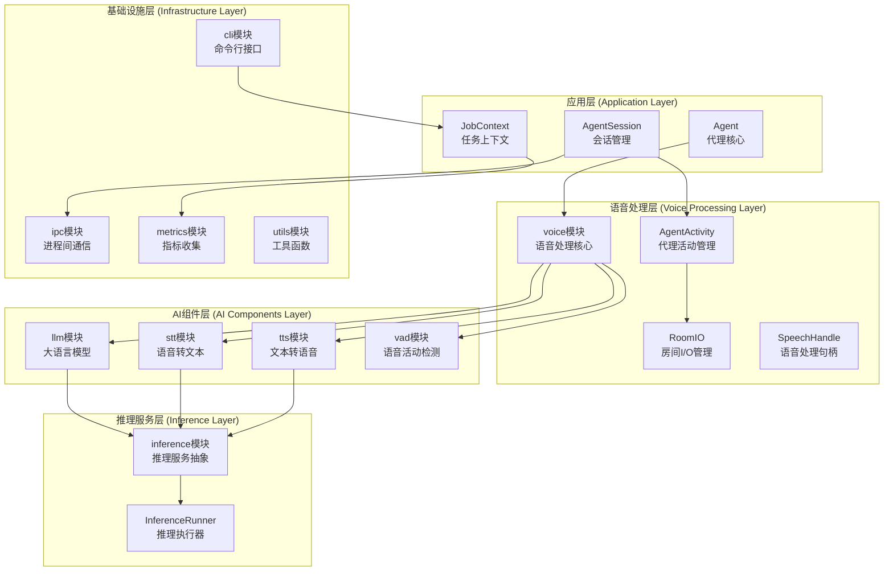
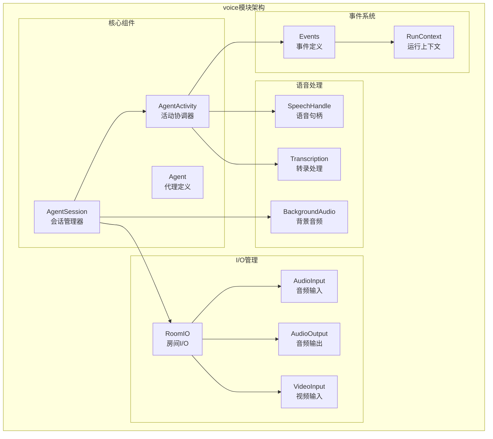
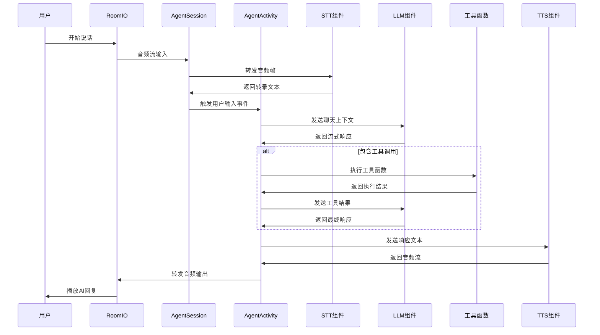
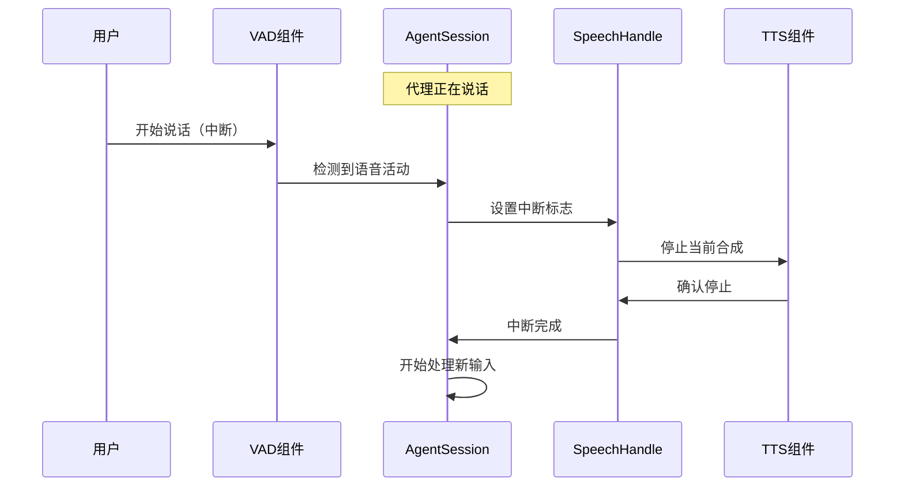

# LiveKit Agents 核心模块深入分析

## 1. 模块概览

LiveKit Agents框架由多个核心模块组成，每个模块负责特定的功能领域。本文档将深入分析每个模块的架构、API和实现细节。

### 1.1 核心模块架构图



## 2. voice 模块 - 语音处理核心

### 2.1 模块架构

voice模块是LiveKit Agents的核心，负责协调语音输入、处理和输出的整个流程。



### 2.2 AgentSession 详细分析

#### 2.2.1 核心属性和状态管理

```python
class AgentSession(rtc.EventEmitter[EventTypes], Generic[Userdata_T]):
    """
    AgentSession是语音代理的运行时核心，负责协调所有组件
    
    核心职责：
    1. 管理音频/视频/文本I/O流
    2. 协调STT、VAD、TTS、LLM组件
    3. 处理转换检测和端点检测
    4. 管理中断和多步工具调用
    5. 维护会话状态和用户数据
    """
    
    def __init__(self, ...):
        # 核心组件引用
        self._stt: stt.STT | None = None              # 语音转文本组件
        self._vad: vad.VAD | None = None              # 语音活动检测组件  
        self._llm: llm.LLM | None = None              # 大语言模型组件
        self._tts: tts.TTS | None = None              # 文本转语音组件
        self._mcp_servers: list[mcp.MCPServer] | None = None  # MCP服务器列表
        
        # 错误计数器
        self._llm_error_counts = 0                    # LLM错误计数
        self._tts_error_counts = 0                    # TTS错误计数
        
        # I/O管理
        self._input = io.AgentInput(                  # 代理输入管理器
            self._on_video_input_changed, 
            self._on_audio_input_changed
        )
        self._output = io.AgentOutput(                # 代理输出管理器
            self._on_video_output_changed,
            self._on_audio_output_changed, 
            self._on_text_output_changed
        )
        
        # 异步任务管理
        self._forward_audio_atask: asyncio.Task[None] | None = None
        self._forward_video_atask: asyncio.Task[None] | None = None
        self._update_activity_atask: asyncio.Task[None] | None = None
        
        # 同步锁
        self._activity_lock = asyncio.Lock()          # 活动锁
        self._lock = asyncio.Lock()                   # 主锁
        
        # 核心状态
        self._agent: Agent | None = None              # 当前代理
        self._activity: AgentActivity | None = None   # 当前活动
        self._next_activity: AgentActivity | None = None  # 下一个活动
        self._user_state: UserState = "listening"    # 用户状态
        self._agent_state: AgentState = "initializing"  # 代理状态
        
        # 用户数据和会话管理
        self._userdata: Userdata_T | None = userdata
        self._closing_task: asyncio.Task[None] | None = None
        self._closing: bool = False
        
        # 跟踪和监控
        self._user_speaking_span: trace.Span | None = None
        self._agent_speaking_span: trace.Span | None = None
        self._session_span: trace.Span | None = None
```

#### 2.2.2 会话启动流程

```python
class AgentSession:
    async def start(
        self,
        agent: Agent,
        *,
        capture_run: bool = False,
        room: NotGivenOr[rtc.Room] = NOT_GIVEN,
        room_input_options: NotGivenOr[room_io.RoomInputOptions] = NOT_GIVEN,
        room_output_options: NotGivenOr[room_io.RoomOutputOptions] = NOT_GIVEN,
    ) -> None | RunResult:
        """
        启动代理会话的主要流程
        
        启动步骤：
        1. 验证和设置代理
        2. 初始化房间I/O
        3. 创建代理活动
        4. 启动音视频转发任务
        5. 调用代理进入回调
        
        参数说明：
        - agent: 要运行的代理实例
        - capture_run: 是否捕获运行结果（用于测试）
        - room: LiveKit房间对象
        - room_input_options: 房间输入配置
        - room_output_options: 房间输出配置
        """
        
        # 1. 设置代理和基础状态
        self._agent = agent
        self._update_agent_state("initializing")
        
        # 2. 处理房间连接
        if is_given(room):
            self._room_io = room_io.RoomIO(room, self)
            await self._room_io.start(room_input_options, room_output_options)
        
        # 3. 创建代理活动管理器
        async with self._activity_lock:
            self._activity = AgentActivity(agent, self)
            
        # 4. 启动音视频转发任务
        self._forward_audio_atask = asyncio.create_task(
            self._forward_audio_task()
        )
        self._forward_video_atask = asyncio.create_task(
            self._forward_video_task()
        )
        self._update_activity_atask = asyncio.create_task(
            self._update_activity_task()
        )
        
        # 5. 更新状态并调用代理回调
        self._update_agent_state("listening")
        
        # 调用代理进入回调
        if hasattr(agent, 'on_enter') and callable(agent.on_enter):
            await agent.on_enter()
        
        # 6. 处理测试模式
        if capture_run:
            return self._global_run_state or RunResult()
```

#### 2.2.3 语音处理管道

```python
class AgentSession:
    async def _forward_audio_task(self) -> None:
        """
        音频转发任务 - 处理音频流的核心循环
        
        处理流程：
        1. 监听音频输入变化
        2. 连接STT和VAD组件
        3. 处理语音识别结果
        4. 触发代理响应生成
        """
        while not self._closing:
            try:
                # 等待音频输入变化
                audio_input = await self._input.wait_for_audio_input()
                
                if audio_input is None:
                    continue
                
                # 连接语音处理组件
                if self._stt:
                    await self._connect_stt_pipeline(audio_input)
                
                if self._vad:
                    await self._connect_vad_pipeline(audio_input)
                    
            except Exception as e:
                logger.error(f"音频转发任务错误: {e}")
                await asyncio.sleep(0.1)
    
    async def _connect_stt_pipeline(self, audio_input: AudioInput) -> None:
        """
        连接STT处理管道
        
        功能：
        1. 将音频流连接到STT组件
        2. 处理转录结果
        3. 触发用户输入事件
        """
        stt_stream = await self._stt.stream()
        
        async def _forward_audio():
            async for audio_frame in audio_input:
                await stt_stream.push_frame(audio_frame)
        
        async def _handle_transcription():
            async for event in stt_stream:
                if isinstance(event, stt.SpeechEvent):
                    if event.type == stt.SpeechEventType.FINAL_TRANSCRIPT:
                        # 发送用户输入转录事件
                        self.emit("user_input_transcribed", 
                                UserInputTranscribedEvent(
                                    text=event.alternatives[0].text,
                                    confidence=event.alternatives[0].confidence
                                ))
                        
                        # 触发代理响应
                        if self._activity:
                            await self._activity.handle_user_input(event.alternatives[0].text)
        
        # 启动并发任务
        await asyncio.gather(
            _forward_audio(),
            _handle_transcription()
        )
```

### 2.3 AgentActivity - 活动协调器

#### 2.3.1 核心功能

```python
class AgentActivity(RecognitionHooks):
    """
    AgentActivity协调单个代理的所有活动
    
    主要职责：
    1. 管理代理的生命周期
    2. 协调LLM调用和工具执行
    3. 处理语音合成和播放
    4. 管理对话上下文
    5. 处理中断和错误恢复
    """
    
    def __init__(self, agent: Agent, sess: AgentSession) -> None:
        self._agent = agent                           # 关联的代理
        self._session = sess                          # 关联的会话
        self._chat_ctx = agent.chat_ctx.copy()       # 对话上下文副本
        self._current_speech: SpeechHandle | None = None  # 当前语音句柄
        self._pending_logs: list[str] = []           # 待处理日志
        
        # 状态管理
        self._generating = False                      # 是否正在生成响应
        self._tool_calling = False                   # 是否正在调用工具
        self._interrupted = False                    # 是否被中断
        
        # 任务管理
        self._reply_task: asyncio.Task | None = None # 回复生成任务
        self._tool_tasks: set[asyncio.Task] = set()  # 工具执行任务集
```

#### 2.3.2 响应生成流程

```python
class AgentActivity:
    async def _pipeline_reply_task(
        self,
        *,
        speech_handle: SpeechHandle,
        chat_ctx: llm.ChatContext,
        tools: list[llm.FunctionTool | llm.RawFunctionTool],
        model_settings: ModelSettings,
        new_message: llm.ChatMessage | None = None,
        instructions: str | None = None,
    ) -> None:
        """
        响应生成管道 - 处理完整的响应生成流程
        
        流程步骤：
        1. 准备LLM请求上下文
        2. 调用LLM生成响应
        3. 处理工具调用
        4. 执行TTS合成
        5. 播放音频输出
        6. 更新对话历史
        """
        
        # 1. 准备请求上下文
        if new_message:
            chat_ctx = chat_ctx.append(
                role=new_message.role,
                content=new_message.content
            )
        
        # 2. 调用LLM生成响应
        self._session._update_agent_state("thinking")
        
        try:
            llm_stream = await self._agent.llm_node(
                chat_ctx=chat_ctx,
                tools=tools,
                model_settings=model_settings
            )
            
            # 3. 处理流式响应
            response_text = ""
            tool_calls = []
            
            async for chunk in llm_stream:
                if speech_handle.interrupted:
                    break
                
                if isinstance(chunk, llm.ChatChunk):
                    if chunk.choices:
                        choice = chunk.choices[0]
                        if choice.delta.content:
                            response_text += choice.delta.content
                            
                        if choice.delta.tool_calls:
                            tool_calls.extend(choice.delta.tool_calls)
            
            # 4. 执行工具调用
            if tool_calls and not speech_handle.interrupted:
                tool_results = await self._execute_tools(tool_calls)
                
                # 更新聊天上下文
                for call, result in zip(tool_calls, tool_results):
                    chat_ctx = chat_ctx.append(
                        role="assistant",
                        tool_calls=[call]
                    ).append(
                        role="tool",
                        content=result,
                        tool_call_id=call.id
                    )
                
                # 递归生成最终响应
                return await self._pipeline_reply_task(
                    speech_handle=speech_handle,
                    chat_ctx=chat_ctx,
                    tools=tools,
                    model_settings=model_settings
                )
            
            # 5. TTS合成和播放
            if response_text and not speech_handle.interrupted:
                await self._synthesize_and_play(response_text, speech_handle)
            
            # 6. 更新对话历史
            self._chat_ctx = chat_ctx.append(
                role="assistant",
                content=response_text
            )
            
        except Exception as e:
            logger.error(f"响应生成失败: {e}")
            await self._handle_generation_error(e, speech_handle)
        finally:
            self._session._update_agent_state("listening")
    
    async def _execute_tools(
        self, 
        tool_calls: list[llm.FunctionCall]
    ) -> list[str]:
        """
        执行工具调用
        
        参数：
        - tool_calls: 要执行的工具调用列表
        
        返回值：
        - list[str]: 工具执行结果列表
        """
        results = []
        
        for call in tool_calls:
            try:
                # 查找对应的工具函数
                tool_fn = self._find_tool_function(call.function.name)
                if not tool_fn:
                    results.append(f"工具 {call.function.name} 未找到")
                    continue
                
                # 解析参数
                args = json.loads(call.function.arguments)
                
                # 执行工具函数
                result = await tool_fn(**args)
                results.append(str(result) if result is not None else "")
                
            except Exception as e:
                logger.error(f"工具执行失败 {call.function.name}: {e}")
                results.append(f"工具执行失败: {e}")
        
        return results
    
    async def _synthesize_and_play(
        self, 
        text: str, 
        speech_handle: SpeechHandle
    ) -> None:
        """
        合成并播放语音
        
        参数：
        - text: 要合成的文本
        - speech_handle: 语音处理句柄
        """
        if not self._session._tts:
            return
        
        try:
            # 开始TTS合成
            tts_stream = await self._session._tts.synthesize(text)
            
            # 更新代理状态
            self._session._update_agent_state("speaking")
            
            # 播放音频
            async for audio_frame in tts_stream:
                if speech_handle.interrupted:
                    break
                
                # 发送到音频输出
                await self._session._output.audio_output.push_frame(audio_frame)
            
        except Exception as e:
            logger.error(f"TTS合成失败: {e}")
            raise
        finally:
            self._session._update_agent_state("listening")
```

### 2.4 RoomIO - 房间I/O管理

#### 2.4.1 输入输出配置

```python
@dataclass
class RoomInputOptions:
    """
    房间输入配置选项
    
    配置项说明：
    - text_enabled: 是否启用文本输入
    - audio_enabled: 是否启用音频输入
    - video_enabled: 是否启用视频输入
    - audio_sample_rate: 音频采样率
    - audio_num_channels: 音频通道数
    - noise_cancellation: 噪音消除配置
    - participant_kinds: 接受的参与者类型
    - pre_connect_audio: 预连接音频功能
    """
    text_enabled: NotGivenOr[bool] = NOT_GIVEN
    audio_enabled: NotGivenOr[bool] = NOT_GIVEN
    video_enabled: NotGivenOr[bool] = NOT_GIVEN
    audio_sample_rate: int = 24000
    audio_num_channels: int = 1
    noise_cancellation: rtc.NoiseCancellationOptions | None = None
    text_input_cb: TextInputCallback = _default_text_input_cb
    participant_kinds: NotGivenOr[list[rtc.ParticipantKind.ValueType]] = NOT_GIVEN
    participant_identity: NotGivenOr[str] = NOT_GIVEN
    pre_connect_audio: bool = True
    pre_connect_audio_timeout: float = 3.0
    close_on_disconnect: bool = True
    delete_room_on_close: bool = True


@dataclass 
class RoomOutputOptions:
    """
    房间输出配置选项
    
    配置项说明：
    - transcription_enabled: 是否启用转录输出
    - audio_enabled: 是否启用音频输出
    - audio_sample_rate: 音频采样率
    - audio_publish_options: 音频发布选项
    """
    transcription_enabled: NotGivenOr[bool] = NOT_GIVEN
    audio_enabled: NotGivenOr[bool] = NOT_GIVEN
    audio_sample_rate: int = 24000
    audio_num_channels: int = 1
    audio_publish_options: rtc.TrackPublishOptions = field(
        default_factory=lambda: rtc.TrackPublishOptions(
            source=rtc.TrackSource.SOURCE_MICROPHONE
        )
    )
```

#### 2.4.2 房间I/O实现

```python
class RoomIO:
    """
    RoomIO管理与LiveKit房间的音视频I/O连接
    
    主要功能：
    1. 管理参与者连接和断开
    2. 处理音频/视频流的订阅和发布
    3. 协调输入输出流的路由
    4. 处理房间事件和状态变化
    """
    
    def __init__(self, room: rtc.Room, session: AgentSession) -> None:
        self._room = room
        self._session = session
        self._participant: rtc.RemoteParticipant | None = None
        self._audio_input: AudioInput | None = None
        self._video_input: VideoInput | None = None
        self._audio_output: AudioOutput | None = None
        self._text_output: TextOutput | None = None
        
        # 流管理
        self._audio_streams: dict[str, _ParticipantAudioInputStream] = {}
        self._video_streams: dict[str, _ParticipantVideoInputStream] = {}
        
        # 预连接音频处理
        self._pre_connect_handler: PreConnectAudioHandler | None = None
    
    async def start(
        self,
        input_options: RoomInputOptions | None = None,
        output_options: RoomOutputOptions | None = None,
    ) -> None:
        """
        启动房间I/O管理
        
        启动流程：
        1. 设置房间事件监听
        2. 配置输入输出选项
        3. 查找并连接目标参与者
        4. 启动音视频流处理
        """
        
        # 1. 设置默认选项
        input_options = input_options or RoomInputOptions()
        output_options = output_options or RoomOutputOptions()
        
        # 2. 注册房间事件监听器
        self._room.on("participant_connected", self._on_participant_connected)
        self._room.on("participant_disconnected", self._on_participant_disconnected)
        self._room.on("track_published", self._on_track_published)
        self._room.on("track_unpublished", self._on_track_unpublished)
        self._room.on("track_subscribed", self._on_track_subscribed)
        self._room.on("track_unsubscribed", self._on_track_unsubscribed)
        
        # 3. 查找目标参与者
        await self._find_and_link_participant(input_options)
        
        # 4. 设置输入输出流
        await self._setup_input_streams(input_options)
        await self._setup_output_streams(output_options)
        
        # 5. 启动预连接音频处理
        if input_options.pre_connect_audio:
            self._pre_connect_handler = PreConnectAudioHandler(
                room=self._room,
                timeout=input_options.pre_connect_audio_timeout
            )
            await self._pre_connect_handler.start()
    
    async def _find_and_link_participant(
        self, 
        options: RoomInputOptions
    ) -> None:
        """
        查找并链接目标参与者
        
        查找策略：
        1. 优先使用指定身份的参与者
        2. 按参与者类型过滤
        3. 选择第一个符合条件的参与者
        """
        participant_kinds = (
            options.participant_kinds 
            if is_given(options.participant_kinds) 
            else DEFAULT_PARTICIPANT_KINDS
        )
        
        # 查找现有参与者
        for participant in self._room.remote_participants.values():
            if participant.kind not in participant_kinds:
                continue
                
            if is_given(options.participant_identity):
                if participant.identity == options.participant_identity:
                    await self._link_participant(participant)
                    return
            else:
                await self._link_participant(participant)
                return
        
        # 如果没有找到，等待新参与者加入
        if not self._participant:
            logger.info("等待参与者加入房间...")
    
    async def _link_participant(self, participant: rtc.RemoteParticipant) -> None:
        """
        链接到特定参与者
        
        功能：
        1. 设置参与者引用
        2. 订阅音视频轨道
        3. 启动流处理
        """
        self._participant = participant
        logger.info(f"链接到参与者: {participant.identity}")
        
        # 订阅现有轨道
        for track_pub in participant.track_publications.values():
            if track_pub.track is not None:
                await self._handle_track_subscription(track_pub.track, participant)
    
    async def _setup_input_streams(self, options: RoomInputOptions) -> None:
        """设置输入流处理"""
        if is_given(options.audio_enabled) and options.audio_enabled:
            self._audio_input = AudioInput()
            self._session._input.set_audio_input(self._audio_input)
        
        if is_given(options.video_enabled) and options.video_enabled:
            self._video_input = VideoInput()
            self._session._input.set_video_input(self._video_input)
    
    async def _setup_output_streams(self, options: RoomOutputOptions) -> None:
        """设置输出流处理"""
        if is_given(options.audio_enabled) and options.audio_enabled:
            self._audio_output = _ParticipantAudioOutput(
                room=self._room,
                sample_rate=options.audio_sample_rate,
                num_channels=options.audio_num_channels,
                publish_options=options.audio_publish_options
            )
            self._session._output.set_audio_output(self._audio_output)
        
        if is_given(options.transcription_enabled) and options.transcription_enabled:
            self._text_output = _ParticipantTranscriptionOutput(
                room=self._room
            )
            self._session._output.set_text_output(self._text_output)
```

## 3. 语音处理时序图

### 3.1 完整对话流程



### 3.2 中断处理流程



## 4. 关键数据结构

### 4.1 语音处理状态

```python
class UserState(str, Enum):
    """用户状态枚举"""
    LISTENING = "listening"      # 监听中
    SPEAKING = "speaking"        # 说话中
    AWAY = "away"               # 离开

class AgentState(str, Enum):
    """代理状态枚举"""
    INITIALIZING = "initializing"  # 初始化中
    LISTENING = "listening"        # 监听中
    THINKING = "thinking"          # 思考中
    SPEAKING = "speaking"          # 说话中
    TOOL_CALLING = "tool_calling"  # 工具调用中

@dataclass
class VoiceOptions:
    """语音处理选项"""
    allow_interruptions: bool = True
    discard_audio_if_uninterruptible: bool = True
    min_interruption_duration: float = 0.5
    min_interruption_words: int = 0
    min_endpointing_delay: float = 0.5
    max_endpointing_delay: float = 6.0
    max_tool_steps: int = 3
    user_away_timeout: float | None = 15.0
    false_interruption_timeout: float | None = 2.0
    resume_false_interruption: bool = True
    min_consecutive_speech_delay: float = 0.0
    preemptive_generation: bool = False
```

### 4.2 事件系统

```python
@dataclass
class UserInputTranscribedEvent:
    """用户输入转录事件"""
    text: str                    # 转录文本
    confidence: float           # 置信度
    is_final: bool = True       # 是否为最终结果

@dataclass  
class AgentStateChangedEvent:
    """代理状态变化事件"""
    previous_state: AgentState  # 之前状态
    current_state: AgentState   # 当前状态
    
@dataclass
class SpeechCreatedEvent:
    """语音创建事件"""
    speech_handle: SpeechHandle # 语音句柄
    source: str                 # 来源描述

@dataclass
class MetricsCollectedEvent:
    """指标收集事件"""
    metrics: dict[str, Any]     # 指标数据
    timestamp: float            # 时间戳
```

## 5. 性能优化特性

### 5.1 预先生成（Preemptive Generation）

```python
class AgentActivity:
    async def _handle_preemptive_generation(
        self,
        user_input: str,
        chat_ctx: llm.ChatContext
    ) -> None:
        """
        预先生成功能实现
        
        优化策略：
        1. 在用户说话时就开始LLM推理
        2. 与音频处理并行执行
        3. 减少响应延迟
        4. 处理中断和取消逻辑
        """
        if not self._session._opts.preemptive_generation:
            return
        
        # 创建预先生成任务
        preemptive_task = asyncio.create_task(
            self._generate_preemptive_response(user_input, chat_ctx)
        )
        
        # 监听中断信号
        try:
            result = await preemptive_task
            if not self._interrupted:
                # 使用预先生成的结果
                await self._use_preemptive_result(result)
        except asyncio.CancelledError:
            logger.debug("预先生成被取消")
```

### 5.2 错误恢复机制

```python
class AgentActivity:
    async def _handle_generation_error(
        self,
        error: Exception,
        speech_handle: SpeechHandle
    ) -> None:
        """
        错误恢复处理
        
        恢复策略：
        1. 区分可恢复和不可恢复错误
        2. 实现指数退避重试
        3. 错误计数和熔断机制
        4. 优雅降级处理
        """
        if isinstance(error, llm.LLMError):
            self._session._llm_error_counts += 1
            
            if error.recoverable and self._session._llm_error_counts < 3:
                # 可恢复错误，重试
                await asyncio.sleep(2 ** self._session._llm_error_counts)
                logger.warning(f"LLM错误，重试中: {error}")
                return
            else:
                # 不可恢复错误或超过重试次数
                logger.error(f"LLM错误，停止生成: {error}")
                speech_handle.interrupt()
        
        elif isinstance(error, tts.TTSError):
            self._session._tts_error_counts += 1
            logger.error(f"TTS错误: {error}")
            # TTS错误时可以降级到文本输出
            await self._fallback_to_text_output(speech_handle)
```

这个核心模块分析文档详细介绍了LiveKit Agents框架中最重要的voice模块的架构和实现。每个组件都包含了详细的代码实现、处理流程和优化策略，帮助开发者深入理解框架的核心工作原理。
