# LiveKit Agents 源码剖析 - 总览

## 项目概述

LiveKit Agents是一个用于构建实时、可编程参与者的Python框架，专门设计用于运行在服务器上。它允许开发者创建能够看、听、理解的对话式多模态语音代理。

### 核心特性

- **灵活的集成**: 提供全面的生态系统，可以混合搭配STT、LLM、TTS和实时API
- **内置任务调度**: 集成的任务调度和分发系统，通过dispatch APIs连接终端用户和代理
- **广泛的WebRTC客户端**: 支持所有主要平台的开源SDK生态系统
- **电话集成**: 与LiveKit的电话栈无缝集成
- **数据交换**: 通过RPC和数据API与客户端交换数据
- **语义转换检测**: 使用transformer模型检测用户何时结束发言
- **MCP支持**: 原生支持MCP服务器工具集成
- **内置测试框架**: 提供测试和评判功能确保代理性能
- **开源**: 完全开源，可在自己的服务器上运行

## 整体架构

```mermaid
graph TB
    subgraph "LiveKit Agents Framework"
        subgraph "核心层 (Core Layer)"
            Agent[Agent<br/>代理核心]
            AgentSession[AgentSession<br/>会话管理]
            Worker[Worker<br/>工作进程]
            JobContext[JobContext<br/>任务上下文]
        end
        
        subgraph "组件层 (Components Layer)"
            STT[STT<br/>语音转文本]
            TTS[TTS<br/>文本转语音]
            LLM[LLM<br/>大语言模型]
            VAD[VAD<br/>语音活动检测]
        end
        
        subgraph "插件层 (Plugins Layer)"
            OpenAI[OpenAI Plugin]
            Deepgram[Deepgram Plugin]
            ElevenLabs[ElevenLabs Plugin]
            Silero[Silero Plugin]
            Others[其他插件...]
        end
        
        subgraph "基础设施层 (Infrastructure Layer)"
            IPC[IPC<br/>进程间通信]
            Metrics[Metrics<br/>指标收集]
            Utils[Utils<br/>工具函数]
            CLI[CLI<br/>命令行接口]
        end
        
        subgraph "I/O层 (I/O Layer)"
            RoomIO[Room I/O<br/>房间输入输出]
            AudioIO[Audio I/O<br/>音频处理]
            VideoIO[Video I/O<br/>视频处理]
        end
    end
    
    subgraph "外部系统 (External Systems)"
        LiveKitServer[LiveKit Server<br/>媒体服务器]
        ModelProviders[AI模型提供商<br/>OpenAI/Google/等]
        Clients[客户端应用<br/>Web/Mobile/等]
    end
    
    %% 连接关系
    Agent --> AgentSession
    AgentSession --> STT
    AgentSession --> TTS
    AgentSession --> LLM
    AgentSession --> VAD
    
    Worker --> JobContext
    JobContext --> Agent
    
    STT --> OpenAI
    TTS --> ElevenLabs
    LLM --> OpenAI
    VAD --> Silero
    
    AgentSession --> RoomIO
    RoomIO --> AudioIO
    RoomIO --> VideoIO
    
    Worker --> IPC
    AgentSession --> Metrics
    
    RoomIO --> LiveKitServer
    OpenAI --> ModelProviders
    LiveKitServer --> Clients
    
    CLI --> Worker
```



## 核心概念

### 1. Agent（代理）
- **定义**: 基于LLM的应用程序，具有定义的指令
- **功能**: 处理用户交互，执行工具调用，生成响应
- **特点**: 可配置指令、工具集、模型参数等

### 2. AgentSession（代理会话）
- **定义**: 管理与终端用户交互的容器
- **功能**: 协调音频、视频、文本I/O与STT、VAD、TTS、LLM的交互
- **特点**: 处理转换检测、端点检测、中断和多步工具调用

### 3. Worker（工作进程）
- **定义**: 协调任务调度和为用户会话启动代理的主进程
- **功能**: 管理进程池、任务分发、资源调度
- **特点**: 支持多并发代理、热重载、生产优化

### 4. JobContext（任务上下文）
- **定义**: 交互会话的起点，类似于Web服务器中的请求处理器
- **功能**: 提供房间连接、日志上下文、关闭回调等
- **特点**: 管理会话生命周期和资源清理

## 模块架构

### 核心模块结构


### 插件生态系统


## 数据流时序图


## 关键设计模式

### 1. 插件架构模式
- **目的**: 支持多种AI服务提供商的灵活集成
- **实现**: 基于抽象基类的插件系统
- **优势**: 可扩展性强，支持热插拔

### 2. 事件驱动模式
- **目的**: 处理异步音视频流和用户交互
- **实现**: EventEmitter基类和事件监听机制
- **优势**: 响应式设计，低延迟处理

### 3. 工厂模式
- **目的**: 根据配置动态创建各种组件实例
- **实现**: 智能字符串到实例的转换
- **优势**: 配置灵活，代码简洁

### 4. 责任链模式
- **目的**: 处理复杂的音频处理流水线
- **实现**: 音频流处理管道
- **优势**: 处理流程清晰，易于扩展

## 性能特性

### 1. 异步处理
- 全面采用asyncio异步编程模型
- 支持并发处理多个用户会话
- 非阻塞I/O操作

### 2. 流式处理
- 实时音频流处理
- 流式语音识别和合成
- 低延迟响应

### 3. 资源管理
- 智能进程池管理
- 内存使用优化
- GPU资源调度

### 4. 可扩展性
- 水平扩展支持
- 负载均衡
- 容错机制

## 开发工作流

### 1. 开发模式
```bash
python agent.py dev
```
- 支持热重载
- 实时调试
- 开发友好

### 2. 测试模式
```bash
python agent.py console
```
- 终端音频测试
- 快速验证
- 无需外部服务

### 3. 生产模式
```bash
python agent.py start
```
- 生产优化
- 稳定运行
- 监控集成

## 下一步

本文档将按模块深入分析：

1. **[核心模块分析](./核心模块分析.md)** - Agent、AgentSession、Worker详细分析
2. **[语音处理模块](./语音处理模块.md)** - STT、TTS、VAD组件深度解析
3. **[LLM集成模块](./LLM集成模块.md)** - 大语言模型集成和工具调用
4. **[插件系统](./插件系统.md)** - 插件架构和扩展机制
5. **[I/O处理模块](./IO处理模块.md)** - 音视频流处理和房间管理
6. **[基础设施模块](./基础设施模块.md)** - IPC、Metrics、Utils等支撑组件
7. **[实战案例](./实战案例.md)** - 完整应用开发指南
8. **[最佳实践](./最佳实践.md)** - 性能优化和部署建议

每个模块文档将包含：
- 详细的架构图和时序图
- 核心API和调用链路分析
- 关键代码实现解析
- UML类图和数据结构
- 实际使用示例
- 性能优化建议
